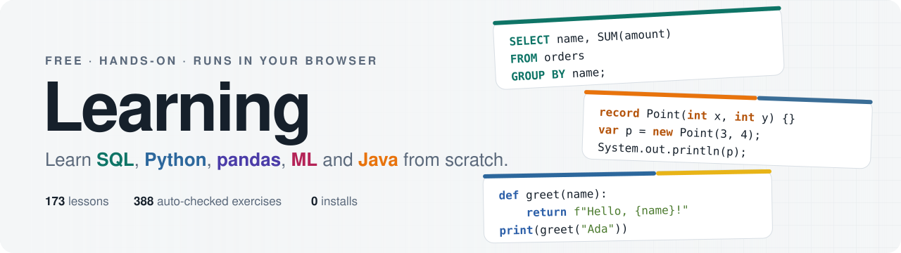

<p align="center">
  <picture>
    <source media="(prefers-color-scheme: dark)" srcset="assets/banner-dark.svg">
    
  </picture>
</p>

<p align="center">
  <a href="https://kishoremadanagopal.github.io/learning/"></a>
</p>

<p align="center">
  
  
  
  
  
</p>

<p align="center">
  Hands-on courses that start from zero. Read a lesson here on GitHub, practise in a sandbox that runs your code in the browser,<br>
  and get instant feedback on every exercise. No installs, no sign-up.
</p>

---

## 📚 Courses

<table>
  <tr>
    <td width="50%" valign="top">
      <h3>🗄️ Learn SQL from scratch</h3>
      <p>Ask questions of a real database: filtering, grouping, joins, subqueries, CTEs, window functions and a final project.</p>
      <p><b>18</b> lessons · <b>79</b> exercises · SQLite in the browser</p>
      <p>
        <a href="https://kishoremadanagopal.github.io/learning/sql/"><b>▶ Open the SQL sandbox</b></a><br>
        📘 <a href="sql/README.md#lessons">Lessons</a> ·
        📖 <a href="sql/glossary.md">Glossary</a> ·
        🧾 <a href="sql/cheatsheet.md">Cheat sheet</a>
      </p>
    </td>
    <td width="50%" valign="top">
      <h3>🐍 Learn Python from scratch</h3>
      <p>Learn to program: variables, loops, collections, functions, classes, generators, decorators and a final project.</p>
      <p><b>37</b> lessons · <b>62</b> exercises · <b>87</b> quiz questions</p>
      <p>
        <a href="https://kishoremadanagopal.github.io/learning/python/"><b>▶ Open the Python course</b></a><br>
        📘 <a href="python/README.md#lessons">Lessons</a> ·
        📖 <a href="python/glossary.md">Glossary</a> ·
        🧾 <a href="python/cheatsheet.md">Cheat sheet</a>
      </p>
    </td>
  </tr>
  <tr>
    <td width="50%" valign="top">
      <h3>📊 Python for Data</h3>
      <p>The next step after Python basics: NumPy, pandas and charts. Load, clean, analyse and chart real data, ending with a full sales analysis.</p>
      <p><b>31</b> lessons · <b>62</b> exercises · <b>93</b> quiz questions · real pandas in the browser</p>
      <p>
        <a href="https://kishoremadanagopal.github.io/learning/python-data/"><b>▶ Open the Python for Data course</b></a><br>
        📘 <a href="python-data/README.md#lessons">Lessons</a> ·
        📖 <a href="python-data/glossary.md">Glossary</a> ·
        🧾 <a href="python-data/cheatsheet.md">Cheat sheet</a> ·
        🗂️ <a href="python-data/data/">Datasets</a>
      </p>
    </td>
    <td width="50%" valign="top">
      <h3>☕ Learn Java from scratch</h3>
      <p>Real Java 17 compiled in your browser: classes, inheritance, collections, generics, streams, concurrency and a final project.</p>
      <p><b>38</b> lessons · <b>57</b> exercises · <b>103</b> quiz questions · 🎮 <b>97</b> Quest challenges</p>
      <p>
        <a href="https://kishoremadanagopal.github.io/learning/java/"><b>▶ Open the Java course</b></a><br>
        🎮 <a href="https://kishoremadanagopal.github.io/learning/java/game.html">Play Java Quest</a><br>
        📘 <a href="java/README.md#lessons">Lessons</a> ·
        📖 <a href="java/glossary.md">Glossary</a> ·
        🧾 <a href="java/cheatsheet.md">Cheat sheet</a>
      </p>
    </td>
  </tr>
</table>

## 🧭 Where to start

| If you're… | Start with | Why |
|---|---|---|
| New to programming | 🐍 **Python** | It teaches how programs think: variables, decisions, loops and functions. |
| Working with data or reports | 🗄️ **SQL** | You'll answer real questions about data from the first lesson. |
| Heading into data or AI work | 🐍 **Python** → 📊 **Python for Data** + 🗄️ **SQL** | The shared core of both the AI engineer and the data/AI analyst paths. |
| Aiming for backend, Android or enterprise jobs | ☕ **Java** | It's the language of large systems and teaches object-oriented design properly. |

## ✅ How every course works

1. **Read** a lesson. Start with its **Key terms**.
2. **Run** the examples in the course's sandbox and change them to see what happens.
3. **Practise** with the exercises and press **Check**. The sandbox tells you exactly what's off.
4. **Compare** with the **Answers** at the bottom of the lesson, only after you've had a real go.

Every lesson has a **Common mistakes** section. Read it: you'll recognise those errors when they happen to you.

## 🗂️ What's inside

Every course shares the same structure, so once you know one, you know the other.

```text
learning/
├── index.html              the course site home page
├── sql/                    🗄️ Learn SQL from scratch
│   ├── README.md           course home: lesson list and how to use it
│   ├── index.html          practice sandbox (real SQLite in the browser)
│   ├── lessons/            18 lessons with exercises and answers
│   ├── glossary.md         every term, A to Z
│   └── cheatsheet.md       all the syntax on one page
├── python/                 🐍 Learn Python from scratch
│   ├── README.md           course home: lesson list and how to use it
│   ├── index.html          practice sandbox (Python in the browser)
│   ├── lessons/            37 lessons with exercises, answers and quizzes
│   ├── glossary.md         every term, A to Z
│   ├── cheatsheet.md       all the syntax on one page
│   ├── playground.html     a free editor for experimenting
│   └── course/             sources the Python course is built from
├── python-data/            📊 Python for Data: NumPy, pandas and charts
│   ├── README.md           course home: lesson list and how to use it
│   ├── index.html          practice sandbox (real pandas in the browser, via Pyodide)
│   ├── lessons/            31 lessons with exercises, answers and quizzes
│   ├── data/               7 practice datasets
│   ├── glossary.md         every term, A to Z
│   ├── cheatsheet.md       all the syntax on one page
│   └── course/             sources the course is built from
└── java/                   ☕ Learn Java from scratch
    ├── README.md           course home: lesson list and how to use it
    ├── index.html          practice sandbox (real Java 17 compiler in the browser)
    ├── game.html           🎮 Java Quest: timed fill-in-the-code challenges
    ├── lessons/            38 lessons with exercises, answers and quizzes
    ├── glossary.md         every term, A to Z
    ├── cheatsheet.md       all the syntax on one page
    └── course/             sources the Java course is built from
```

## 💡 Good to know

- **Your progress stays with you.** Completed exercises and your code are saved in your own browser.
- **Everything runs locally.** The SQL sandbox uses SQLite, the Python sandbox uses Brython, the Python for Data sandbox runs real Python with pandas on [Pyodide](https://pyodide.org), and the Java sandbox runs the real `javac` compiler on [CheerpJ](https://cheerpj.com), all inside the page. Nothing you type is sent anywhere.
- **Read anywhere.** Every lesson is plain Markdown, so it reads well right here on GitHub, on your phone or offline.

---

<p align="center">
  Made by <a href="https://github.com/kishoremadanagopal">Kishore Madanagopal</a> · Powered by <a href="https://claude.ai">Claude</a><br>
  <sub>If these courses help you, give the repository a ⭐</sub>
</p>
