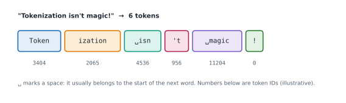

# Lesson 2: Tokens and tokenization

**You'll learn:** tokens and vocabularies, characters versus words versus subwords, byte-pair encoding, counting and estimating tokens, token-based pricing, context windows, tokenizer quirks with spelling, numbers and other languages.

▶ **Practise this lesson in the [sandbox](https://kishoremadanagopal.github.io/learning/ai-engineering/#tokens)**: run every example and check your exercise answers.

## Key terms

- **Token:** a chunk of text (a word, part of a word, a symbol) that the model reads and writes as one unit.
- **Vocabulary:** the fixed set of tokens a tokenizer can produce, each with an integer ID.
- **Tokenizer:** the program that turns text into token IDs and back.
- **Byte-pair encoding (BPE):** building a vocabulary by repeatedly merging the most frequent neighbouring pair of symbols.
- **Context window:** the maximum number of tokens (input plus output) a model can handle in one request.
- **Input and output tokens:** tokens sent to the model and tokens it generates; priced separately.

Models don't read letters or words: they read **tokens**, chunks of text from a fixed **vocabulary** of tens of thousands to a few hundred thousand pieces. Common words are usually one token (" the", " cat"); rarer words are split into several (" token" + "ization"); spaces, punctuation and digits are tokens too. Each token is just an integer ID to the model.



## Why not characters, or whole words?

| Unit | Vocabulary | Problem |
|---|---|---|
| Characters | tiny (~100s) | texts become very long sequences, and the model must learn spelling from scratch |
| Whole words | enormous (millions, and new words appear all the time) | any word not in the vocabulary can't be represented |
| **Subwords (tokens)** | tens of thousands | frequent words stay whole, rare words split into known pieces: nothing is ever "unknown" |

## Byte-pair encoding (BPE)

The most common way to build a subword vocabulary is **byte-pair encoding**. Start with single characters (or bytes); count every pair of neighbouring symbols across the training text; **merge the most frequent pair** into a new symbol; repeat until the vocabulary is the size you want. Frequent words end up as single tokens because their pieces keep getting merged.

```python
from collections import Counter

def most_frequent_pair(words):
    pairs = Counter()
    for symbols, freq in words.items():
        for a, b in zip(symbols, symbols[1:]):
            pairs[(a, b)] += freq                 # weight by how often the word occurs
    return max(pairs, key=pairs.get) if pairs else None

def merge(words, pair):
    merged = {}
    for symbols, freq in words.items():
        out, i = [], 0
        while i < len(symbols):
            if i + 1 < len(symbols) and (symbols[i], symbols[i + 1]) == pair:
                out.append(symbols[i] + symbols[i + 1])   # glue the pair into one symbol
                i += 2
            else:
                out.append(symbols[i])
                i += 1
        merged[tuple(out)] = freq
    return merged

corpus = {"low": 5, "lower": 2, "newest": 6, "widest": 3}
words = {tuple(w): f for w, f in corpus.items()}       # start from single characters
for step in range(6):
    pair = most_frequent_pair(words)
    words = merge(words, pair)
    print(f"merge {step + 1}: {pair[0]!r} + {pair[1]!r}   ->", list(words))
```

After a few merges, "est" and "low" have become single symbols: the vocabulary has learned the common pieces of the language. Real tokenizers do this on bytes (so any text, emoji or language can be encoded) with tens of thousands of merges.

## Tokens are what you pay for and what fills the context

- **Cost:** APIs charge per token, usually per million, and **output tokens cost several times more than input tokens**.
- **Context window:** the maximum number of tokens (input plus output) the model can handle in one request, from about 200,000 to over 1,000,000 tokens for current frontier models.
- **Speed:** output is generated one token at a time, so long answers take longer.

A handy rule of thumb for English is **about 4 characters, or ¾ of a word, per token**. Other languages, code and numbers often use more tokens for the same content, so measure rather than guess:

```python
def rough_tokens(text):
    return max(1, round(len(text) / 4))          # the ~4 characters per token rule of thumb

for sample in ["Hello, world!",
               "The quick brown fox jumps over the lazy dog.",
               "def add(a, b):\n    return a + b"]:
    print(f"{rough_tokens(sample):>3} tokens (estimate)  {sample!r}")

words = 750
print(f"{words} English words is roughly {round(words / 0.75)} tokens")
```

Each provider's tokenizer is different, so the same text has a different token count with different models. The APIs report exact counts in every response, and have token-counting endpoints:

```python
import anthropic

client = anthropic.Anthropic()                       # reads ANTHROPIC_API_KEY from the environment
count = client.messages.count_tokens(
    model="claude-sonnet-5-5",
    messages=[{"role": "user", "content": "Tokenization isn't magic!"}],
)
print(count.input_tokens)

# OpenAI models: the open-source tiktoken library counts tokens locally
import tiktoken
enc = tiktoken.get_encoding("o200k_base")
print(len(enc.encode("Tokenization isn't magic!")))
```

## Quirks that come from tokens

- **Spelling and counting letters** ("how many r's in strawberry?") is hard for models, because they see tokens, not letters.
- **Arithmetic** on long numbers is error-prone: digits may be grouped into tokens unevenly. Give the model a calculator tool for exact maths (Part 5).
- **Trailing spaces and formatting** change tokenization, which can subtly change outputs.
- **Non-English text** typically costs more tokens per word, so the same conversation costs more and fills the context faster.

## At a glance

| Concept | Approach | Time | Space |
|---|---|---|---|
| Rough token estimate (English) | characters ÷ 4, or words ÷ 0.75 | O(1) | O(1) |
| Exact token count | the provider's tokenizer or count-tokens endpoint | O(n) | O(n) |
| BPE training step | count neighbouring pairs; merge the most frequent | O(total symbols) per merge | O(pairs) |
| Request cost | tokens_in × price_in + tokens_out × price_out, per million | O(1) | O(1) |

## Common mistakes

- Estimating cost or context use in words or characters instead of tokens.
- Assuming every provider's tokenizer gives the same count.
- Forgetting that output tokens usually cost several times more than input tokens.
- Asking a model to count letters or do long arithmetic without a tool.

## Exercises

### 1. Count the pairs

Write `pair_counts(words)` where `words` maps a tuple of symbols to how often that word appears, e.g. `{("l", "o", "w"): 5}`. Return a dict mapping every pair of neighbouring symbols to its total count across all words (weighted by each word's frequency). This is the first step of every BPE merge.

Starter code:

```python
def pair_counts(words):
    pass

print(pair_counts({("l", "o", "w"): 5, ("l", "o", "t"): 2}))
# {('l', 'o'): 7, ('o', 'w'): 5, ('o', 't'): 2}
```

<details>
<summary>🧭 How to approach it</summary>

1. **Understand:** pairs inside each word, weighted by the word's frequency; overlapping pairs count separately.
2. **Examples:** ("a", "a", "a") × 2 → the pair ("a", "a") occurs twice in the word, so 4.
3. **Brute force:** index loops over each word: fine.
4. **Pattern:** **neighbour pairs + weighted counting**.
5. **Plan:** two nested loops, a dict of counts.
6. **Code and test:** one-symbol words, no words, multi-character symbols.

</details>

<details>
<summary>💡 Hint 1</summary>

Inside each word, which pairs of symbols are neighbours?

</details>

<details>
<summary>💡 Hint 2</summary>

`zip(symbols, symbols[1:])` gives the neighbouring pairs of one word. Each occurrence of a pair should add the word's frequency, not 1.

</details>

<details>
<summary>💡 Hint 3</summary>

For each `(symbols, freq)` in `words.items()` and each pair from the zip, do `counts[pair] = counts.get(pair, 0) + freq`.

</details>

### 2. Estimate the cost of a request

Prices are quoted per **million** tokens. Write `request_cost(input_tokens, output_tokens, input_price, output_price)` returning the cost in dollars, rounded to 6 decimal places. For example, 2,000 input tokens and 500 output tokens at $3 / $15 per million cost 0.006 + 0.0075 = 0.0135.

Starter code:

```python
def request_cost(input_tokens, output_tokens, input_price, output_price):
    pass

print(request_cost(2_000, 500, 3, 15))   # 0.0135
```

<details>
<summary>🧭 How to approach it</summary>

1. **Understand:** separate prices for input and output; per million; round to 6 decimals.
2. **Examples:** 2,000 in at $3/M = $0.006; 500 out at $15/M = $0.0075.
3. **Brute force:** none needed: it's a formula.
4. **Pattern:** **unit conversion** (tokens → millions of tokens).
5. **Plan:** two products, a sum, a round.
6. **Code and test:** zeros, exactly one million, a value that needs rounding.

</details>

<details>
<summary>💡 Hint 1</summary>

Prices are per million tokens, so first work out how many millions of tokens each side used.

</details>

<details>
<summary>💡 Hint 2</summary>

Input cost = `input_tokens / 1_000_000 * input_price`; the output side is the same with its own price.

</details>

<details>
<summary>💡 Hint 3</summary>

Add the two and return `round(total, 6)`.

</details>

**In the sandbox:** exercises 3–4. Press **Check** to run the hidden tests.

### Answers and walkthroughs

Open these only after a real attempt. Each one explains the solution step by step.

<details>
<summary>✅ 1. Count the pairs</summary>

```python
def pair_counts(words):
    counts = {}
    for symbols, freq in words.items():
        for pair in zip(symbols, symbols[1:]):     # neighbouring symbols
            counts[pair] = counts.get(pair, 0) + freq
    return counts

print(pair_counts({("l", "o", "w"): 5, ("l", "o", "t"): 2}))
```

**Line by line**

- Each word is a tuple of symbols (single characters at the start of BPE, longer pieces after merges).
- `zip(symbols, symbols[1:])` produces each neighbouring pair once per position.
- Adding `freq` (not 1) weights each pair by how common the word is in the corpus.

**Trace** on {("l","o","w"): 5, ("l","o","t"): 2}: low gives (l,o) +5, (o,w) +5; lot gives (l,o) +2, (o,t) +2 → (l,o): 7.

**Complexity:** O(total symbols).

**Common wrong approach:** counting each pair once per word instead of `freq` times, which makes rare words as influential as common ones.

</details>

<details>
<summary>✅ 2. Estimate the cost of a request</summary>

```python
def request_cost(input_tokens, output_tokens, input_price, output_price):
    cost = input_tokens / 1_000_000 * input_price + output_tokens / 1_000_000 * output_price
    return round(cost, 6)

print(request_cost(2_000, 500, 3, 15))
```

**Line by line**

- Dividing by 1,000,000 converts tokens into millions of tokens, the unit the price is quoted in.
- Input and output are priced separately; output is usually several times dearer.
- `round(…, 6)` removes floating-point noise like 0.013500000000000002.

**Trace:** 2,000 / 1e6 × 3 = 0.006; 500 / 1e6 × 15 = 0.0075; total 0.0135.

**Complexity:** O(1).

**Common wrong approach:** multiplying by the price per token as if it were per thousand, which is off by a factor of 1,000.

</details>

## Quick quiz

1. Why do LLMs use subword tokens instead of whole words?
   - A) Frequent words stay whole while rare words split into known pieces, so no text is ever "unknown"
   - B) Subwords are always shorter than characters
   - C) Whole words can't be stored in a computer

2. What does byte-pair encoding repeatedly do?
   - A) Merges the most frequent pair of neighbouring symbols into a new symbol
   - B) Splits every word in half
   - C) Removes rare words from the text

3. Roughly how many tokens is 750 English words?
   - A) About 1,000
   - B) About 100
   - C) About 7,500

4. Why are models often bad at counting the letters in a word?
   - A) They see tokens, which can hide individual letters
   - B) They don't know the alphabet
   - C) Letters cost more tokens than words

<details>
<summary>Quiz answers</summary>

1. **A) Frequent words stay whole while rare words split into known pieces, so no text is ever "unknown"**: Subwords balance vocabulary size against sequence length.
2. **A) Merges the most frequent pair of neighbouring symbols into a new symbol**: Frequent pieces like "est" and "low" become single tokens.
3. **A) About 1,000**: Rule of thumb: about ¾ of a word (4 characters) per token.
4. **A) They see tokens, which can hide individual letters**: "strawberry" might be one or two tokens, not ten letters.

</details>

---
Previous: [Lesson 1](01-what-is-an-llm.md) · Next: [Lesson 3: Embeddings and similarity](03-embeddings.md)
