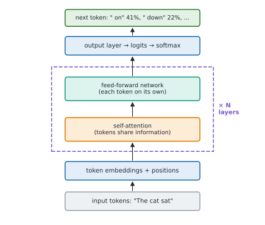

# Lesson 4: Transformers and attention

**You'll learn:** the transformer architecture, token and position embeddings, softmax, self-attention with queries, keys and values, scaling by the square root of the dimension, causal masking, multi-head attention, the cost of long contexts, the KV cache.

▶ **Practise this lesson in the [sandbox](https://kishoremadanagopal.github.io/learning/ai-engineering/#attention)**: run every example and check your exercise answers.

## Key terms

- **Transformer:** the neural-network architecture behind modern LLMs, built from attention and feed-forward layers.
- **Logit:** the raw score the model gives each vocabulary token before softmax.
- **Softmax:** turns a list of scores into probabilities that sum to 1.
- **Self-attention:** each token computing a weighted mix of other tokens' information.
- **Query, key, value:** per-token vectors used by attention: what a token seeks, what it offers to match, and what it passes on.
- **Causal mask:** prevents a token from attending to later tokens during text generation.
- **Attention head:** one of several attention mechanisms run in parallel in a layer.
- **KV cache:** stored keys and values of earlier tokens, reused while generating each new token.

Almost every modern LLM is a **transformer**, an architecture introduced in 2017 ("Attention Is All You Need"). You don't need its full mathematics to build with LLMs, but knowing the shape of it explains context windows, costs and many model behaviours.

## From tokens to a prediction

1. Each token ID is looked up in an **embedding table**, giving one vector per token. **Position information** is added, so the model knows word order.
2. A stack of **transformer layers** (dozens in large models) updates every token's vector. Each layer has two parts:
   - **Self-attention:** each token gathers information from the other tokens that matter to it.
   - A **feed-forward network:** processes each token's vector on its own.
3. The final vector of the **last** token is turned into a score (a **logit**) for every token in the vocabulary; **softmax** turns the scores into probabilities for the next token (Lesson 5).



## Softmax: from scores to probabilities

Softmax turns any list of scores into positive numbers that add up to 1, keeping their order and exaggerating the gaps: `softmax(x)ᵢ = exp(xᵢ) / Σ exp(xⱼ)`. Subtracting the maximum score first gives the same result without overflowing.

```python
import math

def softmax(scores):
    m = max(scores)
    exps = [math.exp(s - m) for s in scores]     # subtract the max: same result, no overflow
    total = sum(exps)
    return [e / total for e in exps]

print([round(p, 3) for p in softmax([2.0, 1.0, 0.1])])
print([round(p, 3) for p in softmax([1000, 999, 998])])   # would overflow without the max trick
```

## Self-attention: queries, keys and values

In "The animal didn't cross the street because **it** was too tired", the vector for "it" needs information from "animal". Attention does this with three vectors per token, each made by multiplying the token's vector by a learned matrix:

- a **query** (q): "what am I looking for?"
- a **key** (k): "what do I contain?"
- a **value** (v): "what information do I pass on?"

Each token compares its query with every token's key (a dot product), scales the scores by √d, turns them into weights with softmax, and takes the weighted average of the values: **attention(Q, K, V) = softmax(QKᵀ / √d) V**. In models that generate text, a **causal mask** stops a token from attending to tokens that come after it.


```python
import numpy as np

rng = np.random.default_rng(0)
tokens = ["the", "cat", "sat"]
d = 4
X = rng.normal(size=(3, d))                       # one embedding per token (made up)
Wq, Wk, Wv = (rng.normal(size=(d, d)) for _ in range(3))
Q, K, V = X @ Wq, X @ Wk, X @ Wv                  # queries, keys, values

scores = Q @ K.T / np.sqrt(d)                     # every query against every key
mask = np.triu(np.ones((3, 3), dtype=bool), k=1)  # causal mask: no looking ahead
scores[mask] = -np.inf
weights = np.exp(scores - scores.max(axis=1, keepdims=True))
weights /= weights.sum(axis=1, keepdims=True)     # softmax along each row
out = weights @ V                                 # each token: a weighted mix of the values

print(np.round(weights, 2))                       # row i: how much token i attends to each token
print(out.shape)
```

Real models run many attention **heads** in parallel (each can track a different kind of relationship, such as grammar or coreference), across dozens of layers, with vectors of thousands of dimensions.

## Why this matters when you build

- **Context windows:** attention compares every token with every other, so its cost grows roughly with the **square** of the sequence length. Engineering tricks have pushed windows past a million tokens, but long prompts still cost more and take longer.
- **Output is slower than input:** the whole prompt is processed in parallel, but output tokens are generated **one at a time**, each needing a pass through the model.
- **The KV cache:** during generation, keys and values of earlier tokens are stored and reused rather than recomputed. Providers extend this idea across requests with **prompt caching** (Lesson 11): a repeated prompt prefix can be cheaper and faster.
- **Position matters:** models can pay less attention to material buried in the middle of a very long context, so put key instructions and the most relevant documents where they're easy to find, and test it.

## At a glance

| Concept | Approach | Time | Space |
|---|---|---|---|
| Stable softmax | subtract the max, exponentiate, normalise | O(n) | O(n) |
| Attention for one query | softmax(q · kᵢ / √d), then weighted sum of values | O(n · d) | O(n) |
| Full self-attention | softmax(QKᵀ / √d) V | O(n² · d) | O(n²) |

## Common mistakes

- Computing softmax without subtracting the maximum (overflow on large scores).
- Forgetting the √d scaling in attention.
- Assuming a long context is free: cost and latency grow with length.
- Burying the most important instructions in the middle of a very long prompt.

## Exercises

### 1. Softmax

Write `softmax(scores)` returning a list of probabilities: `exp(score)` for each score divided by the sum of all of them. Subtract the maximum score first so huge scores like 1000 don't overflow.

Starter code:

```python
import math

def softmax(scores):
    pass

print(softmax([2.0, 1.0, 0.1]))   # about [0.659, 0.242, 0.099]
```

<details>
<summary>🧭 How to approach it</summary>

1. **Understand:** positive outputs that sum to 1, same order as the inputs; must survive huge scores.
2. **Examples:** [0, 0] → [0.5, 0.5]; [5] → [1.0].
3. **Brute force:** `exp` without the max shift: overflows on [1000, 999].
4. **Pattern:** **numerically stable softmax** (subtract the max).
5. **Plan:** shift, exponentiate, normalise.
6. **Code and test:** huge, very negative, single scores.

</details>

<details>
<summary>💡 Hint 1</summary>

Exponentiate each score, then divide each by the total so they add up to 1.

</details>

<details>
<summary>💡 Hint 2</summary>

`math.exp(1000)` overflows. Subtracting the same number from every score doesn't change the result, because it cancels out in the division.

</details>

<details>
<summary>💡 Hint 3</summary>

`m = max(scores)`; `exps = [math.exp(s - m) for s in scores]`; return each `e / sum(exps)`.

</details>

### 2. Attention weights for one query

Write `attention_weights(query, keys)` for one query vector and a list of key vectors (all of length d). Return the softmax of the scaled dot products: `softmax([dot(query, k) / sqrt(d) for k in keys])`, as a list.

Starter code:

```python
import math

def attention_weights(query, keys):
    pass

print(attention_weights([1.0, 0.0], [[1.0, 0.0], [0.0, 1.0]]))   # the first key gets more weight
```

<details>
<summary>🧭 How to approach it</summary>

1. **Understand:** one query, many keys; weights must sum to 1; scale by √d.
2. **Examples:** a zero query gives equal scores, so equal weights.
3. **Brute force:** loops are fine; NumPy would do `softmax(K @ q / sqrt(d))`.
4. **Pattern:** **scaled dot-product attention** for a single row.
5. **Plan:** scores → stable softmax.
6. **Code and test:** a single key, a zero query, large scores.

</details>

<details>
<summary>💡 Hint 1</summary>

Two steps: a score for each key, then softmax over the scores.

</details>

<details>
<summary>💡 Hint 2</summary>

Each score is the dot product of the query and that key, divided by `math.sqrt(d)` where d is the vector length.

</details>

<details>
<summary>💡 Hint 3</summary>

Reuse your stable softmax: subtract the max score before `math.exp`.

</details>

**In the sandbox:** exercises 7–8. Press **Check** to run the hidden tests.

### Answers and walkthroughs

Open these only after a real attempt. Each one explains the solution step by step.

<details>
<summary>✅ 1. Softmax</summary>

```python
import math

def softmax(scores):
    m = max(scores)
    exps = [math.exp(s - m) for s in scores]   # largest exponent is exp(0) = 1: no overflow
    total = sum(exps)
    return [e / total for e in exps]

print(softmax([2.0, 1.0, 0.1]))
```

**Line by line**

- exp(s − m) = exp(s) / exp(m); the exp(m) factor appears in every term and the total, so it cancels.
- After the shift the largest exponent is 0, giving exp(0) = 1, so nothing overflows; very negative values safely become 0.0.
- Dividing by the total makes the outputs sum to 1.

**Trace** for [2.0, 1.0, 0.1]: shift by 2 → [0, −1, −1.9]; exps ≈ [1, 0.368, 0.150]; total ≈ 1.518 → [0.659, 0.242, 0.099].

**Complexity:** O(n).

**Common wrong approach:** dividing each score by the sum of scores. That's not softmax: it fails for negative scores and doesn't exaggerate the gaps.

</details>

<details>
<summary>✅ 2. Attention weights for one query</summary>

```python
import math

def attention_weights(query, keys):
    d = len(query)
    scores = [sum(q * k for q, k in zip(query, key)) / math.sqrt(d) for key in keys]   # scaled dot products
    m = max(scores)
    exps = [math.exp(s - m) for s in scores]                                          # stable softmax
    total = sum(exps)
    return [e / total for e in exps]

print(attention_weights([1.0, 0.0], [[1.0, 0.0], [0.0, 1.0]]))
```

**Line by line**

- The dot product measures how well each key matches what the query is looking for.
- Dividing by √d keeps scores from growing with the vector size, which would make softmax too peaky.
- The stable softmax turns the scores into weights that sum to 1.

**Trace** for q = [1, 0], keys [1, 0] and [0, 1]: scores 1/√2 ≈ 0.707 and 0 → softmax ≈ [0.670, 0.330].

**Complexity:** O(n · d) for n keys: done for every token, that's the O(n² · d) cost of attention.

**Common wrong approach:** forgetting the √d scaling, which gives the right ordering but the wrong (too extreme) weights.

</details>

## Quick quiz

1. In self-attention, what does a token's query get compared with?
   - A) The keys of the tokens it can attend to
   - B) The values of every token
   - C) The vocabulary

2. Why do long prompts cost more time and compute?
   - A) Attention compares tokens pairwise, so cost grows roughly with the square of the length
   - B) Each token is processed by a different model
   - C) Long prompts are sent over the network twice

3. What does the causal mask do in a text-generating model?
   - A) Stops each token from attending to tokens after it
   - B) Hides offensive words
   - C) Removes padding tokens from the output

4. Why is generating output slower per token than reading input?
   - A) Output tokens are produced one at a time, each needing a pass through the model
   - B) Output tokens are longer
   - C) Input is cached on disk

<details>
<summary>Quiz answers</summary>

1. **A) The keys of the tokens it can attend to**: Query–key dot products decide the attention weights; values are what gets mixed.
2. **A) Attention compares tokens pairwise, so cost grows roughly with the square of the length**: That's also why context windows have limits.
3. **A) Stops each token from attending to tokens after it**: The model must predict the future without seeing it.
4. **A) Output tokens are produced one at a time, each needing a pass through the model**: The prompt can be processed in parallel; generation can't.

</details>

---
Previous: [Lesson 3](03-embeddings.md) · Next: [Lesson 5: Sampling and temperature](05-sampling.md)
