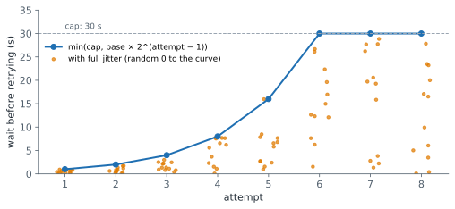

# Lesson 8: Streaming, errors and retries

**You'll learn:** server-sent events, stream event types, text and JSON deltas, assembling a streamed message, SDK streaming helpers, HTTP status codes and error types, which errors to retry, exponential backoff, jitter, retry-after, timeouts, SDK automatic retries, request IDs, fallbacks to another model or provider.

▶ **Practise this lesson in the [sandbox](https://kishoremadanagopal.github.io/learning/ai-engineering/#streaming-and-retries)**: run every example and check your exercise answers.

## Key terms

- **Streaming:** receiving the response as a series of events while the model generates it.
- **Server-sent events (SSE):** the web standard used to push the stream of events over one HTTP response.
- **Delta:** an event carrying the next small piece of a content block.
- **Transient error:** a temporary failure, such as a rate limit or an overloaded server, that may succeed on retry.
- **Exponential backoff:** waiting twice as long after each failed attempt, up to a cap.
- **Jitter:** a random amount added to (or taken from) the wait so that clients don't retry in sync.
- **Retry-after:** a response header telling the client how long to wait before trying again.
- **Request ID:** the identifier of one API call, for debugging and support.

A model can take seconds (or minutes, for long answers with lots of thinking) to finish. Two things make an application feel good and stay up: **streaming** the answer as it's generated, and handling the **errors** that every busy API sometimes returns.

## Streaming

With streaming, the API sends the response as a series of small **events** (server-sent events, SSE) while the model is still generating. The user sees the first words in well under a second instead of waiting for the whole reply, and long requests don't hit network timeouts.

```python
import anthropic

client = anthropic.Anthropic()
with client.messages.stream(
    model="claude-sonnet-5-5",
    max_tokens=1024,
    messages=[{"role": "user", "content": "Explain tubeless tyres in three sentences."}],
) as stream:
    for text in stream.text_stream:          # text arrives in small pieces
        print(text, end="", flush=True)
    final = stream.get_final_message()       # the complete Message, as a non-streaming call returns
print("\n", final.stop_reason, final.usage.output_tokens)
```


Underneath, a stream is a sequence of typed events:

| Event | Carries |
|---|---|
| `message_start` | the message envelope (id, model) with empty content |
| `content_block_start` | the start of a block (text, tool call, thinking) at an index |
| `content_block_delta` | a piece of a block: `text_delta` text, `input_json_delta` partial tool input, `thinking_delta` |
| `content_block_stop` | the end of a block |
| `message_delta` | top-level changes such as the `stop_reason` and cumulative usage |
| `message_stop` | the end of the stream |
| `ping`, `error` | keep-alives, and errors that happen mid-stream |

```python
events = [
    {"type": "message_start", "message": {"id": "msg_1", "content": []}},
    {"type": "content_block_start", "index": 0, "content_block": {"type": "text", "text": ""}},
    {"type": "content_block_delta", "index": 0, "delta": {"type": "text_delta", "text": "Tubeless tyres "}},
    {"type": "ping"},
    {"type": "content_block_delta", "index": 0, "delta": {"type": "text_delta", "text": "seal themselves."}},
    {"type": "content_block_stop", "index": 0},
    {"type": "message_delta", "delta": {"stop_reason": "end_turn"}, "usage": {"output_tokens": 6}},
    {"type": "message_stop"},
]

for e in events:
    if e["type"] == "content_block_delta" and e["delta"]["type"] == "text_delta":
        print(e["delta"]["text"], end="", flush=True)     # what the user sees appearing
print()
```

Assembling these events into the final text and stop reason is the first exercise. In practice the SDKs do it for you (`get_final_message()`), but knowing the events helps when you stream to a web page or debug a stream that stopped early.

## Errors

The API returns standard HTTP status codes with a JSON body naming the error type:

| Status | Error type | Retry? |
|---|---|---|
| 400 | `invalid_request_error` | **no**: fix the request (bad parameter, unsupported feature, too many tokens) |
| 401 | `authentication_error` | no: check the API key |
| 403 | `permission_error` | no |
| 404 | `not_found_error` | no: check the model name or endpoint |
| 413 | `request_too_large` | no: send less (the Messages API allows up to 32 MB) |
| 429 | `rate_limit_error` | **yes, after waiting**: honour the `retry-after` header |
| 500 | `api_error` | yes, with backoff |
| 504 | `timeout_error` | yes; for long generations, use streaming instead |
| 529 | `overloaded_error` | yes, with backoff |

Every response carries a `request-id` header (`req_…`); log it, because support needs it to investigate a specific request.

## Retrying with exponential backoff

For temporary failures (429, 5xx, dropped connections), **retry**, but wait longer each time so a struggling service gets room to recover: 1 s, 2 s, 4 s, 8 s… up to a cap. Add random **jitter** so thousands of clients don't all retry at the same instant, and if the server sends `retry-after`, wait at least that long.



```python
import random

def backoff_delays(attempts, base=1.0, cap=30.0, seed=0):
    rng = random.Random(seed)
    delays = []
    for attempt in range(attempts):
        exp = min(cap, base * 2 ** attempt)          # exponential growth, capped
        delays.append(round(rng.uniform(0, exp), 2)) # "full jitter": anywhere from 0 to exp
    return delays

print(backoff_delays(6))

class TransientError(Exception):
    pass

def call_with_retries(fn, max_retries=3):
    for attempt in range(max_retries + 1):
        try:
            return fn()
        except TransientError as e:
            if attempt == max_retries:
                raise                                 # give up: let the caller decide
            print(f"attempt {attempt + 1} failed ({e}); retrying")
            # a real version sleeps first: time.sleep(the backoff delay for this attempt)

outcomes = iter([TransientError("529 overloaded"), TransientError("529 overloaded"), "OK: here is the reply"])
def flaky_call():
    result = next(outcomes)
    if isinstance(result, Exception):
        raise result
    return result

print(call_with_retries(flaky_call))
```

The official SDKs already retry connection errors, 429s and 5xx errors **twice by default** with exponential backoff, honouring `retry-after`; set `max_retries` on the client to change that. You still decide what happens when retries run out.

## Designing for failure

- **Timeouts:** set a sensible client timeout; for long outputs, stream (non-streaming SDK calls refuse requests expected to take over 10 minutes).
- **Fallbacks:** if the primary model keeps failing, fall back to another model or provider, or to a non-AI path ("we'll email you the summary").
- **Idempotency:** before retrying an action with side effects (sending an email, charging a card), make sure retrying can't do it twice.
- **Mid-stream errors:** a stream can fail after it started successfully; handle `error` events and partial output.
- **Rate limits** are per organisation and per model, in requests and tokens per minute: smooth out bursts with a queue, and move non-urgent work to batches (Lesson 11).

## At a glance

| Concept | Approach | Time | Space |
|---|---|---|---|
| Assemble a stream | append each text delta to its block; read stop reason from message_delta | O(events) | O(text length) |
| Retry decision | retryable status and attempts left | O(1) | O(1) |
| Backoff delay | min(cap, base × 2^(attempt − 1)), at least retry-after, plus jitter | O(1) | O(1) |

## Common mistakes

- Retrying permanent errors such as 400 or 401.
- Retrying immediately in a tight loop instead of backing off.
- Ignoring the server's retry-after value.
- Retrying without a limit, so a failure turns into a hang.
- Logging API keys or full sensitive prompts instead of request IDs and metadata.

## Exercises

### 1. Assemble a stream

Write `assemble(events)` that takes a list of stream event dicts (as in the lesson) and returns a tuple `(text, stop_reason)`: all `text_delta` pieces joined in order, and the `stop_reason` from the `message_delta` event (or `None` if there wasn't one). Ignore every other event type, including `ping` and non-text deltas.

Starter code:

```python
def assemble(events):
    pass

events = [
    {"type": "message_start", "message": {"id": "msg_1", "content": []}},
    {"type": "content_block_delta", "index": 0, "delta": {"type": "text_delta", "text": "Hel"}},
    {"type": "ping"},
    {"type": "content_block_delta", "index": 0, "delta": {"type": "text_delta", "text": "lo!"}},
    {"type": "message_delta", "delta": {"stop_reason": "end_turn"}, "usage": {"output_tokens": 2}},
    {"type": "message_stop"},
]
print(assemble(events))   # ('Hello!', 'end_turn')
```

<details>
<summary>🧭 How to approach it</summary>

1. **Understand:** text deltas in order; the stop reason from message_delta; ignore everything else.
2. **Examples:** "Hel" + "lo!" → "Hello!", "end_turn".
3. **Brute force:** string concatenation in a loop: fine (a list + join is the idiomatic version).
4. **Pattern:** **event dispatch on type** while accumulating state.
5. **Plan:** loop, two branches, return the tuple.
6. **Code and test:** empty stream, tool-input deltas, thinking deltas, no message_delta.

</details>

<details>
<summary>💡 Hint 1</summary>

Only two event types matter: text deltas and the message delta.

</details>

<details>
<summary>💡 Hint 2</summary>

A text piece is in `event["delta"]["text"]` when `event["type"] == "content_block_delta"` and `event["delta"]["type"] == "text_delta"`. The stop reason is in a `message_delta` event's `event["delta"]["stop_reason"]`.

</details>

<details>
<summary>💡 Hint 3</summary>

Collect text pieces in a list, join them at the end, and return `("".join(pieces), stop_reason)` with `stop_reason` starting as None.

</details>

### 2. Should this request be retried?

Write `should_retry(status, attempt, max_retries)` returning `True` if a request that failed with HTTP `status` should be retried: the status must be retryable (429, 500, 504 or 529; not other 4xx errors) **and** `attempt` (the number of attempts already made, starting at 1) must be at most `max_retries`. Then write `wait_seconds(attempt, retry_after=None, base=1.0, cap=30.0)` returning `min(cap, base * 2 ** (attempt - 1))`, or `retry_after` if that's given and larger.

Starter code:

```python
def should_retry(status, attempt, max_retries):
    pass

def wait_seconds(attempt, retry_after=None, base=1.0, cap=30.0):
    pass

print(should_retry(529, 1, 2), should_retry(400, 1, 2), should_retry(429, 3, 2))   # True False False
print(wait_seconds(1), wait_seconds(4), wait_seconds(2, retry_after=10))          # 1.0 8.0 10
```

<details>
<summary>🧭 How to approach it</summary>

1. **Understand:** retryable statuses only, within the retry budget; exponential delay with a cap, overridden upwards by retry-after.
2. **Examples:** 529 on attempt 1 with 2 retries → True; 400 → False; delay for attempt 4 → 8 s.
3. **Brute force:** a chain of `if` statements: works, a set is clearer.
4. **Pattern:** **classify errors + exponential backoff**.
5. **Plan:** a set of retryable codes; a capped power of two; `max` with retry-after.
6. **Code and test:** each status type, the cap, retry-after shorter and longer.

</details>

<details>
<summary>💡 Hint 1</summary>

Which errors can succeed if you simply try again later? Which mean the request itself is wrong?

</details>

<details>
<summary>💡 Hint 2</summary>

Retry rate limits (429), server errors (500), timeouts (504) and overload (529). Never retry 400, 401, 403, 404 or 413: the same request will fail again.

</details>

<details>
<summary>💡 Hint 3</summary>

`should_retry` is `status in {429, 500, 504, 529} and attempt <= max_retries`. `wait_seconds` computes `min(cap, base * 2 ** (attempt - 1))` and returns `retry_after` instead when it's larger.

</details>

**In the sandbox:** exercises 14–15. Press **Check** to run the hidden tests.

### Answers and walkthroughs

Open these only after a real attempt. Each one explains the solution step by step.

<details>
<summary>✅ 1. Assemble a stream</summary>

```python
def assemble(events):
    pieces, stop_reason = [], None
    for event in events:
        kind = event.get("type")
        if kind == "content_block_delta" and event["delta"].get("type") == "text_delta":
            pieces.append(event["delta"]["text"])
        elif kind == "message_delta":
            stop_reason = event["delta"].get("stop_reason", stop_reason)
    return "".join(pieces), stop_reason

events = [
    {"type": "message_start", "message": {"id": "msg_1", "content": []}},
    {"type": "content_block_delta", "index": 0, "delta": {"type": "text_delta", "text": "Hel"}},
    {"type": "ping"},
    {"type": "content_block_delta", "index": 0, "delta": {"type": "text_delta", "text": "lo!"}},
    {"type": "message_delta", "delta": {"stop_reason": "end_turn"}, "usage": {"output_tokens": 2}},
    {"type": "message_stop"},
]
print(assemble(events))
```

**Line by line**

- `event.get("type")` reads the event type safely.
- Only `text_delta` deltas are appended; `input_json_delta` (tool input) and `thinking_delta` belong to other blocks.
- The `message_delta` event carries the final `stop_reason`; starting from None covers streams that never sent one.

**Trace** on the example: message_start (ignored), "Hel" (kept), ping (ignored), "lo!" (kept), message_delta → end_turn, message_stop (ignored).

**Complexity:** O(number of events + text length).

**Common wrong approach:** concatenating every delta's content regardless of type, which mixes partial tool JSON and thinking into the visible answer.

</details>

<details>
<summary>✅ 2. Should this request be retried?</summary>

```python
RETRYABLE = {429, 500, 504, 529}

def should_retry(status, attempt, max_retries):
    return status in RETRYABLE and attempt <= max_retries

def wait_seconds(attempt, retry_after=None, base=1.0, cap=30.0):
    delay = min(cap, base * 2 ** (attempt - 1))       # 1, 2, 4, 8, ... seconds, capped
    if retry_after is not None and retry_after > delay:
        return retry_after                            # the server asked us to wait longer
    return delay

print(should_retry(529, 1, 2), should_retry(400, 1, 2), should_retry(429, 3, 2))
print(wait_seconds(1), wait_seconds(4), wait_seconds(2, retry_after=10))
```

**Line by line**

- The set `RETRYABLE` lists the transient failures; set membership is O(1) and easy to read.
- `attempt <= max_retries` allows exactly `max_retries` retries after the first try.
- `base * 2 ** (attempt - 1)` gives 1, 2, 4, 8… for base 1; `min(cap, …)` stops it growing forever.
- `retry-after` is a minimum the server asks for, so it only ever lengthens the wait.

**Trace:** attempts 1–6 with base 1 and cap 30 wait 1, 2, 4, 8, 16, 30 seconds.

**Complexity:** O(1).

**Common wrong approach:** retrying every error, including 400s, which wastes time and money and can trigger more rate limiting. (In production, also add random jitter to the delay.)

</details>

## Quick quiz

1. What is the main benefit of streaming a response?
   - A) Users see the answer appear immediately, and long generations avoid network timeouts
   - B) It makes the model smarter
   - C) It halves the cost

2. Which error should NOT be retried?
   - A) 400 invalid_request_error
   - B) 429 rate_limit_error
   - C) 529 overloaded_error

3. Why add jitter to exponential backoff?
   - A) So many clients don't all retry at exactly the same moment
   - B) To make retries faster
   - C) To make the delays shorter than the server asked

4. What should you log for every API call to help debugging later?
   - A) The request-id from the response
   - B) The API key
   - C) Nothing; the provider keeps everything

<details>
<summary>Quiz answers</summary>

1. **A) Users see the answer appear immediately, and long generations avoid network timeouts**: The total work is the same; the experience and robustness improve.
2. **A) 400 invalid_request_error**: A malformed request fails the same way every time.
3. **A) So many clients don't all retry at exactly the same moment**: Randomising the wait spreads retries out.
4. **A) The request-id from the response**: Support uses the request ID to find a specific call; never log API keys.

</details>

---
Previous: [Lesson 7](07-messages-api.md) · Next: [Lesson 9: Getting reliable JSON out](09-structured-output.md)
