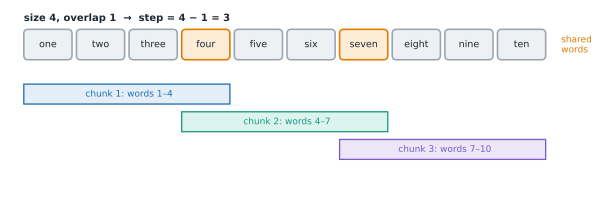

# Lesson 18: Chunking documents

**You'll learn:** why documents are chunked, the chunk-size trade-off, fixed-size chunks, overlap, sentence and paragraph boundaries, recursive splitting, structure-aware chunking with headings, tables and code, chunk metadata, chunk headers, contextual retrieval, contextualised chunk embeddings, small-to-big retrieval.

▶ **Practise this lesson in the [sandbox](https://kishoremadanagopal.github.io/learning/ai-engineering/#chunking)**: run every example and check your exercise answers.

## Key terms

- **Chunk size:** how much text goes in each chunk, usually measured in tokens.
- **Overlap:** text repeated at the end of one chunk and the start of the next.
- **Recursive splitting:** splitting on the largest separator first, falling back to smaller ones only when needed.
- **Structure-aware chunking:** splitting along a document's own structure, such as headings or code functions.
- **Chunk header:** the title and section path prepended to a chunk's text.
- **Contextual retrieval:** prepending a short model-written context to each chunk before indexing it.
- **Small-to-big retrieval:** matching small chunks but giving the model their larger parent section.

Retrieval works on **chunks**: passages small enough to match a specific question and to fit, several at a time, into a prompt. How you cut documents into chunks quietly decides what retrieval can ever find.

## Why chunk at all?

- **Precision.** A question about puncture prices matches one paragraph, not a 40-page manual. One embedding for a whole manual blurs every topic in it together.
- **Prompt budget.** You can put the top 5–20 chunks in a prompt, not the top 20 documents.
- **Limits.** Embedding models accept a limited input length per text.

## The size trade-off

| Chunks that are… | Good | Bad |
|---|---|---|
| small (a sentence or two) | precise matches | lose context ("It costs £12": what does?) |
| large (pages) | full context | vague matches; fewer fit in the prompt; costlier |

A few hundred tokens per chunk with **10–20% overlap** is a common starting point. Then tune it, along with how many chunks you retrieve, on your own questions (Lesson 22). There's no universally best size.

## Fixed-size chunks with overlap

The simplest method takes a fixed number of words (or tokens) at a time. **Overlap** repeats a little text at each boundary, so a sentence cut in half still appears whole in one of the chunks:



The step between chunk starts is `size − overlap`. The first exercise implements this.

## Respecting boundaries

Cutting mid-sentence hurts. Better splitters prefer natural boundaries:

- **Sentences and paragraphs:** gather whole sentences until the chunk is full.
- **Recursive splitting:** try to split on the biggest separator first (blank lines between paragraphs), and only fall back to smaller ones (line breaks, sentence ends, spaces) for pieces that are still too long. Libraries such as LangChain and LlamaIndex provide this.
- **Structure-aware:** use the document's own structure: Markdown or HTML headings, sections of a contract, functions in code, rows of a table. Never split a table row or a code block down the middle (the second exercise splits by headings).

```python
import re

text = """Unused items can be returned within 30 days. Bring your receipt.

Helmets can only be returned unworn. This is for safety reasons.

Refunds go back to the original payment method."""

paragraphs = [p.strip() for p in text.split("\n\n") if p.strip()]
sentences = [s for p in paragraphs for s in re.split(r"(?<=[.!?])\s+", p)]
print(len(paragraphs), "paragraphs;", len(sentences), "sentences")
for p in paragraphs:
    print("-", p)
```

## Give every chunk its context

A chunk on its own often loses vital context: "The fee is £12." Which fee? Fixes, from simple to sophisticated:

- **Metadata:** store the source, title, section path, date and permissions with each chunk; use them for citations and filtering.
- **Chunk headers:** prepend the document title and section path to the text before indexing: `Repairs guide > Punctures: The fee is £12.`
- **Contextual retrieval:** use an LLM to write a short context (Anthropic used 50–100 tokens) situating each chunk in its document, and prepend that before embedding and keyword indexing. In Anthropic's 2024 tests, this cut the top-20 retrieval failure rate by 49%, and by 67% when combined with reranking (Lesson 21). Prompt caching makes it affordable, since the whole document is resent for each of its chunks.
- **Contextualised chunk embeddings:** some embedding models (for example Voyage's `voyage-context-4`) take the whole document and return one embedding per chunk that already reflects its surroundings.

## Small to big

Another pattern **retrieves small and returns big**: index small chunks (precise matching), but when one matches, give the model its surrounding section or the neighbouring chunks (enough context to answer). Store each chunk's parent ID or position to make this possible.

## At a glance

| Concept | Approach | Time | Space |
|---|---|---|---|
| Fixed-size chunks | sliding window with step size − overlap | O(n) | O(n) |
| Split by headings | stack of open headings; flush at each heading | O(n) | O(n) |
| Context for chunks | headers, contextual retrieval, small-to-big | — | — |

## Common mistakes

- Picking a chunk size without testing it on real questions.
- Splitting sentences, table rows or code blocks in half.
- Losing the title and section that give a chunk its meaning.
- Treating `#` lines inside code blocks as headings.
- Adding chunks that only repeat the overlap.

## Exercises

### 1. Fixed-size chunks with overlap

Write `chunk_words(text, size, overlap=0)` splitting `text` into words (`text.split()`) and returning a list of chunks, each the words joined with single spaces:

- each chunk has `size` words (the last may have fewer);
- each chunk starts `size − overlap` words after the previous one;
- stop once a chunk reaches the end of the text (don't add a final chunk that only repeats overlap);
- raise `ValueError` unless `0 <= overlap < size`;
- an empty text gives `[]`.

Starter code:

```python
def chunk_words(text, size, overlap=0):
    pass

text = "one two three four five six seven eight nine ten"
print(chunk_words(text, 4, overlap=1))
# ['one two three four', 'four five six seven', 'seven eight nine ten']
```

<details>
<summary>🧭 How to approach it</summary>

1. **Understand:** a sliding window of `size` words moving `size − overlap` at a time, ending at the first window that touches the end.
2. **Examples:** size 4, overlap 1 → starts 0, 3, 6; the window at 6 covers words 7–10 and ends the text.
3. **Brute force:** this is already linear.
4. **Pattern:** **sliding window with a step**.
5. **Plan:** validate → split → loop over starts → slice and join → stop at the end.
6. **Code and test:** no overlap, exact fit, step 1, odd whitespace, empty text, invalid settings.

</details>

<details>
<summary>💡 Hint 1</summary>

The chunks start at 0, `step`, `2 × step`, … where `step = size − overlap`: `range(0, len(words), step)`.

</details>

<details>
<summary>💡 Hint 2</summary>

Each chunk is `words[start:start + size]`; slicing past the end is safe in Python.

</details>

<details>
<summary>💡 Hint 3</summary>

After adding a chunk, `break` if `start + size >= len(words)`; without this, overlap creates extra chunks made only of words you've already covered. Check the `ValueError` condition first.

</details>

### 2. Split Markdown by headings

Write `split_markdown(text)` returning a list of `(path, body)` pairs, one per section:

- A heading is a line matching `^(#{1,6})\s+(.*)$`; its level is the number of `#`s.
- A section's `path` is the titles of the enclosing headings joined with `" > "`, such as `"Returns > Helmets"`. A heading closes any open headings of the same or a deeper level.
- A section's `body` is the lines up to the next heading, joined with `"\n"` and stripped. Skip sections whose body is empty.
- Text before the first heading has the path `""`.

Starter code:

```python
import re

def split_markdown(text):
    pass

doc = """# Returns
Unused items within 30 days.
## Helmets
Only if unworn.
# Repairs
## Punctures
£12, same day."""
for path, body in split_markdown(doc):
    print(f"{path}: {body}")
```

<details>
<summary>🧭 How to approach it</summary>

1. **Understand:** sections split at headings; each knows its chain of parent headings.
2. **Examples:** `# A`, `### C`, `## B`: B (level 2) closes C (level 3) but not A (level 1) → "A > B".
3. **Brute force:** for each section, scan backwards for the nearest heading of each lower level: O(n²).
4. **Pattern:** **stack of open headings**, like matching nested brackets.
5. **Plan:** for each line → heading? flush, pop, push : collect → final flush.
6. **Code and test:** text before any heading, skipped levels, empty sections, `#` without a space.

</details>

<details>
<summary>💡 Hint 1</summary>

Walk the lines once. Keep the lines of the current section in a list, and a **stack** of the open headings as `(level, title)` pairs.

</details>

<details>
<summary>💡 Hint 2</summary>

At each heading: first save the current section (if its body isn't empty), then pop headings from the stack while the top one's level is ≥ the new level, then push the new heading.

</details>

<details>
<summary>💡 Hint 3</summary>

The path is `" > ".join(title for level, title in stack)`. Don't forget to save the last section after the loop.

</details>

**In the sandbox:** exercises 34–35. Press **Check** to run the hidden tests.

### Answers and walkthroughs

Open these only after a real attempt. Each one explains the solution step by step.

<details>
<summary>✅ 1. Fixed-size chunks with overlap</summary>

```python
def chunk_words(text, size, overlap=0):
    if not 0 <= overlap < size:
        raise ValueError("need 0 <= overlap < size")
    words = text.split()
    step = size - overlap
    chunks = []
    for start in range(0, len(words), step):
        chunks.append(" ".join(words[start:start + size]))
        if start + size >= len(words):
            break                      # this chunk reached the end
    return chunks

text = "one two three four five six seven eight nine ten"
print(chunk_words(text, 4, overlap=1))
```

**Line by line**

- `0 <= overlap < size` guarantees a positive step; an overlap equal to the size would never move forward.
- `text.split()` with no argument splits on any run of whitespace and ignores it at the ends.
- `range(0, len(words), step)` produces the window starts; for an empty text it produces none.
- The `break` stops as soon as a window covers the last word.

**Trace** with size 6, overlap 2 (step 4): start 0 → words 1–6; start 4 → words 5–10, and 4 + 6 = 10 reaches the end → stop.

**Complexity:** O(n · size ÷ step) words copied; O(n) when the overlap is small.

**Common wrong approach:** forgetting the `break`, which with size 4 and overlap 1 adds a fourth chunk, "ten", repeating text already covered. (Real systems usually count **tokens** rather than words, and prefer sentence boundaries.)

</details>

<details>
<summary>✅ 2. Split Markdown by headings</summary>

```python
import re

HEADING = re.compile(r"^(#{1,6})\s+(.*)$")

def split_markdown(text):
    sections = []
    stack = []                         # (level, title) of the open headings
    lines = []

    def flush():
        body = "\n".join(lines).strip()
        if body:
            sections.append((" > ".join(title for _, title in stack), body))

    for line in text.split("\n"):
        match = HEADING.match(line)
        if match:
            flush()
            lines = []
            level = len(match.group(1))
            while stack and stack[-1][0] >= level:
                stack.pop()            # close headings at the same or a deeper level
            stack.append((level, match.group(2).strip()))
        else:
            lines.append(line)
    flush()
    return sections

doc = """# Returns
Unused items within 30 days.
## Helmets
Only if unworn.
# Repairs
## Punctures
£12, same day."""
for path, body in split_markdown(doc):
    print(f"{path}: {body}")
```

**Line by line**

- The regex requires whitespace after the `#`s, so `#NoSpace` is ordinary text (as in Markdown itself).
- `flush` builds the path from the stack **as it was** for that section, so it must run before the stack changes.
- Popping while `stack[-1][0] >= level` closes siblings (same level) and their children (deeper levels).
- The final `flush()` after the loop saves the last section.

**Trace** on the first example: "Returns" body saved with path "Returns"; "Helmets" → "Returns > Helmets"; `# Repairs` pops both and has no body (skipped); "Punctures" → "Repairs > Punctures".

**Complexity:** O(n) for n lines (each heading is pushed and popped at most once).

**Common wrong approach:** treating `#` lines inside fenced code blocks as headings. A production splitter tracks whether it's inside a fence, or uses a real Markdown parser.

</details>

## Quick quiz

1. What is the main risk of very small chunks?
   - A) They lose context, such as what "it" or "the fee" refers to
   - B) They can't be embedded
   - C) They make the index too small

2. Why add overlap between chunks?
   - A) So text cut at a boundary still appears whole in one chunk
   - B) To make the index larger
   - C) Because embedding models require it

3. What does contextual retrieval add to each chunk before indexing?
   - A) A short, model-written description situating the chunk within its document
   - B) The full document
   - C) A random ID

4. A chunk matches, but the answer needs the surrounding section. Which pattern helps?
   - A) Small-to-big: retrieve the small chunk, give the model its parent section
   - B) Bigger embeddings
   - C) More overlap only

<details>
<summary>Quiz answers</summary>

1. **A) They lose context, such as what "it" or "the fee" refers to**: Precise but context-poor; add headers or small-to-big retrieval.
2. **A) So text cut at a boundary still appears whole in one chunk**: A little repetition protects ideas that straddle a cut.
3. **A) A short, model-written description situating the chunk within its document**: In Anthropic's tests it cut retrieval failures substantially.
4. **A) Small-to-big: retrieve the small chunk, give the model its parent section**: Match precisely, answer with context.

</details>

---
Previous: [Lesson 17](17-rag-pipeline.md) · Next: [Lesson 19: Keyword search with BM25](19-keyword-search.md)
