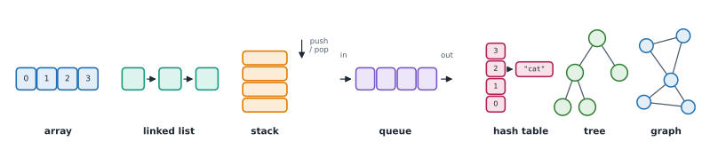

# Lesson 1: What data structures and algorithms are

**You'll learn:** data structures vs algorithms, the structures in this course, why the right choice matters, how exercises and the help ladder work.

▶ **Practise this lesson in the [sandbox](https://kishoremadanagopal.github.io/learning/dsa/#what-is-dsa)**: run every example and check your exercise answers.

## Key terms

- **Data structure:** a way of organising data in memory so certain operations are fast, such as a list, dict or tree.
- **Algorithm:** a precise, step-by-step recipe for solving a problem.
- **Function:** a named block of code that takes inputs (arguments) and returns an output.
- **Return value:** what a function gives back with `return`; tests check this, not what it prints.
- **Test case:** one input together with the expected output, used to check a function.
- **Hidden test:** a test case the checker runs without showing it to you first, like on coding-interview sites.
- **Edge case:** an unusual input at the boundaries, such as an empty list, one item, negatives or duplicates.
- **Running best:** a pattern that walks through data once, remembering the best value seen so far.

A **data structure** is a way of organising data in memory so that certain jobs are fast. An **algorithm** is a precise, step-by-step recipe for solving a problem. You've already used both: a Python `list` is a data structure, and "go through the list and keep the biggest number so far" is an algorithm.



| Data structure | Picture it as | Great at | Lessons |
|---|---|---|---|
| **Array / list** | numbered boxes in a row | jumping to position *i* | 6–12 |
| **Hash table** (`dict`, `set`) | labelled drawers | "is this here?", "what's stored under this key?" | 13–14 |
| **Stack** | a pile of plates | undo, matching brackets | Part 4 |
| **Queue** | a line of people | first come, first served | Part 4 |
| **Linked list** | a chain of boxes with arrows | inserting in the middle | Part 4 |
| **Tree** | a family tree | sorted data, hierarchies | Part 6 |
| **Graph** | cities and roads | networks, routes, dependencies | Part 7 |

## Why it matters: the same question, two speeds

"Do these two lists share any item?" Here are two correct answers. The first checks every pair; the second puts one list into a `set` first:

```python
import time

a = list(range(0, 20_000, 2))      # 10,000 even numbers
b = list(range(1, 20_000, 2))      # 10,000 odd numbers: no overlap, the worst case

start = time.perf_counter()
found = any(x in b for x in a)            # 'in' on a list checks item by item
print("list:", found, f"{time.perf_counter() - start:.2f} s")

start = time.perf_counter()
b_set = set(b)
found = any(x in b_set for x in a)        # 'in' on a set jumps straight to the answer
print("set: ", found, f"{time.perf_counter() - start:.4f} s")
```

Same answer, but the set version is hundreds of times faster, and the gap grows with the data. With a million items, the list version would take hours. Choosing the right structure is most of the work. This course teaches you to see that **before** you write the slow version.

## Where you'll use DSA

- **Coding interviews.** Almost every software, data and AI engineering interview includes a problem-solving round built on exactly these topics.
- **Real work.** Deduplicating records (sets), finding the top 10 results (heaps), scheduling tasks that depend on each other (graphs), autocomplete (tries), caching (hash tables and linked lists).
- **AI engineering.** Agent workflows are graphs, retrieval ranks the top *k* results with heaps, tokenizers use tries and hashing, and dynamic programming appears in sequence alignment and beam search.

## How exercises work in this course

Exercises ask you to write a **function**. When you press **Check**, the sandbox runs it against **hidden test cases**, like coding-interview sites do, including edge cases such as empty lists. Many exercises also have a **speed check** on large inputs. If something fails, you'll see the exact input, what was expected and what your function returned.

Stuck? Every exercise has a **help ladder**: 🧭 **Approach** (how to think about it), 💡 **three hints**, each giving away a bit more, and ✅ a **walkthrough** that explains the solution line by line with a trace of it running.

Here's a function and a call, the shape of every exercise:

```python
def find_max(nums):
    best = nums[0]                # the first number is the biggest seen so far
    for n in nums[1:]:            # look at every other number once
        if n > best:
            best = n              # found a bigger one: remember it
    return best                   # return the answer (don't just print it)

print(find_max([3, 8, 2, 8, 5]))
print(find_max([-7, -3, -9]))
```

## At a glance

| Concept | Approach | Time | Space |
|---|---|---|---|
| Data structure | a way to organise data so the operations you need are fast | depends on the structure | O(n) to store n items |
| Algorithm | exact steps that turn an input into the right output | measured with Big-O | extra memory it needs |
| Smallest number | one pass, remembering the smallest so far | O(n) | O(1) |
| Duplicate check (brute force vs set) | compare every pair, or remember seen items in a set | O(n²) vs O(n) | O(1) vs O(n) |

## Common mistakes

- Printing the answer instead of returning it. Tests see None.
- Starting a "smallest so far" at 0 instead of the first item, which breaks on lists without 0.
- Testing only the example in the question and forgetting edge cases like an empty list.

## Exercises

### 1. Smallest number

Write a function `find_min(nums)` that returns the **smallest** number in a non-empty list, **without** using Python's built-in `min()`.

Starter code:

```python
def find_min(nums):
    # your code here
    pass
```

<details>
<summary>🧭 How to approach it</summary>

1. **Understand:** input is a non-empty list of numbers; output is one number, the smallest. No `min()`.
2. **Examples:** `[4, 2, 9]` → 2. Edge cases: one number `[7]` → 7; all negative `[-3, -10, -1]` → -10; the smallest first or last.
3. **Brute force:** for each number, check whether it's smaller than all the others. That works but compares every pair: O(n²).
4. **Pattern:** a **running best**: walk through once, remembering the best so far. Very common.
5. **Plan:** start with the first number as "smallest so far"; for each other number, if it's smaller, remember it instead; at the end, return what you remembered.
6. **Code and test:** write it, then try the edge cases in your head: does a one-item list work? (The loop over `nums[1:]` simply doesn't run.)

</details>

<details>
<summary>💡 Hint 1</summary>

Copy the idea of `find_max` above: keep the "smallest so far" in a variable.

</details>

<details>
<summary>💡 Hint 2</summary>

Start with `smallest = nums[0]`. Then loop over the rest and replace `smallest` whenever you meet a smaller number.

</details>

<details>
<summary>💡 Hint 3</summary>

`for n in nums[1:]: if n < smallest: smallest = n`, then `return smallest` after the loop (not inside it).

</details>

### 2. Count the evens

Write `count_evens(nums)` that returns how many numbers in the list are even. An empty list has 0 evens.

Starter code:

```python
def count_evens(nums):
    pass
```

<details>
<summary>🧭 How to approach it</summary>

1. **Understand:** input a list (maybe empty); output a count, an integer ≥ 0.
2. **Examples:** `[1, 2, 3, 4]` → 2. Edge cases: `[]` → 0; negatives (`-2` is even); `0` is even.
3. **Brute force:** this is already simple: look at every number once.
4. **Pattern:** a **counter** updated in one pass.
5. **Plan:** counter = 0; for each number, if even, add 1; return the counter.
6. **Code and test:** check the empty list: the loop never runs and the counter stays 0.

</details>

<details>
<summary>💡 Hint 1</summary>

A number is even when `n % 2 == 0` (it divides by 2 with nothing left over).

</details>

<details>
<summary>💡 Hint 2</summary>

Keep a counter that starts at 0 and goes up by 1 for each even number.

</details>

<details>
<summary>💡 Hint 3</summary>

`count = 0`, then `for n in nums: if n % 2 == 0: count += 1`, then `return count`.

</details>

**In the sandbox:** exercises 1–2. Press **Check** to run the hidden tests.

### Answers and walkthroughs

Open these only after a real attempt. Each one explains the solution step by step.

<details>
<summary>✅ 1. Smallest number</summary>

```python
def find_min(nums):
    smallest = nums[0]
    for n in nums[1:]:
        if n < smallest:
            smallest = n
    return smallest
```

**Line by line**

- `smallest = nums[0]`: before looking at anything else, the first number is the smallest we've seen. Don't start with `0`: for `[4, 2, 9]` the answer would wrongly be 0.
- `for n in nums[1:]:` visits every other number exactly once.
- `if n < smallest: smallest = n` keeps the running best up to date.
- `return smallest` comes **after** the loop. Returning inside the loop would stop after the first comparison.

**Trace** on `[4, 2, 9]`:

| step | n | n < smallest? | smallest |
|---|---|---|---|
| start | – | – | 4 |
| 1 | 2 | yes | 2 |
| 2 | 9 | no | 2 |
| end | | | returns **2** |

**Complexity:** O(n) time, because each number is looked at once; O(1) extra space, because we only keep one variable. (Strictly, `nums[1:]` makes a copy; `for i in range(1, len(nums))` avoids it.)

**Common wrong approach:** `smallest = 0` as the starting value. It looks fine on lists containing 0 or negatives, but returns 0 for `[4, 2, 9]`. Always start from a real element (or `float("inf")`).

</details>

<details>
<summary>✅ 2. Count the evens</summary>

```python
def count_evens(nums):
    count = 0
    for n in nums:
        if n % 2 == 0:
            count += 1
    return count
```

**Line by line**

- `count = 0` handles the empty list for free: if the loop never runs, we return 0.
- `n % 2 == 0` is the even test. It works for negatives too in Python: `-3 % 2` is `1`, `-2 % 2` is `0`.
- `count += 1` adds one each time.

**Trace** on `[1, 2, 3, 4]`:

| n | even? | count |
|---|---|---|
| 1 | no | 0 |
| 2 | yes | 1 |
| 3 | no | 1 |
| 4 | yes | 2 |

**Complexity:** O(n) time, O(1) space.

**Shorter version:** `return sum(1 for n in nums if n % 2 == 0)` does the same in one line. Understand the loop first; use the one-liner once it's obvious to you.

</details>

## Quick quiz

1. What is an algorithm?
   - A) A Python library
   - B) A precise, step-by-step recipe for solving a problem
   - C) A kind of list

2. Why was the set version of "do two lists share an item?" so much faster?
   - A) Checking `x in some_set` jumps straight to the answer instead of scanning every item
   - B) Sets use less memory
   - C) Sets are sorted

3. Your function prints the right answer but the checker says it returned None. Why?
   - A) It prints instead of returning; a function without return gives back None
   - B) The checker is broken
   - C) print is slower than return

4. Which structure fits "undo the last action" best?
   - A) Queue
   - B) Stack
   - C) Graph

<details>
<summary>Quiz answers</summary>

1. **B) A precise, step-by-step recipe for solving a problem**: Data structures organise data; algorithms are the recipes that use them.
2. **A) Checking `x in some_set` jumps straight to the answer instead of scanning every item**: A list check looks at items one by one; a set uses hashing (Lesson 13).
3. **A) It prints instead of returning; a function without return gives back None**: Tests look at what the function returns. Use `return answer`.
4. **B) Stack**: The last thing done is the first thing undone: last in, first out.

</details>

---
Back to the [course home](../README.md) · Next: [Lesson 2: How to approach any problem: the 6-step method](02-problem-solving.md)
