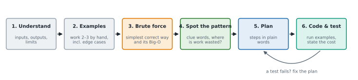

# Lesson 2: How to approach any problem: the 6-step method

**You'll learn:** the 6-step method, understanding the problem, examples and edge cases, brute force first, spotting the pattern, planning in pseudocode, testing, clue words.

▶ **Practise this lesson in the [sandbox](https://kishoremadanagopal.github.io/learning/dsa/#problem-solving)**: run every example and check your exercise answers.

## Key terms

- **Brute force:** the simplest correct solution, usually trying every possibility; often slow but a good start.
- **Pseudocode:** the steps of an algorithm in plain words, before writing real code.
- **Pattern:** a known technique that solves a family of problems, such as two pointers or a hash map.
- **Trade-off:** gaining one thing (like speed) by giving up another (like memory).
- **Constraint:** a limit given in the problem, such as the input size or value range; it hints at the Big-O you need.
- **Clue words:** phrases in a problem that point to a pattern, like "contiguous subarray" → sliding window.

Most people stare at a problem, start typing, and get lost. Strong problem solvers follow a **routine**. Use these six steps on every exercise in this course until they're automatic:



| Step | Ask yourself | Why it matters |
|---|---|---|
| **1. Understand** | What goes in? What comes out? What are the limits (size, negatives, empty, duplicates)? | Half of wrong answers solve the wrong problem. |
| **2. Examples** | Work 2–3 examples by hand, including an **edge case** (empty, one item, all the same, negative). | Examples reveal the rules and become your tests. |
| **3. Brute force** | What's the simplest correct way, even if slow? What's its Big-O? | A correct slow answer beats a fast wrong one, and it's a starting point. |
| **4. Spot the pattern** | Do clue words point to a known technique? Where is the brute force wasting work? | Most problems are a known pattern in disguise (cheat sheet table). |
| **5. Plan** | Write the steps in plain words or pseudocode. Check the plan on your examples. | Fixing a plan is cheaper than fixing code. |
| **6. Code and test** | Translate the plan; run your examples and edge cases; state the time and space cost. | Testing finds mistakes before someone else does. |

In an interview, **say each step out loud**. Interviewers grade your thinking as much as your final code, and in 2026 many interviews explicitly ask you to explain trade-offs.

## A full example: "contains duplicate"

> Write `has_duplicate(nums)` that returns `True` if any value appears at least twice in the list, else `False`.

**1. Understand.** Input: a list of numbers, possibly empty, possibly huge. Output: `True` or `False`.

**2. Examples.** `[1, 2, 3, 1]` → `True`. `[1, 2, 3]` → `False`. Edge cases: `[]` → `False`; `[5]` → `False`; `[7, 7]` → `True`.

**3. Brute force.** Compare every pair:

```python
def has_duplicate_brute(nums):
    for i in range(len(nums)):
        for j in range(i + 1, len(nums)):    # every pair (i, j) once
            if nums[i] == nums[j]:
                return True
    return False

print(has_duplicate_brute([1, 2, 3, 1]), has_duplicate_brute([1, 2, 3]), has_duplicate_brute([]))
```

Correct, but two nested loops over *n* items: about n²/2 comparisons, **O(n²)**. For a million items that's 500 billion comparisons.

**4. Spot the pattern.** The waste: for each number, we search the whole rest of the list again. If we **remembered** the numbers we'd already seen in a structure with instant lookup, each check would be O(1). Clue words like "appears twice", "seen before" and "duplicate" point to a **hash set** (Lesson 14).

**5. Plan.** Make an empty set `seen`. For each number: if it's already in `seen`, return `True`; otherwise add it. If the loop finishes, return `False`.

**6. Code and test.**

```python
def has_duplicate(nums):
    seen = set()
    for n in nums:
        if n in seen:          # O(1) on average
            return True
        seen.add(n)
    return False

for test_input in ([1, 2, 3, 1], [1, 2, 3], [], [5], [7, 7]):
    print(test_input, has_duplicate(test_input))
```

**Cost:** O(n) time (one pass, O(1) per check), O(n) extra space for the set. We traded memory for speed, which is the most common trade-off in DSA.

There's a third option: sort first, then duplicates sit next to each other. That's O(n log n) time and no set, a good middle ground when memory is tight. Knowing **several** solutions and their trade-offs is exactly what interviewers look for.

## Common clue words

| If the problem says… | Think about… |
|---|---|
| "sorted array", "find a pair" | two pointers, binary search |
| "contiguous subarray / substring", "longest / shortest window" | sliding window |
| "sum of a range", "subarray sum equals k" | prefix sums (+ hash map) |
| "seen before", "duplicate", "count", "anagram" | hash map / set |
| "matching brackets", "next greater", "undo" | stack |
| "top k", "k-th largest", "closest k" | heap |
| "shortest path", "fewest steps" in a grid or network | BFS |
| "all combinations / permutations / subsets" | backtracking |
| "number of ways", "minimum cost", "can you reach" with choices | dynamic programming |

You'll meet every one of these in the course; the cheat sheet has the full table.

## Common mistakes

- Typing code before understanding the problem and working an example by hand.
- Skipping the brute force and getting stuck chasing a clever solution.
- Not stating the time and space cost at the end; interviewers expect it.
- Staying silent in an interview. Say your reasoning out loud.

## Exercises

### 1. Contains duplicate

Write `has_duplicate(nums)` that returns `True` if any value appears at least twice, otherwise `False`. It must handle a list of 50,000 numbers quickly.

Starter code:

```python
def has_duplicate(nums):
    pass
```

<details>
<summary>🧭 How to approach it</summary>

1. **Understand:** list in (maybe empty, maybe 50,000 long); `True`/`False` out.
2. **Examples:** `[1, 2, 3, 1]` → True; `[]` → False; `[7, 7]` → True.
3. **Brute force:** compare every pair with two loops: correct but O(n²), too slow for 50,000 numbers (over a billion comparisons).
4. **Pattern:** "seen before" → **hash set**. Each lookup is O(1) on average.
5. **Plan:** empty set; for each number, if it's in the set → True, else add it; end → False.
6. **Code and test:** run the examples. State the cost: O(n) time, O(n) space.

</details>

<details>
<summary>💡 Hint 1</summary>

The slow way compares every pair. What if you remembered every number you've already passed?

</details>

<details>
<summary>💡 Hint 2</summary>

Use a `set` called `seen`. Checking `n in seen` takes the same short time however big the set is.

</details>

<details>
<summary>💡 Hint 3</summary>

For each `n`: if `n in seen`, return True; else `seen.add(n)`. After the loop, return False.

</details>

### 2. Second largest

Write `second_largest(nums)` that returns the second-largest **distinct** value, or `None` if there isn't one. For `[3, 9, 9, 4]` the answer is 4 (the largest is 9; the next different value is 4). Do it in **one pass**, without sorting.

Starter code:

```python
def second_largest(nums):
    pass
```

<details>
<summary>🧭 How to approach it</summary>

1. **Understand:** distinct values matter: `[9, 9]` has no second largest. Empty or one value → `None`.
2. **Examples:** `[3, 9, 9, 4]` → 4; `[5]` → None; `[7, 7, 7]` → None; `[-5, -1, -3]` → -3.
3. **Brute force:** sort the distinct values and take the second from the end: O(n log n). Fine in real code, but the exercise asks for one pass.
4. **Pattern:** a **running best**, extended to two variables. Each new number can change the first, the second, or nothing.
5. **Plan:** first = second = None. For each n: bigger than first → shift first down to second, n becomes first; else if different from first and bigger than second → n becomes second.
6. **Code and test:** check `[9, 9, 4]`: the second 9 must not become "second" (that's why we test `n != first`).

</details>

<details>
<summary>💡 Hint 1</summary>

Keep **two** running values: the largest so far and the second largest so far.

</details>

<details>
<summary>💡 Hint 2</summary>

When a new number beats the largest, the old largest becomes the second largest. When it's only bigger than the second (and not equal to the largest), update the second.

</details>

<details>
<summary>💡 Hint 3</summary>

Start both as `None`. For each n: if `first is None or n > first`: `second, first = first, n`; elif `n != first and (second is None or n > second)`: `second = n`.

</details>

**In the sandbox:** exercises 3–4. Press **Check** to run the hidden tests.

### Answers and walkthroughs

Open these only after a real attempt. Each one explains the solution step by step.

<details>
<summary>✅ 1. Contains duplicate</summary>

```python
def has_duplicate(nums):
    seen = set()
    for n in nums:
        if n in seen:
            return True
        seen.add(n)
    return False
```

**Line by line**

- `seen = set()` will hold every number we've already passed.
- `if n in seen: return True`: we've met this value before, so it's a duplicate. We can stop at once.
- `seen.add(n)` remembers the current number for later checks.
- `return False` only runs if the loop finished without finding a repeat.

**Trace** on `[1, 2, 3, 1]`:

| n | n in seen? | seen after |
|---|---|---|
| 1 | no | {1} |
| 2 | no | {1, 2} |
| 3 | no | {1, 2, 3} |
| 1 | **yes** → return True | |

**Complexity:** O(n) time, O(n) space.

**One-liner:** `return len(set(nums)) < len(nums)` (a set drops duplicates, so it's shorter if there were any). Also O(n), but it always processes the whole list, while the loop can stop early.

**Common wrong approach:** the nested loop. It passes the small tests and fails the speed check: at 50,000 numbers it needs about 1.25 billion comparisons.

</details>

<details>
<summary>✅ 2. Second largest</summary>

```python
def second_largest(nums):
    first = second = None
    for n in nums:
        if first is None or n > first:
            second = first          # the old largest becomes the second largest
            first = n
        elif n != first and (second is None or n > second):
            second = n
    return second
```

**Line by line**

- `first = second = None`: `None` means "not found yet". It's safer than starting at 0, because the numbers might all be negative.
- `if first is None or n > first:` a new largest. The old largest is now the second largest, so `second = first` happens **before** `first = n`.
- `elif n != first and (second is None or n > second):` not a new largest, but a new second largest, as long as it isn't equal to the largest (distinct values only).
- `return second` is `None` when there were fewer than two distinct values.

**Trace** on `[3, 9, 9, 4]`:

| n | case | first | second |
|---|---|---|---|
| 3 | new largest | 3 | None |
| 9 | new largest | 9 | 3 |
| 9 | equal to first: skip | 9 | 3 |
| 4 | new second | 9 | 4 |

**Complexity:** O(n) time, O(1) space, versus O(n log n) for sorting.

**Common wrong approaches:** starting `first` and `second` at 0 (fails on all-negative lists), and forgetting `n != first` (then `[9, 9]` returns 9).

</details>

## Quick quiz

1. What is step 3, "brute force", for?
   - A) Getting a simple correct solution and its cost, as a starting point to improve
   - B) Writing the fastest possible code first
   - C) Skipping the examples

2. Which is an edge case for a list problem?
   - A) An empty list
   - B) A list of 5 normal numbers
   - C) A sorted list of positive numbers

3. The words "contiguous subarray" and "longest" suggest which pattern?
   - A) Binary search
   - B) Sliding window
   - C) Backtracking

4. The set solution to "contains duplicate" uses O(n) extra space. What did we get for it?
   - A) O(n) time instead of O(n²)
   - B) Nothing; it's the same speed
   - C) Sorted output

<details>
<summary>Quiz answers</summary>

1. **A) Getting a simple correct solution and its cost, as a starting point to improve**: A correct slow answer shows you understand the problem and where the waste is.
2. **A) An empty list**: Edge cases are the unusual inputs at the boundaries: empty, one item, all equal, negatives, huge.
3. **B) Sliding window**: A window that grows and shrinks over a contiguous range.
4. **A) O(n) time instead of O(n²)**: Trading memory for speed is the most common trade-off in DSA.

</details>

---
Previous: [Lesson 1](01-what-is-dsa.md) · Next: [Lesson 3: Big-O: how running time grows](03-big-o.md)
