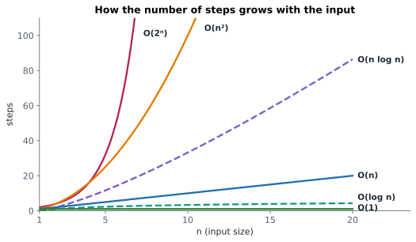

# Lesson 3: Big-O: how running time grows

**You'll learn:** Big-O notation, counting steps, dropping constants and lower terms, O(1) O(log n) O(n) O(n log n) O(n²) O(2ⁿ), loops that add vs multiply, halving, hidden loops.

▶ **Practise this lesson in the [sandbox](https://kishoremadanagopal.github.io/learning/dsa/#big-o)**: run every example and check your exercise answers.

## Key terms

- **Big-O notation:** describes how the number of steps (or memory) grows as the input size n grows, ignoring constants.
- **Time complexity:** how an algorithm's running time grows with the input size.
- **n:** the size of the input, such as the length of a list.
- **O(1), constant time:** the work doesn't depend on n.
- **O(log n), logarithmic time:** the work grows by one step each time n doubles, typical when the problem is halved each step.
- **O(n), linear time:** the work grows in proportion to n, typically one loop.
- **O(n log n):** typical of efficient sorting.
- **O(n²), quadratic time:** typical of a loop inside a loop.
- **O(2ⁿ), exponential time:** doubles with every extra item, typical of trying every subset.
- **Dominant term:** the fastest-growing part of a step count, the only one Big-O keeps.
- **Logarithm (log₂ n):** how many times you can halve n before reaching 1.

Timing code with a stopwatch depends on the computer, the language and what else is running. **Big-O notation** describes something more stable: **how the number of steps grows as the input grows**. If the input doubles, does the work stay the same, double, or quadruple?



| Big-O | Name | Example | n = 1,000 | n = 1,000,000 |
|---|---|---|---|---|
| O(1) | constant | `d[key]`, `nums[i]` | 1 step | 1 step |
| O(log n) | logarithmic | binary search | ~10 | ~20 |
| O(n) | linear | one loop over the data | 1,000 | 1,000,000 |
| O(n log n) | linearithmic | good sorting (`sorted`) | ~10,000 | ~20,000,000 |
| O(n²) | quadratic | a loop inside a loop | 1,000,000 | 10¹² (hours) |
| O(2ⁿ) | exponential | trying every subset | more than atoms in the universe | – |

Python manages very roughly 10⁷ (ten million) simple steps per second. So O(n²) on a million items (10¹² steps) would take more than a day, while O(n log n) (about 2 × 10⁷ steps) takes a couple of seconds.

## The two rules

1. **Drop constants.** 3n + 5 steps is O(n). Big-O is about the **shape** of growth, not exact counts.
2. **Keep only the fastest-growing term.** n² + 100n + 7 is O(n²). For large n, the n² part dwarfs everything else.

## Reading the Big-O of code

```python
def total(nums):                 # O(n): the loop body runs n times
    s = 0
    for x in nums:
        s += x
    return s

def all_pairs(nums):             # O(n²): n iterations, each doing n iterations
    pairs = 0
    for a in nums:
        for b in nums:
            pairs += 1
    return pairs

def halvings(n):                 # O(log n): n is cut in half each time
    steps = 0
    while n > 1:
        n //= 2
        steps += 1
    return steps

print(total([1, 2, 3]), all_pairs([1, 2, 3]), halvings(1_000_000))
```

- **Sequential** steps **add**: a loop over n followed by another loop over n is O(n + n) = O(n).
- **Nested** steps **multiply**: a loop over n inside a loop over m is O(n × m).
- **Halving** each time gives O(log n): 1,000,000 halves to 1 in about 20 steps. (In computing, log means log base 2.)

## Count it yourself

Watch the step counts grow as n doubles:

```python
def count_steps(n):
    linear = sum(1 for _ in range(n))
    quadratic = sum(1 for _ in range(n) for _ in range(n))
    return linear, quadratic

for n in [10, 20, 40, 80]:
    lin, quad = count_steps(n)
    print(f"n={n:>3}   O(n): {lin:>4} steps   O(n²): {quad:>5} steps")
```

When n doubles, the O(n) column doubles and the O(n²) column **quadruples**. That's how you recognise them from timings too.

## Careful: hidden loops

One line of Python can hide a loop. `x in my_list`, `my_list.index(x)`, `my_list.count(x)`, `min(nums)`, `sum(nums)`, slicing `nums[a:b]` and `sorted(nums)` all look at many items. Putting one inside a loop multiplies:

```python
def slow_unique(nums):            # looks like one loop, but 'in result' scans a list: O(n²)
    result = []
    for x in nums:
        if x not in result:
            result.append(x)
    return result

print(slow_unique([3, 1, 3, 2, 1]))
```

Lesson 5 lists the real cost of every common Python operation.

## At a glance

| Concept | Approach | Time | Space |
|---|---|---|---|
| O(1) constant | same work whatever the size: indexing, dict lookup | O(1) | — |
| O(log n) logarithmic | halve the problem each step: binary search | O(log n) | — |
| O(n) linear | touch each item once: one loop | O(n) | — |
| O(n log n) | sort, or split in halves and do linear work per level | O(n log n) | — |
| O(n²) quadratic | a loop inside a loop over the same data | O(n²) | — |
| O(2ⁿ), O(n!) | try every subset or every ordering | O(2ⁿ), O(n!) | — |
| Sum 1..n | formula n(n+1)/2 instead of a loop | O(1) | O(1) |

## Common mistakes

- Keeping constants or smaller terms, like writing O(2n) or O(n² + n).
- Calling two loops one after the other O(n²). Only nested loops multiply.
- Missing hidden loops such as `in`, `index`, `min`, slicing or sorting inside a loop.

## Exercises

### 1. Name the complexity

Make a dictionary `answers` mapping each function name to its Big-O, written exactly as one of `"O(1)"`, `"O(log n)"`, `"O(n)"`, `"O(n log n)"`, `"O(n²)"`. In each function, `n` is `len(nums)`.

```python
def first(nums):
    return nums[0]

def pairs_with_sum(nums, target):
    count = 0
    for i in range(len(nums)):
        for j in range(i + 1, len(nums)):
            if nums[i] + nums[j] == target:
                count += 1
    return count

def sum_and_max(nums):
    s = 0
    for x in nums:
        s += x
    biggest = nums[0]
    for x in nums:
        biggest = max(biggest, x)
    return s, biggest

def digits(n):
    count = 0
    while n > 0:
        n //= 10
        count += 1
    return count

def sorted_median(nums):
    return sorted(nums)[len(nums) // 2]
```

For `digits`, use n as the number itself.

Starter code:

```python
answers = {
    "first": "",
    "pairs_with_sum": "",
    "sum_and_max": "",
    "digits": "",
    "sorted_median": "",
}
```

<details>
<summary>🧭 How to approach it</summary>

1. **Understand:** for each function, ask "if the input doubles, how much more work?"
2. **Examples:** try n = 10 and n = 20 in your head and count loop iterations.
3. **Brute force:** count the exact steps, then simplify.
4. **Pattern:** the rules: drop constants, keep the dominant term; nested loops multiply, sequential loops add; halving or dividing → log.
5. **Plan:** label each loop with how many times it runs, combine, simplify.
6. **Code and test:** fill in the dictionary.

</details>

<details>
<summary>💡 Hint 1</summary>

Look for loops. Nested loops multiply; loops one after the other add.

</details>

<details>
<summary>💡 Hint 2</summary>

`digits` divides n by 10 each step: a number with d digits takes d steps, and d grows like log n. `sorted()` costs O(n log n).

</details>

<details>
<summary>💡 Hint 3</summary>

first → O(1); pairs_with_sum → O(n²); sum_and_max → O(n); digits → O(log n); sorted_median → O(n log n).

</details>

### 2. From O(n) to O(1)

`sum_to(n)` should return 1 + 2 + … + n (and 0 for n = 0). A loop works but is O(n). Write a version that is **O(1)**: the same tiny amount of work for n = 10 or n = 10,000,000.

Starter code:

```python
def sum_to(n):
    total = 0
    for i in range(1, n + 1):
        total += i
    return total
```

<details>
<summary>🧭 How to approach it</summary>

1. **Understand:** same answer as the loop, but the work must not grow with n.
2. **Examples:** n = 4 → 10; n = 100 → 5050; n = 0 → 0.
3. **Brute force:** the starter loop: O(n). With n = 10,000,000 it does ten million additions.
4. **Pattern:** sometimes **maths** removes a loop entirely. Look for a formula.
5. **Plan:** write the sum forwards and backwards and add them up: each column is n + 1, and there are n columns, so twice the sum is n(n + 1).
6. **Code and test:** check n = 0 and n = 1 by hand.

</details>

<details>
<summary>💡 Hint 1</summary>

Pair the numbers from both ends: 1 + n, 2 + (n − 1), 3 + (n − 2)… What does each pair add up to?

</details>

<details>
<summary>💡 Hint 2</summary>

Each pair adds up to n + 1, and there are n / 2 pairs.

</details>

<details>
<summary>💡 Hint 3</summary>

`return n * (n + 1) // 2` (use `//` so the answer stays a whole number).

</details>

**In the sandbox:** exercises 5–6. Press **Check** to run the hidden tests.

### Answers and walkthroughs

Open these only after a real attempt. Each one explains the solution step by step.

<details>
<summary>✅ 1. Name the complexity</summary>

```python
answers = {
    "first": "O(1)",            # one step, whatever the length
    "pairs_with_sum": "O(n²)",  # a loop inside a loop
    "sum_and_max": "O(n)",      # two loops one after another: n + n
    "digits": "O(log n)",       # n shrinks 10 times each step
    "sorted_median": "O(n log n)",  # dominated by sorting
}
```

| Function | Reasoning | Big-O |
|---|---|---|
| `first` | one index lookup, no loop | O(1) |
| `pairs_with_sum` | outer loop n times × inner loop up to n times ≈ n²/2 | O(n²) |
| `sum_and_max` | n steps, then another n steps: 2n, drop the constant | O(n) |
| `digits` | each step divides n by 10; a 6-digit number takes 6 steps; digits ≈ log₁₀ n | O(log n) |
| `sorted_median` | sorting is O(n log n), the lookup is O(1); keep the biggest term | O(n log n) |

**Why the base of the log doesn't matter:** log₁₀ n and log₂ n differ only by a constant factor (about 3.3), and Big-O drops constants. So both are just O(log n).

**Common mistake:** calling `sum_and_max` O(n²) because it has two loops. Only **nested** loops multiply.

</details>

<details>
<summary>✅ 2. From O(n) to O(1)</summary>

```python
def sum_to(n):
    return n * (n + 1) // 2
```

**The idea (Gauss's trick):**

```text
   1 +   2 + ... + 100
 100 +  99 + ... +   1
 ---------------------
 101 + 101 + ... + 101   (100 times) = 100 × 101
```

So twice the sum is n × (n + 1), and the sum is n × (n + 1) / 2.

- `n * (n + 1)` is always even (one of two neighbouring numbers is even), so `// 2` divides exactly and keeps an `int`. With `/` you'd get a float like `5050.0`, and floats lose precision for huge numbers.

**Trace:** n = 4 → 4 × 5 = 20 → 20 // 2 = **10** = 1 + 2 + 3 + 4. ✓

**Complexity:** O(1) time and space: one multiplication and one division, whatever n is.

**Lesson:** before optimising a loop, ask whether you need the loop at all.

</details>

## Quick quiz

1. An algorithm takes 3n² + 50n + 1000 steps. Its Big-O is:
   - A) O(3n²)
   - B) O(n²)
   - C) O(n² + n)

2. If n doubles, how much longer does an O(n²) algorithm take?
   - A) Twice as long
   - B) About four times as long
   - C) The same

3. A loop over n items, followed by a separate loop over the same n items, is:
   - A) O(n)
   - B) O(n²)
   - C) O(2ⁿ)

4. Which line hides an O(n) loop?
   - A) `nums[5]`
   - B) `if x in nums:` (where nums is a list)
   - C) `d[key]` (where d is a dict)

<details>
<summary>Quiz answers</summary>

1. **B) O(n²)**: Drop constants and keep only the fastest-growing term.
2. **B) About four times as long**: (2n)² = 4n².
3. **A) O(n)**: Sequential loops add: n + n = 2n, which is O(n).
4. **B) `if x in nums:` (where nums is a list)**: `in` on a list checks items one by one.

</details>

---
Previous: [Lesson 2](02-problem-solving.md) · Next: [Lesson 4: Space, best and worst cases, amortised cost](04-space-and-cases.md)
