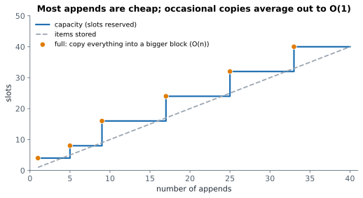

# Lesson 4: Space, best and worst cases, amortised cost

**You'll learn:** space complexity, extra vs input memory, in-place algorithms, the call stack, best/average/worst case, amortised analysis, list growth.

▶ **Practise this lesson in the [sandbox](https://kishoremadanagopal.github.io/learning/dsa/#space-and-cases)**: run every example and check your exercise answers.

## Key terms

- **Space complexity:** how the extra memory an algorithm needs grows with the input size.
- **In place:** changing the input directly with only O(1) extra memory.
- **Best case:** the input that makes the algorithm do the least work.
- **Worst case:** the input that makes it do the most work; the usual meaning of "the complexity".
- **Average case:** the expected work over typical inputs.
- **Amortised cost:** the average cost per operation over a long sequence, when rare operations are expensive and most are cheap.
- **Capacity:** the space a list has reserved; it grows by a factor when full.
- **Linear search:** checking items one by one until the target is found.
- **Call stack:** the memory Python uses to remember function calls that haven't finished yet.

Big-O measures **memory** too. **Space complexity** counts the **extra** memory an algorithm needs as the input grows, not counting the input itself.

```python
def reversed_copy(nums):          # O(n) extra space: builds a whole new list
    return nums[::-1]

def reverse_in_place(nums):       # O(1) extra space: just two index variables
    i, j = 0, len(nums) - 1
    while i < j:
        nums[i], nums[j] = nums[j], nums[i]   # swap the ends, move inwards
        i += 1
        j -= 1

data = [1, 2, 3, 4, 5]
print(reversed_copy(data), data)
reverse_in_place(data)
print(data)
```

An algorithm that changes its input directly with O(1) extra memory is called **in place**. It saves memory, but it destroys the original, so only do it when that's allowed. A function that changes its input in place usually returns `None` (like `list.sort()`), to remind callers that it didn't make a copy.

Recursion also uses memory: every call that hasn't finished yet waits on the **call stack** (Lesson 21). A recursion 1,000 levels deep uses O(1,000) space even if it creates no lists.

## Best, average and worst case

The same algorithm can take different time on different inputs of the same size. Searching a list for a value:

```python
def linear_search(nums, target):
    for i, x in enumerate(nums):
        if x == target:
            return i
    return -1

nums = list(range(1, 11))
print(linear_search(nums, 1))    # best case: found at the first position
print(linear_search(nums, 10))   # worst case: found at the last position
print(linear_search(nums, 99))   # worst case: not there, every item checked
```

| Case | When | Cost |
|---|---|---|
| **Best** | target is first | O(1) |
| **Average** | target somewhere in the middle | about n/2 steps → O(n) |
| **Worst** | target last or missing | O(n) |

When people say "the complexity" without qualification, they usually mean the **worst case**, because it's a guarantee. Some algorithms are quoted by their average case when the worst is rare, like quicksort (O(n log n) on average, O(n²) worst; Lesson 26) and hash tables (O(1) on average, O(n) worst; Lesson 13).

## Amortised cost: why append is O(1)

A Python list keeps some spare room at the end. `append` normally just fills the next free slot: O(1). When the room runs out, Python allocates a **bigger** block (roughly 1.125–1.5 times the size, depending on the size) and copies everything across: O(n) for that one append.



Because the capacity grows by a **factor** (not by a fixed amount), copies become rarer as the list grows. Averaged over many appends, each one costs O(1). That's **amortised O(1)**: an occasional expensive step, paid for by many cheap ones. You can watch the capacity jumps:

```python
import sys

nums = []
last = sys.getsizeof(nums)
for i in range(40):
    nums.append(i)
    size = sys.getsizeof(nums)
    if size != last:
        print(f"after {len(nums):>2} items the list grew to {size} bytes")
        last = size
```

(The exact sizes depend on the Python version; the pattern is what matters.)

## Common mistakes

- Forgetting that building a new list, set or dict costs O(n) extra space.
- Assigning `nums = ...` inside a function and expecting the caller's list to change.
- Quoting only the best case. Give the worst case unless asked otherwise.

## Exercises

### 1. Reverse in place

Write `reverse_in_place(nums)` that reverses the list **in place** using O(1) extra space: swap items, don't build a new list, and don't use `reverse()`, `reversed()` or slicing. The function should return `None`.

Starter code:

```python
def reverse_in_place(nums):
    pass
```

<details>
<summary>🧭 How to approach it</summary>

1. **Understand:** change the given list itself; return nothing; O(1) extra memory.
2. **Examples:** `[1, 2, 3, 4]` → `[4, 3, 2, 1]`; odd length `[1, 2, 3]` → `[3, 2, 1]` (the middle stays); `[]` and `[7]` stay the same.
3. **Brute force:** build a reversed copy and copy it back: O(n) extra space, not allowed here.
4. **Pattern:** **two pointers** from opposite ends (Lesson 7).
5. **Plan:** i at the start, j at the end; while i < j: swap, step inwards.
6. **Code and test:** for an empty list, j = −1 and the loop never runs. Good.

</details>

<details>
<summary>💡 Hint 1</summary>

Swap the first and last items, then the second and second-to-last, and so on.

</details>

<details>
<summary>💡 Hint 2</summary>

Use two indexes: `i` from the start and `j` from the end. Swap, then move them towards each other.

</details>

<details>
<summary>💡 Hint 3</summary>

`i, j = 0, len(nums) - 1`; `while i < j:` swap with `nums[i], nums[j] = nums[j], nums[i]`, then `i += 1; j -= 1`. No return needed.

</details>

### 2. Find the index

Write `index_of(nums, target)` that returns the **first** index where `target` appears, or `-1` if it isn't there. Don't use `.index()`.

Starter code:

```python
def index_of(nums, target):
    pass
```

<details>
<summary>🧭 How to approach it</summary>

1. **Understand:** first position of `target`, or −1. Lists can be empty or contain duplicates.
2. **Examples:** `([4, 2, 9], 9)` → 2; `([5, 3, 5], 5)` → 0 (first); `([], 1)` → −1.
3. **Brute force:** this is **linear search**, already the natural solution for an unsorted list: O(n).
4. **Pattern:** a scan with an **early return**.
5. **Plan:** walk with index; on a match return the index; after the loop return −1.
6. **Code and test:** best case O(1) (first item), worst case O(n) (missing).

</details>

<details>
<summary>💡 Hint 1</summary>

`enumerate(nums)` gives you each index together with its item.

</details>

<details>
<summary>💡 Hint 2</summary>

Return as soon as you find a match; that way you return the first one.

</details>

<details>
<summary>💡 Hint 3</summary>

`for i, x in enumerate(nums): if x == target: return i`, then `return -1` after the loop.

</details>

**In the sandbox:** exercises 7–8. Press **Check** to run the hidden tests.

### Answers and walkthroughs

Open these only after a real attempt. Each one explains the solution step by step.

<details>
<summary>✅ 1. Reverse in place</summary>

```python
def reverse_in_place(nums):
    i, j = 0, len(nums) - 1
    while i < j:
        nums[i], nums[j] = nums[j], nums[i]
        i += 1
        j -= 1
```

**Line by line**

- `i, j = 0, len(nums) - 1` point at the two ends.
- `while i < j:` stops when the pointers meet (odd length: the middle item stays put) or cross (even length).
- `nums[i], nums[j] = nums[j], nums[i]` swaps in one line: Python evaluates the right side first, then assigns both.
- No `return`: the function returns `None`, and the caller's list has changed, because a list is passed by reference.

**Trace** on `[1, 2, 3, 4, 5]`:

| i | j | list after swap |
|---|---|---|
| 0 | 4 | [5, 2, 3, 4, 1] |
| 1 | 3 | [5, 4, 3, 2, 1] |
| 2 | 2 | stop (i == j) |

**Complexity:** O(n) time (n/2 swaps), O(1) extra space.

**Common wrong approach:** `nums = nums[::-1]` inside the function. That builds a new list and points the **local** name at it; the caller's list is unchanged.

</details>

<details>
<summary>✅ 2. Find the index</summary>

```python
def index_of(nums, target):
    for i, x in enumerate(nums):
        if x == target:
            return i
    return -1
```

**Line by line**

- `for i, x in enumerate(nums):` gives `(0, first item)`, `(1, second item)`, …
- `if x == target: return i` leaves the function at the **first** match, so later duplicates don't matter.
- `return -1` is reached only when nothing matched. −1 is a common "not found" signal because it can't be a real index… although careful: in Python, `nums[-1]` is valid (the last item), so callers must check for −1 before using it.

**Trace** on `([4, 2, 9], 9)`:

| i | x | x == 9? |
|---|---|---|
| 0 | 4 | no |
| 1 | 2 | no |
| 2 | 9 | **yes** → return 2 |

**Complexity:** O(n) worst case, O(1) best case, O(1) space. On a **sorted** list, binary search does it in O(log n) (Lesson 23).

</details>

## Quick quiz

1. What does space complexity measure?
   - A) How the extra memory an algorithm needs grows with the input
   - B) The size of the source code
   - C) How much disk space Python uses

2. What does "in place" mean?
   - A) The algorithm changes its input directly, using O(1) extra memory
   - B) The algorithm runs in one place in the code
   - C) It returns a copy

3. Why is list.append called amortised O(1)?
   - A) Most appends are O(1); the occasional O(n) resize is spread over many appends
   - B) It is always exactly one step
   - C) It is O(n) but nobody minds

4. Linear search for a value that isn't in the list is the:
   - A) Best case
   - B) Worst case
   - C) Average case

<details>
<summary>Quiz answers</summary>

1. **A) How the extra memory an algorithm needs grows with the input**: Like time complexity, but for memory, not counting the input itself.
2. **A) The algorithm changes its input directly, using O(1) extra memory**: Swapping inside the list instead of building a new one.
3. **A) Most appends are O(1); the occasional O(n) resize is spread over many appends**: Growing the capacity by a factor makes resizes rare enough to average out.
4. **B) Worst case**: Every item must be checked before you can say "not found".

</details>

---
Previous: [Lesson 3](03-big-o.md) · Next: [Lesson 5: The real cost of Python's built-ins](05-python-costs.md)
