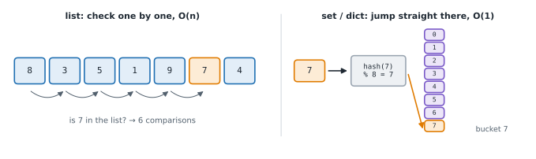

# Lesson 5: The real cost of Python's built-ins

**You'll learn:** cost of list, dict, set and string operations, insert/pop at the front, slicing copies, hashable keys, deque, timing with perf_counter, doubling experiments.

▶ **Practise this lesson in the [sandbox](https://kishoremadanagopal.github.io/learning/dsa/#python-costs)**: run every example and check your exercise answers.

## Key terms

- **Hash table:** the structure behind dict and set; finds keys in O(1) on average.
- **Hashable:** a value that can be a dict key or set item because it can't change, such as numbers, strings and tuples.
- **Immutable:** can't be changed after it's created; "changing" a string makes a new one.
- **deque:** a double-ended queue from `collections` with O(1) adds and removals at both ends.
- **perf_counter:** `time.perf_counter()`, a precise clock for timing code.
- **Doubling experiment:** timing code at n, 2n, 4n to see how the time grows.

Python makes many operations one line long, but one line doesn't mean one step. Knowing the cost of the built-ins is the fastest way to spot slow code.



## Lists

| Operation | Example | Cost |
|---|---|---|
| index, assign | `a[i]`, `a[i] = x` | O(1) |
| length | `len(a)` | O(1) |
| append, pop from the end | `a.append(x)`, `a.pop()` | O(1) amortised |
| insert / pop at the front or middle | `a.insert(0, x)`, `a.pop(0)` | O(n): everything after it shifts |
| search | `x in a`, `a.index(x)`, `a.count(x)` | O(n) |
| remove by value | `a.remove(x)` | O(n) |
| slice | `a[i:j]` | O(j − i): it copies |
| copy, extend | `a.copy()`, `a + b`, `a.extend(b)` | O(n) / O(len(b)) |
| min, max, sum | `min(a)` | O(n) |
| sort | `a.sort()`, `sorted(a)` | O(n log n) |

## Dicts and sets (hash tables)

| Operation | Example | Average cost |
|---|---|---|
| look up, insert, delete | `d[k]`, `d[k] = v`, `del d[k]`, `s.add(x)` | O(1) |
| membership | `k in d`, `x in s` | O(1) |
| iterate | `for k in d` | O(n) |
| set union / intersection | `s | t`, `s & t` | O(len(s) + len(t)) / O(min(len(s), len(t))) |

Keys must be **hashable** (unchangeable): numbers, strings, tuples yes; lists and dicts no. Lesson 13 shows why.

## Strings

Strings are **immutable**: every "change" builds a new string. Indexing and `len` are O(1); `s + t`, slicing, `s.replace`, `s.lower()` and `sub in s` are O(n). To build a long string from many pieces, collect the pieces in a list and `"".join(pieces)` once at the end: O(total length).

## Deques for the front

`collections.deque` adds and removes at **both** ends in O(1). Use it whenever you'd call `pop(0)` or `insert(0, x)` on a list (queues, Lesson 17):

```python
from collections import deque
import time

n = 50_000
items = list(range(n))
start = time.perf_counter()
while items:
    items.pop(0)                      # O(n) each: shifts everything left
print(f"list.pop(0):     {time.perf_counter() - start:.3f} s")

items = deque(range(n))
start = time.perf_counter()
while items:
    items.popleft()                   # O(1) each
print(f"deque.popleft(): {time.perf_counter() - start:.3f} s")
```

## Timing code yourself

`time.perf_counter()` is a precise clock. Measure a few sizes and look at the **ratio**: if doubling n doubles the time, it's O(n); if it quadruples, it's O(n²).

```python
import time

def timed(func, arg):
    start = time.perf_counter()
    func(arg)
    return time.perf_counter() - start

def in_list_many(n):
    data = list(range(n))
    return sum(1 for x in range(n) if x in data)     # n searches of O(n) each

def in_set_many(n):
    data = set(range(n))
    return sum(1 for x in range(n) if x in data)     # n searches of O(1) each

for n in [1_000, 2_000, 4_000]:
    print(f"n={n:>5}  list: {timed(in_list_many, n):.4f} s   set: {timed(in_set_many, n):.5f} s")
```

The list version roughly quadruples each time n doubles (O(n²) overall); the set version roughly doubles (O(n)). Timings bounce around a bit from run to run; the trend is what counts. For careful measurements, the `timeit` module repeats a statement many times and reports the best.

## Common mistakes

- Using `pop(0)` or `insert(0, x)` on a big list in a loop. Use a deque.
- Checking `x in some_list` inside a loop instead of using a set.
- Deleting items from a list one by one in a loop instead of building a filtered list.
- Building a big string with + in a loop instead of collecting parts and joining.

## Exercises

### 1. Items in both lists

Write `common_items(a, b)` that returns a **sorted** list of the values that appear in both lists, each value once. It must be fast for lists of 50,000 numbers.

Starter code:

```python
def common_items(a, b):
    result = []
    for x in a:
        if x in b and x not in result:
            result.append(x)
    return sorted(result)
```

<details>
<summary>🧭 How to approach it</summary>

1. **Understand:** values in both lists, no repeats, sorted ascending.
2. **Examples:** `[1, 2, 3, 4]` and `[3, 4, 5]` → `[3, 4]`; duplicates `[2, 2, 1]`, `[2, 2]` → `[2]`.
3. **Brute force:** the starter: for each x in a, scan b (and the result): O(n × m).
4. **Pattern:** repeated membership checks → **set**. Set intersection does exactly "in both".
5. **Plan:** convert both to sets, intersect, sort.
6. **Code and test:** cost: O(n + m) for the sets and intersection, plus O(k log k) to sort the k common values.

</details>

<details>
<summary>💡 Hint 1</summary>

The starter is correct but slow: `x in b` and `x not in result` are both O(n) list scans inside a loop.

</details>

<details>
<summary>💡 Hint 2</summary>

Sets make membership O(1), and `set_a & set_b` gives the values in both sets directly.

</details>

<details>
<summary>💡 Hint 3</summary>

`return sorted(set(a) & set(b))`.

</details>

### 2. Remove every copy

Write `remove_all(nums, x)` that returns a **new** list with every occurrence of `x` removed, keeping the order of the others. It must be fast for 50,000 numbers.

Starter code:

```python
def remove_all(nums, x):
    result = list(nums)
    while x in result:
        result.remove(x)
    return result
```

<details>
<summary>🧭 How to approach it</summary>

1. **Understand:** a new list, same order, without any `x`.
2. **Examples:** `([1, 2, 1, 3], 1)` → `[2, 3]`; nothing to remove → unchanged copy; all removed → `[]`.
3. **Brute force:** the starter: repeated `remove`, each O(n) → O(n²) when many copies.
4. **Pattern:** **filter in one pass**: keep what you want instead of deleting what you don't.
5. **Plan:** loop once, append every value that isn't x.
6. **Code and test:** O(n) time, O(n) space for the new list.

</details>

<details>
<summary>💡 Hint 1</summary>

The starter calls `x in result` and `result.remove(x)` once per copy, and each call is O(n).

</details>

<details>
<summary>💡 Hint 2</summary>

Instead of deleting from a list, build a new list containing only the values you want to keep.

</details>

<details>
<summary>💡 Hint 3</summary>

`return [v for v in nums if v != x]`.

</details>

**In the sandbox:** exercises 9–10. Press **Check** to run the hidden tests.

### Answers and walkthroughs

Open these only after a real attempt. Each one explains the solution step by step.

<details>
<summary>✅ 1. Items in both lists</summary>

```python
def common_items(a, b):
    return sorted(set(a) & set(b))
```

**Line by line**

- `set(a)` and `set(b)` build hash sets: O(len(a) + len(b)). They also remove duplicates for free.
- `&` is set intersection: it loops over the smaller set and checks each value in the other, O(1) per check.
- `sorted(...)` returns a list in ascending order.

**Trace** on `([5, 1, 3], [3, 1, 5, 9])`:

| step | value |
|---|---|
| set(a) | {1, 3, 5} |
| set(b) | {1, 3, 5, 9} |
| intersection | {1, 3, 5} |
| sorted | [1, 3, 5] |

**Complexity:** O(n + m + k log k) time and O(n + m) space, versus O(n × m) for the starter. With 50,000 numbers each, that's about 100,000 steps instead of 2.5 billion.

</details>

<details>
<summary>✅ 2. Remove every copy</summary>

```python
def remove_all(nums, x):
    return [v for v in nums if v != x]
```

**Line by line**

- `[v for v in nums if v != x]` is a list comprehension: it visits each value once and keeps the ones that aren't `x`, in order.

**Why the starter is slow:** `remove` finds the first copy (scanning from the start) and then **shifts every later item left by one** to close the gap. With 25,000 copies in a 50,000-item list, that's about 25,000 × 25,000 steps.

**Trace** on `([1, 2, 1, 3], 1)`:

| v | v != 1? | result so far |
|---|---|---|
| 1 | no | [] |
| 2 | yes | [2] |
| 1 | no | [2] |
| 3 | yes | [2, 3] |

**Complexity:** O(n) time, O(n) space.

**General lesson:** deleting from the middle of a list in a loop is a classic hidden O(n²). Filter into a new list instead.

</details>

## Quick quiz

1. What does `nums.insert(0, x)` cost on a list of n items?
   - A) O(1)
   - B) O(n), because every item shifts one place right
   - C) O(log n)

2. Which is O(1) on average?
   - A) `x in some_list`
   - B) `x in some_set`
   - C) `some_list.count(x)`

3. Doubling n made your function take about four times longer. It's probably:
   - A) O(n)
   - B) O(n²)
   - C) O(log n)

4. What's the efficient way to build a long string from many pieces?
   - A) Collect the pieces in a list and join them once with "".join(pieces)
   - B) Add them one by one with +
   - C) Convert each piece to a list

<details>
<summary>Quiz answers</summary>

1. **B) O(n), because every item shifts one place right**: Inserting at the front moves everything. Use a deque for fast front operations.
2. **B) `x in some_set`**: Sets and dicts use hashing.
3. **B) O(n²)**: Quadratic time grows with the square of n.
4. **A) Collect the pieces in a list and join them once with "".join(pieces)**: join builds the result once, in O(total length).

</details>

---
Previous: [Lesson 4](04-space-and-cases.md) · Next: [Lesson 6: Arrays and Python lists](06-arrays.md)
