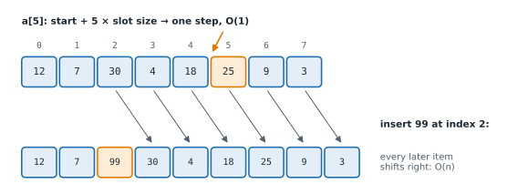

# Lesson 6: Arrays and Python lists

**You'll learn:** contiguous memory, why indexing is O(1), dynamic arrays, the cost of inserting and deleting, loop patterns, off-by-one errors, running minimum, rotating with three reversals.

▶ **Practise this lesson in the [sandbox](https://kishoremadanagopal.github.io/learning/dsa/#arrays)**: run every example and check your exercise answers.

## Key terms

- **Array:** items stored side by side in one contiguous block of memory, each reachable by its index in O(1).
- **Contiguous:** stored in one unbroken block, next to each other.
- **Index:** the position of an item, starting at 0.
- **Dynamic array:** an array that grows automatically by reserving spare room; Python's list.
- **Reference:** a pointer to an object; a Python list stores references, not the objects themselves.
- **Off-by-one error:** a loop that runs one step too many or too few, usually from a wrong range bound.
- **Rotation:** shifting every item k places, wrapping around the end.
- **Running minimum:** the smallest value seen so far while scanning.

An **array** stores items in one **contiguous** block of memory, side by side. Because every slot is the same size, the computer finds slot *i* with one calculation: start address + i × slot size. That's why **indexing is O(1)**, whatever the length.



A Python `list` is a **dynamic array**: a contiguous block of references (pointers) to the actual objects, with spare room at the end so it can grow (Lesson 4). That gives lists the classic array costs:

| Operation | Cost | Why |
|---|---|---|
| `a[i]`, `a[i] = x` | O(1) | address arithmetic |
| `a.append(x)`, `a.pop()` | O(1) amortised | the end has spare room |
| `a.insert(i, x)`, `a.pop(i)`, `del a[i]` | O(n − i) | items after i shift |
| `x in a` | O(n) | no shortcut: check one by one |

(In lower-level languages like C or Java, arrays have a fixed size. Python's `array` module and NumPy arrays store raw numbers instead of references, which is faster and smaller for numeric work.)

## Loop patterns

```python
nums = [5, 3, 8, 1]

for x in nums:                        # values only
    print(x, end=" ")
print()
for i, x in enumerate(nums):          # index and value
    print(f"{i}:{x}", end=" ")
print()
for i in range(len(nums) - 1):        # neighbouring pairs (i, i + 1)
    print(nums[i], "->", nums[i + 1], end="   ")
print()
for x in reversed(nums):              # backwards, without copying
    print(x, end=" ")
print()
```

Off-by-one errors live in the `range` bounds. If the loop body uses `nums[i + 1]`, the loop must stop at `len(nums) - 1`.

## The running-minimum pattern: best time to buy and sell

Prices of a share on consecutive days. Buy once, sell later. What's the most profit? Brute force tries every buy day with every later sell day: O(n²). One pass is enough if you remember the **cheapest price so far**: selling today, the best you could have done is today's price minus that minimum.

```python
def max_profit(prices):
    cheapest = float("inf")
    best = 0
    for p in prices:
        cheapest = min(cheapest, p)          # best day to have bought, up to today
        best = max(best, p - cheapest)       # profit if we sell today
    return best

print(max_profit([7, 1, 5, 3, 6, 4]))   # buy at 1, sell at 6
print(max_profit([7, 6, 4, 3, 1]))      # prices only fall: don't trade
```

## Rotating in place with three reversals

Rotating `[1, 2, 3, 4, 5, 6, 7]` right by 3 gives `[5, 6, 7, 1, 2, 3, 4]`. Slicing (`nums[-k:] + nums[:-k]`) builds new lists, O(n) space. A neat in-place trick: reverse the whole list, then reverse the first k items and the rest separately.

```python
def reverse(nums, i, j):                 # reverse nums[i..j] in place
    while i < j:
        nums[i], nums[j] = nums[j], nums[i]
        i, j = i + 1, j - 1

nums = [1, 2, 3, 4, 5, 6, 7]
k = 3
reverse(nums, 0, len(nums) - 1);  print(nums)   # [7, 6, 5, 4, 3, 2, 1]
reverse(nums, 0, k - 1);          print(nums)   # [5, 6, 7, 4, 3, 2, 1]
reverse(nums, k, len(nums) - 1);  print(nums)   # [5, 6, 7, 1, 2, 3, 4]
```

## At a glance

| Concept | Approach | Time | Space |
|---|---|---|---|
| Index access | address = start + index × size | O(1) | — |
| Insert / delete in the middle | shift the items after it | O(n) | O(1) |
| Best time to buy and sell | track the cheapest price so far and today's profit | O(n) | O(1) |
| Rotate by k in place | reverse all, then reverse the first k and the rest | O(n) | O(1) |

## Common mistakes

- Using `nums[i + 1]` in a loop that runs to `len(nums)`, which reads past the end.
- Forgetting `k %= n` when rotating, so k larger than the length breaks the code.
- Using `max(prices) - min(prices)` when order matters (buy before sell).

## Exercises

### 1. Best time to buy and sell

Write `max_profit(prices)` returning the largest profit from one buy followed by one later sell, or 0 if no profit is possible. It must handle 100,000 prices quickly. Try it before scrolling up!

Starter code:

```python
def max_profit(prices):
    pass
```

<details>
<summary>🧭 How to approach it</summary>

1. **Understand:** buy before you sell; at most one trade; no profit possible → 0. Empty list → 0.
2. **Examples:** `[7, 1, 5, 3, 6, 4]` → 5 (buy 1, sell 6). `[2, 4, 1]` → 2: the 1 comes after the peak, so it doesn't help.
3. **Brute force:** every pair (buy i, sell j > i): O(n²), about 5 billion pairs for 100,000 days.
4. **Pattern:** **running minimum**: for each sell day, the best buy day is the cheapest day before it.
5. **Plan:** track the cheapest price so far and the best profit so far in one pass.
6. **Code and test:** check the falling list (profit stays 0) and the empty list.

</details>

<details>
<summary>💡 Hint 1</summary>

If you sell on a given day, which buy day would you have wanted?

</details>

<details>
<summary>💡 Hint 2</summary>

The cheapest price **before** today. Keep it in a variable as you walk through the days.

</details>

<details>
<summary>💡 Hint 3</summary>

`cheapest = inf, best = 0`; for each p: `cheapest = min(cheapest, p)`, `best = max(best, p - cheapest)`.

</details>

### 2. Rotate in place

Write `rotate(nums, k)` that rotates the list **right** by `k` steps **in place** (O(1) extra space) and returns `None`. `k` can be bigger than the length. Don't use slicing to build new lists.

Starter code:

```python
def rotate(nums, k):
    pass
```

<details>
<summary>🧭 How to approach it</summary>

1. **Understand:** move each item k places right, wrapping around; change the list itself; k may exceed n.
2. **Examples:** `[1..7]`, k = 3 → `[5, 6, 7, 1, 2, 3, 4]`. `[1, 2]`, k = 3 → same as k = 1 → `[2, 1]`. `[]` → stays empty.
3. **Brute force:** rotate by one step, k times (each step O(n)): O(n·k). Or build a new list: O(n) space.
4. **Pattern:** **reversal trick** + **two pointers**. Reversing the whole list puts the last k items first, but backwards; reversing each part fixes the order inside it.
5. **Plan:** n = len; if 0 stop; k %= n; reverse all; reverse first k; reverse rest.
6. **Code and test:** check k = 0 (reverse(0, −1) does nothing, then reversing the rest restores the original).

</details>

<details>
<summary>💡 Hint 1</summary>

Rotating by `k` and by `k % len(nums)` give the same result. Handle the empty list first.

</details>

<details>
<summary>💡 Hint 2</summary>

Use the three-reversal trick: reverse everything, then reverse the first k items, then reverse the rest.

</details>

<details>
<summary>💡 Hint 3</summary>

Write a helper `reverse(i, j)` that swaps inwards with two pointers, then call it on `(0, n-1)`, `(0, k-1)` and `(k, n-1)`.

</details>

**In the sandbox:** exercises 11–12. Press **Check** to run the hidden tests.

### Answers and walkthroughs

Open these only after a real attempt. Each one explains the solution step by step.

<details>
<summary>✅ 1. Best time to buy and sell</summary>

```python
def max_profit(prices):
    cheapest = float("inf")
    best = 0
    for p in prices:
        cheapest = min(cheapest, p)
        best = max(best, p - cheapest)
    return best
```

**Line by line**

- `cheapest = float("inf")`: before any day, nothing has been seen; infinity is bigger than any real price, so the first price replaces it.
- `best = 0`: "don't trade" is always allowed, so profit never goes below 0.
- `cheapest = min(cheapest, p)`: update the best buy price up to and including today.
- `best = max(best, p - cheapest)`: the profit if we sell today. (Buying and selling on the same day gives 0, which is harmless.)

**Trace** on `[7, 1, 5, 3, 6, 4]`:

| p | cheapest | p − cheapest | best |
|---|---|---|---|
| 7 | 7 | 0 | 0 |
| 1 | 1 | 0 | 0 |
| 5 | 1 | 4 | 4 |
| 3 | 1 | 2 | 4 |
| 6 | 1 | 5 | **5** |
| 4 | 1 | 3 | 5 |

**Complexity:** O(n) time, O(1) space.

**Common wrong approach:** `max(prices) - min(prices)`. For `[2, 4, 1]` it gives 3, but the minimum (1) comes **after** the maximum, so that trade is impossible.

</details>

<details>
<summary>✅ 2. Rotate in place</summary>

```python
def rotate(nums, k):
    n = len(nums)
    if n == 0:
        return
    k %= n                        # rotating by n is the same as not rotating

    def reverse(i, j):
        while i < j:
            nums[i], nums[j] = nums[j], nums[i]
            i, j = i + 1, j - 1

    reverse(0, n - 1)             # whole list
    reverse(0, k - 1)             # first k items
    reverse(k, n - 1)             # the rest
```

**Line by line**

- `k %= n` turns k = 10 on 7 items into 3. Without it, `reverse(0, k - 1)` would use indexes past the end.
- The inner `reverse(i, j)` is the two-pointer swap from Lesson 4. It can change `nums` because it modifies the list object, not the name.
- Three calls do the rotation.

**Trace** on `[1, 2, 3, 4, 5, 6, 7]`, k = 3:

| step | list |
|---|---|
| reverse all | [7, 6, 5, 4, 3, 2, 1] |
| reverse first 3 | [5, 6, 7, 4, 3, 2, 1] |
| reverse the rest | [5, 6, 7, 1, 2, 3, 4] |

**Why it works:** after reversing everything, the last k items are at the front but backwards, and the first n − k items are at the back, also backwards. Reversing each block puts both blocks the right way round.

**Complexity:** O(n) time (each item is swapped at most twice), O(1) space.

</details>

## Quick quiz

1. Why is `a[i]` O(1) for an array?
   - A) The address is computed directly: start + i × slot size
   - B) Python remembers every index you've used
   - C) Arrays are always short

2. What does `a.insert(0, x)` cost on a list of n items?
   - A) O(1)
   - B) O(n)
   - C) O(log n)

3. In "best time to buy and sell", why doesn't `max(prices) - min(prices)` work?
   - A) The minimum might come after the maximum, which is an impossible trade
   - B) It's too slow
   - C) max and min don't work on lists

4. Rotating right by k = 10 on a list of 7 items is the same as rotating by:
   - A) 10
   - B) 3
   - C) 7

<details>
<summary>Quiz answers</summary>

1. **A) The address is computed directly: start + i × slot size**: Contiguous, equal-size slots make any position one calculation away.
2. **B) O(n)**: Every existing item shifts right by one.
3. **A) The minimum might come after the maximum, which is an impossible trade**: You must buy before you sell, so order matters.
4. **B) 3**: 10 % 7 = 3: every 7 steps brings the list back to where it started.

</details>

---
Previous: [Lesson 5](05-python-costs.md) · Next: [Lesson 7: Two pointers](07-two-pointers.md)
