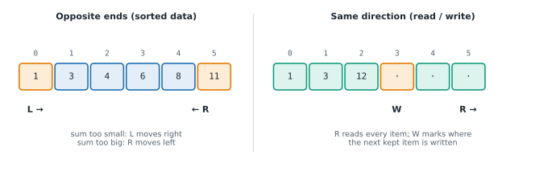

# Lesson 7: Two pointers

**You'll learn:** opposite-ends pointers, pair sum in a sorted array, palindromes, read/write pointers, removing duplicates and zeros in place, merging sorted lists, why each move is safe.

▶ **Practise this lesson in the [sandbox](https://kishoremadanagopal.github.io/learning/dsa/#two-pointers)**: run every example and check your exercise answers.

## Key terms

- **Two pointers:** two indexes that move through the data by a rule, replacing a nested loop.
- **Opposite-ends pointers:** one pointer starts at each end and they move towards each other.
- **Read/write pointers:** one pointer scans every item; the other marks where the next kept item goes.
- **Palindrome:** text that reads the same forwards and backwards.
- **Merge:** combining two sorted lists into one sorted list by repeatedly taking the smaller front item.
- **Sorted:** arranged in increasing (or decreasing) order; what makes opposite-ends pointers work.

**Two pointers** means keeping two indexes into the data and moving them according to a rule. There are two main shapes:



| Shape | How the pointers move | Typical problems |
|---|---|---|
| **Opposite ends** | `left` from the start, `right` from the end, moving inwards | pair with a target sum in a **sorted** array, palindromes, reversing, container with most water |
| **Same direction** (fast/slow, read/write) | `fast` reads every item; `slow` marks where to write | removing duplicates or zeros in place, partitioning, merging sorted lists |

## Opposite ends: a pair with a given sum (sorted input)

With sorted numbers, look at the smallest and largest. If their sum is too small, the only way to increase it is to move `left` right; if too big, move `right` left. Each step rules out one number for good, so it's O(n):

```python
def pair_sum_sorted(nums, target):
    left, right = 0, len(nums) - 1
    while left < right:
        s = nums[left] + nums[right]
        if s == target:
            return [left, right]
        if s < target:
            left += 1            # need a bigger sum
        else:
            right -= 1           # need a smaller sum
    return []

print(pair_sum_sorted([1, 3, 4, 6, 8, 11], 10))   # 4 + 6
print(pair_sum_sorted([1, 2, 3], 100))
```

Why can't it miss the answer? When the sum is too small with `nums[left]` and the **largest** remaining number, `nums[left]` can't be part of any pair (every other partner is smaller still), so it's safe to drop.

## Opposite ends: a palindrome check

A **palindrome** reads the same forwards and backwards. Compare the outer characters and move inwards, skipping anything that isn't a letter or digit:

```python
def is_palindrome(s):
    left, right = 0, len(s) - 1
    while left < right:
        if not s[left].isalnum():
            left += 1
        elif not s[right].isalnum():
            right -= 1
        elif s[left].lower() != s[right].lower():
            return False
        else:
            left, right = left + 1, right - 1
    return True

print(is_palindrome("A man, a plan, a canal: Panama"))
print(is_palindrome("race a car"))
```

This uses O(1) extra space; `cleaned == cleaned[::-1]` is simpler but builds two new strings.

## Same direction: write pointer and read pointer

Move every zero to the end, keeping the order of the other numbers, in place. `write` is where the next non-zero goes; `read` scans everything:

```python
def move_zeros(nums):
    write = 0
    for read in range(len(nums)):
        if nums[read] != 0:
            nums[write], nums[read] = nums[read], nums[write]
            write += 1

data = [0, 1, 0, 3, 12]
move_zeros(data)
print(data)
```

## Merging two sorted lists

Two pointers, one in each list, always taking the smaller front item. This is the heart of merge sort (Lesson 26):

```python
def merge(a, b):
    i = j = 0
    out = []
    while i < len(a) and j < len(b):
        if a[i] <= b[j]:
            out.append(a[i]); i += 1
        else:
            out.append(b[j]); j += 1
    out.extend(a[i:])            # one of these is empty
    out.extend(b[j:])
    return out

print(merge([1, 4, 9], [2, 3, 10, 11]))
```

## At a glance

| Concept | Approach | Time | Space |
|---|---|---|---|
| Pair sum in a sorted array | pointers at both ends; move the one that fixes the sum | O(n) | O(1) |
| Palindrome check | compare from both ends towards the middle | O(n) | O(1) |
| Remove duplicates in place | write pointer + read pointer | O(n) | O(1) |
| Merge two sorted lists | one pointer per list, take the smaller | O(n + m) | O(n + m) for the result |

## Common mistakes

- Using opposite-ends pointers on unsorted data.
- Letting the two pointers meet and pairing an item with itself (`while left <= right` instead of `<`).
- Comparing with the previous item instead of the last kept item when removing duplicates.
- Forgetting to add the leftovers after one list runs out while merging.

## Exercises

### 1. Pair with target sum

`nums` is sorted in increasing order. Write `pair_sum_sorted(nums, target)` that returns `[i, j]` (with `i < j`) for any two positions whose values add up to `target`, or `[]` if there are none. Use O(1) extra space and make it fast for 100,000 numbers.

Starter code:

```python
def pair_sum_sorted(nums, target):
    pass
```

<details>
<summary>🧭 How to approach it</summary>

1. **Understand:** sorted input; return two different positions whose values sum to target, or []. Any valid pair is accepted.
2. **Examples:** `[1, 3, 4, 6, 8, 11]`, 10 → `[2, 3]` (4 + 6). `[5]`, 10 → `[]` (can't use the same item twice).
3. **Brute force:** all pairs: O(n²).
4. **Pattern:** **sorted** + **pair** → two pointers from opposite ends.
5. **Plan:** compare the sum with the target and move the pointer that can fix it; stop when they meet.
6. **Code and test:** O(n) time, O(1) space. (Unsorted input? Then use a hash map: Lesson 14.)

</details>

<details>
<summary>💡 Hint 1</summary>

The list is sorted. Look at the smallest and the largest number together.

</details>

<details>
<summary>💡 Hint 2</summary>

If their sum is too small, the smallest number can't be in any pair: move the left pointer right. If too big, move the right pointer left.

</details>

<details>
<summary>💡 Hint 3</summary>

`left, right = 0, len(nums) - 1`; `while left < right`: compute `s`; equal → return; `s < target` → `left += 1`; else `right -= 1`. After the loop, `return []`.

</details>

### 2. Remove duplicates in place

`nums` is sorted. Write `remove_duplicates(nums)` that rearranges it **in place** so the first `k` items are the distinct values in order, and returns `k`. What's left after position k doesn't matter. Use O(1) extra space (no sets, no new lists).

Starter code:

```python
def remove_duplicates(nums):
    pass
```

<details>
<summary>🧭 How to approach it</summary>

1. **Understand:** in place; return how many distinct values; the list must start with them in order.
2. **Examples:** `[1, 1, 2]` → 2, list starts `[1, 2]`. `[]` → 0. `[2, 2, 2]` → 1.
3. **Brute force:** `sorted(set(nums))` then copy back: O(n) extra space, not allowed.
4. **Pattern:** **same-direction two pointers** (read/write). Sorted → duplicates are adjacent.
5. **Plan:** keep the first value; scan the rest; copy a value forward only if it differs from the last kept one.
6. **Code and test:** check `[]`, one item, and all-equal.

</details>

<details>
<summary>💡 Hint 1</summary>

Because the list is sorted, equal values sit next to each other.

</details>

<details>
<summary>💡 Hint 2</summary>

Use a `write` pointer for where the next new value goes, and a `read` pointer that scans. Compare each value with the last one you kept.

</details>

<details>
<summary>💡 Hint 3</summary>

If empty return 0. `write = 1`; for `read` from 1: if `nums[read] != nums[write - 1]`: `nums[write] = nums[read]`, `write += 1`. Return `write`.

</details>

**In the sandbox:** exercises 13–14. Press **Check** to run the hidden tests.

### Answers and walkthroughs

Open these only after a real attempt. Each one explains the solution step by step.

<details>
<summary>✅ 1. Pair with target sum</summary>

```python
def pair_sum_sorted(nums, target):
    left, right = 0, len(nums) - 1
    while left < right:
        s = nums[left] + nums[right]
        if s == target:
            return [left, right]
        if s < target:
            left += 1
        else:
            right -= 1
    return []
```

**Line by line**

- `left, right = 0, len(nums) - 1` start at the two ends.
- `while left < right:` stops before a pointer pairs with itself.
- `s < target` → `left += 1`: a bigger left value is the only way to increase the sum.
- `else: right -= 1`: the sum is too big, so try a smaller right value.

**Trace** on `[1, 3, 4, 6, 8, 11]`, target 10:

| left | right | values | sum | action |
|---|---|---|---|---|
| 0 | 5 | 1 + 11 | 12 | too big → right − 1 |
| 0 | 4 | 1 + 8 | 9 | too small → left + 1 |
| 1 | 4 | 3 + 8 | 11 | too big → right − 1 |
| 1 | 3 | 3 + 6 | 9 | too small → left + 1 |
| 2 | 3 | 4 + 6 | **10** | return [2, 3] |

**Why it's correct:** every move throws away one value that provably can't be in a valid pair, so no answer is skipped.

**Complexity:** O(n) time (the pointers together move at most n steps), O(1) space.

</details>

<details>
<summary>✅ 2. Remove duplicates in place</summary>

```python
def remove_duplicates(nums):
    if not nums:
        return 0
    write = 1                          # nums[0] is always kept
    for read in range(1, len(nums)):
        if nums[read] != nums[write - 1]:
            nums[write] = nums[read]
            write += 1
    return write
```

**Line by line**

- `if not nums: return 0` handles the empty list, where `nums[0]` would fail.
- `write = 1`: the first value is always kept, so the next free spot is index 1.
- `nums[read] != nums[write - 1]` compares with the **last kept** value, not with the previous item read.
- `return write`: everything before `write` is the distinct values.

**Trace** on `[0, 0, 1, 1, 2]`:

| read | nums[read] | last kept | new? | list (first write items) | write |
|---|---|---|---|---|---|
| start | | 0 | | [0] | 1 |
| 1 | 0 | 0 | no | [0] | 1 |
| 2 | 1 | 0 | yes | [0, 1] | 2 |
| 3 | 1 | 1 | no | [0, 1] | 2 |
| 4 | 2 | 1 | yes | [0, 1, 2] | 3 |

Returns **3**.

**Complexity:** O(n) time, O(1) space.

</details>

## Quick quiz

1. When does the opposite-ends pair search work?
   - A) When the array is sorted
   - B) On any array
   - C) Only when all numbers are positive

2. In the pair search, the sum is smaller than the target. What do you do?
   - A) Move the left pointer right, to a bigger value
   - B) Move the right pointer left
   - C) Move both pointers

3. In the read/write pattern, what does the write pointer mark?
   - A) Where the next item to keep should go
   - B) The item being read
   - C) The end of the list

4. What is the time complexity of merging two sorted lists of sizes n and m?
   - A) O(n × m)
   - B) O(n + m)
   - C) O(log n)

<details>
<summary>Quiz answers</summary>

1. **A) When the array is sorted**: Sorted order is what tells you which pointer to move.
2. **A) Move the left pointer right, to a bigger value**: Only a bigger left value can increase the sum.
3. **A) Where the next item to keep should go**: Read scans everything; write builds the result at the front.
4. **B) O(n + m)**: Each step moves one pointer forward.

</details>

---
Previous: [Lesson 6](06-arrays.md) · Next: [Lesson 8: Sliding window](08-sliding-window.md)
