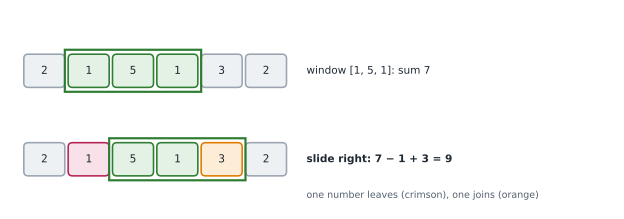

# Lesson 8: Sliding window

**You'll learn:** fixed-size windows, variable windows that grow and shrink, the template, why it's O(n), longest substring without repeats, shortest subarray with a target sum, when windows don't work.

▶ **Practise this lesson in the [sandbox](https://kishoremadanagopal.github.io/learning/dsa/#sliding-window)**: run every example and check your exercise answers.

## Key terms

- **Sliding window:** a contiguous range [left, right] that moves through the data and is updated instead of recomputed.
- **Fixed-size window:** a window of exactly k items; one item joins and one leaves at each step.
- **Variable-size window:** a window that grows on the right and shrinks on the left to keep a rule true.
- **Substring:** a contiguous run of characters in a string.
- **Subarray:** a contiguous run of items in an array.
- **Window state:** what you keep about the window (a sum, counts, a set) so updates are O(1).
- **Monotonic rule:** a rule where growing an invalid window can never make it valid again; needed for variable windows.

Many problems ask about **contiguous** runs: "the largest sum of any 5 days in a row", "the longest substring with no repeated letter". The brute force looks at every start and end: O(n²) windows, often with O(n) work each. A **sliding window** keeps track of the current run and **updates** it as it moves, so each item enters and leaves once: O(n).



## Fixed-size window

Largest sum of k consecutive numbers. Instead of re-adding k numbers for every position, slide: add the number that enters, subtract the one that leaves.

```python
def max_window_sum(nums, k):
    window = sum(nums[:k])                    # the first window
    best = window
    for i in range(k, len(nums)):
        window += nums[i] - nums[i - k]       # one joins, one leaves
        best = max(best, window)
    return best

print(max_window_sum([2, 1, 5, 1, 3, 2], 3))   # 5 + 1 + 3
```

## Variable-size window: grow and shrink

When the window's size isn't fixed, use two pointers, `left` and `right`. Move `right` to **grow** the window; when the window breaks the rule, move `left` to **shrink** it until it's valid again. Track the best valid window as you go.

Shortest subarray with sum at least a target (all numbers positive):

```python
def min_len_at_least(nums, target):
    left = 0
    total = 0
    best = float("inf")
    for right, x in enumerate(nums):
        total += x                             # grow
        while total >= target:                 # valid: try to shrink
            best = min(best, right - left + 1)
            total -= nums[left]
            left += 1
    return 0 if best == float("inf") else best

print(min_len_at_least([2, 3, 1, 2, 4, 3], 7))   # [4, 3]
```

Even with a `while` inside the `for`, it's O(n): `left` only ever moves forward, so across the whole run it moves at most n times. This **"each pointer moves at most n times"** argument is how you prove sliding windows are linear.

Longest substring without a repeated character, using a set for what's in the window:

```python
def longest_unique(s):
    seen = set()
    left = best = 0
    for right, ch in enumerate(s):
        while ch in seen:                    # repeat: shrink from the left
            seen.remove(s[left])
            left += 1
        seen.add(ch)
        best = max(best, right - left + 1)
    return best

print(longest_unique("abcabcbb"), longest_unique("bbbbb"), longest_unique("pwwkew"))
```

## The template

```python
left = 0
state = empty                      # sum, counts, set... whatever the rule needs
for right in range(len(data)):
    add data[right] to state
    while the window is invalid:   # (or: if the window is too big, for fixed size)
        remove data[left] from state
        left += 1
    update the answer with the window [left, right]
```

Sliding windows need the rule to be **monotonic**: once a window is invalid, growing it can't make it valid again. With negative numbers, "sum at least target" breaks that, and you need prefix sums (Lesson 9) instead.

## Common mistakes

- Recomputing the whole window at every step, which makes it O(n·k).
- Starting the best value at 0 when all values could be negative.
- Moving the left pointer backwards (the "abba" bug).
- Using a sliding window with negative numbers for "sum at least target"; use prefix sums instead.

## Exercises

### 1. Best k days in a row

Write `max_window_sum(nums, k)` that returns the largest sum of any `k` consecutive numbers. You can assume `1 <= k <= len(nums)`. Numbers can be negative. Make it fast for 100,000 numbers with k = 5,000.

Starter code:

```python
def max_window_sum(nums, k):
    pass
```

<details>
<summary>🧭 How to approach it</summary>

1. **Understand:** contiguous runs of exactly k; return the biggest sum; negatives allowed (so the answer can be negative).
2. **Examples:** `[2, 1, 5, 1, 3, 2]`, k = 3 → 9 (5 + 1 + 3). `[-5, -2, -3]`, k = 2 → −5.
3. **Brute force:** sum every window: O(n·k). With n = 100,000 and k = 5,000 that's 500 million additions.
4. **Pattern:** "k consecutive" → **fixed-size sliding window**.
5. **Plan:** sum the first window; slide: add the new number, subtract the old; track the max.
6. **Code and test:** start `best` from the first window, not 0, so all-negative inputs work.

</details>

<details>
<summary>💡 Hint 1</summary>

Two neighbouring windows share k − 1 numbers. Don't add them up again.

</details>

<details>
<summary>💡 Hint 2</summary>

Moving the window right by one: the number at `i` joins and the number at `i - k` leaves.

</details>

<details>
<summary>💡 Hint 3</summary>

`window = sum(nums[:k])`, `best = window`; for `i` from k to the end: `window += nums[i] - nums[i - k]`, `best = max(best, window)`.

</details>

### 2. Longest substring without repeats

Write `longest_unique(s)` returning the length of the longest substring (a contiguous run of characters) with no repeated character. Make it fast for strings of 200,000 characters.

Starter code:

```python
def longest_unique(s):
    pass
```

<details>
<summary>🧭 How to approach it</summary>

1. **Understand:** substring = contiguous; return a length; empty string → 0.
2. **Examples:** "abcabcbb" → 3; "pwwkew" → 3 ("wke"); "abba" → 2.
3. **Brute force:** for every start, extend until a repeat: O(n²) or O(n³) with set rebuilding.
4. **Pattern:** "longest contiguous … with no repeats" → **variable sliding window** + a **set** of what's inside.
5. **Plan:** grow right; while the new character is already inside, remove from the left; record the window length.
6. **Code and test:** "abba" is the classic trap: make sure `left` only moves forward.

</details>

<details>
<summary>💡 Hint 1</summary>

Keep a window `s[left:right + 1]` that never contains a repeat, and a set of the characters in it.

</details>

<details>
<summary>💡 Hint 2</summary>

Each new character extends the window on the right. If it's already in the set, shrink from the left until it isn't.

</details>

<details>
<summary>💡 Hint 3</summary>

For each `right, ch`: `while ch in seen: seen.remove(s[left]); left += 1`, then `seen.add(ch)` and `best = max(best, right - left + 1)`.

</details>

**In the sandbox:** exercises 15–16. Press **Check** to run the hidden tests.

### Answers and walkthroughs

Open these only after a real attempt. Each one explains the solution step by step.

<details>
<summary>✅ 1. Best k days in a row</summary>

```python
def max_window_sum(nums, k):
    window = sum(nums[:k])
    best = window
    for i in range(k, len(nums)):
        window += nums[i] - nums[i - k]
        best = max(best, window)
    return best
```

**Line by line**

- `window = sum(nums[:k])` is the only full sum we ever compute: O(k).
- `for i in range(k, len(nums))`: `i` is the index of the number **joining** the window; `i - k` is the one **leaving**.
- `window += nums[i] - nums[i - k]` updates in O(1).
- `best = window` at the start (not 0), because with all-negative numbers 0 isn't a real window sum.

**Trace** on `[2, 1, 5, 1, 3, 2]`, k = 3:

| window | joins | leaves | sum | best |
|---|---|---|---|---|
| [2, 1, 5] | | | 8 | 8 |
| [1, 5, 1] | 1 | 2 | 7 | 8 |
| [5, 1, 3] | 3 | 1 | 9 | **9** |
| [1, 3, 2] | 2 | 5 | 6 | 9 |

**Complexity:** O(n) time, O(1) space.

</details>

<details>
<summary>✅ 2. Longest substring without repeats</summary>

```python
def longest_unique(s):
    seen = set()
    left = best = 0
    for right, ch in enumerate(s):
        while ch in seen:
            seen.remove(s[left])
            left += 1
        seen.add(ch)
        best = max(best, right - left + 1)
    return best
```

**Line by line**

- `seen` holds exactly the characters in `s[left:right + 1]`.
- `while ch in seen:` the new character would repeat, so shrink from the left until the old copy is gone. `left` only moves forward.
- `seen.add(ch)` then extends the window.
- `right - left + 1` is the window's length.

**Trace** on `"pwwkew"`:

| right | ch | shrink? | window | best |
|---|---|---|---|---|
| 0 | p | | p | 1 |
| 1 | w | | pw | 2 |
| 2 | w | remove p, w | w | 2 |
| 3 | k | | wk | 2 |
| 4 | e | | wke | 3 |
| 5 | w | remove w | kew | 3 |

**Complexity:** O(n) time (each character is added once and removed at most once), O(k) space for the set, where k is the number of distinct characters.

**Faster variant:** store each character's **last index** in a dict and jump `left` straight past the old copy: `left = max(left, last[ch] + 1)`. The `max` is what makes "abba" work.

</details>

## Quick quiz

1. Which problem suits a sliding window?
   - A) Longest contiguous run of days with rising temperatures
   - B) Sorting a list
   - C) Finding the shortest path in a map

2. Why is a variable sliding window O(n) even with a while loop inside the for loop?
   - A) The left pointer only moves forward, so it moves at most n times in total
   - B) The while loop never runs
   - C) Python optimises it

3. When moving a fixed window of size k one step right, the new sum is:
   - A) old sum + the number that joins − the number that leaves
   - B) old sum + the number that joins
   - C) the sum of the k new numbers, recomputed

4. Why can't "shortest subarray with sum at least target" use this window with negative numbers?
   - A) Shrinking or growing no longer moves the sum in a predictable direction
   - B) Negative numbers can't be added
   - C) The window would be too big

<details>
<summary>Quiz answers</summary>

1. **A) Longest contiguous run of days with rising temperatures**: Contiguous runs are what windows track.
2. **A) The left pointer only moves forward, so it moves at most n times in total**: Count total pointer moves, not loop nesting.
3. **A) old sum + the number that joins − the number that leaves**: Only two numbers change.
4. **A) Shrinking or growing no longer moves the sum in a predictable direction**: The window needs a monotonic rule; with negatives use prefix sums.

</details>

---
Previous: [Lesson 7](07-two-pointers.md) · Next: [Lesson 9: Prefix sums and difference arrays](09-prefix-sums.md)
