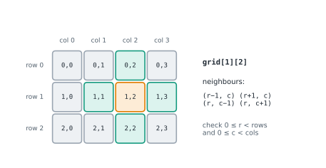

# Lesson 10: 2-D grids and matrices

**You'll learn:** grids as lists of lists, rows and columns, the aliasing trap, direction lists and bounds checks, transpose and rotate, zip(*grid), spiral order, searching a sorted matrix.

▶ **Practise this lesson in the [sandbox](https://kishoremadanagopal.github.io/learning/dsa/#matrices)**: run every example and check your exercise answers.

## Key terms

- **Grid / matrix:** values arranged in rows and columns; grid[r][c] is row r, column c.
- **Aliasing:** two names (or list slots) referring to the same object, so changing one changes the other.
- **Direction list:** offsets like (−1, 0), (1, 0), (0, −1), (0, 1) used to visit neighbours in a loop.
- **Bounds check:** testing 0 <= r < rows and 0 <= c < cols before using a cell.
- **Transpose:** swapping rows and columns.
- **Spiral order:** visiting a grid's values clockwise from the outside ring inwards.

Boards, maps, images and spreadsheets are **grids**: rows and columns. In Python a grid is a list of rows, and `grid[r][c]` is row `r`, column `c`.



```python
grid = [
    [1, 2, 3, 4],
    [5, 6, 7, 8],
    [9, 10, 11, 12],
]
rows, cols = len(grid), len(grid[0])
print(rows, "rows,", cols, "columns")
print("row 1:", grid[1])
print("column 2:", [grid[r][2] for r in range(rows)])
print("cell (1, 2):", grid[1][2])
```

## The aliasing trap

```python
bad = [[0] * 3] * 2           # two references to the SAME row
bad[0][0] = 9
print(bad)                    # both rows changed!

good = [[0] * 3 for _ in range(2)]   # a new row each time
good[0][0] = 9
print(good)
```

`[row] * n` copies the **reference**, not the row. Always build grids with a comprehension.

## Neighbours with a direction list

Instead of four `if` blocks, loop over direction offsets and check the bounds once:

```python
DIRS = [(-1, 0), (1, 0), (0, -1), (0, 1)]     # up, down, left, right

def neighbours(grid, r, c):
    rows, cols = len(grid), len(grid[0])
    for dr, dc in DIRS:
        nr, nc = r + dr, c + dc
        if 0 <= nr < rows and 0 <= nc < cols:
            yield nr, nc

grid = [[1, 2, 3], [4, 5, 6]]
print(list(neighbours(grid, 0, 0)))   # a corner has 2 neighbours
print(list(neighbours(grid, 1, 1)))
```

Add `(-1, -1), (-1, 1), (1, -1), (1, 1)` for 8 directions (diagonals). Grids are really graphs where each cell connects to its neighbours, and BFS/DFS on grids (Lesson 36) builds on this.

## Transpose and rotate

**Transposing** swaps rows and columns: `t[c][r] = grid[r][c]`. **Rotating 90° clockwise** is a transpose followed by reversing each row.

```python
grid = [[1, 2, 3],
        [4, 5, 6]]
transposed = [list(col) for col in zip(*grid)]
print(transposed)
rotated = [row[::-1] for row in transposed]
print(rotated)
```

`zip(*grid)` is a Python idiom: it passes each row as a separate argument, and `zip` groups their first items, their second items, and so on, which are the columns.

## Searching a sorted matrix in O(rows + cols)

If every row and every column is sorted, start at the **top-right** corner. If the value is too big, the whole column below is too big: move left. If too small, the whole row to the left is too small: move down. Each step discards a row or a column.

```python
def search_sorted_matrix(grid, target):
    r, c = 0, len(grid[0]) - 1
    while r < len(grid) and c >= 0:
        v = grid[r][c]
        if v == target:
            return (r, c)
        if v > target:
            c -= 1
        else:
            r += 1
    return None

m = [[1, 4, 7, 11],
     [2, 5, 8, 12],
     [3, 6, 9, 16],
     [10, 13, 14, 17]]
print(search_sorted_matrix(m, 9), search_sorted_matrix(m, 15))
```

## Common mistakes

- Creating grids with `[[0] * cols] * rows`, which repeats one row object.
- Mixing up rows and columns (grid[c][r]) or the lengths (len(grid) is the number of rows).
- Code that only works for square grids.
- Forgetting the bounds check when visiting neighbours.

## Exercises

### 1. Rotate 90° clockwise

Write `rotate_90(grid)` that returns a **new** grid rotated 90° clockwise. The grid can be rectangular (R rows by C columns gives C rows by R columns) or empty (`[]` gives `[]`).

Starter code:

```python
def rotate_90(grid):
    pass
```

<details>
<summary>🧭 How to approach it</summary>

1. **Understand:** a new grid; R × C becomes C × R; empty → empty; don't change the input.
2. **Examples:** `[[1, 2], [3, 4]]` → `[[3, 1], [4, 2]]`. One row `[[1, 2, 3]]` → a column `[[1], [2], [3]]`.
3. **Brute force:** work out where each cell goes: (r, c) moves to (c, R − 1 − r).
4. **Pattern:** **index mapping**, or **transpose + reverse each row**.
5. **Plan:** for each old column c (top to bottom of the new grid), build a row from the old column read bottom-up.
6. **Code and test:** test a non-square grid; square-only code often breaks there.

</details>

<details>
<summary>💡 Hint 1</summary>

Try it on paper with `[[1, 2, 3], [4, 5, 6]]`. The result has 3 rows of 2. Where does each new row come from?

</details>

<details>
<summary>💡 Hint 2</summary>

New row c is old column c, read from the bottom row up.

</details>

<details>
<summary>💡 Hint 3</summary>

`[[grid[rows - 1 - r][c] for r in range(rows)] for c in range(cols)]`, or transpose with `zip(*grid)` then reverse each row.

</details>

### 2. Spiral order

Write `spiral(grid)` that returns all values in **clockwise spiral order**, starting top-left: across the top row, down the right column, back along the bottom, up the left, then the next ring inwards. Handle rectangular and empty grids.

Starter code:

```python
def spiral(grid):
    pass
```

<details>
<summary>🧭 How to approach it</summary>

1. **Understand:** every value exactly once, in spiral order; rectangular grids allowed.
2. **Examples:** 3 × 3 → 1, 2, 3, 6, 9, 8, 7, 4, 5. A single row or column is just read in order.
3. **Brute force:** walk with a direction and turn when you hit the edge or a visited cell (needs a visited grid). Works, but more bookkeeping.
4. **Pattern:** **shrinking boundaries** (four pointers).
5. **Plan:** while the boundaries haven't crossed: four sides, shrinking one boundary after each.
6. **Code and test:** the 3 × 4 and 3 × 2 grids catch the double-counting bug.

</details>

<details>
<summary>💡 Hint 1</summary>

Keep four boundaries, `top`, `bottom`, `left` and `right`, and shrink them as you finish each side.

</details>

<details>
<summary>💡 Hint 2</summary>

One lap: walk the top row and move `top` down; the right column and move `right` left; the bottom row (backwards) and move `bottom` up; the left column (upwards) and move `left` right.

</details>

<details>
<summary>💡 Hint 3</summary>

Before the bottom row and the left column, check `top <= bottom` and `left <= right` again, or a single leftover row or column gets added twice.

</details>

**In the sandbox:** exercises 19–20. Press **Check** to run the hidden tests.

### Answers and walkthroughs

Open these only after a real attempt. Each one explains the solution step by step.

<details>
<summary>✅ 1. Rotate 90° clockwise</summary>

```python
def rotate_90(grid):
    if not grid:
        return []
    rows, cols = len(grid), len(grid[0])
    return [[grid[rows - 1 - r][c] for r in range(rows)] for c in range(cols)]
```

**Line by line**

- `if not grid: return []` avoids `grid[0]` failing on an empty grid.
- The outer comprehension makes one new row per old column `c`.
- The inner part reads that column from the **bottom** row up: `grid[rows - 1 - r][c]` for r = 0, 1, …

**Trace** on `[[1, 2, 3], [4, 5, 6]]` (rows = 2, cols = 3):

| new row (c) | reads grid[1][c], grid[0][c] | result |
|---|---|---|
| 0 | 4, 1 | [4, 1] |
| 1 | 5, 2 | [5, 2] |
| 2 | 6, 3 | [6, 3] |

**Alternative:** `[list(row)[::-1] for row in zip(*grid)]` (transpose, then reverse each row).

**Complexity:** O(R × C) time and space: every cell is copied once. (An in-place rotation is possible for **square** grids by rotating four cells at a time, still O(n²) for n × n.)

</details>

<details>
<summary>✅ 2. Spiral order</summary>

```python
def spiral(grid):
    out = []
    if not grid:
        return out
    top, bottom = 0, len(grid) - 1
    left, right = 0, len(grid[0]) - 1
    while top <= bottom and left <= right:
        for c in range(left, right + 1):          # top row, left to right
            out.append(grid[top][c])
        top += 1
        for r in range(top, bottom + 1):          # right column, top to bottom
            out.append(grid[r][right])
        right -= 1
        if top <= bottom:                         # bottom row, right to left
            for c in range(right, left - 1, -1):
                out.append(grid[bottom][c])
            bottom -= 1
        if left <= right:                         # left column, bottom to top
            for r in range(bottom, top - 1, -1):
                out.append(grid[r][left])
            left += 1
    return out
```

**Line by line**

- `top, bottom, left, right` describe the ring not yet visited.
- After the top row, `top += 1`: that row is done. Same for the others.
- `if top <= bottom:` before the bottom row: if the top row we just did **was** the last row, there's no separate bottom row left. The same idea with `left <= right` for the left column.

**Trace** on the 3 × 4 grid `[[1,2,3,4],[5,6,7,8],[9,10,11,12]]`:

| side | values | boundaries after |
|---|---|---|
| top | 1 2 3 4 | top = 1 |
| right | 8 12 | right = 2 |
| bottom | 11 10 9 | bottom = 1 |
| left | 5 | left = 1 |
| top (lap 2) | 6 7 | top = 2 |
| right | (none: top > bottom) | right = 1 |
| stop | | top > bottom |

**Complexity:** O(R × C) time (each value once), O(1) extra space besides the output.

</details>

## Quick quiz

1. What's wrong with `grid = [[0] * 3] * 2`?
   - A) Both rows are the same list, so changing one changes the other
   - B) It creates a 3 × 2 grid
   - C) Nothing

2. How do you get the columns of a grid as tuples?
   - A) zip(*grid)
   - B) grid.T
   - C) reversed(grid)

3. Rotating a grid 90° clockwise equals:
   - A) Transposing, then reversing each row
   - B) Reversing the rows only
   - C) Transposing twice

4. Searching a matrix whose rows and columns are sorted, starting from the top-right corner, costs:
   - A) O(rows × cols)
   - B) O(rows + cols)
   - C) O(1)

<details>
<summary>Quiz answers</summary>

1. **A) Both rows are the same list, so changing one changes the other**: Multiplying a list of lists copies references. Use a comprehension.
2. **A) zip(*grid)**: `*` unpacks the rows as separate arguments to zip.
3. **A) Transposing, then reversing each row**: Try it on a 2 × 2 example.
4. **B) O(rows + cols)**: Each step removes a whole row or a whole column.

</details>

---
Previous: [Lesson 9](09-prefix-sums.md) · Next: [Lesson 11: Working with strings](11-strings.md)
