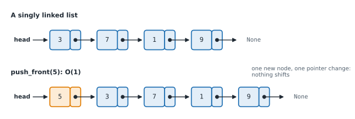
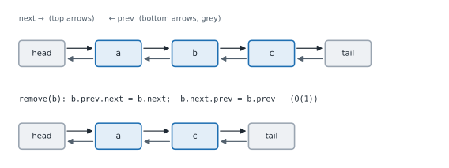

# Lesson 15: Linked lists

**You'll learn:** nodes and pointers, traversal, insert and delete, the dummy (sentinel) node, tail pointers, doubly and circular linked lists, linked list vs array.

▶ **Practise this lesson in the [sandbox](https://kishoremadanagopal.github.io/learning/dsa/#linked-lists)**: run every example and check your exercise answers.

## Key terms

- **Linked list:** a sequence of nodes where each node points to the next one.
- **Node:** one item of a linked list: a value plus a pointer to the next node (and the previous one, in a doubly linked list).
- **Pointer (reference):** a variable that refers to an object, such as `node.next`.
- **Head:** the first node of a linked list; the list is reached through it.
- **Tail:** the last node; its `next` is None.
- **Traversal:** visiting every node by following `next` from the head.
- **Dummy (sentinel) node:** a placeholder node before the head (or after the tail) that removes special cases.
- **Doubly linked list:** nodes point both forwards (`next`) and backwards (`prev`).
- **Circular linked list:** the last node points back to the first.

A Python list keeps its items side by side in memory, so jumping to item 1,000 is instant, but inserting at the front shifts every item. A **linked list** makes the opposite trade. Each item lives in its own **node**, and each node holds a **pointer** (a reference) to the next one. The list itself only remembers the first node, the **head**.



## A node, and walking the list

```python
class ListNode:
    def __init__(self, val, next=None):
        self.val = val
        self.next = next          # the next node, or None at the end

# build 3 -> 7 -> 1 -> 9 by hand
head = ListNode(3, ListNode(7, ListNode(1, ListNode(9))))

node = head
while node:                       # stop when we fall off the end (None)
    print(node.val, end=" -> ")
    node = node.next
print("None")
```

**Traversal** is the basic move of every linked-list algorithm: start at the head and follow `next` until `None`. Reaching item *i* takes *i* steps, so access by position is **O(n)**, not O(1).

Two helpers you'll use in every exercise turn Python lists into linked lists and back:

```python
class ListNode:
    def __init__(self, val, next=None):
        self.val = val
        self.next = next

def build(values):
    dummy = ListNode(0)                 # a placeholder before the real head
    tail = dummy
    for v in values:
        tail.next = ListNode(v)
        tail = tail.next
    return dummy.next

def to_list(head):
    out = []
    while head:
        out.append(head.val)
        head = head.next
    return out

head = build([4, 8, 15, 16])
print(to_list(head), "head value:", head.val)
```

## The operations and their costs

```python
class ListNode:
    def __init__(self, val, next=None):
        self.val = val
        self.next = next

class LinkedList:
    def __init__(self):
        self.head = None
        self.tail = None                # keeping a tail makes append O(1)
        self.size = 0

    def push_front(self, val):          # O(1): new node points at the old head
        self.head = ListNode(val, self.head)
        if self.tail is None:
            self.tail = self.head
        self.size += 1

    def append(self, val):              # O(1) thanks to the tail pointer
        node = ListNode(val)
        if self.tail is None:
            self.head = self.tail = node
        else:
            self.tail.next = node
            self.tail = node
        self.size += 1

    def find(self, val):                # O(n): walk until found
        node = self.head
        while node and node.val != val:
            node = node.next
        return node

    def delete(self, val):              # O(n) to find it, O(1) to unlink it
        dummy = ListNode(0, self.head)
        prev = dummy
        while prev.next and prev.next.val != val:
            prev = prev.next
        if prev.next:                   # found: skip over it
            if prev.next is self.tail:
                self.tail = prev if prev is not dummy else None
            prev.next = prev.next.next
            self.size -= 1
        self.head = dummy.next

    def __iter__(self):
        node = self.head
        while node:
            yield node.val
            node = node.next

ll = LinkedList()
for x in [7, 1, 9]:
    ll.append(x)
ll.push_front(3)
ll.delete(1)
print(list(ll), "size", ll.size, "tail", ll.tail.val)
```

| Operation | Linked list | Python list (array) |
|---|---|---|
| Access item *i* | O(n): walk from the head | **O(1)** |
| Insert / delete at the front | **O(1)** | O(n): everything shifts |
| Insert / delete after a node you already hold | **O(1)** | O(n) |
| Append at the end | O(1) with a tail pointer | O(1) amortised |
| Search for a value | O(n) | O(n) |
| Extra memory | one pointer per node | none (plus spare capacity) |

**The dummy (sentinel) node trick:** a placeholder node in front of the head means "delete the head" is no longer a special case. You'll see it in almost every linked-list solution; return `dummy.next` at the end.

## Doubly linked lists

Each node also points **back** (`prev`). Now, given a node, you can remove it in O(1) without searching for the node before it, and you can walk in both directions. The price is one more pointer per node and more pointers to keep correct.



```python
class DNode:
    def __init__(self, val):
        self.val, self.prev, self.next = val, None, None

class DoublyLinkedList:
    def __init__(self):
        self.head, self.tail = DNode(None), DNode(None)    # two sentinels
        self.head.next, self.tail.prev = self.tail, self.head

    def add_last(self, val):                               # O(1)
        node = DNode(val)
        node.prev, node.next = self.tail.prev, self.tail
        self.tail.prev.next = node
        self.tail.prev = node
        return node

    def remove(self, node):                                # O(1): no search needed
        node.prev.next = node.next
        node.next.prev = node.prev

    def values(self):
        out, node = [], self.head.next
        while node is not self.tail:
            out.append(node.val)
            node = node.next
        return out

d = DoublyLinkedList()
a, b, c = d.add_last("a"), d.add_last("b"), d.add_last("c")
d.remove(b)
print(d.values())
```

Doubly linked lists power the LRU cache (Lesson 20), browser history and text editors' undo lists. Python's `collections.deque` is built from linked blocks for the same reason: O(1) at both ends.

## Circular linked lists

The last node points back to the first instead of to `None`. Useful for things that go round and round: players taking turns, a round-robin scheduler, a playlist on repeat. Be careful: a plain `while node:` loop never ends on a circle, so stop when you're back at the start.

```python
class ListNode:
    def __init__(self, val, next=None):
        self.val = val
        self.next = next

# players 1..5 in a circle; every 2nd player is out (the Josephus problem)
first = ListNode(1)
node = first
for v in range(2, 6):
    node.next = ListNode(v)
    node = node.next
node.next = first                        # close the circle

prev, cur, out = node, first, []
while cur.next is not cur:               # until one player is left
    prev, cur = cur, cur.next            # skip one player
    out.append(cur.val)                  # this one is out
    prev.next = cur.next                 # unlink it: O(1)
    cur = cur.next
print("out in order:", out, " winner:", cur.val)
```

## When to use a linked list

In Python you'll rarely build one for real work: lists and `deque` are faster in practice because of how memory caches work. But linked lists matter because:

- they're the classic interview topic for **pointer manipulation**;
- they're the building block of other structures (stacks, queues, hash-table chains, LRU caches, adjacency lists for graphs);
- they're what you'd use in a lower-level language when you need O(1) inserts and deletes in the middle of a sequence you're already walking through.

## At a glance

| Concept | Approach | Time | Space |
|---|---|---|---|
| Traverse / search | follow next from the head | O(n) | O(1) |
| Access item i | walk i steps | O(n) | O(1) |
| Insert / delete at the front | new node points to the old head | O(1) | O(1) |
| Append with a tail pointer | link after the tail, move the tail | O(1) | O(1) |
| Delete by value | dummy + prev pointer; prev.next = prev.next.next | O(n) | O(1) |
| Delete a node you hold (doubly linked) | reconnect its prev and next | O(1) | O(1) |
| Insert into a sorted list | walk to the last smaller node, splice | O(n) | O(1) |
| Josephus circle | circular list, unlink every k-th node | O(n·k) | O(n) |

## Common mistakes

- Losing the rest of the list by overwriting `node.next` before saving it.
- Forgetting the empty list (head is None) and one-node lists.
- Writing `while node.next:` when you need `while node:`, which skips the last node (or crashes on an empty list).
- Looping forever over a circular list with `while node:`.

## Exercises

### 1. Remove every copy

Write `remove_value(head, val)` that removes **every** node whose value equals `val` and returns the new head (which may be `None`). The `ListNode` class and the `build` / `to_list` helpers are in the starter.

Starter code:

```python
class ListNode:
    def __init__(self, val, next=None):
        self.val = val
        self.next = next

def build(values):
    dummy = ListNode(0)
    tail = dummy
    for v in values:
        tail.next = ListNode(v)
        tail = tail.next
    return dummy.next

def to_list(head):
    out = []
    while head:
        out.append(head.val)
        head = head.next
    return out

def remove_value(head, val):
    pass

print(to_list(remove_value(build([1, 2, 6, 3, 6]), 6)))
```

<details>
<summary>🧭 How to approach it</summary>

1. **Understand:** remove all matches, keep the order of the rest, return the (possibly new) head.
2. **Examples:** [1, 2, 6, 3, 6], 6 → [1, 2, 3]. [7, 7], 7 → [] (head becomes None). [] → [].
3. **Brute force:** copy the values into a Python list, filter, rebuild: O(n) time but O(n) extra space, and it dodges the pointer skill being practised.
4. **Pattern:** **dummy head + prev pointer**: unlink a node by changing the pointer of the node before it.
5. **Plan:** dummy → head; prev = dummy; while prev.next: skip it if it matches, else advance; return dummy.next.
6. **Code and test:** test a match at the head, at the tail, two in a row, and an empty list.

</details>

<details>
<summary>💡 Hint 1</summary>

Removing a node means making the node **before** it skip over it. What if the node to remove is the head, which has nothing before it?

</details>

<details>
<summary>💡 Hint 2</summary>

Put a dummy node in front of the head, then walk with a `prev` pointer and look at `prev.next`.

</details>

<details>
<summary>💡 Hint 3</summary>

If `prev.next.val == val`, set `prev.next = prev.next.next` and **stay** (the new `prev.next` might match too); otherwise move `prev` forward. Return `dummy.next`.

</details>

### 2. Insert into a sorted list

Write `insert_sorted(head, val)` that inserts a new node with `val` into a linked list already sorted in ascending order, keeps it sorted, and returns the head.

Starter code:

```python
class ListNode:
    def __init__(self, val, next=None):
        self.val = val
        self.next = next

def build(values):
    dummy = ListNode(0)
    tail = dummy
    for v in values:
        tail.next = ListNode(v)
        tail = tail.next
    return dummy.next

def to_list(head):
    out = []
    while head:
        out.append(head.val)
        head = head.next
    return out

def insert_sorted(head, val):
    pass

print(to_list(insert_sorted(build([1, 3, 7]), 5)))
```

<details>
<summary>🧭 How to approach it</summary>

1. **Understand:** keep ascending order; the new node may become the head or the tail; the list may be empty.
2. **Examples:** [1, 3, 7] + 5 → [1, 3, 5, 7]; [3, 7] + 1 → [1, 3, 7]; [] + 4 → [4].
3. **Brute force:** convert to a Python list, `bisect.insort`, rebuild: works, but O(n) extra space.
4. **Pattern:** **dummy head**, then walk to the insertion point and splice.
5. **Plan:** prev = dummy; move while the next value is smaller; link the new node between prev and prev.next.
6. **Code and test:** smallest, largest, empty, equal values.

</details>

<details>
<summary>💡 Hint 1</summary>

The new node goes right after the last node whose value is smaller than `val`.

</details>

<details>
<summary>💡 Hint 2</summary>

Use a dummy node so "insert before the head" needs no special case. Walk `prev` while `prev.next.val < val`.

</details>

<details>
<summary>💡 Hint 3</summary>

Splice in one line: `prev.next = ListNode(val, prev.next)`. Return `dummy.next`.

</details>

**In the sandbox:** exercises 29–30. Press **Check** to run the hidden tests.

### Answers and walkthroughs

Open these only after a real attempt. Each one explains the solution step by step.

<details>
<summary>✅ 1. Remove every copy</summary>

```python
class ListNode:
    def __init__(self, val, next=None):
        self.val = val
        self.next = next

def build(values):
    dummy = ListNode(0)
    tail = dummy
    for v in values:
        tail.next = ListNode(v)
        tail = tail.next
    return dummy.next

def to_list(head):
    out = []
    while head:
        out.append(head.val)
        head = head.next
    return out

def remove_value(head, val):
    dummy = ListNode(0, head)        # sentinel: the head is no longer a special case
    prev = dummy
    while prev.next:
        if prev.next.val == val:
            prev.next = prev.next.next   # unlink; don't move prev (the next one may match too)
        else:
            prev = prev.next
    return dummy.next

print(to_list(remove_value(build([1, 2, 6, 3, 6]), 6)))
```

**Line by line**

- `dummy = ListNode(0, head)` puts a node in front of the real head, so removing the head works exactly like removing any other node.
- `prev` always points to the last node we've decided to **keep**; we look one step ahead at `prev.next`.
- On a match, `prev.next = prev.next.next` unlinks the node. We don't move `prev`, because the new `prev.next` hasn't been checked yet: that's what handles `7, 7` in a row.
- Otherwise the next node stays, so `prev` moves onto it.
- `dummy.next` is the new head, which may be `None` if everything was removed.

**Trace** on 7 → 1 → 7 → 2, removing 7:

| prev | prev.next | action | list after |
|---|---|---|---|
| dummy | 7 | unlink | dummy → 1 → 7 → 2 |
| dummy | 1 | keep, move | dummy → 1 → 7 → 2 |
| 1 | 7 | unlink | dummy → 1 → 2 |
| 1 | 2 | keep, move | dummy → 1 → 2 |
| 2 | None | stop | return 1 → 2 |

**Complexity:** O(n) time (each node is looked at once), O(1) extra space.

**Common wrong approach:** moving `prev` forward after every removal skips the node right after a removed one, so `1, 7, 7, 2` leaves a 7 behind.

</details>

<details>
<summary>✅ 2. Insert into a sorted list</summary>

```python
class ListNode:
    def __init__(self, val, next=None):
        self.val = val
        self.next = next

def build(values):
    dummy = ListNode(0)
    tail = dummy
    for v in values:
        tail.next = ListNode(v)
        tail = tail.next
    return dummy.next

def to_list(head):
    out = []
    while head:
        out.append(head.val)
        head = head.next
    return out

def insert_sorted(head, val):
    dummy = ListNode(0, head)
    prev = dummy
    while prev.next and prev.next.val < val:   # find the last node smaller than val
        prev = prev.next
    prev.next = ListNode(val, prev.next)       # splice the new node in after it
    return dummy.next

print(to_list(insert_sorted(build([1, 3, 7]), 5)))
```

**Line by line**

- `dummy = ListNode(0, head)`: inserting before the head becomes "insert after dummy".
- The `while` stops at the last node with a value **smaller** than `val` (or at the dummy, or at the last node).
- `ListNode(val, prev.next)` creates the node already pointing at the rest of the list; assigning it to `prev.next` links it in. The order of these two steps matters: if you set `prev.next` first, you lose the rest of the list.

**Trace** inserting 5 into 1 → 3 → 7:

| prev | prev.next.val | < 5? | action |
|---|---|---|---|
| dummy | 1 | yes | move |
| 1 | 3 | yes | move |
| 3 | 7 | no | stop; link 3 → 5 → 7 |

**Complexity:** O(n) time in the worst case (walk to the end), O(1) extra space.

**Common wrong approach:** writing `prev.next = new` and then `new.next = prev.next`. By the second line `prev.next` already **is** the new node, so the node points to itself and the rest of the list is lost.

</details>

## Quick quiz

1. Why is reading the 1,000th item of a linked list slow?
   - A) You must follow 999 pointers from the head: O(n)
   - B) Linked lists store items in random order
   - C) Python checks every item for errors

2. Which operation is O(1) for a linked list but O(n) for a Python list?
   - A) Reading the last item
   - B) Inserting at the front
   - C) Searching for a value

3. What is a dummy (sentinel) node for?
   - A) It sits before the head so that changing the head needs no special case
   - B) It marks the end of the list instead of None
   - C) It stores the list's length

4. What does a doubly linked list let you do in O(1) that a singly linked list can't?
   - A) Remove a node you hold, without searching for the node before it
   - B) Access any position directly
   - C) Sort the list

<details>
<summary>Quiz answers</summary>

1. **A) You must follow 999 pointers from the head: O(n)**: Nodes aren't side by side in memory, so there's no way to jump straight to position i.
2. **B) Inserting at the front**: A new head just points at the old head. A Python list must shift every item.
3. **A) It sits before the head so that changing the head needs no special case**: With a dummy, every real node has a node before it, including the head. Return dummy.next.
4. **A) Remove a node you hold, without searching for the node before it**: With prev pointers, the node already knows its neighbour on each side.

</details>

---
Previous: [Lesson 14](14-hashing-patterns.md) · Next: [Lesson 16: Linked list patterns: reverse, fast and slow pointers, merge](16-linked-list-patterns.md)
