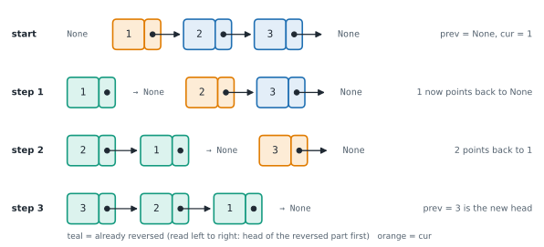

# Lesson 16: Linked list patterns: reverse, fast and slow pointers, merge

**You'll learn:** reversing in place, recursion vs iteration, fast and slow pointers, the middle node, Floyd's cycle detection and cycle start, merging sorted lists, a gap of k, palindrome lists.

▶ **Practise this lesson in the [sandbox](https://kishoremadanagopal.github.io/learning/dsa/#linked-list-patterns)**: run every example and check your exercise answers.

## Key terms

- **In-place:** changing the existing structure instead of building a new one, using O(1) extra memory.
- **Fast and slow pointers:** two pointers moving at different speeds (usually 2 steps and 1 step) through a list.
- **Floyd's cycle detection:** the tortoise-and-hare method: if fast and slow ever meet, there's a cycle.
- **Cycle:** a loop in the links, so following `next` never reaches None.
- **Merge:** combining two sorted sequences into one sorted sequence.
- **Stable:** keeping equal items in their original order.

Almost every linked-list question is a combination of four moves. Learn them as templates.

## 1. Reverse a list in place

Walk the list once, turning every `next` arrow around. You need three pointers: `prev` (the reversed part so far), `cur` (the node being turned) and `nxt` (saved so you don't lose the rest).



```python
class ListNode:
    def __init__(self, val, next=None):
        self.val, self.next = val, next

def build(values):
    head = None
    for v in reversed(values):
        head = ListNode(v, head)
    return head

def to_list(head):
    out = []
    while head:
        out.append(head.val)
        head = head.next
    return out

def reverse(head):
    prev, cur = None, head
    while cur:
        nxt = cur.next      # 1. remember the rest
        cur.next = prev     # 2. turn the arrow around
        prev = cur          # 3. move both pointers one step
        cur = nxt
    return prev             # prev is the old tail = the new head

print(to_list(reverse(build([1, 2, 3, 4]))))
```

O(n) time, O(1) space. A recursive version exists (reverse the rest, then hook the current node on the end) but uses O(n) call-stack space and crashes past Python's recursion limit of about 1,000 nodes, so prefer the loop.

```python
class ListNode:
    def __init__(self, val, next=None):
        self.val, self.next = val, next

def reverse_recursive(head):
    if head is None or head.next is None:
        return head                      # 0 or 1 node: already reversed
    new_head = reverse_recursive(head.next)
    head.next.next = head                # the node after me now points back at me
    head.next = None
    return new_head

head = ListNode(1, ListNode(2, ListNode(3)))
node = reverse_recursive(head)
print(node.val, node.next.val, node.next.next.val)
```

## 2. Fast and slow pointers

Two pointers start at the head; `slow` moves one step, `fast` moves two. When `fast` reaches the end, `slow` is in the **middle**:

```python
class ListNode:
    def __init__(self, val, next=None):
        self.val, self.next = val, next

def build(values):
    head = None
    for v in reversed(values):
        head = ListNode(v, head)
    return head

def middle(head):
    slow = fast = head
    while fast and fast.next:
        slow = slow.next
        fast = fast.next.next
    return slow

print(middle(build([1, 2, 3, 4, 5])).val, middle(build([1, 2, 3, 4, 5, 6])).val)
```

(For an even length, this returns the second of the two middle nodes.)

**Cycle detection (Floyd's tortoise and hare).** If a list loops back on itself, a plain walk never ends. With fast and slow pointers, if there's a cycle, the fast one eventually laps the slow one and they meet; if there isn't, fast falls off the end. O(n) time and **O(1) space**, where a "visited" set would need O(n).


```python
class ListNode:
    def __init__(self, val, next=None):
        self.val, self.next = val, next

def has_cycle(head):
    slow = fast = head
    while fast and fast.next:
        slow, fast = slow.next, fast.next.next
        if slow is fast:                 # same node object, not just the same value
            return True
    return False

def cycle_start(head):
    slow = fast = head
    while fast and fast.next:
        slow, fast = slow.next, fast.next.next
        if slow is fast:                 # they met inside the loop
            slow = head                  # restart one pointer from the head
            while slow is not fast:      # both move 1 step; they meet at the loop's start
                slow, fast = slow.next, fast.next
            return slow
    return None

nodes = [ListNode(v) for v in [1, 2, 3, 4, 5, 6]]
for a, b in zip(nodes, nodes[1:]):
    a.next = b
nodes[-1].next = nodes[2]                # 6 -> 3 makes a loop
print(has_cycle(nodes[0]), cycle_start(nodes[0]).val)
```

Why does restarting find the start? If the head is *a* steps before the loop and they meet *b* steps into the loop, the fast pointer travelled twice as far as the slow one; working that out shows *a* equals the distance from the meeting point forward to the loop's start (plus whole laps). So two pointers moving one step at a time from the head and from the meeting point arrive at the start together.

## 3. Merge two sorted lists

Like merging two sorted arrays (Lesson 7), but you **relink** existing nodes instead of copying values: O(n + m) time, O(1) extra space.

```python
class ListNode:
    def __init__(self, val, next=None):
        self.val, self.next = val, next

def build(values):
    head = None
    for v in reversed(values):
        head = ListNode(v, head)
    return head

def to_list(head):
    out = []
    while head:
        out.append(head.val)
        head = head.next
    return out

def merge(a, b):
    dummy = tail = ListNode(0)
    while a and b:
        if a.val <= b.val:
            tail.next, a = a, a.next
        else:
            tail.next, b = b, b.next
        tail = tail.next
    tail.next = a or b                  # attach whatever is left
    return dummy.next

print(to_list(merge(build([1, 4, 9]), build([2, 3, 10, 12]))))
```

## 4. A gap of k: remove the k-th node from the end

Move a `lead` pointer k steps ahead, then move `lead` and `trail` together. When `lead` falls off the end, `trail` is just before the node to remove. One pass, no length needed.

```python
class ListNode:
    def __init__(self, val, next=None):
        self.val, self.next = val, next

def build(values):
    head = None
    for v in reversed(values):
        head = ListNode(v, head)
    return head

def to_list(head):
    out = []
    while head:
        out.append(head.val)
        head = head.next
    return out

def remove_kth_from_end(head, k):
    dummy = ListNode(0, head)
    lead = trail = dummy
    for _ in range(k):
        lead = lead.next
    while lead.next:
        lead, trail = lead.next, trail.next
    trail.next = trail.next.next
    return dummy.next

print(to_list(remove_kth_from_end(build([1, 2, 3, 4, 5]), 2)))
```

## Putting moves together: is the list a palindrome?

Find the middle (fast/slow), reverse the second half, compare the halves: O(n) time, O(1) space.

```python
class ListNode:
    def __init__(self, val, next=None):
        self.val, self.next = val, next

def build(values):
    head = None
    for v in reversed(values):
        head = ListNode(v, head)
    return head

def is_palindrome(head):
    slow = fast = head
    while fast and fast.next:            # 1. find the middle
        slow, fast = slow.next, fast.next.next
    prev = None
    while slow:                          # 2. reverse the second half
        slow.next, prev, slow = prev, slow, slow.next
    left, right = head, prev
    while right:                         # 3. compare
        if left.val != right.val:
            return False
        left, right = left.next, right.next
    return True

print(is_palindrome(build([1, 2, 3, 2, 1])), is_palindrome(build([1, 2, 2, 3])))
```

## At a glance

| Concept | Approach | Time | Space |
|---|---|---|---|
| Reverse a list | prev / cur / next, turn each arrow around | O(n) | O(1) (recursive: O(n) stack) |
| Middle node | slow 1 step, fast 2 steps | O(n) | O(1) |
| Detect a cycle (Floyd) | fast and slow meet if there's a loop | O(n) | O(1) |
| Find the cycle's start | after meeting, restart one pointer at the head; step both by 1 | O(n) | O(1) |
| Merge two sorted lists | dummy + tail; attach the smaller front | O(n + m) | O(1) |
| Remove k-th from the end | lead k steps ahead, then move both | O(n) | O(1) |
| Palindrome list | middle, reverse the second half, compare | O(n) | O(1) |

## Common mistakes

- Comparing node values (`==`) instead of node identity (`is`) when detecting cycles.
- Reversing recursively on long lists in Python, which hits the recursion limit.
- Forgetting to attach the leftover nodes after a merge loop.
- Checking `fast.next.next` without first checking `fast` and `fast.next`.

## Exercises

### 1. Reverse a linked list

Write `reverse_list(head)` that reverses the list **in place** (relink the nodes; don't create new ones) and returns the new head. It must handle 100,000 nodes, so use a loop, not recursion.

Starter code:

```python
class ListNode:
    def __init__(self, val, next=None):
        self.val = val
        self.next = next

def build(values):
    head = None
    for v in reversed(values):
        head = ListNode(v, head)
    return head

def to_list(head):
    out = []
    while head:
        out.append(head.val)
        head = head.next
    return out

def reverse_list(head):
    pass

print(to_list(reverse_list(build([1, 2, 3, 4, 5]))))
```

<details>
<summary>🧭 How to approach it</summary>

1. **Understand:** relink, don't copy; return the new head (the old tail); empty and one-node lists are valid.
2. **Examples:** 1→2→3 becomes 3→2→1; None stays None.
3. **Brute force:** read the values into a list and write them back reversed: O(n) extra space, and it changes values instead of links.
4. **Pattern:** **pointer reversal with prev / cur / next**.
5. **Plan:** prev = None, cur = head; while cur: save next, point cur back at prev, advance both; return prev.
6. **Code and test:** test empty, one node, two nodes.

</details>

<details>
<summary>💡 Hint 1</summary>

As you walk forward, make each node point to the node **before** it. What do you need to remember so you don't lose the rest of the list?

</details>

<details>
<summary>💡 Hint 2</summary>

Keep three pointers: `prev` (starts as None), `cur` (starts at head) and `nxt` (saved before you change `cur.next`).

</details>

<details>
<summary>💡 Hint 3</summary>

Loop while `cur`: `nxt = cur.next; cur.next = prev; prev = cur; cur = nxt`. Return `prev`.

</details>

### 2. Detect a cycle

Write `has_cycle(head)` that returns `True` if following `next` pointers ever loops back to an earlier node, otherwise `False`. Aim for O(1) extra space (no set of visited nodes).

Starter code:

```python
class ListNode:
    def __init__(self, val, next=None):
        self.val = val
        self.next = next

def has_cycle(head):
    pass
```

<details>
<summary>🧭 How to approach it</summary>

1. **Understand:** detect a loop in the links, not repeated values; O(1) space wanted.
2. **Examples:** 3→2→0→−4→(back to 2) → True; 1→2→3 → False; one node pointing at itself → True.
3. **Brute force:** remember every visited node in a set: O(n) time, O(n) space.
4. **Pattern:** **fast and slow pointers** (Floyd).
5. **Plan:** slow and fast start at head; while fast and fast.next exist, step them; meeting means a cycle; reaching the end means none.
6. **Code and test:** empty list, one node, a self-loop, equal values without a loop.

</details>

<details>
<summary>💡 Hint 1</summary>

Without a loop, a walk reaches `None`. With a loop, it goes round forever. How can two walkers tell the difference?

</details>

<details>
<summary>💡 Hint 2</summary>

Floyd's tortoise and hare: `slow` moves 1 step, `fast` moves 2. In a loop, fast catches slow; without one, fast hits the end.

</details>

<details>
<summary>💡 Hint 3</summary>

`while fast and fast.next:` move both, then `if slow is fast: return True`. After the loop, `return False`. Use `is` to compare nodes.

</details>

### 3. Merge two sorted lists

Write `merge_lists(a, b)` that merges two sorted linked lists into one sorted list by **relinking** their nodes, and returns its head.

Starter code:

```python
class ListNode:
    def __init__(self, val, next=None):
        self.val = val
        self.next = next

def build(values):
    head = None
    for v in reversed(values):
        head = ListNode(v, head)
    return head

def to_list(head):
    out = []
    while head:
        out.append(head.val)
        head = head.next
    return out

def merge_lists(a, b):
    pass

print(to_list(merge_lists(build([1, 2, 4]), build([1, 3, 4]))))
```

<details>
<summary>🧭 How to approach it</summary>

1. **Understand:** both inputs sorted; output sorted; reuse the nodes; either list may be empty.
2. **Examples:** [1, 2, 4] + [1, 3, 4] → [1, 1, 2, 3, 4, 4]; [] + [0] → [0].
3. **Brute force:** collect all values, sort, rebuild: O((n+m) log(n+m)) and new nodes.
4. **Pattern:** **merge with two pointers + dummy head** (same idea as merge sort's merge step).
5. **Plan:** dummy and tail; while both remain, attach the smaller; then attach the remainder.
6. **Code and test:** empties, one list running out first, equal values.

</details>

<details>
<summary>💡 Hint 1</summary>

At each step, which of the two front nodes should come next in the result?

</details>

<details>
<summary>💡 Hint 2</summary>

Use a dummy node and a `tail` pointer to the end of the merged list. Attach the smaller front node, then advance that list.

</details>

<details>
<summary>💡 Hint 3</summary>

`while a and b:` attach the smaller and move on; after the loop, `tail.next = a or b` attaches the leftover part in one step.

</details>

**In the sandbox:** exercises 31–33. Press **Check** to run the hidden tests.

### Answers and walkthroughs

Open these only after a real attempt. Each one explains the solution step by step.

<details>
<summary>✅ 1. Reverse a linked list</summary>

```python
class ListNode:
    def __init__(self, val, next=None):
        self.val = val
        self.next = next

def build(values):
    head = None
    for v in reversed(values):
        head = ListNode(v, head)
    return head

def to_list(head):
    out = []
    while head:
        out.append(head.val)
        head = head.next
    return out

def reverse_list(head):
    prev, cur = None, head
    while cur:
        nxt = cur.next       # save the rest of the list
        cur.next = prev      # turn this node's arrow around
        prev, cur = cur, nxt # step forward
    return prev

print(to_list(reverse_list(build([1, 2, 3, 4, 5]))))
```

**Line by line**

- `prev = None`: the old head will become the last node, so it must end up pointing at `None`.
- `nxt = cur.next` must come first: the next line overwrites `cur.next`, and without the saved copy the rest of the list would be unreachable.
- `cur.next = prev` turns the arrow around.
- `prev, cur = cur, nxt` moves both pointers one node forward.
- When `cur` is `None`, `prev` is the last node we turned around: the new head.

**Trace** on 1 → 2 → 3:

| step | prev | cur | nxt | links after the step |
|---|---|---|---|---|
| 1 | None → 1 | 1 → 2 | 2 | 1 → None |
| 2 | 1 → 2 | 2 → 3 | 3 | 2 → 1 → None |
| 3 | 2 → 3 | 3 → None | None | 3 → 2 → 1 → None |

Return `prev` = 3.

**Complexity:** O(n) time, O(1) extra space.

**Common wrong approach:** the recursive version is elegant but uses one call-stack frame per node, so 100,000 nodes raise `RecursionError` in Python.

</details>

<details>
<summary>✅ 2. Detect a cycle</summary>

```python
class ListNode:
    def __init__(self, val, next=None):
        self.val = val
        self.next = next

def has_cycle(head):
    slow = fast = head
    while fast and fast.next:
        slow = slow.next
        fast = fast.next.next
        if slow is fast:          # the fast pointer caught up from behind: there's a loop
            return True
    return False                  # fast reached the end: no loop
```

**Line by line**

- Both pointers start at the head.
- `while fast and fast.next:` guards both steps of the fast pointer: if either is `None`, the list has an end, so there's no cycle.
- Each round, the gap between them grows by one node. Inside a loop of length L, the fast pointer gains one node per round, so it must land exactly on the slow one within L rounds.
- `slow is fast` compares **objects**. `slow.val == fast.val` would wrongly report a cycle for 5 → 5 → 5.

**Trace** on 3 → 2 → 0 → −4 → (back to 2):

| round | slow | fast | same node? |
|---|---|---|---|
| start | 3 | 3 | — |
| 1 | 2 | 0 | no |
| 2 | 0 | 2 | no |
| 3 | −4 | −4 | **yes** → True |

**Complexity:** O(n) time, O(1) extra space.

**Common wrong approach:** comparing values instead of nodes, or looping with `while fast.next.next`, which crashes with `AttributeError` when `fast.next` is `None`.

</details>

<details>
<summary>✅ 3. Merge two sorted lists</summary>

```python
class ListNode:
    def __init__(self, val, next=None):
        self.val = val
        self.next = next

def build(values):
    head = None
    for v in reversed(values):
        head = ListNode(v, head)
    return head

def to_list(head):
    out = []
    while head:
        out.append(head.val)
        head = head.next
    return out

def merge_lists(a, b):
    dummy = tail = ListNode(0)
    while a and b:
        if a.val <= b.val:
            tail.next = a
            a = a.next
        else:
            tail.next = b
            b = b.next
        tail = tail.next
    tail.next = a if a else b      # one list is finished: attach the other's remainder
    return dummy.next

print(to_list(merge_lists(build([1, 2, 4]), build([1, 3, 4]))))
```

**Line by line**

- `dummy = tail = ListNode(0)`: `tail` always points at the last node of the merged list.
- Each round compares the two fronts and attaches the smaller (`<=` keeps equal values in their original order: a **stable** merge).
- `tail = tail.next` moves to the node just attached.
- When one list runs out, the rest of the other is already sorted, so `tail.next = a if a else b` attaches it all at once.

**Trace** on [1, 4] and [2, 3]:

| a | b | attach | merged so far |
|---|---|---|---|
| 1 | 2 | 1 | 1 |
| 4 | 2 | 2 | 1, 2 |
| 4 | 3 | 3 | 1, 2, 3 |
| 4 | None | rest of a | 1, 2, 3, 4 |

**Complexity:** O(n + m) time, O(1) extra space.

**Common wrong approach:** forgetting the leftover nodes after the loop, which silently drops the end of the longer list.

</details>

## Quick quiz

1. Reversing a list, why must you save cur.next before changing it?
   - A) Changing cur.next would otherwise lose the only link to the rest of the list
   - B) Python requires a temporary variable for every assignment
   - C) It makes the loop faster

2. In fast/slow pointers, where is slow when fast reaches the end?
   - A) In the middle of the list
   - B) At the head
   - C) At the end too

3. Why is Floyd's cycle detection better than storing visited nodes in a set?
   - A) It uses O(1) extra memory instead of O(n)
   - B) It's always faster
   - C) It works on unsorted lists only

4. To remove the 2nd node from the end in one pass, you:
   - A) Move a lead pointer 2 steps ahead, then move lead and trail together until lead reaches the end
   - B) Reverse the list twice
   - C) Count the length first, then walk again

<details>
<summary>Quiz answers</summary>

1. **A) Changing cur.next would otherwise lose the only link to the rest of the list**: The next pointer is the only way to reach the remaining nodes.
2. **A) In the middle of the list**: Fast moves twice as far, so slow has covered half the distance.
3. **A) It uses O(1) extra memory instead of O(n)**: Both are O(n) time; the two-pointer version needs no extra storage.
4. **A) Move a lead pointer 2 steps ahead, then move lead and trail together until lead reaches the end**: The fixed gap means trail stops right before the node to remove. (Counting first also works, but takes two passes.)

</details>

---
Previous: [Lesson 15](15-linked-lists.md) · Next: [Lesson 17: Stacks](17-stacks.md)
