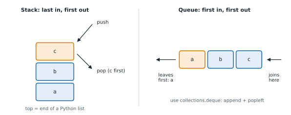

# Lesson 17: Stacks

**You'll learn:** last in first out, lists as stacks, matching brackets, a min stack, reverse Polish notation, shunting-yard, the call stack and recursion.

▶ **Practise this lesson in the [sandbox](https://kishoremadanagopal.github.io/learning/dsa/#stacks)**: run every example and check your exercise answers.

## Key terms

- **Stack:** a collection where you add and remove only at the top: last in, first out.
- **LIFO:** last in, first out.
- **Push / pop / peek:** add to the top / remove the top / look at the top without removing it.
- **Reverse Polish notation (RPN):** writing operators after their operands, like `3 4 +`; no brackets needed.
- **Infix notation:** the usual way of writing expressions, like `3 + 4`.
- **Shunting-yard algorithm:** converts infix expressions to RPN using a stack of operators and precedence rules.
- **Call stack:** the stack of active function calls; each call pushes a frame, each return pops it.
- **Stack frame:** the record of one function call: its local variables and where to return to.

A **stack** is a pile: you add to the top (**push**) and take from the top (**pop**). The last item in is the first out (**LIFO**). That one rule makes stacks perfect whenever the most recent unfinished thing must be dealt with first: the browser's Back button, undo in an editor, matching brackets, and the computer's own record of function calls.



## A Python list is a stack

`append` pushes onto the end and `pop()` removes from the end, both O(1). The end of the list is the top of the stack.

```python
stack = []
stack.append("a")        # push
stack.append("b")
stack.append("c")
print("top:", stack[-1])          # peek without removing
print("pop:", stack.pop())        # c: last in, first out
print("pop:", stack.pop())        # b
print("left:", stack, " empty?", not stack)
```

| Operation | Code | Cost |
|---|---|---|
| push | `stack.append(x)` | O(1) amortised |
| pop | `stack.pop()` | O(1) |
| peek (top) | `stack[-1]` | O(1) |
| is empty? | `not stack` | O(1) |

Never use `pop(0)` / `insert(0, x)` for a stack: those work at the **front** and cost O(n).

## Matching brackets

Every closing bracket must match the **most recent** unmatched opening bracket: exactly what a stack's top holds.

```python
def balanced(text):
    pairs = {")": "(", "]": "[", "}": "{"}
    stack = []
    for ch in text:
        if ch in "([{":
            stack.append(ch)
        elif ch in pairs:
            if not stack or stack.pop() != pairs[ch]:
                return False
    return not stack            # anything left open is unbalanced

for t in ["(a[b]{c})", "(]", "((", "x = {1: [2, 3]}"]:
    print(f"{t!r:20} {balanced(t)}")
```

## A stack that knows its minimum

Design questions often ask for an extra O(1) operation. Store, alongside each item, the minimum **at that point**; popping restores the previous minimum for free.

```python
class MinStack:
    def __init__(self):
        self.items = []              # pairs (value, minimum so far)

    def push(self, x):
        current_min = min(x, self.items[-1][1]) if self.items else x
        self.items.append((x, current_min))

    def pop(self):
        return self.items.pop()[0]

    def top(self):
        return self.items[-1][0]

    def get_min(self):
        return self.items[-1][1]     # O(1): no searching

s = MinStack()
for x in [5, 3, 7, 2]:
    s.push(x)
print(s.get_min())   # 2
s.pop()
print(s.get_min())   # 3 again, after 2 is gone
```

## Evaluating expressions

**Reverse Polish notation** (RPN, or postfix) writes the operator after its two numbers: `3 4 +` means 3 + 4, and `2 3 4 * +` means 2 + 3 × 4. No brackets are ever needed, and a stack evaluates it in one pass: push numbers; on an operator, pop two, apply, push the result.

```python
def eval_rpn(tokens):
    stack = []
    for t in tokens:
        if t in {"+", "-", "*", "/"}:
            b, a = stack.pop(), stack.pop()      # careful: b was pushed last
            if t == "+": stack.append(a + b)
            elif t == "-": stack.append(a - b)
            elif t == "*": stack.append(a * b)
            else: stack.append(int(a / b))       # divide, rounding towards zero
        else:
            stack.append(int(t))
    return stack[0]

print(eval_rpn("2 3 4 * +".split()))          # 2 + 3*4 = 14
print(eval_rpn("5 1 2 + 4 * + 3 -".split()))  # 5 + (1+2)*4 - 3 = 14
```

Turning ordinary **infix** expressions like `2 + 3 * 4` into RPN is done with another stack, in Dijkstra's **shunting-yard** algorithm: numbers go straight to the output; operators wait on a stack until an operator with lower precedence (or a closing bracket) pushes them out. That's how calculators and programming-language parsers handle precedence.

```python
def to_rpn(expression):
    prec = {"+": 1, "-": 1, "*": 2, "/": 2}
    out, ops = [], []
    for tok in expression.replace("(", " ( ").replace(")", " ) ").split():
        if tok.isdigit():
            out.append(tok)
        elif tok in prec:
            while ops and ops[-1] in prec and prec[ops[-1]] >= prec[tok]:
                out.append(ops.pop())            # higher/equal precedence goes first (left to right)
            ops.append(tok)
        elif tok == "(":
            ops.append(tok)
        else:                                    # ")": pop until the matching "("
            while ops[-1] != "(":
                out.append(ops.pop())
            ops.pop()
    while ops:
        out.append(ops.pop())
    return out

print(to_rpn("2 + 3 * 4"))
print(to_rpn("(2 + 3) * 4"))
```

Both are O(n) time and O(n) space for n tokens.

## Recursion runs on a stack

Every function call pushes a **frame** (its local variables and where to return to) onto the **call stack**; returning pops it. That's why very deep recursion raises `RecursionError` in Python (the stack is limited to about 1,000 frames by default), and why any recursive algorithm can be rewritten with an explicit stack. You'll do exactly that for tree and graph traversals in Parts 7 and 8.

```python
def countdown(n):
    if n == 0:
        print("liftoff")
        return
    print("push frame for n =", n)
    countdown(n - 1)
    print("pop frame for n =", n)

countdown(2)
```

## At a glance

| Concept | Approach | Time | Space |
|---|---|---|---|
| Push / pop / peek | list.append / list.pop() / list[-1] | O(1) | O(n) for n items |
| Valid brackets | push openers; a closer must match the popped top | O(n) | O(n) |
| Min stack | store (value, min so far) pairs | O(1) per operation | O(n) |
| Evaluate RPN | push numbers; on an operator pop b, pop a, push a op b | O(n) | O(n) |
| Infix → RPN (shunting-yard) | operator stack ordered by precedence | O(n) | O(n) |
| Recursion → loop | replace the call stack with your own list | same as the recursion | O(depth) |

## Common mistakes

- Using `pop(0)` or `insert(0, x)`, which make a list-based stack O(n).
- Popping from an empty stack without checking first (IndexError).
- Popping operands in the wrong order for `-` and `/`.
- Checking bracket balance by counting, which ignores order and type.

## Exercises

### 1. Valid brackets

Write `is_valid(s)` that returns `True` if every bracket in `s` (any of `()[]{}`, mixed with other characters) is closed by the matching type in the right order, otherwise `False`. Must handle 200,000 characters quickly.

Starter code:

```python
def is_valid(s):
    pass
```

<details>
<summary>🧭 How to approach it</summary>

1. **Understand:** three bracket types, other characters ignored, order matters, an empty string is valid.
2. **Examples:** "{[()]}" → True; "([)]" → False (crossed); "((" → False (unclosed); ")" → False.
3. **Brute force:** repeatedly delete "()", "[]" and "{}" until nothing changes: correct but O(n²).
4. **Pattern:** "most recent unmatched" → **stack**.
5. **Plan:** dict closing → opening; push openers; on a closer, check and pop; return whether the stack is empty.
6. **Code and test:** the empty-stack case on a closer, and leftovers at the end.

</details>

<details>
<summary>💡 Hint 1</summary>

When you meet a closing bracket, which opening bracket must it match?

</details>

<details>
<summary>💡 Hint 2</summary>

It must match the **most recent** opening bracket that's still open: the top of a stack.

</details>

<details>
<summary>💡 Hint 3</summary>

Push opening brackets. On a closing one: if the stack is empty or `stack.pop()` isn't its partner, return False. At the end, the stack must be empty.

</details>

### 2. Evaluate reverse Polish notation

Write `eval_rpn(tokens)` for a list of tokens: integers (as strings, possibly negative like `"-3"`) and the operators `+ - * /`. Division rounds **towards zero** (so `-7 / 2` is `-3`). Return the integer result.

Starter code:

```python
def eval_rpn(tokens):
    pass

print(eval_rpn(["2", "1", "+", "3", "*"]))   # (2 + 1) * 3 = 9
```

<details>
<summary>🧭 How to approach it</summary>

1. **Understand:** postfix order; operands are strings; negative numbers exist; truncating division.
2. **Examples:** 2 1 + 3 * → 9; 3 5 - → −2 (not 2); −7 2 / → −3.
3. **Brute force:** repeatedly find "number number operator" and replace it with its value: O(n²).
4. **Pattern:** "use the most recent results" → **stack**.
5. **Plan:** for each token: operator → pop b, pop a, push a op b; number → push int(token). Return the last value.
6. **Code and test:** check the operand order for − and /, and negative division.

</details>

<details>
<summary>💡 Hint 1</summary>

Read left to right. When you see an operator, which two numbers does it use?

</details>

<details>
<summary>💡 Hint 2</summary>

The two most recent numbers: pop them from a stack, compute, and push the result back.

</details>

<details>
<summary>💡 Hint 3</summary>

Pop `b` first, then `a`, and compute `a op b`. For division use `int(a / b)`, because `//` rounds down (−7 // 2 is −4).

</details>

### 3. A stack with a minimum

Complete `MinStack` with `push(x)`, `pop()`, `top()` and `get_min()`. **Every** method must be O(1): `get_min` can't search the stack.

Starter code:

```python
class MinStack:
    def __init__(self):
        pass

    def push(self, x):
        pass

    def pop(self):
        pass

    def top(self):
        pass

    def get_min(self):
        pass
```

<details>
<summary>🧭 How to approach it</summary>

1. **Understand:** a normal stack plus `get_min`, all in O(1); pops must restore older minimums.
2. **Examples:** push 5, 3, 7: min 3; pop 7: still 3; pop 3: min 5.
3. **Brute force:** `min()` over the list on every `get_min`: O(n).
4. **Pattern:** **store extra state with each item** (precompute instead of search).
5. **Plan:** each entry is (value, min so far); push computes the new min from the previous top's min.
6. **Code and test:** equal values, and the minimum returning after pops.

</details>

<details>
<summary>💡 Hint 1</summary>

`min(self.items)` is O(n). What could you store at push time so the minimum is already known?

</details>

<details>
<summary>💡 Hint 2</summary>

The minimum only changes when you push or pop, and popping must bring back the previous minimum. Store the minimum **at each level** of the stack.

</details>

<details>
<summary>💡 Hint 3</summary>

Push pairs `(x, min(x, previous_min))`. `get_min` returns `self.items[-1][1]`; `pop` just pops.

</details>

**In the sandbox:** exercises 34–36. Press **Check** to run the hidden tests.

### Answers and walkthroughs

Open these only after a real attempt. Each one explains the solution step by step.

<details>
<summary>✅ 1. Valid brackets</summary>

```python
def is_valid(s):
    match = {")": "(", "]": "[", "}": "{"}
    stack = []
    for ch in s:
        if ch in "([{":
            stack.append(ch)                      # remember the opening bracket
        elif ch in match:
            if not stack or stack.pop() != match[ch]:
                return False                      # nothing open, or the wrong type
    return not stack                              # leftovers were never closed
```

**Line by line**

- `match` maps each closing bracket to the opening one it needs.
- Opening brackets are pushed: they're waiting for their partner.
- For a closing bracket, two things can go wrong: nothing is open (`not stack`), or the most recent opener is the wrong type. `stack.pop()` both checks and removes it.
- Characters that aren't brackets fall through both branches and are ignored.
- `return not stack`: anything still on the stack was opened but never closed.

**Trace** on `([)]`:

| ch | action | stack after |
|---|---|---|
| ( | push | ( |
| [ | push | ( [ |
| ) | pop [ but need ( | **return False** |

**Complexity:** O(n) time, O(n) space in the worst case (all openers).

**Common wrong approach:** counting brackets (opens minus closes) only checks totals, so `([)]` and `)(` look valid.

</details>

<details>
<summary>✅ 2. Evaluate reverse Polish notation</summary>

```python
def eval_rpn(tokens):
    stack = []
    for t in tokens:
        if t in ("+", "-", "*", "/"):
            b = stack.pop()              # the second operand was pushed last
            a = stack.pop()
            if t == "+":
                stack.append(a + b)
            elif t == "-":
                stack.append(a - b)
            elif t == "*":
                stack.append(a * b)
            else:
                stack.append(int(a / b)) # int() truncates towards zero; // would floor
        else:
            stack.append(int(t))         # handles "-3" too
    return stack.pop()

print(eval_rpn(["2", "1", "+", "3", "*"]))
```

**Line by line**

- Numbers are pushed. `int("-3")` handles negatives, and checking for operators first means `"-3"` is never mistaken for minus (it isn't exactly `"-"`).
- On an operator, `b = stack.pop()` comes first because `b` was pushed **last**. For `3 5 -`, a = 3 and b = 5, giving −2.
- `int(a / b)` truncates towards zero, as the task requires. Python's `//` floors, which differs for negatives.
- At the end exactly one number remains: the answer.

**Trace** on `4 13 5 / +`:

| token | stack after |
|---|---|
| 4 | 4 |
| 13 | 4 13 |
| 5 | 4 13 5 |
| / | 4 2 (13 / 5 → 2) |
| + | 6 |

**Complexity:** O(n) time, O(n) space.

**Common wrong approach:** popping as `a, b = stack.pop(), stack.pop()`, which swaps the operands, so `3 5 -` gives 2.

</details>

<details>
<summary>✅ 3. A stack with a minimum</summary>

```python
class MinStack:
    def __init__(self):
        self.items = []                         # pairs: (value, minimum including this value)

    def push(self, x):
        smallest = min(x, self.items[-1][1]) if self.items else x
        self.items.append((x, smallest))

    def pop(self):
        self.items.pop()

    def top(self):
        return self.items[-1][0]

    def get_min(self):
        return self.items[-1][1]
```

**Line by line**

- Each stack entry carries the minimum of itself and everything below it.
- `push` needs only the previous entry's minimum: `min(x, self.items[-1][1])`, or `x` if the stack is empty.
- `pop` removes the top pair; the entry now on top already holds the correct minimum for the smaller stack, so nothing else needs updating.
- `top` and `get_min` read the top pair.

**Trace** pushing 5, 3, 7, then popping:

| operation | stack (value, min) | get_min |
|---|---|---|
| push 5 | (5,5) | 5 |
| push 3 | (5,5) (3,3) | 3 |
| push 7 | (5,5) (3,3) (7,3) | 3 |
| pop | (5,5) (3,3) | 3 |
| pop | (5,5) | 5 |

**Complexity:** O(1) per operation, O(n) space (one extra number per item).

**Common wrong approach:** keeping a single `self.min` variable: it can't be restored after the minimum is popped.

</details>

## Quick quiz

1. A stack returns items in which order?
   - A) Last in, first out
   - B) First in, first out
   - C) Smallest first

2. Which list operations make a Python list an O(1) stack?
   - A) append and pop()
   - B) insert(0, x) and pop(0)
   - C) append and pop(0)

3. Why does `3 5 -` in RPN give -2?
   - A) The first popped number (5) is the second operand: 3 - 5
   - B) Minus always gives a negative answer
   - C) RPN subtracts in reverse

4. What causes Python's RecursionError?
   - A) Too many nested calls: each one pushes a frame onto the limited call stack
   - B) Using a list as a stack
   - C) Returning None

<details>
<summary>Quiz answers</summary>

1. **A) Last in, first out**: You always take from the top: the most recently added item.
2. **A) append and pop()**: Both work at the end of the list. Working at the front is O(n).
3. **A) The first popped number (5) is the second operand: 3 - 5**: Pop b first, then a, and compute a - b.
4. **A) Too many nested calls: each one pushes a frame onto the limited call stack**: The call stack is about 1,000 frames by default; deep recursion overflows it.

</details>

---
Previous: [Lesson 16](16-linked-list-patterns.md) · Next: [Lesson 18: Monotonic stacks: next greater element](18-monotonic-stack.md)
