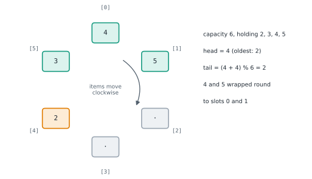
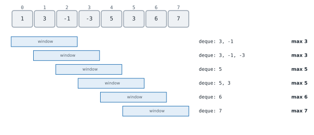

# Lesson 19: Queues, circular buffers and deques

**You'll learn:** first in first out, collections.deque, why not list.pop(0), bounded deques, circular buffers, a queue from two stacks, amortised O(1), the monotonic deque, other kinds of queue.

▶ **Practise this lesson in the [sandbox](https://kishoremadanagopal.github.io/learning/dsa/#queues-deques)**: run every example and check your exercise answers.

## Key terms

- **Queue:** a collection where items join at the back and leave from the front: first in, first out.
- **FIFO:** first in, first out.
- **Enqueue / dequeue:** add at the back / remove from the front.
- **Deque:** a double-ended queue: O(1) adds and removes at both ends (`collections.deque`).
- **Circular (ring) buffer:** a fixed-size array used as a queue, with indexes that wrap around using `%`.
- **Monotonic deque:** a deque kept in increasing or decreasing order, used for sliding-window maximums or minimums.
- **Priority queue:** a queue that always serves the smallest (or most urgent) item first.
- **Producer / consumer:** one part of a program adds work to a queue while another takes it off.

A **queue** is a line at a shop: people join at the back (**enqueue**) and leave from the front (**dequeue**). First in, first out (**FIFO**). Queues appear whenever things must be handled in arrival order: print jobs, web requests, messages between programs, and breadth-first search (Part 8), which explores a graph level by level.

## Don't use a list as a queue

`list.pop(0)` removes the front item, but then every other item shifts left: O(n). Python's `collections.deque` (a **double-ended queue**, said "deck") adds and removes at **both** ends in O(1).

```python
from collections import deque
import time

n = 20_000
items = list(range(n))
t = time.perf_counter()
while items:
    items.pop(0)                  # shifts everything each time: O(n) per pop
list_time = time.perf_counter() - t

q = deque(range(n))
t = time.perf_counter()
while q:
    q.popleft()                   # O(1) per pop
deque_time = time.perf_counter() - t
print(f"list.pop(0): {list_time:.3f} s   deque.popleft(): {deque_time:.3f} s")
```

| Operation | `deque` | `list` |
|---|---|---|
| `append(x)` / `pop()` (right end) | O(1) | O(1) |
| `appendleft(x)` / `popleft()` (left end) | **O(1)** | O(n) |
| `q[0]`, `q[-1]` (peek at the ends) | O(1) | O(1) |
| `q[i]` in the middle | O(n) | O(1) |
| `deque(maxlen=k)` | keeps only the last k items | — |

```python
from collections import deque

q = deque()
q.append("Ana"); q.append("Ben"); q.append("Cy")   # join at the back
print("served:", q.popleft())                      # Ana: first in, first out
print("next up:", q[0], " waiting:", list(q))

recent = deque(maxlen=3)                           # a bounded deque drops the oldest automatically
for page in ["home", "news", "sport", "weather", "home"]:
    recent.append(page)
print("last 3 pages:", list(recent))
```

## A circular buffer (ring buffer)

With a fixed capacity, you can build a queue on a plain array: two indexes (head and size) move forward and **wrap around** to 0 with `%`. No shifting, no growing: every operation is O(1). Audio players, network cards and logging systems use ring buffers because their memory never changes size.



```python
class RingBuffer:
    def __init__(self, capacity):
        self.data = [None] * capacity
        self.head = 0                    # index of the oldest item
        self.size = 0

    def enqueue(self, x):
        if self.size == len(self.data):
            raise OverflowError("buffer full")
        tail = (self.head + self.size) % len(self.data)   # wrap around
        self.data[tail] = x
        self.size += 1

    def dequeue(self):
        if self.size == 0:
            raise IndexError("buffer empty")
        x = self.data[self.head]
        self.head = (self.head + 1) % len(self.data)
        self.size -= 1
        return x

rb = RingBuffer(3)
rb.enqueue(1); rb.enqueue(2); rb.enqueue(3)
print(rb.dequeue(), rb.dequeue())     # 1 2
rb.enqueue(4); rb.enqueue(5)          # these wrap round into slots 0 and 1
print(rb.data, "->", rb.dequeue(), rb.dequeue(), rb.dequeue())
```

## A queue from two stacks

An interview classic, and a nice example of **amortised** cost. Push onto an `inbox` stack. To dequeue, take from an `outbox` stack; only when the outbox is empty, pour the whole inbox into it, which reverses the order so the oldest item ends up on top.

```python
class TwoStackQueue:
    def __init__(self):
        self.inbox, self.outbox = [], []

    def enqueue(self, x):
        self.inbox.append(x)                      # O(1)

    def dequeue(self):
        if not self.outbox:                       # only when empty...
            while self.inbox:                     # ...move everything once
                self.outbox.append(self.inbox.pop())
        return self.outbox.pop()

q = TwoStackQueue()
for x in [1, 2, 3]:
    q.enqueue(x)
print(q.dequeue())          # 1
q.enqueue(4)
print(q.dequeue(), q.dequeue(), q.dequeue())   # 2 3 4
```

A single dequeue can cost O(n) when it pours, but each item is moved from inbox to outbox **at most once**, so n operations cost O(n) in total: **amortised O(1)** each.

## Sliding window maximum: the monotonic deque

"The maximum of every window of k consecutive numbers." Recomputing `max(window)` is O(k) per window, O(n·k) in total. A deque of indexes, kept in **decreasing** order of value, does it in O(n):

- Before adding index `i`, pop from the **back** every index whose value is ≤ the new value: they can never be a maximum again while the new, larger value is in the window.
- Pop from the **front** if that index has slid out of the window.
- The front is always the current window's maximum.



```python
from collections import deque

def window_max(nums, k):
    dq, out = deque(), []                 # indexes; their values decrease front -> back
    for i, x in enumerate(nums):
        while dq and nums[dq[-1]] <= x:   # smaller values behind x can never win again
            dq.pop()
        dq.append(i)
        if dq[0] <= i - k:                # the front has left the window
            dq.popleft()
        if i >= k - 1:
            out.append(nums[dq[0]])
    return out

print(window_max([1, 3, -1, -3, 5, 3, 6, 7], 3))
```

Same amortised argument as the monotonic stack: each index enters and leaves the deque at most once.

## Other queues you'll meet

- **Priority queue:** always serves the smallest (or most urgent) item first, not the oldest. Built on a heap with `heapq` (Lesson 32).
- **`queue.Queue`:** a thread-safe queue for passing work between threads (producer and consumer). It locks internally, so it's slower than `deque` for single-threaded code.
- **Message queues** (Kafka, RabbitMQ, cloud queues): the same FIFO idea between whole programs and servers.

## At a glance

| Concept | Approach | Time | Space |
|---|---|---|---|
| Enqueue / dequeue | deque.append / deque.popleft | O(1) | O(n) |
| Keep only the last k items | deque(maxlen=k) | O(1) per append | O(k) |
| Circular buffer | array + head + size, indexes wrap with % | O(1) per operation | O(capacity) |
| Queue from two stacks | push to inbox; pour into outbox only when it's empty | amortised O(1) | O(n) |
| Sliding window maximum | deque of indexes with decreasing values | O(n) | O(k) |

## Common mistakes

- Using `list.pop(0)` as dequeue: O(n) per call.
- Indexing into the middle of a deque in a loop: `q[i]` is O(n) for a deque.
- Pouring a two-stack queue back and forth on every operation.
- Storing values instead of indexes in a sliding-window deque, so expired items can't be detected.

## Exercises

### 1. A queue from two stacks

Complete `MyQueue` using **only two Python lists used as stacks** (append, pop, `[-1]`, len) with `push(x)`, `pop()` (remove and return the front), `peek()` (return the front) and `empty()`. Each operation must be amortised O(1): 100,000 operations in well under a second.

Starter code:

```python
class MyQueue:
    def __init__(self):
        self.inbox = []
        self.outbox = []

    def push(self, x):
        pass

    def pop(self):
        pass

    def peek(self):
        pass

    def empty(self):
        pass
```

<details>
<summary>🧭 How to approach it</summary>

1. **Understand:** FIFO behaviour using only stack operations; amortised O(1).
2. **Examples:** push 1, push 2, pop → 1; push 3; pop → 2; pop → 3.
3. **Brute force:** pour everything to the other stack and back on every pop: O(n) per operation.
4. **Pattern:** **two stacks reverse order**, with lazy transfer for **amortised O(1)**.
5. **Plan:** inbox for pushes; outbox for pops/peeks; refill the outbox only when it's empty.
6. **Code and test:** pushes in between pops must keep FIFO order.

</details>

<details>
<summary>💡 Hint 1</summary>

A stack gives you the **newest** item; a queue needs the **oldest**. What happens to the order if you pour one stack into another?

</details>

<details>
<summary>💡 Hint 2</summary>

Pouring reverses the order, so the oldest ends up on top of the outbox. Pour only when the outbox is **empty**, and never pour back.

</details>

<details>
<summary>💡 Hint 3</summary>

`push` appends to inbox. `pop`/`peek`: if outbox is empty, move everything from inbox to outbox; then use `outbox.pop()` / `outbox[-1]`. `empty`: both lists empty.

</details>

### 2. Sliding window maximum

Write `window_max(nums, k)` returning the maximum of every window of `k` consecutive numbers (there are `len(nums) - k + 1` windows; assume `1 <= k <= len(nums)`). Must handle 100,000 numbers with large windows.

Starter code:

```python
from collections import deque

def window_max(nums, k):
    pass

print(window_max([1, 3, -1, -3, 5, 3, 6, 7], 3))   # [3, 3, 5, 5, 6, 7]
```

<details>
<summary>🧭 How to approach it</summary>

1. **Understand:** n − k + 1 windows; the max of each; negatives and repeats allowed.
2. **Examples:** [1, 3, −1, −3, 5, 3, 6, 7], k = 3 → [3, 3, 5, 5, 6, 7].
3. **Brute force:** `max` of every slice: O(n·k), too slow when k is large.
4. **Pattern:** sliding window + "biggest so far, with expiry" → **monotonic deque**.
5. **Plan:** deque of indexes, values decreasing; push new, drop dominated ones from the back, expired from the front; read the front.
6. **Code and test:** decreasing and increasing input, equal values, k equal to the length.

</details>

<details>
<summary>💡 Hint 1</summary>

When a new, bigger number enters the window, can any smaller number before it ever be a window's maximum again?

</details>

<details>
<summary>💡 Hint 2</summary>

No, so throw those away. Keep a deque of **indexes** whose values decrease from front to back; the front is always the maximum.

</details>

<details>
<summary>💡 Hint 3</summary>

For each `i, x`: pop from the back while the back's value ≤ x; append i; if the front index ≤ i − k, popleft; once i ≥ k − 1, record nums[dq[0]].

</details>

**In the sandbox:** exercises 39–40. Press **Check** to run the hidden tests.

### Answers and walkthroughs

Open these only after a real attempt. Each one explains the solution step by step.

<details>
<summary>✅ 1. A queue from two stacks</summary>

```python
class MyQueue:
    def __init__(self):
        self.inbox = []     # new items are pushed here
        self.outbox = []    # items come out from here, oldest on top

    def _refill(self):
        if not self.outbox:                       # only when the outbox runs dry
            while self.inbox:
                self.outbox.append(self.inbox.pop())

    def push(self, x):
        self.inbox.append(x)

    def pop(self):
        self._refill()
        return self.outbox.pop()

    def peek(self):
        self._refill()
        return self.outbox[-1]

    def empty(self):
        return not self.inbox and not self.outbox
```

**Line by line**

- `push` is a plain append to `inbox`: O(1).
- `_refill` runs only when `outbox` is empty. Popping everything from `inbox` onto `outbox` reverses it, so the oldest item ends up on top of `outbox`.
- New pushes while `outbox` still has items go to `inbox` and wait. They're newer than everything in `outbox`, so serving `outbox` first keeps the order right.
- `empty` must check both lists.

**Trace:**

| operation | inbox | outbox | returns |
|---|---|---|---|
| push 1, push 2 | 1 2 | — | |
| pop | — | 2 1 → pop 1 → 2 | 1 |
| push 3 | 3 | 2 | |
| pop | 3 | — | 2 |
| pop | — (poured) | 3 → pop | 3 |

**Complexity:** amortised O(1) per operation (each item is pushed twice and popped twice in total), O(n) space.

**Common wrong approach:** pouring back into `inbox` after every pop (the "slow" version), which makes each pop O(n) and the whole sequence O(n²).

</details>

<details>
<summary>✅ 2. Sliding window maximum</summary>

```python
from collections import deque

def window_max(nums, k):
    dq = deque()                       # indexes; nums[dq] decreases from front to back
    out = []
    for i, x in enumerate(nums):
        while dq and nums[dq[-1]] <= x:
            dq.pop()                   # can never be a maximum while x is in the window
        dq.append(i)
        if dq[0] <= i - k:             # the front index has slid out of the window
            dq.popleft()
        if i >= k - 1:                 # the first full window ends at index k - 1
            out.append(nums[dq[0]])
    return out

print(window_max([1, 3, -1, -3, 5, 3, 6, 7], 3))
```

**Line by line**

- The deque holds **indexes**, because we must know when the front has left the window.
- `while dq and nums[dq[-1]] <= x: dq.pop()`: a value that's smaller and older than `x` leaves the window before `x` does, so it can never be the maximum. Popping it keeps the deque decreasing.
- `if dq[0] <= i - k`: the window is now `i-k+1 .. i`, so index `i - k` and older are out. At most one index expires per step.
- `if i >= k - 1`: from the first full window onward, the front is the maximum.

**Trace** on [1, 3, −1, −3, 5], k = 3:

| i | x | deque (values) after | window max |
|---|---|---|---|
| 0 | 1 | 1 | — |
| 1 | 3 | 3 (1 popped) | — |
| 2 | −1 | 3 −1 | 3 |
| 3 | −3 | 3 −1 −3 | 3 |
| 4 | 5 | 5 (all popped; 3 had expired anyway) | 5 |

**Complexity:** O(n) time (each index is added and removed at most once), O(k) space.

**Common wrong approach:** storing values instead of indexes, which gives no way to tell when the maximum has slid out of the window.

</details>

## Quick quiz

1. Why is `list.pop(0)` a bad way to dequeue?
   - A) Every remaining item shifts left, so it's O(n) per call
   - B) It removes the last item instead
   - C) It only works on sorted lists

2. In a circular buffer, how does the tail index wrap from the last slot to the first?
   - A) (head + size) % capacity
   - B) It's reset by copying the array
   - C) The buffer grows instead

3. A queue built from two stacks has one dequeue that costs O(n). Why is it still called O(1)?
   - A) Each item is moved between the stacks at most once, so n operations cost O(n) in total: amortised O(1)
   - B) Because n is always small
   - C) Because Python lists are fast

4. In the sliding-window-maximum deque, why can a smaller value be removed when a larger one arrives?
   - A) It will leave the window before the larger value does, so it can never be the maximum
   - B) Smaller values are never needed in any problem
   - C) Deques can only hold decreasing values

<details>
<summary>Quiz answers</summary>

1. **A) Every remaining item shifts left, so it's O(n) per call**: Use collections.deque and popleft(), which is O(1).
2. **A) (head + size) % capacity**: The modulo makes indexes go round the ring with no shifting.
3. **A) Each item is moved between the stacks at most once, so n operations cost O(n) in total: amortised O(1)**: Amortised analysis averages the rare expensive step over all the cheap ones.
4. **A) It will leave the window before the larger value does, so it can never be the maximum**: The newer, larger value dominates it for every future window that contains it.

</details>

---
Previous: [Lesson 18](18-monotonic-stack.md) · Next: [Lesson 20: Designing a data structure: the LRU cache](20-lru-cache.md)
