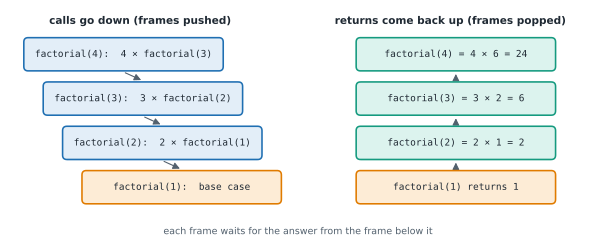
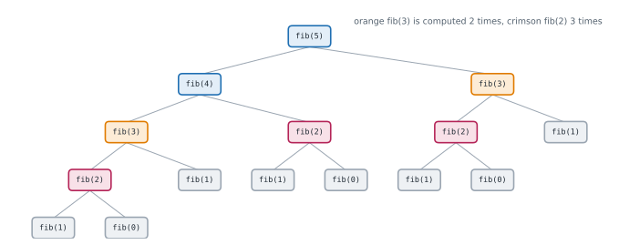

# Lesson 21: Recursion and recursion trees

**You'll learn:** base and recursive cases, the call stack, the leap of faith, recursion on nested data, recursion trees, memoisation, recursion limits and when to use a loop, the Tower of Hanoi.

▶ **Practise this lesson in the [sandbox](https://kishoremadanagopal.github.io/learning/dsa/#recursion)**: run every example and check your exercise answers.

## Key terms

- **Recursion:** a function solving a problem by calling itself on smaller versions of it.
- **Base case:** an input small enough to answer directly, which stops the recursion.
- **Recursive case:** the part that breaks the problem down and makes the recursive calls.
- **Leap of faith:** assuming the function already works on smaller inputs while writing it.
- **Recursion tree:** a drawing of every call as a node, with its recursive calls as children.
- **Recursion depth:** how many calls are waiting on the stack at once; it decides the stack space.
- **Memoisation:** storing each result the first time it's computed and reusing it.
- **Tail call:** a recursive call that is the very last thing a function does; Python doesn't optimise these.
- **RecursionError:** Python's error when the call stack goes deeper than its limit (about 1,000 by default).

A **recursive** function solves a problem by calling itself on a **smaller** version of the same problem. Every recursive function has two parts:

- a **base case**: an input so small the answer is obvious, returned directly (no further calls);
- a **recursive case**: break the problem into smaller pieces, call the function on them, and combine their answers.

```python
def factorial(n):
    if n <= 1:                    # base case: 0! = 1! = 1
        return 1
    return n * factorial(n - 1)   # recursive case: n! = n × (n-1)!

print(factorial(5))
```

## What actually happens: the call stack

Each call gets its own **frame** on the call stack (Lesson 17) with its own `n`. Calls pile up until a base case returns; then the frames finish in reverse order, each using the answer from the call above it.



```python
def factorial(n, depth=0):
    pad = "  " * depth
    print(f"{pad}factorial({n}) called")
    if n <= 1:
        print(f"{pad}base case -> 1")
        return 1
    result = n * factorial(n - 1, depth + 1)
    print(f"{pad}factorial({n}) returns {result}")
    return result

factorial(4)
```

## The leap of faith

When writing a recursive function, **don't** trace every level in your head. Instead:

1. Handle the base case.
2. **Assume** the function already works for any smaller input (that's the "leap of faith").
3. Use that smaller answer to build the answer for the current input.

For "sum of a list": assume `total(rest)` is correct; then `total(nums) = nums[0] + total(nums[1:])`. That's the whole function.

```python
def total(nums):
    if not nums:                     # base case: an empty list sums to 0
        return 0
    return nums[0] + total(nums[1:]) # trust that total() works on the rest

def reverse(s):
    if len(s) <= 1:
        return s
    return reverse(s[1:]) + s[0]

def is_palindrome(s):
    if len(s) <= 1:
        return True
    return s[0] == s[-1] and is_palindrome(s[1:-1])

print(total([3, 1, 4, 1, 5]), reverse("stack"), is_palindrome("racecar"))
```

(These slice-based versions copy the list or string at every level, so they're O(n²) overall; passing an index instead of slicing makes them O(n). Here they show the idea.)

## Where recursion shines: nested structures

Recursion is the natural fit for data that contains smaller copies of itself: folders inside folders, nested lists, JSON, trees and graphs (Parts 7 and 8).

```python
def count_files(folder):
    """folder: a dict whose values are either a file size (int) or another folder (dict)."""
    count = 0
    for name, item in folder.items():
        if isinstance(item, dict):
            count += count_files(item)     # a subfolder: same problem, smaller
        else:
            count += 1
    return count

drive = {"cv.pdf": 120, "photos": {"a.jpg": 900, "b.jpg": 850, "2025": {"c.jpg": 700}}, "notes.txt": 4}
print(count_files(drive))
```

## Measuring cost with a recursion tree

Draw each call as a node and its recursive calls as children. Then:

- **time** = (number of calls) × (work per call, not counting the recursive calls);
- **space** = the **depth** of the tree (the longest chain of calls waiting on the stack), plus any data each frame keeps.

Factorial makes one call per level: n calls, O(n) time, O(n) stack space. Now look at naive Fibonacci, where each call makes **two**:

```python
calls = 0

def fib(n):
    global calls
    calls += 1
    if n < 2:
        return n
    return fib(n - 1) + fib(n - 2)

for n in [10, 20, 25]:
    calls = 0
    print(f"fib({n}) = {fib(n):>6}   calls: {calls:,}")
```



The tree roughly doubles at each level, so the number of calls grows exponentially, about O(1.6ⁿ) (often written loosely as O(2ⁿ)). fib(40) would take over 300 million calls. The tree also shows **why**: the same subproblems (fib(3), fib(2)…) are solved again and again.

## The first fix: memoisation

Remember each answer the first time it's computed and reuse it. Now each fib(k) is computed once: O(n) time, O(n) space. This idea, **recursion + memo**, is the doorway to dynamic programming (Part 9).

```python
from functools import cache

@cache
def fib(n):
    return n if n < 2 else fib(n - 1) + fib(n - 2)

print(fib(80))

def fib_memo(n, memo=None):          # the same thing by hand, with a dict
    memo = {} if memo is None else memo
    if n < 2:
        return n
    if n not in memo:
        memo[n] = fib_memo(n - 1, memo) + fib_memo(n - 2, memo)
    return memo[n]

print(fib_memo(80))
```

## Recursion or a loop?

- Python limits recursion depth to about 1,000 frames (`sys.getrecursionlimit()`), and each call is slower than a loop iteration. Python does **not** optimise tail calls, so even "tail-recursive" functions use one frame per call.
- So: when the depth could be large (a linked list of 100,000 nodes, counting down from a million), use a loop.
- Use recursion when the problem is naturally recursive and the depth stays modest: trees (depth ~ log n when balanced), nested data, divide and conquer, backtracking.
- `sys.setrecursionlimit(10_000)` raises the limit, but going too deep can crash the interpreter. Prefer rewriting with an explicit stack.

```python
import sys

print("limit:", sys.getrecursionlimit())

def depth(n):
    return 0 if n == 0 else 1 + depth(n - 1)

try:
    depth(5000)
except RecursionError as e:
    print("RecursionError:", e)

def depth_loop(n):                 # the same computation with a loop: no limit
    d = 0
    while n:
        n, d = n - 1, d + 1
    return d

print(depth_loop(5000))
```

## A classic: the Tower of Hanoi

Move n disks from peg A to peg C, one at a time, never putting a bigger disk on a smaller one. The recursive insight: to move n disks, move the top n − 1 out of the way to B, move the biggest to C, then move the n − 1 from B onto it.

```python
def hanoi(n, source, spare, target, moves):
    if n == 0:
        return
    hanoi(n - 1, source, target, spare, moves)    # clear the top n-1 onto the spare peg
    moves.append((source, target))                # move the biggest disk
    hanoi(n - 1, spare, source, target, moves)    # put the n-1 back on top of it

moves = []
hanoi(3, "A", "B", "C", moves)
print(len(moves), "moves:", moves)
```

The number of moves is 2ⁿ − 1: T(n) = 2·T(n − 1) + 1. Each extra disk doubles the work.

EOF
echo ok

## At a glance

| Concept | Approach | Time | Space |
|---|---|---|---|
| Factorial | n × factorial(n − 1), base case n ≤ 1 | O(n) | O(n) stack |
| Sum / reverse / palindrome by recursion | handle one item, recurse on the rest | O(n) with indexes (O(n²) with slicing) | O(n) stack |
| Nested data (folders, nested lists) | recurse into each sub-container | O(total items) | O(depth) |
| Naive Fibonacci | fib(n − 1) + fib(n − 2) | O(2ⁿ) (about 1.6ⁿ) | O(n) |
| Memoised Fibonacci | cache each fib(k) | O(n) | O(n) |
| Tower of Hanoi | move n − 1, move 1, move n − 1 | O(2ⁿ) moves | O(n) stack |
| Flatten a nested list | extend with flatten(sub-list), append numbers | O(n) | O(depth) |

## Common mistakes

- A base case that some inputs never reach (for example, n going negative).
- Forgetting to `return` the recursive result.
- Recursing on very long linked lists or big counts, past Python's recursion limit.
- Slicing lists or strings at every level without realising it adds O(n) work per call.

## Exercises

### 1. Flatten a nested list

Write `flatten(items)` that takes a list which may contain numbers and other lists (nested to any depth) and returns one flat list of all the numbers, in order.

Starter code:

```python
def flatten(items):
    pass

print(flatten([1, [2, [3, 4]], 5]))   # [1, 2, 3, 4, 5]
```

<details>
<summary>🧭 How to approach it</summary>

1. **Understand:** any nesting depth; keep the left-to-right order; empty lists contribute nothing.
2. **Examples:** [1, [2, [3, 4]], 5] → [1, 2, 3, 4, 5]; [[], [1, []]] → [1].
3. **Brute force:** loops can only handle a fixed depth: you'd need one loop per level.
4. **Pattern:** a structure that contains smaller copies of itself → **recursion**.
5. **Plan:** for each item: a list → flatten it recursively and extend; a number → append.
6. **Code and test:** empty lists inside, deep nesting, already flat.

</details>

<details>
<summary>💡 Hint 1</summary>

Each item is either a number or a list. What should you do with a list item?

</details>

<details>
<summary>💡 Hint 2</summary>

A list item is the same problem, only smaller: flatten it with a recursive call and add all of its results.

</details>

<details>
<summary>💡 Hint 3</summary>

Loop over `items`; if `isinstance(item, list)`, `flat.extend(flatten(item))`; otherwise `flat.append(item)`. Return `flat`.

</details>

### 2. Tower of Hanoi

Write `hanoi_moves(n)` returning the list of moves, as `(from_peg, to_peg)` pairs using pegs `"A"`, `"B"`, `"C"`, that move `n` disks from `"A"` to `"C"` following the rules. For `n = 0` return `[]`.

Starter code:

```python
def hanoi_moves(n):
    pass

print(hanoi_moves(2))   # [('A', 'B'), ('A', 'C'), ('B', 'C')]
```

<details>
<summary>🧭 How to approach it</summary>

1. **Understand:** one disk at a time; never a larger disk on a smaller one; the shortest sequence (2ⁿ − 1 moves).
2. **Examples:** n = 1 → [A→C]; n = 2 → [A→B, A→C, B→C].
3. **Brute force:** searching all sequences of moves is hopeless: the number of possible sequences explodes.
4. **Pattern:** a problem defined in terms of a smaller copy → **recursion** with a leap of faith.
5. **Plan:** move(k, src, spare, dst): move k − 1 src → spare; record src → dst; move k − 1 spare → dst.
6. **Code and test:** n = 0, 1, 2; check the count 2ⁿ − 1.

</details>

<details>
<summary>💡 Hint 1</summary>

To move the **biggest** disk from A to C, where must the other n − 1 disks be?

</details>

<details>
<summary>💡 Hint 2</summary>

They must all be on B. So: move n − 1 disks A → B (using C as the spare), move the biggest A → C, then move n − 1 disks B → C (using A as the spare).

</details>

<details>
<summary>💡 Hint 3</summary>

Write a helper `move(k, source, spare, target)` that appends to a shared `moves` list; the base case `k == 0` does nothing. Call `move(n, "A", "B", "C")`.

</details>

**In the sandbox:** exercises 42–43. Press **Check** to run the hidden tests.

### Answers and walkthroughs

Open these only after a real attempt. Each one explains the solution step by step.

<details>
<summary>✅ 1. Flatten a nested list</summary>

```python
def flatten(items):
    flat = []
    for item in items:
        if isinstance(item, list):
            flat.extend(flatten(item))   # a smaller copy of the same problem
        else:
            flat.append(item)            # base case: a plain number
    return flat

print(flatten([1, [2, [3, 4]], 5]))
```

**Line by line**

- The loop visits the items left to right, so the order is kept.
- `isinstance(item, list)` decides which case we're in.
- For a list, the leap of faith: `flatten(item)` returns that sub-list's numbers, already flat; `extend` adds them all.
- A number is the base case: it's added as it is.
- An empty list simply loops zero times and returns `[]`.

**Trace** on `[1, [2, [3]]]`:

| call | item | action | returns |
|---|---|---|---|
| flatten([1, [2, [3]]]) | 1 | append | |
| | [2, [3]] | recurse ↓ | |
| flatten([2, [3]]) | 2 | append | |
| | [3] | recurse ↓ | |
| flatten([3]) | 3 | append | [3] |
| back in flatten([2, [3]]) | | extend with [3] | [2, 3] |
| back at the top | | extend with [2, 3] | [1, 2, 3] |

**Complexity:** O(n + d) time where n is the number of values and d the number of lists, O(depth) stack space (plus the output list).

**Common wrong approach:** `flat.append(flatten(item))` adds the flattened list as one item, giving `[1, [2, 3]]`.

</details>

<details>
<summary>✅ 2. Tower of Hanoi</summary>

```python
def hanoi_moves(n):
    moves = []

    def move(k, source, spare, target):
        if k == 0:
            return                              # base case: nothing to move
        move(k - 1, source, target, spare)      # top k-1 disks out of the way
        moves.append((source, target))          # the biggest of the k disks
        move(k - 1, spare, source, target)      # the k-1 disks back on top

    move(n, "A", "B", "C")
    return moves

print(hanoi_moves(2))
```

**Line by line**

- `moves` lives in the outer function; the inner helper appends to it, so every call shares the same list.
- The helper's parameters say **which peg plays which role** at this level. Swapping the roles in the two recursive calls is the whole trick.
- Leap of faith: assume `move(k - 1, ...)` correctly moves k − 1 disks between any two pegs. Then moving k disks takes: k − 1 out of the way, one big move, k − 1 back.

**Trace** of `hanoi_moves(2)`:

| call | action |
|---|---|
| move(2, A, B, C) | first: move(1, A, C, B) |
| move(1, A, C, B) | move(0) does nothing; record **A→B**; move(0) |
| move(2, A, B, C) | record **A→C** |
| move(2, A, B, C) | then: move(1, B, A, C) → record **B→C** |

**Complexity:** O(2ⁿ) time (there are 2ⁿ − 1 moves to output), O(n) stack space.

**Common wrong approach:** keeping the same peg roles in both recursive calls, which tries to put the small disks where the big disk needs to go.

</details>

## Quick quiz

1. What must every recursive function have to avoid running forever?
   - A) A base case that returns without recursing, reached by making the input smaller each call
   - B) A global variable
   - C) A loop

2. Naive recursive Fibonacci is slow because:
   - A) It solves the same smaller problems again and again, so the call tree grows exponentially
   - B) Python can't add large numbers
   - C) Recursion is always slower than loops by a factor of 1000

3. What decides the stack space of a recursive function?
   - A) The maximum depth of calls waiting at once
   - B) The total number of calls
   - C) The size of the output

4. Why prefer a loop over recursion for walking a 100,000-node linked list in Python?
   - A) The recursion would need 100,000 frames, far past Python's limit of about 1,000
   - B) Loops give different answers
   - C) Recursion can't use linked lists

<details>
<summary>Quiz answers</summary>

1. **A) A base case that returns without recursing, reached by making the input smaller each call**: Without a base case that every path eventually reaches, the calls never stop (RecursionError in Python).
2. **A) It solves the same smaller problems again and again, so the call tree grows exponentially**: The recursion tree repeats fib(3), fib(2)... Memoisation removes the repeats.
3. **A) The maximum depth of calls waiting at once**: Only one path of the tree is on the stack at a time.
4. **A) The recursion would need 100,000 frames, far past Python's limit of about 1,000**: Python has no tail-call optimisation, so deep recursion overflows the call stack.

</details>

---
Previous: [Lesson 20](20-lru-cache.md) · Next: [Lesson 22: Divide and conquer](22-divide-and-conquer.md)
