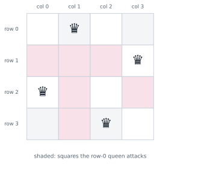

# Lesson 23: Backtracking: subsets, permutations, N-Queens

**You'll learn:** the choose-explore-unchoose template, subsets, permutations, combinations, itertools, N-Queens with sets, a Sudoku solver, word search, pruning, recognising backtracking problems.

▶ **Practise this lesson in the [sandbox](https://kishoremadanagopal.github.io/learning/dsa/#backtracking)**: run every example and check your exercise answers.

## Key terms

- **Backtracking:** building candidates one choice at a time and undoing choices that can't lead to a solution.
- **Decision tree:** the tree of all choices; backtracking explores it depth first.
- **Pruning:** skipping a branch as soon as it can't lead to a valid answer.
- **Subset:** any selection of items, including none and all; n items have 2ⁿ subsets.
- **Permutation:** an ordering of items; n items have n! permutations.
- **Combination:** a selection where order doesn't matter; choosing k of n gives C(n, k).
- **N-Queens:** placing n queens on an n × n board so none attack each other.
- **itertools:** Python's module with fast permutations, combinations and product.

Some questions ask for **every** solution, or for **any** arrangement satisfying rules: all subsets, all orderings, a valid Sudoku, a way to place queens. **Backtracking** builds a candidate one choice at a time; as soon as a partial candidate can't possibly work, it **undoes** the last choice and tries the next option. It's depth-first search over a tree of decisions.

![The decision tree for the subsets of [1, 2, 3]. At each level we decide whether to include one number: include 1 or not, then 2, then 3. The eight leaves are the eight subsets, from [1, 2, 3] down to []. Backtracking walks this tree depth first](../figures/backtracking-tree.svg)

## The template: choose, explore, unchoose

```python
def backtrack(path, choices):
    if is_complete(path):
        record(path)
        return
    for choice in choices:
        if not valid(path, choice):   # pruning: skip choices that can't lead anywhere
            continue
        path.append(choice)           # choose
        backtrack(path, ...)          # explore
        path.pop()                    # unchoose: undo, so the next choice starts clean
```

The `path.pop()` is what makes it **back**tracking: one shared list is reused for every candidate instead of copying it at each step. Record a **copy** (`path[:]`) when you save a solution, or later pops will empty it.

## Subsets: include or skip each item

```python
def subsets(nums):
    result, path = [], []

    def go(i):
        if i == len(nums):
            result.append(path[:])       # a copy!
            return
        path.append(nums[i])             # choose: include nums[i]
        go(i + 1)
        path.pop()                       # unchoose
        go(i + 1)                        # skip nums[i]

    go(0)
    return result

print(subsets([1, 2, 3]))
```

n items give 2ⁿ subsets, each up to n long: **O(n · 2ⁿ)** time. No algorithm can be faster than the size of its output.

## Permutations: every ordering

At each position, try every number not used yet.

```python
def permutations(nums):
    result, path, used = [], [], [False] * len(nums)

    def go():
        if len(path) == len(nums):
            result.append(path[:])
            return
        for i, x in enumerate(nums):
            if used[i]:
                continue
            used[i] = True; path.append(x)       # choose
            go()                                 # explore
            used[i] = False; path.pop()          # unchoose

    go()
    return result

print(permutations([1, 2, 3]))
```

n! orderings, each n long: **O(n · n!)**. 10 items already give 3.6 million permutations.

## Combinations: choose k of n

Only move **forward** (start the loop after the last chosen index), so [1, 2] and [2, 1] aren't both produced. Pruning: stop early if there aren't enough numbers left to reach k.

```python
def combinations(n, k):
    result, path = [], []

    def go(start):
        if len(path) == k:
            result.append(path[:])
            return
        for x in range(start, n - (k - len(path)) + 2):   # prune: leave room for the rest
            path.append(x)
            go(x + 1)
            path.pop()

    go(1)
    return result

print(combinations(4, 2))
```

There are C(n, k) = n! / (k!(n − k)!) combinations.

## Python's shortcuts

For plain generation, `itertools` does it in C, and much faster. Write backtracking yourself when you need **pruning** or custom rules, which is what interviews test.

```python
from itertools import permutations, combinations, product

print(list(combinations([1, 2, 3, 4], 2)))
print(len(list(permutations(range(5)))))          # 5! = 120
print(list(product("AB", repeat=2)))              # every 2-letter string from A and B
```

## N-Queens: pruning with sets

Place n queens on an n × n board so that no two attack each other (same row, column or diagonal). Place one queen per row; for each row, try every column that isn't attacked. Squares on the same diagonal share `row - col`; on the same anti-diagonal they share `row + col`. Three sets make each check O(1).



```python
def solve_queens(n):
    cols, diag, anti = set(), set(), set()
    board, solutions = [], []

    def place(row):
        if row == n:
            solutions.append(board[:])
            return
        for c in range(n):
            if c in cols or (row - c) in diag or (row + c) in anti:
                continue                                  # attacked: prune this branch
            cols.add(c); diag.add(row - c); anti.add(row + c); board.append(c)
            place(row + 1)
            cols.remove(c); diag.remove(row - c); anti.remove(row + c); board.pop()

    place(0)
    return solutions

sols = solve_queens(4)
print(len(sols), "solutions for n = 4:", sols)
for c in sols[0]:
    print(" ".join("Q" if i == c else "." for i in range(4)))
print("n = 8:", len(solve_queens(8)), "solutions")
```

Without pruning there would be 8⁸ ≈ 16.7 million ways to put one queen in each row of an 8 × 8 board; pruning visits only a few thousand partial boards.

## Sudoku: fill a cell, check, undo

```python
def solve_sudoku(grid):
    """grid: 9 lists of 9 ints, 0 for empty. Fills it in place; returns True if solved."""
    for r in range(9):
        for c in range(9):
            if grid[r][c] == 0:
                for d in range(1, 10):
                    if ok(grid, r, c, d):
                        grid[r][c] = d           # choose
                        if solve_sudoku(grid):   # explore
                            return True
                        grid[r][c] = 0           # unchoose
                return False                     # no digit fits: backtrack
    return True                                  # no empty cells left

def ok(grid, r, c, d):
    if d in grid[r] or any(grid[i][c] == d for i in range(9)):
        return False
    br, bc = 3 * (r // 3), 3 * (c // 3)
    return all(grid[br + i][bc + j] != d for i in range(3) for j in range(3))

puzzle = [[5,3,0,0,7,0,0,0,0],[6,0,0,1,9,5,0,0,0],[0,9,8,0,0,0,0,6,0],
          [8,0,0,0,6,0,0,0,3],[4,0,0,8,0,3,0,0,1],[7,0,0,0,2,0,0,0,6],
          [0,6,0,0,0,0,2,8,0],[0,0,0,4,1,9,0,0,5],[0,0,0,0,8,0,0,7,9]]
print(solve_sudoku(puzzle))
for row in puzzle[:3]:
    print(row)
```

## Word search in a grid

Does a word appear as a path of neighbouring cells (no cell used twice)? Start from every cell, extend letter by letter, and mark cells as used while they're on the current path.

```python
def exists(board, word):
    rows, cols = len(board), len(board[0])

    def dfs(r, c, i):
        if i == len(word):
            return True
        if not (0 <= r < rows and 0 <= c < cols) or board[r][c] != word[i]:
            return False
        saved, board[r][c] = board[r][c], "#"          # choose: mark as used
        found = any(dfs(r + dr, c + dc, i + 1) for dr, dc in ((1, 0), (-1, 0), (0, 1), (0, -1)))
        board[r][c] = saved                            # unchoose: unmark
        return found

    return any(dfs(r, c, 0) for r in range(rows) for c in range(cols))

grid = [list("ABCE"), list("SFCS"), list("ADEE")]
print(exists(grid, "ABCCED"), exists(grid, "SEE"), exists(grid, "ABCB"))
```

Worst case O(r · c · 4ᴸ) for a word of length L, but the letter check prunes almost every branch immediately.

## Recognising a backtracking problem

Clue words: "all possible", "every combination", "generate", "find any arrangement", "place", "partition into", "n ≤ 15 or so". Small limits are a hint: exponential algorithms are only acceptable when n is small.

## At a glance

| Concept | Approach | Time | Space |
|---|---|---|---|
| Subsets | include or skip each item | O(n · 2ⁿ) | O(n) + output |
| Permutations | at each position try every unused item | O(n · n!) | O(n) + output |
| Combinations (k of n) | loop forward from a start index; prune when too few remain | O(k · C(n, k)) | O(k) + output |
| Combination sum (reuse allowed) | sorted candidates, recurse with the same index, break when too big | exponential | O(target / smallest) |
| N-Queens | one queen per row; sets of columns, row − col, row + col | O(n!) worst, heavily pruned | O(n) |
| Sudoku | fill an empty cell with each valid digit, undo on dead ends | exponential worst | O(81) |
| Word search | DFS from each cell, mark used cells, unmark after | O(r · c · 4ᴸ) | O(L) |

## Common mistakes

- Saving `path` instead of a copy `path[:]`.
- Forgetting to undo a choice (pop, unmark) after the recursive call.
- Looping from 0 in combination problems, which produces the same combination in different orders.
- Trying backtracking on large inputs where an exponential search can't finish.

## Exercises

### 1. All subsets

Write `all_subsets(nums)` returning a list of every subset of `nums` (a list of distinct integers), each subset as a list. The order of the subsets, and of the numbers inside each, doesn't matter.

Starter code:

```python
def all_subsets(nums):
    pass

print(all_subsets([1, 2, 3]))
```

<details>
<summary>🧭 How to approach it</summary>

1. **Understand:** distinct numbers; 2ⁿ subsets including [] and the whole list; any order.
2. **Examples:** [1, 2] → [], [1], [2], [1, 2].
3. **Brute force:** count from 0 to 2ⁿ − 1 and use the binary digits as include/exclude flags: also valid, O(n · 2ⁿ).
4. **Pattern:** "all possible" → **backtracking** over include/exclude decisions.
5. **Plan:** recursive go(i) with a shared path; base case records a copy; two branches per number.
6. **Code and test:** the empty list must give [[]].

</details>

<details>
<summary>💡 Hint 1</summary>

For each number there are exactly two choices. What are they?

</details>

<details>
<summary>💡 Hint 2</summary>

Include it or leave it out. Make the two choices recursively for index i, then move on to index i + 1; at the end of the list you have one complete subset.

</details>

<details>
<summary>💡 Hint 3</summary>

`go(i)`: if `i == len(nums)`, append `path[:]`. Otherwise `path.append(nums[i]); go(i + 1); path.pop(); go(i + 1)`.

</details>

### 2. All permutations

Write `all_permutations(nums)` returning every ordering of `nums` (distinct integers) as a list of lists, in any order.

Starter code:

```python
def all_permutations(nums):
    pass

print(all_permutations([1, 2, 3]))
```

<details>
<summary>🧭 How to approach it</summary>

1. **Understand:** distinct numbers; n! orderings; an empty list has exactly one (empty) ordering.
2. **Examples:** [1, 2] → [1, 2], [2, 1].
3. **Brute force:** generate all n-length sequences and keep those without repeats: nⁿ candidates, far too many.
4. **Pattern:** **backtracking** with a "used" marker.
5. **Plan:** shared path + used flags; at each level try every unused number; choose, recurse, unchoose.
6. **Code and test:** [], one number, check the count is n!.

</details>

<details>
<summary>💡 Hint 1</summary>

Fill the positions one at a time. For the current position, which numbers can you put there?

</details>

<details>
<summary>💡 Hint 2</summary>

Any number not already used. Track used numbers with a list of booleans (or a set), and undo the mark after exploring.

</details>

<details>
<summary>💡 Hint 3</summary>

`go()`: if the path is full, record a copy. Else for each unused i: mark, append, `go()`, pop, unmark.

</details>

### 3. N-Queens: count the solutions

Write `count_queens(n)` returning how many ways there are to place `n` non-attacking queens on an n × n board. It must handle n up to 9 in about a second, so prune attacked squares instead of trying every board.

Starter code:

```python
def count_queens(n):
    pass

print(count_queens(4))   # 2
```

<details>
<summary>🧭 How to approach it</summary>

1. **Understand:** count arrangements, not print them; queens attack along rows, columns and diagonals.
2. **Examples:** n = 4 → 2; n = 2 and 3 → 0; n = 8 → 92.
3. **Brute force:** try all n! column orders and check diagonals at the end: 9! = 362,880 full boards checked.
4. **Pattern:** **backtracking with pruning**, using sets for O(1) attack checks.
5. **Plan:** one queen per row; skip attacked columns early; count when every row is filled.
6. **Code and test:** n = 1, 2, 3, 4, 8.

</details>

<details>
<summary>💡 Hint 1</summary>

Each row must hold exactly one queen. So place queens row by row: what do you need to know to decide whether a column is safe?

</details>

<details>
<summary>💡 Hint 2</summary>

Whether that column, that diagonal (`row - col`) or that anti-diagonal (`row + col`) already has a queen. Keep three sets.

</details>

<details>
<summary>💡 Hint 3</summary>

`place(row)`: if `row == n`, count one solution. Else, for each column `c` not attacked: add to the three sets, `place(row + 1)`, then remove from the three sets.

</details>

### 4. Combination sum

Write `combination_sum(candidates, target)` returning every **combination** (as a sorted list) of numbers from `candidates` (distinct positive integers) that adds up to `target`. Each number may be used **any number of times**. Combinations are unordered: return [2, 2, 3] once, not also [3, 2, 2]. The order of the combinations doesn't matter.

Starter code:

```python
def combination_sum(candidates, target):
    pass

print(combination_sum([2, 3, 6, 7], 7))   # [[2, 2, 3], [7]]
```

<details>
<summary>🧭 How to approach it</summary>

1. **Understand:** unlimited reuse; no duplicate combinations; return an empty list if impossible.
2. **Examples:** [2, 3, 6, 7], 7 → [2, 2, 3], [7]; [2], 1 → [].
3. **Brute force:** generate every sequence up to length target/min and keep sorted unique ones that sum to target: huge, with duplicates to remove.
4. **Pattern:** **backtracking** with a start index (combinations, not permutations) and **pruning** on sorted input.
5. **Plan:** sort; go(start, remaining); try candidates from start; stay at the same index to allow reuse; stop early when a candidate is too big.
6. **Code and test:** impossible targets, single candidates, unsorted input.

</details>

<details>
<summary>💡 Hint 1</summary>

How do you avoid producing [2, 2, 3] and [3, 2, 2] as different answers?

</details>

<details>
<summary>💡 Hint 2</summary>

Only pick numbers at or after the index of the last number you picked. Reuse is allowed, so you may pick the same index again.

</details>

<details>
<summary>💡 Hint 3</summary>

Sort the candidates. `go(start, remaining)`: if remaining is 0, record a copy; loop i from `start`; break if `candidates[i] > remaining`; choose, `go(i, remaining - x)`, unchoose.

</details>

**In the sandbox:** exercises 46–49. Press **Check** to run the hidden tests.

### Answers and walkthroughs

Open these only after a real attempt. Each one explains the solution step by step.

<details>
<summary>✅ 1. All subsets</summary>

```python
def all_subsets(nums):
    result, path = [], []

    def go(i):
        if i == len(nums):
            result.append(path[:])      # record a copy of the current subset
            return
        path.append(nums[i])            # include nums[i]
        go(i + 1)
        path.pop()                      # undo
        go(i + 1)                       # exclude nums[i]

    go(0)
    return result

print(all_subsets([1, 2, 3]))
```

**Line by line**

- `path` is the subset being built; `result` collects finished subsets.
- At `i == len(nums)` every number has been decided, so `path` is one complete subset. `path[:]` stores a **copy**: storing `path` itself would store the same list object 8 times, which is empty by the end.
- The include branch appends, recurses, then pops, so `path` is back to how it was before the exclude branch runs.

**Trace** for [1, 2] (the order subsets are recorded):

| decisions | path recorded |
|---|---|
| include 1, include 2 | [1, 2] |
| include 1, exclude 2 | [1] |
| exclude 1, include 2 | [2] |
| exclude 1, exclude 2 | [] |

**Complexity:** O(n · 2ⁿ) time (2ⁿ subsets, copying each costs up to n), O(n) recursion depth plus the output.

**Common wrong approach:** `result.append(path)` without copying: every entry is the same list, and the final answer is a list of empty lists.

</details>

<details>
<summary>✅ 2. All permutations</summary>

```python
def all_permutations(nums):
    result, path = [], []
    used = [False] * len(nums)

    def go():
        if len(path) == len(nums):
            result.append(path[:])
            return
        for i in range(len(nums)):
            if used[i]:
                continue
            used[i] = True
            path.append(nums[i])     # choose nums[i] for this position
            go()                     # fill the remaining positions
            path.pop()               # unchoose
            used[i] = False

    go()
    return result

print(all_permutations([1, 2, 3]))
```

**Line by line**

- `used[i]` says whether `nums[i]` is already in `path`, an O(1) check (searching `path` would be O(n)).
- Each level of recursion fills one position, trying every unused number in turn.
- After the recursive call returns, undoing **both** `path.append` and `used[i] = True` restores the state for the next choice in the loop.
- When the path is as long as `nums`, it's a full ordering: record a copy.

**Trace** of the first branches for [1, 2, 3]:

| path | next choice | result so far |
|---|---|---|
| [] | 1 | |
| [1] | 2 → [1, 2] → 3 | [1, 2, 3] |
| [1] | 3 → [1, 3] → 2 | [1, 3, 2] |
| [] | 2 | … [2, 1, 3], [2, 3, 1] … |

**Complexity:** O(n · n!) time, O(n) extra space plus the output.

**Common wrong approach:** forgetting `used[i] = False` after the call, so each number can be used only once in the whole search and most orderings are missed.

</details>

<details>
<summary>✅ 3. N-Queens: count the solutions</summary>

```python
def count_queens(n):
    cols, diag, anti = set(), set(), set()
    count = 0

    def place(row):
        nonlocal count
        if row == n:
            count += 1                       # all rows filled: one more solution
            return
        for c in range(n):
            if c in cols or row - c in diag or row + c in anti:
                continue                     # this square is attacked
            cols.add(c); diag.add(row - c); anti.add(row + c)
            place(row + 1)
            cols.remove(c); diag.remove(row - c); anti.remove(row + c)

    place(0)
    return count

print(count_queens(4))
```

**Line by line**

- Placing exactly one queen per row means rows never clash, so only columns and diagonals need checking.
- On one diagonal (going down-right), `row - col` is the same for every square; on an anti-diagonal (down-left), `row + col` is. Three sets turn "is this square attacked?" into three O(1) lookups.
- `nonlocal count` lets the inner function update the counter.
- Removing from the sets after the call is the "unchoose" step, freeing the column and diagonals for the next column in the loop.

**Trace** of n = 4 (the first solution found):

| row | columns tried | placed at |
|---|---|---|
| 0 | 0 | 0 → later dead ends: back up |
| 0 | 1 | 1 |
| 1 | 0 attacked (diagonal), 1 (column), 2 (diagonal), 3 | 3 |
| 2 | 0 | 0 |
| 3 | 2 | 2 → solution [1, 3, 0, 2] |

**Complexity:** O(n!) in the worst case, but pruning cuts the search to a tiny fraction; O(n) space.

**Common wrong approach:** checking diagonals with `abs(row1 - row2) == abs(col1 - col2)` against every queen placed so far works, but costs O(n) per check; the sets make it O(1).

</details>

<details>
<summary>✅ 4. Combination sum</summary>

```python
def combination_sum(candidates, target):
    candidates = sorted(candidates)
    result, path = [], []

    def go(start, remaining):
        if remaining == 0:
            result.append(path[:])
            return
        for i in range(start, len(candidates)):
            x = candidates[i]
            if x > remaining:
                break                       # sorted: every later number is too big too
            path.append(x)
            go(i, remaining - x)            # i, not i + 1: x may be used again
            path.pop()

    go(0, target)
    return result

print(combination_sum([2, 3, 6, 7], 7))
```

**Line by line**

- Sorting lets us `break` as soon as a candidate exceeds what's left: every later candidate is bigger, so that whole branch is pruned.
- `start` makes each combination come out in non-decreasing order, which is exactly one ordering per combination: no duplicates.
- `go(i, remaining - x)` passes `i`, not `i + 1`, so the same number can be chosen again.
- `remaining == 0` means the path sums to the target: record a copy.

**Trace** for [2, 3, 6, 7], target 7:

| path | remaining | next |
|---|---|---|
| [2] | 5 | try 2 |
| [2, 2] | 3 | try 2 → [2, 2, 2] leaves 1: 2 > 1, break |
| [2, 2] | 3 | try 3 → [2, 2, 3] leaves 0: **record** |
| [2] | 5 | try 3 → [2, 3] leaves 2: 3 > 2, break |
| [3], [6] | 4, 1 | no completions |
| [7] | 0 | **record** |

**Complexity:** exponential in target / smallest candidate in the worst case; pruning keeps it small in practice. O(target / smallest) recursion depth.

**Common wrong approach:** looping from 0 every time, which produces every ordering of each combination.

</details>

## Quick quiz

1. What are the three steps inside a backtracking loop?
   - A) Choose, explore (recurse), unchoose (undo)
   - B) Sort, search, return
   - C) Divide, conquer, combine

2. Why record path[:] instead of path?
   - A) path is one shared list that later pops will change; the copy freezes the current solution
   - B) path[:] is faster to append
   - C) Python requires slices in recursion

3. How many subsets does a list of 10 distinct items have?
   - A) 10
   - B) 100
   - C) 1,024

4. What makes N-Queens fast enough with backtracking?
   - A) Pruning: attacked squares are skipped before exploring them
   - B) Trying every board and checking at the end
   - C) Sorting the board

<details>
<summary>Quiz answers</summary>

1. **A) Choose, explore (recurse), unchoose (undo)**: Undoing the choice restores the state for the next option.
2. **A) path is one shared list that later pops will change; the copy freezes the current solution**: Without a copy, every saved entry points to the same list.
3. **C) 1,024**: Each item is in or out: 2^10 = 1,024.
4. **A) Pruning: attacked squares are skipped before exploring them**: Cutting off dead branches early avoids almost all of the n^n boards.

</details>

---
Previous: [Lesson 22](22-divide-and-conquer.md) · Next: [Lesson 24: Binary search](24-binary-search.md)
