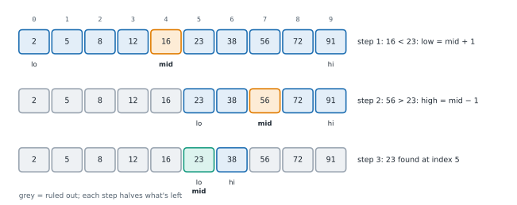

# Lesson 24: Binary search

**You'll learn:** linear vs binary search, the exact template and its invariant, off-by-one errors, bisect, first and last occurrence, rotated arrays, peaks, sorted matrices.

▶ **Practise this lesson in the [sandbox](https://kishoremadanagopal.github.io/learning/dsa/#binary-search)**: run every example and check your exercise answers.

## Key terms

- **Linear search:** checking items one by one until the target is found.
- **Binary search:** repeatedly halving a sorted range by comparing with its middle item.
- **Invariant:** a statement that stays true on every loop pass, such as "if the target exists, it's in nums[lo..hi]".
- **Off-by-one error:** a bug where a loop or index is one step too far or too short.
- **bisect_left / bisect_right:** the first position where x could be inserted keeping the order (before / after equal items).
- **Lower bound / upper bound:** the first position with a value ≥ x / > x.
- **Rotated sorted array:** a sorted list cut at some point with the two parts swapped.
- **Peak element:** an item larger than its neighbours.

**Linear search** checks items one by one: O(n). If the data is **sorted**, you can do much better. Look at the middle item: if it's too small, the target can only be in the right half; if too big, only in the left half. Each step throws away half of what's left, so a million items need at most 20 steps: **O(log n)**.



## The template

```python
def binary_search(nums, target):
    lo, hi = 0, len(nums) - 1          # the target, if present, is in nums[lo..hi]
    while lo <= hi:                     # the range isn't empty
        mid = (lo + hi) // 2
        if nums[mid] == target:
            return mid
        if nums[mid] < target:
            lo = mid + 1                # discard mid and everything left of it
        else:
            hi = mid - 1                # discard mid and everything right of it
    return -1                           # the range became empty: not there

nums = [2, 5, 8, 12, 16, 23, 38, 56, 72, 91]
print(binary_search(nums, 23), binary_search(nums, 7))
```

Three details make or break it:

- **The invariant**: "if the target is anywhere, it's in `nums[lo..hi]`". Every update must keep that true.
- **`lo <= hi`**: with an inclusive range, a single item (lo == hi) must still be checked.
- **`mid + 1` and `mid - 1`**: mid has been checked, so exclude it, otherwise the range can stop shrinking and loop forever.

(In languages with fixed-size integers, `(lo + hi) // 2` can overflow, so people write `lo + (hi - lo) // 2`. Python's integers never overflow, but you'll see that form in other code.)

## Python's bisect module

`bisect_left(a, x)` returns the first position where x could be inserted while keeping `a` sorted, which is the index of the **first** item ≥ x. `bisect_right(a, x)` returns the position **after** the last item ≤ x. Both are binary searches written in C.

```python
from bisect import bisect_left, bisect_right, insort

scores = [10, 20, 20, 20, 30, 40]
print(bisect_left(scores, 20), bisect_right(scores, 20))   # first 20 is at 1; after the last 20 is 4
print("how many 20s:", bisect_right(scores, 20) - bisect_left(scores, 20))
print("items < 25:", bisect_left(scores, 25))

i = bisect_left(scores, 30)
print("30 present?", i < len(scores) and scores[i] == 30)

insort(scores, 25)            # insert keeping the order (O(n), because the list shifts)
print(scores)
```

Common uses: membership in a sorted list, counting items in a range (`bisect_right(a, hi) - bisect_left(a, lo)`), and mapping a value to a band, like a score to a grade:

```python
from bisect import bisect_right

def grade(score, cutoffs=(60, 70, 80, 90), letters="FDCBA"):
    return letters[bisect_right(cutoffs, score)]

print([grade(s) for s in [33, 60, 75, 89, 90, 100]])
```

## First and last occurrence (lower and upper bound)

With duplicates, "find 20" isn't enough: you often need the **first** or **last** 20. Don't stop when you find a match; record it and keep searching to the left (or right).

```python
def first_position(nums, target):
    lo, hi, answer = 0, len(nums) - 1, -1
    while lo <= hi:
        mid = (lo + hi) // 2
        if nums[mid] >= target:
            if nums[mid] == target:
                answer = mid            # a candidate; an earlier one may exist
            hi = mid - 1                # keep looking left
        else:
            lo = mid + 1
    return answer

print(first_position([10, 20, 20, 20, 30], 20), first_position([10, 30], 20))
```

## Rotated sorted arrays

A sorted list "rotated" at some point, like `[40, 50, 60, 10, 20, 30]`, isn't sorted, but at every mid **one half is**. Check which half is sorted and whether the target lies inside it:

```python
def search_rotated(nums, target):
    lo, hi = 0, len(nums) - 1
    while lo <= hi:
        mid = (lo + hi) // 2
        if nums[mid] == target:
            return mid
        if nums[lo] <= nums[mid]:                    # the left half is sorted
            if nums[lo] <= target < nums[mid]:
                hi = mid - 1
            else:
                lo = mid + 1
        else:                                        # the right half is sorted
            if nums[mid] < target <= nums[hi]:
                lo = mid + 1
            else:
                hi = mid - 1
    return -1

print(search_rotated([40, 50, 60, 10, 20, 30], 20), search_rotated([40, 50, 60, 10, 20, 30], 45))
```

## A peak without sorted data

A **peak** is an item bigger than its neighbours. Even in unsorted data, binary search finds one in O(log n): if `nums[mid] < nums[mid + 1]`, the numbers rise to the right, so a peak must exist on the right side; otherwise one exists at mid or to its left.

```python
def find_peak(nums):
    lo, hi = 0, len(nums) - 1
    while lo < hi:                       # a half-open style: stop when one candidate remains
        mid = (lo + hi) // 2
        if nums[mid] < nums[mid + 1]:
            lo = mid + 1                 # rising: a peak is to the right
        else:
            hi = mid                     # falling (or flat): mid could be the peak
    return lo

print(find_peak([1, 3, 20, 4, 1, 0]), find_peak([5, 4, 3]), find_peak([1, 2, 3]))
```

The lesson: binary search doesn't need fully sorted data. It needs a test that tells you **which half to keep**.

## Binary search on 2-D sorted matrices

If every row is sorted and each row starts after the previous row ends, the matrix is one sorted list in disguise: index k is row `k // cols`, column `k % cols`.

```python
def search_matrix(matrix, target):
    rows, cols = len(matrix), len(matrix[0])
    lo, hi = 0, rows * cols - 1
    while lo <= hi:
        mid = (lo + hi) // 2
        value = matrix[mid // cols][mid % cols]
        if value == target:
            return True
        if value < target:
            lo = mid + 1
        else:
            hi = mid - 1
    return False

m = [[1, 3, 5, 7], [10, 11, 16, 20], [23, 30, 34, 60]]
print(search_matrix(m, 16), search_matrix(m, 13))
```

O(log(rows × cols)).

## At a glance

| Concept | Approach | Time | Space |
|---|---|---|---|
| Linear search | check each item | O(n) | O(1) |
| Binary search | compare with the middle; keep one half | O(log n) | O(1) |
| bisect_left / bisect_right | C-coded binary search for insertion points | O(log n) | O(1) |
| Count items in a range of a sorted list | bisect_right(hi) − bisect_left(lo) | O(log n) | O(1) |
| First / last occurrence | on a match, record it and keep searching left / right | O(log n) | O(1) |
| Search a rotated sorted array | one half is always sorted; check if the target is inside it | O(log n) | O(1) |
| Find a peak | move towards the bigger neighbour | O(log n) | O(1) |
| Search a sorted matrix (rows continue) | treat it as one list: row k // cols, column k % cols | O(log(r·c)) | O(1) |

## Common mistakes

- Using `while lo < hi` with an inclusive `hi`, which skips the last candidate.
- Writing `lo = mid` or `hi = mid` with the inclusive template, which can loop forever.
- Running binary search on unsorted data.
- Stopping at the first match when the question asks for the first or last occurrence.

## Exercises

### 1. Binary search

Write `binary_search(nums, target)` returning the index of `target` in the **sorted** list `nums` (distinct values), or `-1` if it isn't there. Don't use `bisect`, `index` or `in`. It will be called 5,000 times on a list of a million numbers, so each call must be O(log n).

Starter code:

```python
def binary_search(nums, target):
    pass

print(binary_search([2, 5, 8, 12, 16, 23, 38], 23))   # 5
```

<details>
<summary>🧭 How to approach it</summary>

1. **Understand:** sorted, distinct values; return an index or −1; many searches on a big list.
2. **Examples:** [2, 5, 8, 12, 16, 23, 38], 23 → 5; 9 → −1; [] → −1.
3. **Brute force:** scan the list: O(n) per search, billions of steps for 5,000 searches of a million items.
4. **Pattern:** sorted + "find" → **binary search**.
5. **Plan:** lo = 0, hi = n − 1; while lo ≤ hi: mid; equal → done; smaller → go right; bigger → go left; return −1.
6. **Code and test:** first item, last item, missing at both ends, one item, empty list.

</details>

<details>
<summary>💡 Hint 1</summary>

The list is sorted. After comparing `target` with the middle item, which half can you ignore?

</details>

<details>
<summary>💡 Hint 2</summary>

Keep two indexes `lo` and `hi` for the range still possible. Loop while `lo <= hi`, compare with `nums[mid]`, and move `lo` or `hi` past `mid`.

</details>

<details>
<summary>💡 Hint 3</summary>

`mid = (lo + hi) // 2`; equal → return mid; `nums[mid] < target` → `lo = mid + 1`; else `hi = mid - 1`. After the loop, return -1.

</details>

### 2. First and last position

Write `search_range(nums, target)` returning `[first, last]`, the first and last indexes of `target` in the sorted list `nums` (which may contain duplicates), or `[-1, -1]` if it's absent. Use two binary searches: O(log n), even when the target appears a million times.

Starter code:

```python
def search_range(nums, target):
    pass

print(search_range([5, 7, 7, 8, 8, 10], 8))   # [3, 4]
```

<details>
<summary>🧭 How to approach it</summary>

1. **Understand:** sorted with duplicates; first and last index; [−1, −1] if absent; O(log n) even with huge runs of the target.
2. **Examples:** [5, 7, 7, 8, 8, 10], 8 → [3, 4]; [2, 2, 2, 2], 2 → [0, 3].
3. **Brute force:** find one match and walk outwards: O(n) when the target fills the list.
4. **Pattern:** **lower bound / upper bound** binary search (don't stop at the first match).
5. **Plan:** a helper that, on a match, records it and keeps searching left (or right); call it twice.
6. **Code and test:** absent target, all equal, single item, empty list.

</details>

<details>
<summary>💡 Hint 1</summary>

A normal binary search stops at **some** match. How could it keep going to find the first one?

</details>

<details>
<summary>💡 Hint 2</summary>

When `nums[mid] == target`, record `mid` as a candidate and continue searching the **left** half (`hi = mid - 1`). Do the mirror image for the last position.

</details>

<details>
<summary>💡 Hint 3</summary>

Write one helper `boundary(go_left)` that records matches and moves `hi` (for first) or `lo` (for last) past them; return `[boundary(True), boundary(False)]`.

</details>

### 3. Search a rotated sorted list

Write `search_rotated(nums, target)` for a list that was sorted (distinct values) and then rotated at some unknown point, like `[4, 5, 6, 7, 0, 1, 2]`. Return the index of `target` or `-1`, in O(log n).

Starter code:

```python
def search_rotated(nums, target):
    pass

print(search_rotated([4, 5, 6, 7, 0, 1, 2], 0))   # 4
```

<details>
<summary>🧭 How to approach it</summary>

1. **Understand:** a rotation of a sorted list; distinct values; O(log n); it might not be rotated at all.
2. **Examples:** [4, 5, 6, 7, 0, 1, 2], 0 → 4; 3 → −1; [1, 2, 3, 4, 5], 4 → 3.
3. **Brute force:** linear scan: O(n).
4. **Pattern:** **modified binary search**: decide which half to keep using the sorted half.
5. **Plan:** loop with lo/hi/mid; return on a match; find the sorted half; keep it if the target's inside its range, else keep the other half.
6. **Code and test:** unrotated input, rotated by one, two items, targets at the ends.

</details>

<details>
<summary>💡 Hint 1</summary>

Pick the middle item. Even in a rotated list, at least one of the two halves around it is in sorted order. How can you tell which?

</details>

<details>
<summary>💡 Hint 2</summary>

If `nums[lo] <= nums[mid]`, the left half is sorted; otherwise the right half is. In the sorted half you can check with two comparisons whether the target lies inside it.

</details>

<details>
<summary>💡 Hint 3</summary>

Left sorted: if `nums[lo] <= target < nums[mid]`, go left (`hi = mid - 1`), else go right. Right sorted: if `nums[mid] < target <= nums[hi]`, go right, else go left.

</details>

**In the sandbox:** exercises 50–52. Press **Check** to run the hidden tests.

### Answers and walkthroughs

Open these only after a real attempt. Each one explains the solution step by step.

<details>
<summary>✅ 1. Binary search</summary>

```python
def binary_search(nums, target):
    lo, hi = 0, len(nums) - 1
    while lo <= hi:
        mid = (lo + hi) // 2
        if nums[mid] == target:
            return mid
        if nums[mid] < target:
            lo = mid + 1          # the target can only be to the right of mid
        else:
            hi = mid - 1          # the target can only be to the left of mid
    return -1

print(binary_search([2, 5, 8, 12, 16, 23, 38], 23))
```

**Line by line**

- `lo, hi = 0, len(nums) - 1`: the whole list is possible at the start. For an empty list hi is −1, so the loop never runs and we return −1.
- `while lo <= hi`: the range `lo..hi` still contains at least one item.
- `mid + 1` / `mid - 1` exclude mid after checking it, so the range always shrinks; without that, `lo = mid` could loop forever when lo and hi are next to each other.

**Trace** searching 23 in [2, 5, 8, 12, 16, 23, 38]:

| lo | hi | mid | nums[mid] | action |
|---|---|---|---|---|
| 0 | 6 | 3 | 12 | 12 < 23 → lo = 4 |
| 4 | 6 | 5 | 23 | found → 5 |

Searching 9: lo 0, hi 6, mid 3 (12) → hi = 2; mid 1 (5) → lo = 2; mid 2 (8) → lo = 3 > hi → −1.

**Complexity:** O(log n) time, O(1) space.

**Common wrong approach:** `while lo < hi` with `hi = len(nums) - 1` skips checking the last remaining item, so a target sitting alone in the final range is reported missing.

</details>

<details>
<summary>✅ 2. First and last position</summary>

```python
def search_range(nums, target):
    def boundary(go_left):
        lo, hi, found = 0, len(nums) - 1, -1
        while lo <= hi:
            mid = (lo + hi) // 2
            if nums[mid] == target:
                found = mid                     # record it, then keep searching one side
                if go_left:
                    hi = mid - 1
                else:
                    lo = mid + 1
            elif nums[mid] < target:
                lo = mid + 1
            else:
                hi = mid - 1
        return found

    return [boundary(True), boundary(False)]

print(search_range([5, 7, 7, 8, 8, 10], 8))
```

**Line by line**

- `found` remembers the best match so far; it stays −1 if the target never appears.
- On a match, searching left (`hi = mid - 1`) looks for an earlier copy. If there is none, the loop ends with `found` holding the first index.
- For the last position, the same happens to the right (`lo = mid + 1`).
- Each search halves the range every step: two searches are still O(log n).

**Trace** of the "first" search for 8 in [5, 7, 7, 8, 8, 10]:

| lo | hi | mid | nums[mid] | action | found |
|---|---|---|---|---|---|
| 0 | 5 | 2 | 7 | 7 < 8 → lo = 3 | −1 |
| 3 | 5 | 4 | 8 | match → hi = 3 | 4 |
| 3 | 3 | 3 | 8 | match → hi = 2 | **3** |

**Complexity:** O(log n) time, O(1) space.

**Common wrong approach:** stopping at the first match found and walking outwards one item at a time, which is O(n) for a list full of the target.

</details>

<details>
<summary>✅ 3. Search a rotated sorted list</summary>

```python
def search_rotated(nums, target):
    lo, hi = 0, len(nums) - 1
    while lo <= hi:
        mid = (lo + hi) // 2
        if nums[mid] == target:
            return mid
        if nums[lo] <= nums[mid]:                 # left half nums[lo..mid] is sorted
            if nums[lo] <= target < nums[mid]:
                hi = mid - 1                      # the target is inside it
            else:
                lo = mid + 1
        else:                                     # right half nums[mid..hi] is sorted
            if nums[mid] < target <= nums[hi]:
                lo = mid + 1
            else:
                hi = mid - 1
    return -1

print(search_rotated([4, 5, 6, 7, 0, 1, 2], 0))
```

**Line by line**

- A rotated sorted list consists of two sorted runs. Whatever `mid` is, the half from `lo` to `mid` or the half from `mid` to `hi` lies entirely within one run, so it's sorted.
- `nums[lo] <= nums[mid]` means no "drop" between lo and mid: the left half is sorted. `<=` matters when lo == mid.
- In a sorted half we know the smallest and largest values, so "is the target inside?" is a range check. If yes, keep that half; if not, it must be in the other half.

**Trace** searching 0 in [4, 5, 6, 7, 0, 1, 2]:

| lo | hi | mid | nums[mid] | sorted half | target inside? | action |
|---|---|---|---|---|---|---|
| 0 | 6 | 3 | 7 | left (4..7) | no | lo = 4 |
| 4 | 6 | 5 | 1 | left (0..1) | yes (0 ≤ 0 < 1) | hi = 4 |
| 4 | 4 | 4 | 0 | — | match | return 4 |

**Complexity:** O(log n) time, O(1) space.

**Common wrong approach:** finding the rotation point first with a linear scan and then binary-searching, which is O(n) overall.

</details>

## Quick quiz

1. Binary search needs at most how many comparisons for a million sorted items?
   - A) About 1,000
   - B) About 20
   - C) About 500,000

2. Why must the template use `lo = mid + 1` rather than `lo = mid`?
   - A) mid has already been checked; excluding it guarantees the range shrinks, otherwise the loop can run forever
   - B) It makes the answer one bigger
   - C) Python indexes start at 1

3. bisect_left([10, 20, 20, 30], 20) returns:
   - A) 1, the index of the first 20
   - B) 2
   - C) 3

4. What does binary search really need to work?
   - A) A test that tells you which half can be thrown away
   - B) Data that is fully sorted, always
   - C) Numbers only

<details>
<summary>Quiz answers</summary>

1. **B) About 20**: Each comparison halves the range: 2^20 is about a million.
2. **A) mid has already been checked; excluding it guarantees the range shrinks, otherwise the loop can run forever**: With lo = mid, when lo and hi are neighbours, mid equals lo and nothing changes.
3. **A) 1, the index of the first 20**: bisect_left gives the leftmost insertion point, which is the first item >= 20.
4. **A) A test that tells you which half can be thrown away**: Rotated arrays and peaks work without full sorting, because each step can still discard half.

</details>

---
Previous: [Lesson 23](23-backtracking.md) · Next: [Lesson 25: Binary search on the answer](25-binary-search-answer.md)
