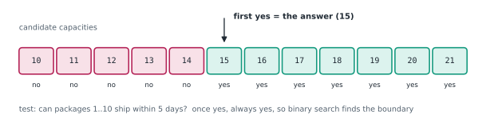

# Lesson 25: Binary search on the answer

**You'll learn:** monotonic yes/no tests, searching for the first yes or last yes, rounding mid, integer square root, minimum ship capacity, eating speed, minimum of a rotated array, real-valued binary search.

▶ **Practise this lesson in the [sandbox](https://kishoremadanagopal.github.io/learning/dsa/#binary-search-answer)**: run every example and check your exercise answers.

## Key terms

- **Binary search on the answer:** binary searching over the possible values of the answer, using a yes/no test.
- **Monotonic:** never changing direction: once the test says yes, it says yes for every larger value.
- **Feasibility check:** a function that answers "does this candidate value work?"
- **Search space:** the range of candidate answers, from the smallest possible to the largest.
- **Half-open template:** `while lo < hi` with `hi = mid` and `lo = mid + 1`; ends with lo == hi.
- **Ceiling division:** dividing and rounding up, `(a + b - 1) // b` for positive integers.

Some problems ask for the **smallest** (or largest) number that satisfies a condition: the smallest ship capacity that delivers everything in 5 days, the slowest eating speed that finishes in time, the biggest number whose square is at most n. There's no sorted list to search, but there is a sorted **range of possible answers**, and a yes/no test that's **monotonic**: once the answer is "yes" for some x, it stays "yes" for every bigger x.



Binary search for the **first yes** on that line:

```python
lo, hi = smallest_possible, largest_possible
while lo < hi:
    mid = (lo + hi) // 2
    if works(mid):
        hi = mid          # mid works: the answer is mid or smaller
    else:
        lo = mid + 1      # mid fails: the answer is bigger
return lo                 # lo == hi: the first value that works
```

This uses the **half-open** style: `while lo < hi`, `hi = mid` (mid might be the answer, so keep it) and `lo = mid + 1`. When the loop ends, `lo == hi` is the answer. The total cost is O(log(range) × cost of `works`).

## Integer square root

The largest x with x·x ≤ n. Here the test flips from yes to no, so search for the **last yes**, rounding mid **up** so the range always shrinks:

```python
def isqrt(n):
    lo, hi = 0, n
    while lo < hi:
        mid = (lo + hi + 1) // 2      # round up, because we set lo = mid below
        if mid * mid <= n:
            lo = mid                  # mid works: the answer is mid or bigger
        else:
            hi = mid - 1
    return lo

import math
print(isqrt(0), isqrt(15), isqrt(16), isqrt(10**18), math.isqrt(10**18))
```

Rounding: if you write `lo = mid`, use `mid = (lo + hi + 1) // 2`; if you write `hi = mid`, use `mid = (lo + hi) // 2`. Mixing them up loops forever when lo and hi are neighbours.

## Minimum ship capacity

Packages with weights must ship **in order**, within D days. Each day the ship carries packages up to its capacity. What's the smallest capacity that works? A capacity of `max(weights)` is the least that can ever work (the heaviest package must fit); `sum(weights)` always works (everything in one day). Test a capacity by simulating the days greedily:

```python
def days_needed(weights, capacity):
    days, load = 1, 0
    for w in weights:
        if load + w > capacity:       # doesn't fit today: start a new day
            days += 1
            load = 0
        load += w
    return days

def ship_within(weights, days):
    lo, hi = max(weights), sum(weights)
    while lo < hi:
        mid = (lo + hi) // 2
        if days_needed(weights, mid) <= days:
            hi = mid
        else:
            lo = mid + 1
    return lo

print(ship_within([1, 2, 3, 4, 5, 6, 7, 8, 9, 10], 5))   # 15
```

O(n · log(sum of weights)). Trying every capacity from max to sum would be O(n · sum).

## Eating bananas at the slowest speed

Piles of bananas; eating at speed k per hour, a pile of p takes ⌈p / k⌉ hours. Find the smallest k that finishes all piles within h hours. Same shape:

```python
def min_eating_speed(piles, h):
    lo, hi = 1, max(piles)
    while lo < hi:
        k = (lo + hi) // 2
        hours = sum((p + k - 1) // k for p in piles)   # ceiling division without floats
        if hours <= h:
            hi = k
        else:
            lo = k + 1
    return lo

print(min_eating_speed([3, 6, 7, 11], 8), min_eating_speed([30, 11, 23, 4, 20], 5))
```

## Minimum of a rotated sorted list

The same "first yes" idea with the test `nums[mid] <= nums[-1]` (mid is in the rotated-to-the-front part, which holds the minimum):

```python
def find_min(nums):
    lo, hi = 0, len(nums) - 1
    while lo < hi:
        mid = (lo + hi) // 2
        if nums[mid] > nums[hi]:
            lo = mid + 1         # the drop (and the minimum) is right of mid
        else:
            hi = mid             # mid could be the minimum
    return nums[lo]

print(find_min([4, 5, 6, 7, 0, 1, 2]), find_min([1, 2, 3]))
```

## Real-valued answers

For an answer that's a real number (a cube root, a time, a rate), repeat a fixed number of times instead of comparing integers: each round halves the error, so 100 rounds shrink even a range of 10¹⁸ to below 10⁻¹².

```python
def cube_root(x):
    lo, hi = 0.0, max(1.0, x)
    for _ in range(100):           # each round halves the interval
        mid = (lo + hi) / 2
        if mid ** 3 < x:
            lo = mid
        else:
            hi = mid
    return lo

print(round(cube_root(27), 9), round(cube_root(2), 9))
```

## Spotting "binary search on the answer"

- The question asks for a **minimum** or **maximum** value (capacity, speed, time, distance, size).
- Checking one candidate value is easy (often a greedy simulation).
- Bigger values are "always at least as good" (monotonic).
- Clue phrases: "minimum largest…", "maximum minimum…", "smallest capacity / speed / time such that…", "within D days".

EOF
echo ok

## At a glance

| Concept | Approach | Time | Space |
|---|---|---|---|
| First value that works | while lo < hi: mid; works → hi = mid, else lo = mid + 1 | O(log(range) × check) | O(1) |
| Last value that works | mid rounded up; works → lo = mid, else hi = mid − 1 | O(log(range) × check) | O(1) |
| Integer square root | last x with x·x ≤ n | O(log n) | O(1) |
| Minimum ship capacity | search max(w)..sum(w); greedy day count | O(n log(sum)) | O(1) |
| Minimum eating speed | search 1..max(pile); total hours with ceiling division | O(n log(max)) | O(1) |
| Minimum of a rotated array | compare nums[mid] with nums[hi] | O(log n) | O(1) |
| Real-valued answer | fixed number of halvings (e.g. 100) | O(iterations × check) | O(1) |

## Common mistakes

- Searching a range that doesn't contain the answer (bounds too tight or too loose).
- Using `mid = (lo + hi) // 2` together with `lo = mid`, which never terminates.
- A feasibility check that isn't actually monotonic.
- Using float square roots for huge integers, which can be off by one.

## Exercises

### 1. Integer square root

Write `int_sqrt(n)` returning the largest integer x with x · x ≤ n, for 0 ≤ n ≤ 10¹⁸. Don't use `math.sqrt`, `math.isqrt`, `** 0.5` or `pow`: use binary search.

Starter code:

```python
def int_sqrt(n):
    pass

print(int_sqrt(15), int_sqrt(16))   # 3 4
```

<details>
<summary>🧭 How to approach it</summary>

1. **Understand:** floor of the square root; inputs up to 10¹⁸; exact integer arithmetic.
2. **Examples:** 15 → 3, 16 → 4, 0 → 0, 10¹⁸ → 10⁹.
3. **Brute force:** count x upward until (x + 1)² > n: O(√n), a billion steps for 10¹⁸.
4. **Pattern:** **binary search on the answer** with the monotonic test x² ≤ n.
5. **Plan:** search [0, n] for the last x with x² ≤ n, rounding mid up.
6. **Code and test:** 0, 1, perfect squares and their neighbours.

</details>

<details>
<summary>💡 Hint 1</summary>

Think of the candidates 0, 1, 2, …, n. For which of them is x · x ≤ n true? Is there a pattern?

</details>

<details>
<summary>💡 Hint 2</summary>

It's true for 0 up to the answer, then false for everything bigger: one boundary. Binary search for the **last** true value.

</details>

<details>
<summary>💡 Hint 3</summary>

`lo, hi = 0, n`; while `lo < hi`: `mid = (lo + hi + 1) // 2`; if `mid * mid <= n`: `lo = mid` else `hi = mid - 1`. Return `lo`.

</details>

### 2. Minimum ship capacity

Write `ship_capacity(weights, days)` returning the smallest ship capacity that delivers every package **in the given order** within `days` days (each day the ship carries a run of consecutive packages whose total weight is at most the capacity). Must be fast when the weights add up to billions.

Starter code:

```python
def ship_capacity(weights, days):
    pass

print(ship_capacity([1, 2, 3, 4, 5, 6, 7, 8, 9, 10], 5))   # 15
```

<details>
<summary>🧭 How to approach it</summary>

1. **Understand:** order is fixed; whole packages only; the smallest capacity that needs at most `days` days.
2. **Examples:** [1..10], 5 days → 15: days [1-5], [6, 7], [8], [9], [10].
3. **Brute force:** try capacities upward from max(weights): O(n × range), hopeless when weights are in the millions.
4. **Pattern:** "smallest X such that it's possible" → **binary search on the answer** + greedy check.
5. **Plan:** `fits(c)` simulates days greedily; binary search the first c in [max, sum] that fits.
6. **Code and test:** one day, one package per day, a single package.

</details>

<details>
<summary>💡 Hint 1</summary>

For a given capacity, can you check quickly whether it's enough? And if capacity c is enough, what about c + 1?

</details>

<details>
<summary>💡 Hint 2</summary>

Check with a greedy simulation (fill each day until the next package won't fit). Bigger capacities never need more days, so the "enough?" answer flips from no to yes once: binary search for the first yes.

</details>

<details>
<summary>💡 Hint 3</summary>

Search between `max(weights)` (the heaviest package must fit) and `sum(weights)` (one day). `while lo < hi: mid; if fits(mid): hi = mid else: lo = mid + 1`.

</details>

**In the sandbox:** exercises 53–54. Press **Check** to run the hidden tests.

### Answers and walkthroughs

Open these only after a real attempt. Each one explains the solution step by step.

<details>
<summary>✅ 1. Integer square root</summary>

```python
def int_sqrt(n):
    lo, hi = 0, n
    while lo < hi:
        mid = (lo + hi + 1) // 2      # round up because we set lo = mid
        if mid * mid <= n:
            lo = mid                  # mid works; the answer is mid or bigger
        else:
            hi = mid - 1              # mid is too big
    return lo

print(int_sqrt(15), int_sqrt(16))
```

**Line by line**

- The range `[lo, hi]` always contains the answer: 0 always satisfies 0² ≤ n, and nothing above n can (for n ≥ 1).
- When `mid * mid <= n`, mid is a valid answer, and something bigger might be too, so keep mid: `lo = mid`.
- Otherwise mid is too big: `hi = mid - 1`.
- Rounding mid **up** matters: with lo = 3, hi = 4, rounding down gives mid = 3, and `lo = mid` changes nothing: an infinite loop.
- Python's integers are exact, so `mid * mid` never loses precision, unlike floats (`int(n ** 0.5)` can be off by one for huge n).

**Trace** for n = 15:

| lo | hi | mid | mid² ≤ 15? | action |
|---|---|---|---|---|
| 0 | 15 | 8 | 64: no | hi = 7 |
| 0 | 7 | 4 | 16: no | hi = 3 |
| 0 | 3 | 2 | 4: yes | lo = 2 |
| 2 | 3 | 3 | 9: yes | lo = 3 |
| 3 | 3 | — | — | return 3 |

**Complexity:** O(log n) time (about 60 steps for 10¹⁸), O(1) space.

**Common wrong approach:** `mid = (lo + hi) // 2` together with `lo = mid` loops forever once lo and hi are neighbours.

</details>

<details>
<summary>✅ 2. Minimum ship capacity</summary>

```python
def ship_capacity(weights, days):
    def fits(capacity):
        needed, load = 1, 0
        for w in weights:
            if load + w > capacity:      # start a new day
                needed += 1
                load = 0
            load += w
        return needed <= days

    lo, hi = max(weights), sum(weights)  # the answer is somewhere in here
    while lo < hi:
        mid = (lo + hi) // 2
        if fits(mid):
            hi = mid                     # works: try smaller
        else:
            lo = mid + 1                 # too small
    return lo

print(ship_capacity([1, 2, 3, 4, 5, 6, 7, 8, 9, 10], 5))
```

**Line by line**

- `fits(capacity)` fills each day greedily: putting as much as possible on today never makes a later day worse, so the greedy count is the true minimum number of days for that capacity.
- `lo = max(weights)`: smaller capacities can't carry the heaviest package. `hi = sum(weights)`: everything in one day, always enough.
- Monotonic: if capacity c fits, c + 1 fits too. So "fits" looks like no, no, …, no, yes, yes, …, and we want the first yes.
- `hi = mid` keeps mid (it works and might be the answer); `lo = mid + 1` discards a failing mid.

**Trace** for [1..10], 5 days (lo = 10, hi = 55):

| lo | hi | mid | days needed | fits? |
|---|---|---|---|---|
| 10 | 55 | 32 | 2 | yes → hi = 32 |
| 10 | 32 | 21 | 3 | yes → hi = 21 |
| 10 | 21 | 15 | 5 | yes → hi = 15 |
| 10 | 15 | 12 | 6 | no → lo = 13 |
| 13 | 15 | 14 | 6 | no → lo = 15 → answer 15 |

**Complexity:** O(n · log(sum of weights)) time, O(1) space.

**Common wrong approach:** starting the search at 1 or 0, so the check meets a package heavier than the capacity; the greedy loop then "fits" it anyway and gives a wrong answer.

</details>

## Quick quiz

1. Binary search on the answer requires the yes/no test to be:
   - A) Monotonic: once it's yes for some value, it's yes for every bigger value (or the reverse)
   - B) Fast, but it can flip back and forth
   - C) Based on a sorted list

2. In the ship problem, why is the lower bound max(weights)?
   - A) Any smaller capacity can't carry the heaviest package at all
   - B) It's the average weight
   - C) Because binary search must start at the largest item

3. You write `lo = mid` in your loop. How should mid be computed?
   - A) (lo + hi + 1) // 2, rounding up
   - B) (lo + hi) // 2, rounding down
   - C) It doesn't matter

4. Which question suggests binary search on the answer?
   - A) "What is the minimum speed that finishes all the work within 8 hours?"
   - B) "Print every permutation of a string"
   - C) "Count the words in a sentence"

<details>
<summary>Quiz answers</summary>

1. **A) Monotonic: once it's yes for some value, it's yes for every bigger value (or the reverse)**: A single boundary between no and yes is what binary search finds.
2. **A) Any smaller capacity can't carry the heaviest package at all**: The search range must contain the answer and only sensible candidates.
3. **A) (lo + hi + 1) // 2, rounding up**: Rounding down with lo = mid can leave the range unchanged forever when lo and hi are neighbours.
4. **A) "What is the minimum speed that finishes all the work within 8 hours?"**: A minimum or maximum value with an easy feasibility check is the classic signal.

</details>

---
Previous: [Lesson 24](24-binary-search.md) · Next: [Lesson 26: Simple sorts: bubble, selection, insertion](26-simple-sorts.md)
