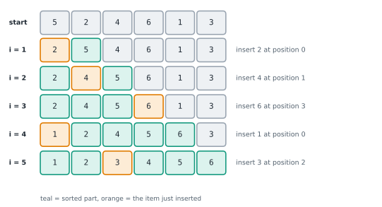

# Lesson 26: Simple sorts: bubble, selection, insertion

**You'll learn:** in-place and stable sorting, bubble sort with early exit, selection sort, insertion sort and nearly sorted data, comparing the simple sorts, the Dutch national flag partition.

▶ **Practise this lesson in the [sandbox](https://kishoremadanagopal.github.io/learning/dsa/#simple-sorts)**: run every example and check your exercise answers.

## Key terms

- **In-place sort:** a sort that rearranges the list itself with O(1) extra memory.
- **Stable sort:** a sort that keeps equal items in their original relative order.
- **Bubble sort:** repeatedly swaps neighbouring items that are out of order.
- **Selection sort:** repeatedly selects the smallest remaining item and swaps it into place.
- **Insertion sort:** grows a sorted prefix, sliding each new item left into position.
- **Adaptive sort:** a sort that runs faster on input that is already partly sorted.
- **Partition:** rearranging items into groups around a value, such as smaller / equal / bigger.
- **Dutch national flag:** a one-pass, three-pointer partition into three groups.

Python's `sorted()` is all you'll use in practice, but the classic sorting algorithms are where the ideas behind most of DSA come from: invariants, swaps, partitions, divide and conquer, and best versus worst cases. Interviews ask you to write them and, more often, to **compare** them.

Two words describe every sort:

- **In place:** it rearranges the list itself using only O(1) extra memory.
- **Stable:** items that compare equal keep their original order. This matters when you sort records by one field after another (sort by name, then stably by department, and each department stays alphabetical).

## Bubble sort

Walk through the list swapping neighbours that are out of order. After each pass, the largest remaining item has "bubbled" to the end. Stop early if a pass makes no swaps.

```python
def bubble_sort(nums):
    n = len(nums)
    for end in range(n - 1, 0, -1):
        swapped = False
        for i in range(end):
            if nums[i] > nums[i + 1]:
                nums[i], nums[i + 1] = nums[i + 1], nums[i]
                swapped = True
        if not swapped:          # no swaps: already sorted, stop early
            break
    return nums

print(bubble_sort([5, 1, 4, 2, 8]))
```

O(n²) comparisons in the worst case; O(n) on an already sorted list thanks to the early exit. Stable and in place, but slow: mostly a teaching tool.

## Selection sort

Find the smallest remaining item and swap it into the next position.

```python
def selection_sort(nums):
    for i in range(len(nums)):
        smallest = i
        for j in range(i + 1, len(nums)):
            if nums[j] < nums[smallest]:
                smallest = j
        nums[i], nums[smallest] = nums[smallest], nums[i]
    return nums

print(selection_sort([64, 25, 12, 22, 11]))
```

Always O(n²) comparisons, even on sorted input, but only O(n) **swaps**, which helps when writing is expensive (like flash memory). **Not stable**: the long-distance swap can jump an item over an equal one.

## Insertion sort

Grow a sorted section on the left. Take the next item and slide it left past every bigger item, like sorting a hand of cards.



```python
def insertion_sort(nums):
    for i in range(1, len(nums)):
        item = nums[i]
        j = i - 1
        while j >= 0 and nums[j] > item:   # shift bigger items one place right
            nums[j + 1] = nums[j]
            j -= 1
        nums[j + 1] = item                 # drop the item into the gap
    return nums

print(insertion_sort([5, 2, 4, 6, 1, 3]))
```

O(n²) in the worst case (reverse order), but **O(n) on nearly sorted data**, because each item moves only a few places. It's stable, in place and has tiny overhead, so real-world sorts (Python's Timsort, C++'s introsort) switch to insertion sort for small pieces.

## Comparing them

| Sort | Best | Average | Worst | Extra space | Stable? | Good for |
|---|---|---|---|---|---|---|
| Bubble | O(n) | O(n²) | O(n²) | O(1) | yes | teaching |
| Selection | O(n²) | O(n²) | O(n²) | O(1) | no | few writes |
| Insertion | O(n) | O(n²) | O(n²) | O(1) | yes | small or nearly sorted data |

You can see "nearly sorted" pay off:

```python
import random, time

def insertion_sort(nums):
    for i in range(1, len(nums)):
        item, j = nums[i], i - 1
        while j >= 0 and nums[j] > item:
            nums[j + 1] = nums[j]
            j -= 1
        nums[j + 1] = item
    return nums

n = 3000
random.seed(1)
shuffled = random.sample(range(n), n)
nearly = list(range(n))
for _ in range(10):                          # swap 10 random neighbours
    i = random.randrange(n - 1)
    nearly[i], nearly[i + 1] = nearly[i + 1], nearly[i]

for name, data in [("shuffled", shuffled), ("nearly sorted", nearly)]:
    t = time.perf_counter()
    insertion_sort(data[:])
    print(f"{name:>14}: {time.perf_counter() - t:.4f} s")
```

## The Dutch national flag: partitioning in one pass

Sorting a list that holds only three values (say 0, 1 and 2) doesn't need a general sort. Edsger Dijkstra's **three-way partition** keeps three regions, 0s at the front, 2s at the back, 1s in the middle, and sorts in one pass with O(1) space. The same partition is the heart of quicksort (next lesson).

```python
def sort_colours(nums):
    low, mid, high = 0, 0, len(nums) - 1     # [0, low) = 0s, [low, mid) = 1s, (high, end] = 2s
    while mid <= high:
        if nums[mid] == 0:
            nums[low], nums[mid] = nums[mid], nums[low]
            low += 1; mid += 1
        elif nums[mid] == 1:
            mid += 1
        else:
            nums[mid], nums[high] = nums[high], nums[mid]
            high -= 1                         # don't move mid: the swapped-in item is unchecked
    return nums

print(sort_colours([2, 0, 2, 1, 1, 0]))
```

## At a glance

| Concept | Approach | Time | Space |
|---|---|---|---|
| Bubble sort | swap out-of-order neighbours; stop when a pass makes no swaps | O(n²), best O(n) | O(1) |
| Selection sort | swap the minimum of the rest into place | O(n²) always | O(1) |
| Insertion sort | shift bigger items right, drop the item in the gap | O(n²), best O(n) | O(1) |
| Dutch national flag (sort 0/1/2) | three pointers low / mid / high | O(n) | O(1) |

## Common mistakes

- Writing insertion sort without the early stop, losing its O(n) best case.
- Forgetting bubble sort's "no swaps → stop" check.
- Assuming every sort is stable (selection sort and quicksort aren't).
- Advancing `mid` after swapping with `high` in the Dutch flag partition.

## Exercises

### 1. Insertion sort

Write `insertion_sort(nums)` that sorts the list **in place** using insertion sort and returns it. Don't use `sorted()` or `.sort()`. It must finish quickly on a nearly sorted list of 50,000 numbers (insertion sort's best case).

Starter code:

```python
def insertion_sort(nums):
    pass

print(insertion_sort([5, 2, 4, 6, 1, 3]))
```

<details>
<summary>🧭 How to approach it</summary>

1. **Understand:** in place, return the list; must be fast on nearly sorted data (so stop shifting early).
2. **Examples:** [5, 2, 4, 6, 1, 3] → [1, 2, 3, 4, 5, 6]; sorted input needs no shifts.
3. **Brute force:** compare every pair: O(n²) always.
4. **Pattern:** **insertion sort**: grow a sorted prefix; shift while bigger.
5. **Plan:** for each i ≥ 1, hold nums[i], shift bigger items right, place it.
6. **Code and test:** empty, one item, reversed, duplicates.

</details>

<details>
<summary>💡 Hint 1</summary>

Imagine the left part of the list is already sorted. Where does the next item belong?

</details>

<details>
<summary>💡 Hint 2</summary>

Remember the item, then shift bigger items one place right until you find a smaller (or equal) one, and drop the item into the gap.

</details>

<details>
<summary>💡 Hint 3</summary>

For i from 1: `item = nums[i]; j = i - 1; while j >= 0 and nums[j] > item: nums[j + 1] = nums[j]; j -= 1`; then `nums[j + 1] = item`.

</details>

### 2. Sort the colours

Write `sort_colours(nums)` for a list containing only `0`, `1` and `2`. Sort it **in place in one pass** with O(1) extra space (no counting and rewriting, no `sorted`), and return it.

Starter code:

```python
def sort_colours(nums):
    pass

print(sort_colours([2, 0, 2, 1, 1, 0]))   # [0, 0, 1, 1, 2, 2]
```

<details>
<summary>🧭 How to approach it</summary>

1. **Understand:** only 0, 1, 2; in place; one pass; O(1) space.
2. **Examples:** [2, 0, 2, 1, 1, 0] → [0, 0, 1, 1, 2, 2].
3. **Brute force:** count each value and rewrite the list: two passes (allowed in real life, banned here), or sort: O(n log n).
4. **Pattern:** **three-way partition** with three pointers (Dutch national flag).
5. **Plan:** low/mid/high; inspect nums[mid]; swap 0s to the front and 2s to the back.
6. **Code and test:** all equal, two items, empty.

</details>

<details>
<summary>💡 Hint 1</summary>

Keep three regions: 0s at the front, 2s at the back, 1s in between, and an unknown middle part that shrinks.

</details>

<details>
<summary>💡 Hint 2</summary>

Use three pointers: `low` (next place for a 0), `mid` (the item being checked) and `high` (next place for a 2).

</details>

<details>
<summary>💡 Hint 3</summary>

While `mid <= high`: a 0 → swap with `low`, move both low and mid; a 1 → move mid; a 2 → swap with `high`, move high only (re-check the new item at mid).

</details>

**In the sandbox:** exercises 55–56. Press **Check** to run the hidden tests.

### Answers and walkthroughs

Open these only after a real attempt. Each one explains the solution step by step.

<details>
<summary>✅ 1. Insertion sort</summary>

```python
def insertion_sort(nums):
    for i in range(1, len(nums)):
        item = nums[i]
        j = i - 1
        while j >= 0 and nums[j] > item:   # strictly greater: equal items stay in order (stable)
            nums[j + 1] = nums[j]          # shift right to make room
            j -= 1
        nums[j + 1] = item
    return nums

print(insertion_sort([5, 2, 4, 6, 1, 3]))
```

**Line by line**

- Invariant: before step i, `nums[0..i-1]` is sorted.
- `item = nums[i]` is saved because shifting will overwrite that slot.
- The `while` stops at the first item that isn't bigger; on nearly sorted data that's immediately, so each step costs O(1): O(n) overall.
- `nums[j + 1] = item` puts it right after the first smaller-or-equal item, which keeps equal items in their original order (stable).

**Trace** on [5, 2, 4]:

| i | item | shifts | list after |
|---|---|---|---|
| 1 | 2 | 5 → right | [2, 5, 4] |
| 2 | 4 | 5 → right; stop at 2 | [2, 4, 5] |

**Complexity:** O(n²) worst case (reversed input), O(n) best case (sorted or nearly sorted), O(1) extra space.

**Common wrong approach:** an inner loop that always runs back to index 0 (the "slow" version) loses the early stop, so even sorted input takes O(n²).

</details>

<details>
<summary>✅ 2. Sort the colours</summary>

```python
def sort_colours(nums):
    low, mid, high = 0, 0, len(nums) - 1
    # nums[:low] are 0s, nums[low:mid] are 1s, nums[high+1:] are 2s, nums[mid:high+1] unknown
    while mid <= high:
        if nums[mid] == 0:
            nums[low], nums[mid] = nums[mid], nums[low]
            low += 1
            mid += 1
        elif nums[mid] == 1:
            mid += 1
        else:
            nums[mid], nums[high] = nums[high], nums[mid]
            high -= 1                 # the item swapped in from high hasn't been checked yet
    return nums

print(sort_colours([2, 0, 2, 1, 1, 0]))
```

**Line by line**

- The invariant is in the comment: four regions, and the unknown one (`mid..high`) shrinks every step.
- A 0 at `mid` swaps with `low`. The item coming back from `low` is a 1 (or it's the same slot), so `mid` can move on safely.
- A 2 swaps with `high`, but the item that comes from `high` hasn't been looked at, so `mid` stays to check it next.
- The loop ends when the unknown region is empty (`mid > high`).

**Trace** on [2, 0, 1]:

| low | mid | high | nums | action |
|---|---|---|---|---|
| 0 | 0 | 2 | [2, 0, 1] | 2: swap with high → [1, 0, 2], high = 1 |
| 0 | 0 | 1 | [1, 0, 2] | 1: mid = 1 |
| 0 | 1 | 1 | [1, 0, 2] | 0: swap with low → [0, 1, 2], low = 1, mid = 2 |

**Complexity:** O(n) time, one pass; O(1) space.

**Common wrong approach:** moving `mid` forward after swapping with `high`, which leaves an unchecked 0 or 2 in the middle.

</details>

## Quick quiz

1. Which sort is fastest on a nearly sorted list?
   - A) Insertion sort: each item only moves a few places, so it's close to O(n)
   - B) Selection sort
   - C) They're all O(n²) on any input

2. What does "stable" mean for a sorting algorithm?
   - A) Items that compare equal keep their original relative order
   - B) It never crashes
   - C) It uses O(1) extra memory

3. Why isn't selection sort stable?
   - A) Its long-distance swap can move an item past another item equal to it
   - B) It sorts in reverse
   - C) It uses recursion

4. In the Dutch flag partition, why doesn't mid move after swapping with high?
   - A) The item swapped in from the end hasn't been checked yet
   - B) Because mid always stays at 0
   - C) It would skip a 1

<details>
<summary>Quiz answers</summary>

1. **A) Insertion sort: each item only moves a few places, so it's close to O(n)**: Insertion sort stops shifting as soon as the item is in place.
2. **A) Items that compare equal keep their original relative order**: Stability matters when sorting records by one key after another.
3. **A) Its long-distance swap can move an item past another item equal to it**: For example [2a, 2b, 1]: swapping 1 with 2a puts 2a after 2b.
4. **A) The item swapped in from the end hasn't been checked yet**: It could be a 0 or a 2 and still needs to be placed.

</details>

---
Previous: [Lesson 25](25-binary-search-answer.md) · Next: [Lesson 27: Efficient sorts: merge, quick and heap sort, quickselect](27-efficient-sorts.md)
