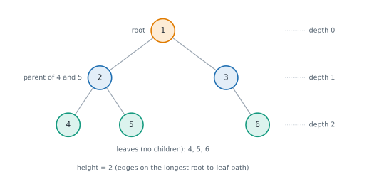

# Lesson 29: Binary trees and traversals

**You'll learn:** tree vocabulary, full, complete and balanced trees, building a tree from a list, preorder, inorder and postorder, iterative traversals with a stack, level-order traversal with a queue, recursive "ask the children" thinking.

▶ **Practise this lesson in the [sandbox](https://kishoremadanagopal.github.io/learning/dsa/#binary-trees)**: run every example and check your exercise answers.

## Key terms

- **Tree:** a hierarchy of nodes with one root, where every other node has exactly one parent.
- **Binary tree:** a tree where each node has at most two children, left and right.
- **Root / leaf:** the top node / a node with no children.
- **Depth / height:** edges from the root down to a node / edges on the longest root-to-leaf path.
- **Complete binary tree:** every level full except possibly the last, which fills from the left.
- **Balanced tree:** a tree whose height stays O(log n).
- **Depth-first search (DFS):** exploring as deep as possible along a branch before backing up.
- **Preorder / inorder / postorder:** visiting the node before, between or after its two subtrees.
- **Breadth-first search (BFS):** visiting level by level, using a queue.

A **tree** is a hierarchy: one **root** at the top, and every other node has exactly one **parent**. A **binary tree** limits each node to at most two **children**, a left and a right. Trees are everywhere: folders on a disk, the HTML of a web page, an organisation chart, a decision tree in machine learning, and the parse tree a compiler builds from your code.



| Term | Meaning |
|---|---|
| **root** | the top node (no parent) |
| **leaf** | a node with no children |
| **depth** of a node | edges from the root down to it (the root has depth 0) |
| **height** of a tree | edges on the longest root-to-leaf path |
| **subtree** | a node together with everything below it |
| **full** binary tree | every node has 0 or 2 children |
| **complete** binary tree | every level full, except possibly the last, which fills from the left (heaps are complete) |
| **balanced** | heights of left and right subtrees differ by at most 1 everywhere: height O(log n) |

A tree with n nodes has n − 1 edges. A balanced tree's height is about log₂ n; a "degenerate" tree where each node has one child is just a linked list, with height n − 1.

## Nodes, and building a tree from a list

```python
class TreeNode:
    def __init__(self, val, left=None, right=None):
        self.val, self.left, self.right = val, left, right

def build(values):
    """Build a tree from level-order values, with None for missing children (LeetCode style)."""
    if not values or values[0] is None:
        return None
    from collections import deque
    root = TreeNode(values[0])
    queue, i = deque([root]), 1
    while queue and i < len(values):
        node = queue.popleft()
        if i < len(values) and values[i] is not None:
            node.left = TreeNode(values[i]); queue.append(node.left)
        i += 1
        if i < len(values) and values[i] is not None:
            node.right = TreeNode(values[i]); queue.append(node.right)
        i += 1
    return root

root = build([1, 2, 3, 4, 5, None, 6])
print(root.val, root.left.val, root.right.val, root.left.left.val, root.right.right.val)
```

## Depth-first traversals

**Depth-first search (DFS)** goes as deep as possible down one branch before backing up. The three orders differ only in **when** you visit the node relative to its subtrees:

| Order | Visit | For the tree above | Typical use |
|---|---|---|---|
| **Preorder** | node, left, right | 1 2 4 5 3 6 | copying or serialising a tree |
| **Inorder** | left, node, right | 4 2 5 1 3 6 | sorted order in a binary search tree |
| **Postorder** | left, right, node | 4 5 2 6 3 1 | deleting a tree, computing sizes or heights (children first) |

```python
class TreeNode:
    def __init__(self, val, left=None, right=None):
        self.val, self.left, self.right = val, left, right

root = TreeNode(1, TreeNode(2, TreeNode(4), TreeNode(5)), TreeNode(3, None, TreeNode(6)))

def preorder(node, out):
    if node:
        out.append(node.val)
        preorder(node.left, out)
        preorder(node.right, out)
    return out

def inorder(node, out):
    if node:
        inorder(node.left, out)
        out.append(node.val)
        inorder(node.right, out)
    return out

def postorder(node, out):
    if node:
        postorder(node.left, out)
        postorder(node.right, out)
        out.append(node.val)
    return out

print("pre: ", preorder(root, []))
print("in:  ", inorder(root, []))
print("post:", postorder(root, []))
```

Each visits every node once: **O(n) time**, and **O(h) space** for the recursion, where h is the height (O(log n) balanced, O(n) for a degenerate tree).

## The same traversals with an explicit stack

For very deep trees, Python's recursion limit bites. Any recursion can use your own stack instead:

```python
class TreeNode:
    def __init__(self, val, left=None, right=None):
        self.val, self.left, self.right = val, left, right

root = TreeNode(1, TreeNode(2, TreeNode(4), TreeNode(5)), TreeNode(3, None, TreeNode(6)))

def preorder_iter(root):
    out, stack = [], [root] if root else []
    while stack:
        node = stack.pop()
        out.append(node.val)
        if node.right: stack.append(node.right)   # push right first, so left is popped first
        if node.left: stack.append(node.left)
    return out

def inorder_iter(root):
    out, stack, node = [], [], root
    while stack or node:
        while node:                     # go as far left as possible
            stack.append(node)
            node = node.left
        node = stack.pop()              # the leftmost unvisited node
        out.append(node.val)
        node = node.right               # then its right subtree
    return out

print(preorder_iter(root), inorder_iter(root))
```

## Breadth-first (level-order) traversal

**Breadth-first search (BFS)** visits the tree level by level, using a **queue**: take a node from the front, add its children to the back. Processing `len(queue)` nodes at a time separates the levels.

```python
from collections import deque

class TreeNode:
    def __init__(self, val, left=None, right=None):
        self.val, self.left, self.right = val, left, right

root = TreeNode(1, TreeNode(2, TreeNode(4), TreeNode(5)), TreeNode(3, None, TreeNode(6)))

def level_order(root):
    if not root:
        return []
    levels, queue = [], deque([root])
    while queue:
        level = []
        for _ in range(len(queue)):        # exactly the nodes of this level
            node = queue.popleft()
            level.append(node.val)
            if node.left: queue.append(node.left)
            if node.right: queue.append(node.right)
        levels.append(level)
    return levels

print(level_order(root))
```

O(n) time, O(w) space where w is the widest level (up to about n/2 for the last level of a full tree). BFS finds things **closest to the root first**, such as the minimum depth or the first node with some property; DFS goes deep first and uses less memory on wide, shallow trees.

## Solving tree problems recursively

Most tree questions are answered by the same move: **ask each subtree, then combine**. The height of a tree is 1 + the larger height of its two subtrees; the number of nodes is 1 + left count + right count. That's postorder thinking: children first.

```python
class TreeNode:
    def __init__(self, val, left=None, right=None):
        self.val, self.left, self.right = val, left, right

root = TreeNode(1, TreeNode(2, TreeNode(4), TreeNode(5)), TreeNode(3, None, TreeNode(6)))

def count(node):
    return 0 if node is None else 1 + count(node.left) + count(node.right)

def total(node):
    return 0 if node is None else node.val + total(node.left) + total(node.right)

def leaves(node):
    if node is None:
        return 0
    if node.left is None and node.right is None:
        return 1
    return leaves(node.left) + leaves(node.right)

print(count(root), total(root), leaves(root))
```

## At a glance

| Concept | Approach | Time | Space |
|---|---|---|---|
| Preorder / inorder / postorder (recursive) | visit node before / between / after the subtrees | O(n) | O(h) |
| Iterative DFS | explicit stack; push right before left for preorder | O(n) | O(h) |
| Level order (BFS) | queue; pop len(queue) nodes per level | O(n) | O(w), the widest level |
| Max depth | 1 + max(depth(left), depth(right)) | O(n) | O(h) |
| Count / sum of nodes | 1 + count(left) + count(right) | O(n) | O(h) |
| Build from a level-order list | queue of nodes waiting for children | O(n) | O(n) |

## Common mistakes

- Forgetting the `None` base case, so the code crashes on `None.left`.
- Using `list.pop(0)` as the BFS queue instead of `deque.popleft()`.
- Not fixing `len(queue)` before the inner loop, which mixes levels together.
- Recursing on very deep (chain-like) trees past Python's recursion limit; use an explicit stack.

## Exercises

### 1. Maximum depth

Write `max_depth(root)` returning the number of nodes on the longest path from the root down to a leaf (an empty tree has depth 0, a single node has depth 1). `TreeNode` and `build` are in the starter.

Starter code:

```python
from collections import deque

class TreeNode:
    def __init__(self, val, left=None, right=None):
        self.val = val
        self.left = left
        self.right = right

def build(values):
    if not values or values[0] is None:
        return None
    root = TreeNode(values[0])
    queue, i = deque([root]), 1
    while queue and i < len(values):
        node = queue.popleft()
        if i < len(values) and values[i] is not None:
            node.left = TreeNode(values[i]); queue.append(node.left)
        i += 1
        if i < len(values) and values[i] is not None:
            node.right = TreeNode(values[i]); queue.append(node.right)
        i += 1
    return root

def max_depth(root):
    pass

print(max_depth(build([3, 9, 20, None, None, 15, 7])))   # 3
```

<details>
<summary>🧭 How to approach it</summary>

1. **Understand:** count nodes (not edges) on the longest root-to-leaf path; None → 0.
2. **Examples:** [3, 9, 20, None, None, 15, 7] → 3 (3 → 20 → 15); [1] → 1.
3. **Brute force:** list every root-to-leaf path and take the longest: works, but more code and memory.
4. **Pattern:** **ask both subtrees, combine** (postorder recursion).
5. **Plan:** base case None → 0; otherwise 1 + max of the two recursive answers.
6. **Code and test:** empty tree, single node, a one-sided chain.

</details>

<details>
<summary>💡 Hint 1</summary>

If you knew the depths of the left and right subtrees, how would you get the depth of the whole tree?

</details>

<details>
<summary>💡 Hint 2</summary>

It's 1 (for the root) plus the bigger of the two subtree depths. An empty tree (None) has depth 0: that's the base case.

</details>

<details>
<summary>💡 Hint 3</summary>

`if root is None: return 0`, then `return 1 + max(max_depth(root.left), max_depth(root.right))`.

</details>

### 2. Level order traversal

Write `level_order(root)` returning the values level by level, as a list of lists from the top level down (left to right within a level). An empty tree gives `[]`.

Starter code:

```python
from collections import deque

class TreeNode:
    def __init__(self, val, left=None, right=None):
        self.val = val
        self.left = left
        self.right = right

def build(values):
    if not values or values[0] is None:
        return None
    root = TreeNode(values[0])
    queue, i = deque([root]), 1
    while queue and i < len(values):
        node = queue.popleft()
        if i < len(values) and values[i] is not None:
            node.left = TreeNode(values[i]); queue.append(node.left)
        i += 1
        if i < len(values) and values[i] is not None:
            node.right = TreeNode(values[i]); queue.append(node.right)
        i += 1
    return root

def level_order(root):
    pass

print(level_order(build([3, 9, 20, None, None, 15, 7])))   # [[3], [9, 20], [15, 7]]
```

<details>
<summary>🧭 How to approach it</summary>

1. **Understand:** one list per level, top to bottom, left to right; empty tree → [].
2. **Examples:** [3, 9, 20, None, None, 15, 7] → [[3], [9, 20], [15, 7]].
3. **Brute force:** DFS with a depth parameter, appending to `levels[depth]`: also O(n) and a fine alternative.
4. **Pattern:** **BFS with a queue**, processing one level per round.
5. **Plan:** queue starts with the root; each round pops `len(queue)` nodes into a list and enqueues their children.
6. **Code and test:** empty, one node, chains on each side.

</details>

<details>
<summary>💡 Hint 1</summary>

Which data structure gives you nodes in the order "all of level 0, then all of level 1, …"?

</details>

<details>
<summary>💡 Hint 2</summary>

A queue (`collections.deque`). Take a node from the front and put its children at the back.

</details>

<details>
<summary>💡 Hint 3</summary>

To group by level, at the start of each round note `len(queue)`: exactly that many nodes belong to the current level. Pop that many, collecting their values and pushing their children.

</details>

**In the sandbox:** exercises 61–62. Press **Check** to run the hidden tests.

### Answers and walkthroughs

Open these only after a real attempt. Each one explains the solution step by step.

<details>
<summary>✅ 1. Maximum depth</summary>

```python
from collections import deque

class TreeNode:
    def __init__(self, val, left=None, right=None):
        self.val = val
        self.left = left
        self.right = right

def build(values):
    if not values or values[0] is None:
        return None
    root = TreeNode(values[0])
    queue, i = deque([root]), 1
    while queue and i < len(values):
        node = queue.popleft()
        if i < len(values) and values[i] is not None:
            node.left = TreeNode(values[i]); queue.append(node.left)
        i += 1
        if i < len(values) and values[i] is not None:
            node.right = TreeNode(values[i]); queue.append(node.right)
        i += 1
    return root

def max_depth(root):
    if root is None:
        return 0                                     # an empty tree has depth 0
    return 1 + max(max_depth(root.left), max_depth(root.right))

print(max_depth(build([3, 9, 20, None, None, 15, 7])))
```

**Line by line**

- The base case makes `None` children count as depth 0, so leaves get 1 + max(0, 0) = 1 with no special case.
- Leap of faith: `max_depth(root.left)` is the depth of the left subtree; the same for the right.
- The root adds one more level on top of the deeper subtree.

**Trace** on [3, 9, 20, None, None, 15, 7]:

| call | left | right | returns |
|---|---|---|---|
| 9 | 0 | 0 | 1 |
| 15, 7 | 0 | 0 | 1 each |
| 20 | 1 | 1 | 2 |
| 3 | 1 (from 9) | 2 (from 20) | **3** |

**Complexity:** O(n) time, O(h) recursion space.

**Common wrong approach:** returning `max(...)` without the `1 +`, so every tree reports depth 0.

</details>

<details>
<summary>✅ 2. Level order traversal</summary>

```python
from collections import deque

class TreeNode:
    def __init__(self, val, left=None, right=None):
        self.val = val
        self.left = left
        self.right = right

def build(values):
    if not values or values[0] is None:
        return None
    root = TreeNode(values[0])
    queue, i = deque([root]), 1
    while queue and i < len(values):
        node = queue.popleft()
        if i < len(values) and values[i] is not None:
            node.left = TreeNode(values[i]); queue.append(node.left)
        i += 1
        if i < len(values) and values[i] is not None:
            node.right = TreeNode(values[i]); queue.append(node.right)
        i += 1
    return root

def level_order(root):
    if root is None:
        return []
    levels, queue = [], deque([root])
    while queue:
        level = []
        for _ in range(len(queue)):        # the queue holds exactly one level right now
            node = queue.popleft()
            level.append(node.val)
            if node.left:
                queue.append(node.left)
            if node.right:
                queue.append(node.right)
        levels.append(level)
    return levels

print(level_order(build([3, 9, 20, None, None, 15, 7])))
```

**Line by line**

- The queue always contains nodes in level order, because children are added at the back after all nodes of the current level.
- At the start of a round, the queue holds exactly the next level, so `range(len(queue))` pops precisely that level even while children are being appended behind it.
- `level` collects the values; `levels.append(level)` stores the finished level.

**Trace** on [3, 9, 20, None, None, 15, 7]:

| round | queue at start | level | queue at end |
|---|---|---|---|
| 1 | 3 | [3] | 9, 20 |
| 2 | 9, 20 | [9, 20] | 15, 7 |
| 3 | 15, 7 | [15, 7] | — |

**Complexity:** O(n) time, O(w) space for the widest level.

**Common wrong approach:** using a list with `pop(0)` as the queue (O(n) per pop), or not fixing the level size before the inner loop, which mixes levels together.

</details>

## Quick quiz

1. Which traversal of a tree visits the node between its left and right subtrees?
   - A) Inorder
   - B) Preorder
   - C) Postorder

2. What data structure does breadth-first (level-order) traversal use?
   - A) A queue
   - B) A stack
   - C) A hash set

3. What is the recursion space of a DFS traversal?
   - A) O(h), the height of the tree
   - B) O(1)
   - C) O(n²)

4. A binary tree where every level is full except the last, which fills from the left, is called:
   - A) Complete
   - B) Full
   - C) Degenerate

<details>
<summary>Quiz answers</summary>

1. **A) Inorder**: In, as in "in between": left, node, right.
2. **A) A queue**: First in, first out keeps the nodes in level order. DFS uses a stack (or recursion).
3. **A) O(h), the height of the tree**: One frame per level on the current path: O(log n) when balanced, O(n) for a chain.
4. **A) Complete**: Heaps are complete binary trees, which is why they fit neatly in an array.

</details>

---
Previous: [Lesson 28](28-sorting-in-practice.md) · Next: [Lesson 30: Classic tree problems](30-tree-problems.md)
