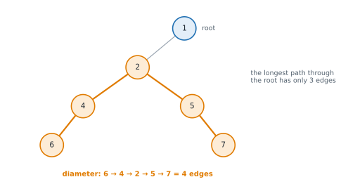

# Lesson 30: Classic tree problems

**You'll learn:** returning information from subtrees, diameter, checking balance, root-to-leaf path sums, inverting and checking symmetry, lowest common ancestor, serialising and deserialising, rebuilding a tree from preorder and inorder.

▶ **Practise this lesson in the [sandbox](https://kishoremadanagopal.github.io/learning/dsa/#tree-problems)**: run every example and check your exercise answers.

## Key terms

- **Diameter:** the number of edges on the longest path between any two nodes.
- **Height-balanced:** at every node, the left and right subtree heights differ by at most 1.
- **Lowest common ancestor (LCA):** the deepest node that has both given nodes in its subtree.
- **Mirror (invert):** swapping every node's left and right children.
- **Serialise / deserialise:** turning a tree into a string / rebuilding the tree from it.
- **Sentinel:** a special value (like −1 or `#`) that signals "empty" or "invalid".

Most tree problems follow one recursive shape: a helper that returns some **information about a subtree** (its height, its sum, whether it's balanced), and the parent **combines** its children's information. Sometimes the helper also updates a best-so-far answer on the side.

## Diameter: the longest path between any two nodes

The longest path might not pass through the root. For every node, the longest path **through** it is (height of left subtree) + (height of right subtree), counted in edges. One postorder pass computes heights and tracks the best sum.



```python
class TreeNode:
    def __init__(self, val, left=None, right=None):
        self.val, self.left, self.right = val, left, right

def diameter(root):
    best = 0
    def height(node):                    # returns the height in nodes; updates best on the side
        nonlocal best
        if node is None:
            return 0
        left, right = height(node.left), height(node.right)
        best = max(best, left + right)   # edges on the longest path through this node
        return 1 + max(left, right)
    height(root)
    return best

root = TreeNode(1, TreeNode(2, TreeNode(4), TreeNode(5)), TreeNode(3))
print(diameter(root))      # 4 -> 2 -> 1 -> 3: 3 edges
```

## Is it balanced?

Balanced means every node's subtrees differ in height by at most 1. Checking heights at every node separately is O(n²); returning −1 as a "not balanced" signal keeps it to one O(n) pass.

```python
class TreeNode:
    def __init__(self, val, left=None, right=None):
        self.val, self.left, self.right = val, left, right

def is_balanced(root):
    def height(node):                    # -1 means "unbalanced somewhere below"
        if node is None:
            return 0
        left = height(node.left)
        right = height(node.right)
        if left == -1 or right == -1 or abs(left - right) > 1:
            return -1
        return 1 + max(left, right)
    return height(root) != -1

balanced = TreeNode(1, TreeNode(2, TreeNode(4)), TreeNode(3))
chain = TreeNode(1, TreeNode(2, TreeNode(3)))
print(is_balanced(balanced), is_balanced(chain))
```

## Root-to-leaf path sums: passing information down

Some problems pass information **down** instead (preorder style): the sum so far on the way to each leaf.

```python
class TreeNode:
    def __init__(self, val, left=None, right=None):
        self.val, self.left, self.right = val, left, right

def paths_with_sum(root, target):
    found = []
    def walk(node, path, remaining):
        if node is None:
            return
        path.append(node.val)
        remaining -= node.val
        if node.left is None and node.right is None and remaining == 0:
            found.append(path[:])
        walk(node.left, path, remaining)
        walk(node.right, path, remaining)
        path.pop()                       # backtrack
    walk(root, [], target)
    return found

root = TreeNode(5, TreeNode(4, TreeNode(11, TreeNode(7), TreeNode(2))), TreeNode(8, TreeNode(13), TreeNode(4, TreeNode(5), TreeNode(1))))
print(paths_with_sum(root, 22))
```

## Invert (mirror) a tree, and check symmetry

```python
class TreeNode:
    def __init__(self, val, left=None, right=None):
        self.val, self.left, self.right = val, left, right

def invert(node):
    if node:
        node.left, node.right = invert(node.right), invert(node.left)
    return node

def is_mirror(a, b):
    if a is None or b is None:
        return a is b                          # both empty is a match; one empty is not
    return a.val == b.val and is_mirror(a.left, b.right) and is_mirror(a.right, b.left)

def is_symmetric(root):
    return root is None or is_mirror(root.left, root.right)

def preorder(node):
    return [] if node is None else [node.val] + preorder(node.left) + preorder(node.right)

t = TreeNode(1, TreeNode(2, TreeNode(3)), TreeNode(4))
print(preorder(invert(t)))
sym = TreeNode(1, TreeNode(2, TreeNode(3), TreeNode(4)), TreeNode(2, TreeNode(4), TreeNode(3)))
print(is_symmetric(sym))
```

## Lowest common ancestor (LCA)

The **lowest common ancestor** of two nodes is the deepest node that has both of them in its subtree (a node counts as its own ancestor). Ask each subtree "did you find p or q?": the first node where **both** sides answer yes, or that is p or q itself with the other below it, is the LCA.

```python
class TreeNode:
    def __init__(self, val, left=None, right=None):
        self.val, self.left, self.right = val, left, right

def lca(root, p, q):
    if root is None or root is p or root is q:
        return root
    left = lca(root.left, p, q)
    right = lca(root.right, p, q)
    if left and right:
        return root                    # p and q are on different sides: root is the split point
    return left or right               # both on one side (or only one found so far)

n6, n0, n8, n7, n4 = TreeNode(6), TreeNode(0), TreeNode(8), TreeNode(7), TreeNode(4)
n5 = TreeNode(5, n6, TreeNode(2, n7, n4)); n1 = TreeNode(1, n0, n8)
root = TreeNode(3, n5, n1)
print(lca(root, n5, n1).val, lca(root, n6, n4).val, lca(root, n5, n4).val)
```

O(n) time, O(h) space. (For a binary search tree there's a faster O(h) method in the next lesson.)

## Serialise and deserialise

To save a tree to a file or send it over a network, turn it into a string (**serialise**) and back (**deserialise**). Preorder with a marker for empty children is enough to rebuild it exactly.

```python
class TreeNode:
    def __init__(self, val, left=None, right=None):
        self.val, self.left, self.right = val, left, right

def serialise(node):
    if node is None:
        return "#"
    return f"{node.val},{serialise(node.left)},{serialise(node.right)}"

def deserialise(text):
    tokens = iter(text.split(","))
    def read():
        tok = next(tokens)
        if tok == "#":
            return None
        node = TreeNode(int(tok))
        node.left = read()
        node.right = read()
        return node
    return read()

t = TreeNode(1, TreeNode(2), TreeNode(3, TreeNode(4), TreeNode(5)))
s = serialise(t)
print(s)
print(serialise(deserialise(s)) == s)
```

## Rebuild a tree from preorder and inorder

Preorder's first value is the root; its position in the inorder list splits the left and right subtrees. A dict from value to inorder index makes each split O(1), so the whole rebuild is O(n).

```python
class TreeNode:
    def __init__(self, val, left=None, right=None):
        self.val, self.left, self.right = val, left, right

def build_tree(preorder, inorder):
    where = {v: i for i, v in enumerate(inorder)}
    pre = iter(preorder)
    def make(lo, hi):                    # build from inorder[lo..hi]
        if lo > hi:
            return None
        val = next(pre)                  # the next preorder value is this subtree's root
        node = TreeNode(val)
        node.left = make(lo, where[val] - 1)
        node.right = make(where[val] + 1, hi)
        return node
    return make(0, len(inorder) - 1)

def postorder(n):
    return [] if n is None else postorder(n.left) + postorder(n.right) + [n.val]

print(postorder(build_tree([3, 9, 20, 15, 7], [9, 3, 15, 20, 7])))
```

## At a glance

| Concept | Approach | Time | Space |
|---|---|---|---|
| Diameter | height helper; best = max(best, left + right) | O(n) | O(h) |
| Is balanced | height helper returning −1 for "unbalanced" | O(n) | O(h) |
| Root-to-leaf paths with a sum | DFS passing the remaining sum down; backtrack the path | O(n) per path copy, O(n²) worst | O(h) |
| Invert a tree | swap children recursively | O(n) | O(h) |
| Is symmetric | compare left.left with right.right and left.right with right.left | O(n) | O(h) |
| Lowest common ancestor | return p/q/None from each side; both non-None → this node | O(n) | O(h) |
| Serialise / deserialise | preorder with "#" for empty children | O(n) | O(n) |
| Build from preorder + inorder | next preorder value is the root; dict of inorder positions splits | O(n) | O(n) |

## Common mistakes

- Only checking the root for the diameter, when the longest path may lie inside a subtree.
- Recomputing heights at every node, which makes balance or diameter O(n²).
- Comparing node values instead of node identity in LCA when values can repeat.
- Saving `path` instead of `path[:]` when collecting root-to-leaf paths.

## Exercises

### 1. Diameter of a binary tree

Write `diameter(root)` returning the number of **edges** on the longest path between any two nodes. One pass: O(n).

Starter code:

```python
from collections import deque

class TreeNode:
    def __init__(self, val, left=None, right=None):
        self.val = val
        self.left = left
        self.right = right

def build(values):
    if not values or values[0] is None:
        return None
    root = TreeNode(values[0])
    queue, i = deque([root]), 1
    while queue and i < len(values):
        node = queue.popleft()
        if i < len(values) and values[i] is not None:
            node.left = TreeNode(values[i]); queue.append(node.left)
        i += 1
        if i < len(values) and values[i] is not None:
            node.right = TreeNode(values[i]); queue.append(node.right)
        i += 1
    return root

def diameter(root):
    pass

print(diameter(build([1, 2, 3, 4, 5])))   # 3
```

<details>
<summary>🧭 How to approach it</summary>

1. **Understand:** count edges; the path may skip the root; empty or single node → 0.
2. **Examples:** [1, 2, 3, 4, 5] → 3 (4 → 2 → 1 → 3).
3. **Brute force:** at every node, compute both heights from scratch: O(n²) on a long tree.
4. **Pattern:** **return info from children + track a global best** (postorder).
5. **Plan:** height helper; at each node, left + right is a candidate; return 1 + the larger.
6. **Code and test:** a path that avoids the root, a single node.

</details>

<details>
<summary>💡 Hint 1</summary>

Every path has a highest node where it "turns". How long is the longest path that turns at a given node?

</details>

<details>
<summary>💡 Hint 2</summary>

Height of its left subtree + height of its right subtree (in edges, that's the number of nodes on each side's longest downward path). The answer is the best of these over all nodes.

</details>

<details>
<summary>💡 Hint 3</summary>

Write `height(node)` returning `1 + max(left, right)` (0 for None), and inside it update a `nonlocal best = max(best, left + right)`. Return `best`.

</details>

### 2. Lowest common ancestor

Write `lowest_common_ancestor(root, p, q)` returning the **node** that is the deepest ancestor of both `p` and `q` (nodes of the tree; a node is an ancestor of itself). Both are guaranteed to be in the tree.

Starter code:

```python
from collections import deque

class TreeNode:
    def __init__(self, val, left=None, right=None):
        self.val = val
        self.left = left
        self.right = right

def build(values):
    if not values or values[0] is None:
        return None
    root = TreeNode(values[0])
    queue, i = deque([root]), 1
    while queue and i < len(values):
        node = queue.popleft()
        if i < len(values) and values[i] is not None:
            node.left = TreeNode(values[i]); queue.append(node.left)
        i += 1
        if i < len(values) and values[i] is not None:
            node.right = TreeNode(values[i]); queue.append(node.right)
        i += 1
    return root

def find(root, val):
    if root is None or root.val == val:
        return root
    return find(root.left, val) or find(root.right, val)

def lowest_common_ancestor(root, p, q):
    pass

root = build([3, 5, 1, 6, 2, 0, 8, None, None, 7, 4])
print(lowest_common_ancestor(root, find(root, 5), find(root, 1)).val)   # 3
```

<details>
<summary>🧭 How to approach it</summary>

1. **Understand:** return a node; p and q exist; a node can be its own ancestor.
2. **Examples:** in the sample tree, LCA(5, 1) = 3; LCA(5, 4) = 5; LCA(7, 4) = 2.
3. **Brute force:** store the root-to-p and root-to-q paths, then find the last common node: O(n) time but O(n) extra space and more code.
4. **Pattern:** **return info from children**: each call reports what it found.
5. **Plan:** base cases: None, p or q; combine the two child answers.
6. **Code and test:** one node being the ancestor of the other, p == q, siblings.

</details>

<details>
<summary>💡 Hint 1</summary>

Ask each subtree a yes/no question: "does it contain p or q?" Where do the answers first meet?

</details>

<details>
<summary>💡 Hint 2</summary>

If p is found in the left subtree and q in the right, the current node is the LCA. If both are on one side, the LCA is on that side.

</details>

<details>
<summary>💡 Hint 3</summary>

Return `root` if it's None, p or q. Recurse left and right. If both results are non-None, return `root`; otherwise return whichever is non-None.

</details>

**In the sandbox:** exercises 63–64. Press **Check** to run the hidden tests.

### Answers and walkthroughs

Open these only after a real attempt. Each one explains the solution step by step.

<details>
<summary>✅ 1. Diameter of a binary tree</summary>

```python
from collections import deque

class TreeNode:
    def __init__(self, val, left=None, right=None):
        self.val = val
        self.left = left
        self.right = right

def build(values):
    if not values or values[0] is None:
        return None
    root = TreeNode(values[0])
    queue, i = deque([root]), 1
    while queue and i < len(values):
        node = queue.popleft()
        if i < len(values) and values[i] is not None:
            node.left = TreeNode(values[i]); queue.append(node.left)
        i += 1
        if i < len(values) and values[i] is not None:
            node.right = TreeNode(values[i]); queue.append(node.right)
        i += 1
    return root

def diameter(root):
    best = 0

    def height(node):
        nonlocal best
        if node is None:
            return 0
        left = height(node.left)
        right = height(node.right)
        best = max(best, left + right)      # longest path that turns at this node
        return 1 + max(left, right)

    height(root)
    return best

print(diameter(build([1, 2, 3, 4, 5])))
```

**Line by line**

- `height(node)` returns the number of nodes on the longest downward path from `node`, and 0 for `None`.
- At each node, `left + right` counts the edges on the longest path that goes down both sides from here: left edges plus right edges.
- `best` remembers the largest such value over all nodes, because the longest path can turn at any node, not only the root.
- Every node is visited once.

**Trace** on [1, 2, 3, 4, 5]:

| node | left height | right height | left + right | returns |
|---|---|---|---|---|
| 4, 5, 3 | 0 | 0 | 0 | 1 |
| 2 | 1 | 1 | 2 | 2 |
| 1 | 2 | 1 | **3** | 3 |

**Complexity:** O(n) time, O(h) space.

**Common wrong approach:** returning `height(root.left) + height(root.right)` only for the root: a tree whose longest path lives inside one subtree gets the wrong answer.

</details>

<details>
<summary>✅ 2. Lowest common ancestor</summary>

```python
from collections import deque

class TreeNode:
    def __init__(self, val, left=None, right=None):
        self.val = val
        self.left = left
        self.right = right

def build(values):
    if not values or values[0] is None:
        return None
    root = TreeNode(values[0])
    queue, i = deque([root]), 1
    while queue and i < len(values):
        node = queue.popleft()
        if i < len(values) and values[i] is not None:
            node.left = TreeNode(values[i]); queue.append(node.left)
        i += 1
        if i < len(values) and values[i] is not None:
            node.right = TreeNode(values[i]); queue.append(node.right)
        i += 1
    return root

def find(root, val):
    if root is None or root.val == val:
        return root
    return find(root.left, val) or find(root.right, val)

def lowest_common_ancestor(root, p, q):
    if root is None or root is p or root is q:
        return root                       # found one of them (or nothing here)
    left = lowest_common_ancestor(root.left, p, q)
    right = lowest_common_ancestor(root.right, p, q)
    if left and right:
        return root                       # one on each side: this is where they split
    return left or right                  # pass up whichever side found something

root = build([3, 5, 1, 6, 2, 0, 8, None, None, 7, 4])
print(lowest_common_ancestor(root, find(root, 5), find(root, 1)).val)
```

**Line by line**

- If the current node is p or q, return it immediately: if the other node is below it, this node is the LCA; if not, the parent will combine it with the other side's result.
- `left` and `right` are what each subtree found: p, q, the LCA itself, or None.
- Both non-None means p and q are in different subtrees, so this node is the lowest point that contains both.
- Otherwise pass up whatever was found, so the information bubbles up to the split point.

**Trace** for p = 7, q = 4 in [3, 5, 1, 6, 2, 0, 8, None, None, 7, 4]:

| node | left result | right result | returns |
|---|---|---|---|
| 6 | None | None | None |
| 7 | — (is p) | | 7 |
| 4 | — (is q) | | 4 |
| 2 | 7 | 4 | **2** (split point) |
| 5 | None (from 6) | 2 | 2 |
| 1 | None | None | None |
| 3 | 2 | None | 2 |

**Complexity:** O(n) time, O(h) space.

**Common wrong approach:** comparing values (`root.val == p.val`) instead of identity, which breaks when values repeat, or returning `root.val` instead of the node.

</details>

## Quick quiz

1. Why does the diameter not always pass through the root?
   - A) The two deepest branches can sit inside one subtree, below the root
   - B) Because the root has no children
   - C) It always does

2. Checking balance by computing heights separately at every node costs:
   - A) O(n²) in the worst case; returning heights from children makes it O(n)
   - B) O(log n)
   - C) O(1)

3. In the LCA algorithm, when is the current node the answer?
   - A) When p is found in one subtree and q in the other (or the node is p or q with the other below it)
   - B) When it's the root
   - C) When it's a leaf

4. Which pair of traversals is enough to rebuild a binary tree with distinct values?
   - A) Preorder and inorder
   - B) Preorder and postorder, always
   - C) Inorder alone

<details>
<summary>Quiz answers</summary>

1. **A) The two deepest branches can sit inside one subtree, below the root**: That's why each node's left + right height is a candidate, not just the root's.
2. **A) O(n²) in the worst case; returning heights from children makes it O(n)**: Combining children's results avoids recomputing heights.
3. **A) When p is found in one subtree and q in the other (or the node is p or q with the other below it)**: The first node where the two searches meet is the lowest common ancestor.
4. **A) Preorder and inorder**: Preorder gives the roots; inorder tells you which values go left and which go right.

</details>

---
Previous: [Lesson 29](29-binary-trees.md) · Next: [Lesson 31: Binary search trees](31-bst.md)
