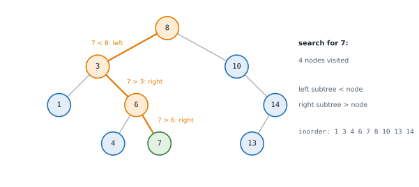
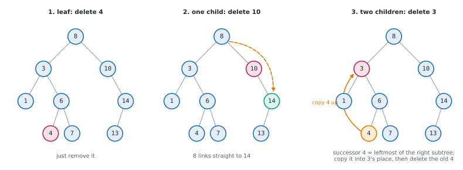
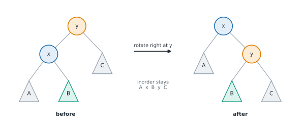

# Lesson 31: Binary search trees

**You'll learn:** the BST ordering rule, search and insert, minimum and maximum, floor and ceiling, k-th smallest, deleting a node, validating with bounds, LCA in a BST, degenerate trees, rotations, AVL and red-black trees, B-trees, sorted collections in Python.

▶ **Practise this lesson in the [sandbox](https://kishoremadanagopal.github.io/learning/dsa/#bst)**: run every example and check your exercise answers.

## Key terms

- **Binary search tree (BST):** a binary tree where every left subtree holds smaller values and every right subtree bigger ones.
- **Inorder successor:** the next value in sorted order; for a node with a right subtree, the leftmost node of that subtree.
- **Floor / ceiling:** the largest value ≤ x / the smallest value ≥ x.
- **Degenerate tree:** a tree where every node has one child, so it behaves like a linked list.
- **Self-balancing BST:** a BST that restructures itself to keep its height O(log n).
- **Rotation:** an O(1) restructuring that lifts a child above its parent while keeping the sorted order.
- **AVL tree:** a self-balancing BST where sibling subtree heights differ by at most 1.
- **Red-black tree:** a self-balancing BST using node colours; used by many standard libraries.
- **B-tree:** a balanced search tree with many keys per node, used by databases and file systems.

A **binary search tree (BST)** is a binary tree with one ordering rule at **every** node: everything in the left subtree is smaller than the node, and everything in the right subtree is bigger. That rule turns the tree into a binary search you can also insert into and delete from: each comparison sends you left or right and skips a whole subtree.



Every operation walks one root-to-leaf path, so it costs **O(h)**, where h is the height: **O(log n)** if the tree is balanced, but **O(n)** if it has degenerated into a chain.

## Search and insert

```python
class TreeNode:
    def __init__(self, val, left=None, right=None):
        self.val, self.left, self.right = val, left, right

def search(root, val):
    node = root
    while node and node.val != val:
        node = node.left if val < node.val else node.right   # one comparison discards a subtree
    return node

def insert(root, val):
    if root is None:
        return TreeNode(val)
    node = root
    while True:
        if val < node.val:
            if node.left is None:
                node.left = TreeNode(val)
                return root
            node = node.left
        elif val > node.val:
            if node.right is None:
                node.right = TreeNode(val)
                return root
            node = node.right
        else:
            return root                  # already there: this BST keeps values unique

def inorder(node):
    return [] if node is None else inorder(node.left) + [node.val] + inorder(node.right)

root = None
for v in [8, 3, 10, 1, 6, 14, 4, 7, 13]:
    root = insert(root, v)
print(inorder(root))                     # inorder of a BST is always sorted
print(search(root, 7) is not None, search(root, 5) is not None)
```

New values are always added as **leaves**. The smallest value is found by going left until you can't; the largest by going right.

## Floor, ceiling and the k-th smallest

The **floor** of x is the largest value ≤ x; the **ceiling** is the smallest value ≥ x. Walk down as in a search, remembering the best candidate seen. For the k-th smallest, run an inorder traversal and stop after k values.

```python
class TreeNode:
    def __init__(self, val, left=None, right=None):
        self.val, self.left, self.right = val, left, right

def floor(root, x):
    best, node = None, root
    while node:
        if node.val == x:
            return x
        if node.val < x:
            best = node.val              # a candidate; something bigger (but still <= x) may be on the right
            node = node.right
        else:
            node = node.left
    return best

def ceiling(root, x):
    best, node = None, root
    while node:
        if node.val == x:
            return x
        if node.val > x:
            best = node.val
            node = node.left
        else:
            node = node.right
    return best

def kth_smallest(root, k):
    stack, node = [], root
    while stack or node:
        while node:
            stack.append(node)
            node = node.left
        node = stack.pop()
        k -= 1
        if k == 0:
            return node.val              # stop early: O(h + k), not O(n)
        node = node.right

root = TreeNode(8, TreeNode(3, TreeNode(1), TreeNode(6, TreeNode(4), TreeNode(7))), TreeNode(10, None, TreeNode(14, TreeNode(13))))
print(floor(root, 5), ceiling(root, 5), floor(root, 0), ceiling(root, 15))
print([kth_smallest(root, k) for k in (1, 3, 9)])
```

## Deleting a node

Deleting needs care, because the tree must stay a BST. There are three cases:

1. **A leaf:** just remove it.
2. **One child:** replace the node with its child.
3. **Two children:** copy in the **inorder successor** (the smallest value of the right subtree, found by going right once and then left all the way), then delete that successor from the right subtree. The successor has no left child, so its own deletion is case 1 or 2.



```python
class TreeNode:
    def __init__(self, val, left=None, right=None):
        self.val, self.left, self.right = val, left, right

def delete(root, key):
    if root is None:
        return None                              # key not found: nothing changes
    if key < root.val:
        root.left = delete(root.left, key)
    elif key > root.val:
        root.right = delete(root.right, key)
    else:
        if root.left is None:                    # cases 1 and 2: zero or one child
            return root.right
        if root.right is None:
            return root.left
        succ = root.right                        # case 3: smallest value on the right
        while succ.left:
            succ = succ.left
        root.val = succ.val
        root.right = delete(root.right, succ.val)
    return root

def inorder(node):
    return [] if node is None else inorder(node.left) + [node.val] + inorder(node.right)

root = TreeNode(8, TreeNode(3, TreeNode(1), TreeNode(6, TreeNode(4), TreeNode(7))), TreeNode(10, None, TreeNode(14, TreeNode(13))))
for key in (4, 10, 3, 8):
    root = delete(root, key)
    print(f"after deleting {key}: {inorder(root)}, root is {root.val}")
```

Each call goes down one path (plus one more walk for the successor), so deleting is O(h).

## Validating a BST

The tempting check, "left child < node < right child", isn't enough: a value deep in the left subtree could still be bigger than the root. Instead pass down the **range of values allowed** in each subtree. Going left lowers the upper bound; going right raises the lower bound.

```python
class TreeNode:
    def __init__(self, val, left=None, right=None):
        self.val, self.left, self.right = val, left, right

def is_bst(node, low=float("-inf"), high=float("inf")):
    if node is None:
        return True
    if not (low < node.val < high):
        return False
    return is_bst(node.left, low, node.val) and is_bst(node.right, node.val, high)

good = TreeNode(5, TreeNode(3, TreeNode(2), TreeNode(4)), TreeNode(8))
sneaky = TreeNode(5, TreeNode(3, TreeNode(2), TreeNode(6)), TreeNode(8))   # 6 is in 5's left subtree
print(is_bst(good), is_bst(sneaky))
```

An equivalent check: an inorder traversal must be **strictly increasing**.

## Lowest common ancestor in a BST

The ordering makes LCA easier than in a general tree: while both values are smaller than the node, go left; while both are bigger, go right; the first node where they split (or that equals one of them) is the answer. O(h) time and O(1) space.

```python
class TreeNode:
    def __init__(self, val, left=None, right=None):
        self.val, self.left, self.right = val, left, right

def lca_bst(root, p, q):
    node = root
    while node:
        if p < node.val and q < node.val:
            node = node.left
        elif p > node.val and q > node.val:
            node = node.right
        else:
            return node.val          # p and q split here (or one of them is this node)

root = TreeNode(6, TreeNode(2, TreeNode(0), TreeNode(4, TreeNode(3), TreeNode(5))), TreeNode(8, TreeNode(7), TreeNode(9)))
print(lca_bst(root, 2, 8), lca_bst(root, 3, 5), lca_bst(root, 2, 4))
```

## Why balance matters

The shape of a BST depends on the **order** of insertions. Random order gives a height around 2–3 × log₂ n; sorted order gives a chain, and every operation becomes O(n), no better than a list.

```python
import random

class TreeNode:
    def __init__(self, val):
        self.val, self.left, self.right = val, None, None

def insert(root, val):
    if root is None:
        return TreeNode(val)
    node = root
    while True:
        side = "left" if val < node.val else "right"
        child = getattr(node, side)
        if child is None:
            setattr(node, side, TreeNode(val))
            return root
        node = child

def height(root):                        # level by level, so a chain can't hit the recursion limit
    levels, level = -1, [root] if root else []
    while level:
        levels += 1
        level = [c for n in level for c in (n.left, n.right) if c]
    return levels

random.seed(1)
values = list(range(2000))
shuffled = values[:]
random.shuffle(shuffled)
for name, order in [("random order", shuffled), ("sorted order", values)]:
    root = None
    for v in order:
        root = insert(root, v)
    print(f"{name}: height {height(root)} (log2 of 2000 is about 11)")
```

## Self-balancing trees: AVL and red-black

A **self-balancing BST** restructures itself after inserts and deletes so the height stays O(log n). The basic move is a **rotation**: it lifts one child above its parent while keeping the inorder order, in O(1).



An **AVL tree** stores each node's height and rotates whenever the two subtrees of a node differ in height by more than 1. Inserting even sorted values keeps it perfectly shallow:

```python
class Node:
    def __init__(self, val):
        self.val, self.left, self.right, self.height = val, None, None, 1

def h(node):
    return node.height if node else 0

def update(node):
    node.height = 1 + max(h(node.left), h(node.right))

def rotate_right(y):
    x = y.left
    y.left = x.right                     # x's right subtree (B) moves under y
    x.right = y
    update(y)
    update(x)
    return x                             # x is the new top of this subtree

def rotate_left(x):
    y = x.right
    x.right = y.left
    y.left = x
    update(x)
    update(y)
    return y

def insert(node, val):
    if node is None:
        return Node(val)
    if val < node.val:
        node.left = insert(node.left, val)
    elif val > node.val:
        node.right = insert(node.right, val)
    else:
        return node
    update(node)
    balance = h(node.left) - h(node.right)
    if balance > 1:                      # left side too tall
        if val > node.left.val:          # left-right shape: straighten it first
            node.left = rotate_left(node.left)
        return rotate_right(node)
    if balance < -1:                     # right side too tall
        if val < node.right.val:         # right-left shape
            node.right = rotate_right(node.right)
        return rotate_left(node)
    return node

root = None
for v in range(1, 1001):                 # sorted inserts: the worst case for a plain BST
    root = insert(root, v)
print("AVL height in nodes:", root.height, "| root:", root.val)
```

| Structure | Idea | Search, insert, delete | Where you meet it |
|---|---|---|---|
| Plain BST | no rebalancing | O(h): O(log n) average, O(n) worst | teaching, random data |
| **AVL tree** | heights of siblings differ by ≤ 1; rotate to fix | O(log n) worst case | lookup-heavy workloads |
| **Red-black tree** | nodes coloured red/black; looser balance, fewer rotations | O(log n) worst case | C++ `std::map`, Java `TreeMap`, the Linux kernel |
| **B-tree / B+ tree** | many keys per node, very shallow | O(log n) with few disk reads | database indexes, file systems |
| **Treap, skip list** | randomness keeps it balanced on average | O(log n) expected | Redis sorted sets use a skip list |

You won't usually write a red-black tree in an interview; know what it guarantees and why.

## Sorted collections in Python

Python has no built-in balanced BST. For an ordered collection you can:

- Keep a **sorted list** with `bisect`: searching is O(log n); `bisect.insort` is O(n) per insert because it shifts items, but that shift is a fast C memory move, so it's fine up to around 10⁵ items.
- Use `sortedcontainers.SortedList` (a popular third-party package, also available on LeetCode): O(log n)-style add, remove and index lookups.

```python
from sortedcontainers import SortedList     # pip install sortedcontainers

s = SortedList([5, 1, 8])
s.add(3)                     # [1, 3, 5, 8]
s.remove(5)                  # [1, 3, 8]
print(s[0], s[-1])           # smallest and largest: 1 8
print(s.bisect_left(4))      # how many items are < 4: 2
```

## At a glance

| Concept | Approach | Time | Space |
|---|---|---|---|
| Search / insert | go left if smaller, right if bigger | O(h): O(log n) balanced, O(n) worst | O(1) iterative |
| Min / max | go left / right until you can't | O(h) | O(1) |
| Floor / ceiling | search, remembering the best candidate | O(h) | O(1) |
| K-th smallest | iterative inorder, stop after k | O(h + k) | O(h) |
| Delete | 0 or 1 child: return the other child; 2 children: copy the successor, delete it | O(h) | O(h) |
| Validate | pass (low, high) bounds down | O(n) | O(h) |
| LCA in a BST | go left while both are smaller, right while both are bigger | O(h) | O(1) |
| AVL / red-black insert and delete | BST operation + rotations | O(log n) | O(log n) |
| Sorted list + bisect | binary search; insort shifts items | O(log n) search, O(n) insert | O(n) |

## Common mistakes

- Validating a BST by comparing each node only with its children.
- Forgetting to assign the result of a recursive delete or insert back to `node.left` / `node.right`.
- Assuming BST operations are always O(log n): a plain BST built from sorted data is O(n).
- Allowing duplicates without deciding which side they go to.

## Exercises

### 1. Validate a binary search tree

Write `is_valid_bst(root)` returning `True` if the tree is a BST with **strictly** increasing values (no duplicates allowed), and `False` otherwise. An empty tree is valid.

Starter code:

```python
from collections import deque

class TreeNode:
    def __init__(self, val, left=None, right=None):
        self.val = val
        self.left = left
        self.right = right

def build(values):
    if not values or values[0] is None:
        return None
    root = TreeNode(values[0])
    queue, i = deque([root]), 1
    while queue and i < len(values):
        node = queue.popleft()
        if i < len(values) and values[i] is not None:
            node.left = TreeNode(values[i]); queue.append(node.left)
        i += 1
        if i < len(values) and values[i] is not None:
            node.right = TreeNode(values[i]); queue.append(node.right)
        i += 1
    return root

def is_valid_bst(root):
    pass

print(is_valid_bst(build([2, 1, 3])))                      # True
print(is_valid_bst(build([5, 1, 4, None, None, 3, 6])))    # False
```

<details>
<summary>🧭 How to approach it</summary>

1. **Understand:** strict ordering against **all** ancestors, not just the parent; empty is valid; duplicates are invalid.
2. **Examples:** [2, 1, 3] → True; [5, 4, 6, None, None, 3, 7] → False because of the 3.
3. **Brute force:** for every node, compare it with the max of its left subtree and the min of its right subtree: O(n²) on a chain.
4. **Pattern:** **pass information down** (preorder): the allowed range. Alternative: inorder must be strictly increasing.
5. **Plan:** recursive helper with `low` and `high`, tightened at each step.
6. **Code and test:** the "grandchild breaks it" case, duplicates, extreme values.

</details>

<details>
<summary>💡 Hint 1</summary>

Checking each node against its two children isn't enough. Which test case shows why?

</details>

<details>
<summary>💡 Hint 2</summary>

In [5, 4, 6, None, None, 3, 7], node 3 is a fine left child of 6, but it's in the **right** subtree of 5, so it must be bigger than 5. Each node has a range of allowed values set by all its ancestors.

</details>

<details>
<summary>💡 Hint 3</summary>

Recurse with bounds: `check(node, low, high)`. The node must satisfy `low < node.val < high`; the left child gets `(low, node.val)` and the right child gets `(node.val, high)`. Start with minus and plus infinity.

</details>

### 2. Delete a node from a BST

Write `delete_node(root, key)` that removes `key` from the BST (if it's there) and returns the root of the resulting tree, which must still be a valid BST. The root itself may be deleted.

Starter code:

```python
from collections import deque

class TreeNode:
    def __init__(self, val, left=None, right=None):
        self.val = val
        self.left = left
        self.right = right

def build(values):
    if not values or values[0] is None:
        return None
    root = TreeNode(values[0])
    queue, i = deque([root]), 1
    while queue and i < len(values):
        node = queue.popleft()
        if i < len(values) and values[i] is not None:
            node.left = TreeNode(values[i]); queue.append(node.left)
        i += 1
        if i < len(values) and values[i] is not None:
            node.right = TreeNode(values[i]); queue.append(node.right)
        i += 1
    return root

def inorder(node):
    return [] if node is None else inorder(node.left) + [node.val] + inorder(node.right)

def delete_node(root, key):
    pass

print(inorder(delete_node(build([5, 3, 6, 2, 4, None, 7]), 3)))   # [2, 4, 5, 6, 7]
```

<details>
<summary>🧭 How to approach it</summary>

1. **Understand:** return the (possibly new) root; a missing key leaves the tree unchanged; the result must remain a BST.
2. **Examples:** deleting 3 from [5, 3, 6, 2, 4, None, 7] puts 4 in its place.
3. **Brute force:** collect all values except the key and rebuild a balanced BST: O(n), and it throws the structure away.
4. **Pattern:** **recursive BST descent** that returns the new subtree root, plus the **inorder successor** trick.
5. **Plan:** recurse into the correct side; at the node, handle 0/1 children by returning the other child, 2 children by copying the successor.
6. **Code and test:** a leaf, one child, two children, the root, a missing key, the only node.

</details>

<details>
<summary>💡 Hint 1</summary>

First find the node, using the BST rule to go left or right. Then think about how many children it has: 0, 1 or 2.

</details>

<details>
<summary>💡 Hint 2</summary>

With 0 or 1 child, return the other child (possibly None) so the parent links straight past the deleted node. Assign the result back: `root.left = delete_node(root.left, key)`.

</details>

<details>
<summary>💡 Hint 3</summary>

With 2 children, find the smallest value in the right subtree (one step right, then left as far as possible), copy it into the node, and delete that value from the right subtree.

</details>

**In the sandbox:** exercises 65–66. Press **Check** to run the hidden tests.

### Answers and walkthroughs

Open these only after a real attempt. Each one explains the solution step by step.

<details>
<summary>✅ 1. Validate a binary search tree</summary>

```python
from collections import deque

class TreeNode:
    def __init__(self, val, left=None, right=None):
        self.val = val
        self.left = left
        self.right = right

def build(values):
    if not values or values[0] is None:
        return None
    root = TreeNode(values[0])
    queue, i = deque([root]), 1
    while queue and i < len(values):
        node = queue.popleft()
        if i < len(values) and values[i] is not None:
            node.left = TreeNode(values[i]); queue.append(node.left)
        i += 1
        if i < len(values) and values[i] is not None:
            node.right = TreeNode(values[i]); queue.append(node.right)
        i += 1
    return root

def is_valid_bst(root, low=float("-inf"), high=float("inf")):
    if root is None:
        return True
    if not (low < root.val < high):          # must fit the range set by all its ancestors
        return False
    return (is_valid_bst(root.left, low, root.val) and
            is_valid_bst(root.right, root.val, high))

print(is_valid_bst(build([2, 1, 3])))
print(is_valid_bst(build([5, 1, 4, None, None, 3, 6])))
```

**Line by line**

- Default bounds of minus and plus infinity mean the root may hold any value, including ±2³¹.
- `low < root.val < high` uses strict comparisons, so duplicates fail.
- Going left, every value must stay below the current node, so `high` becomes `root.val`; going right, `low` becomes `root.val`. Bounds from higher ancestors are carried along.
- `and` stops early: once one side is invalid, the other isn't checked.

**Trace** on [5, 4, 6, None, None, 3, 7]:

| node | low | high | fits? |
|---|---|---|---|
| 5 | −∞ | ∞ | yes |
| 4 | −∞ | 5 | yes |
| 6 | 5 | ∞ | yes |
| 3 | 5 | 6 | **no**: 3 is not > 5 → False |

**Complexity:** O(n) time, O(h) space.

**Common wrong approach:** comparing a node only with its own children (`node.left.val < node.val < node.right.val`), which passes the [5, 4, 6, None, None, 3, 7] tree.

</details>

<details>
<summary>✅ 2. Delete a node from a BST</summary>

```python
from collections import deque

class TreeNode:
    def __init__(self, val, left=None, right=None):
        self.val = val
        self.left = left
        self.right = right

def build(values):
    if not values or values[0] is None:
        return None
    root = TreeNode(values[0])
    queue, i = deque([root]), 1
    while queue and i < len(values):
        node = queue.popleft()
        if i < len(values) and values[i] is not None:
            node.left = TreeNode(values[i]); queue.append(node.left)
        i += 1
        if i < len(values) and values[i] is not None:
            node.right = TreeNode(values[i]); queue.append(node.right)
        i += 1
    return root

def inorder(node):
    return [] if node is None else inorder(node.left) + [node.val] + inorder(node.right)

def delete_node(root, key):
    if root is None:
        return None
    if key < root.val:
        root.left = delete_node(root.left, key)      # the key can only be on the left
    elif key > root.val:
        root.right = delete_node(root.right, key)
    else:
        if root.left is None:                         # no left child: the right subtree takes its place
            return root.right
        if root.right is None:
            return root.left
        succ = root.right                             # two children: find the inorder successor
        while succ.left:
            succ = succ.left
        root.val = succ.val                           # copy it up...
        root.right = delete_node(root.right, succ.val)   # ...and delete it from the right subtree
    return root

print(inorder(delete_node(build([5, 3, 6, 2, 4, None, 7]), 3)))
```

**Line by line**

- Each call returns the root of its subtree after deletion, and the parent stores it with `root.left = …` or `root.right = …`. That's how a deleted child gets unlinked.
- `if root.left is None: return root.right` handles both a leaf (returns None) and a node with only a right child.
- The successor is the smallest value bigger than the node, so putting it in the node's place keeps everything on the left smaller and everything on the right bigger.
- Deleting the successor from the right subtree is easy, because it has no left child.

**Trace** deleting 3 from [5, 3, 6, 2, 4, None, 7]:

| call | situation | action | returns |
|---|---|---|---|
| node 5 | 3 < 5 | `5.left = delete(3's subtree, 3)` | 5 |
| node 3 | found, two children | successor = 4; copy 4 into the node; delete 4 on the right | the node (now 4) |
| node 4 | found, no children | return its right child | None |

**Complexity:** O(h) time and O(h) recursion space.

**Common wrong approach:** forgetting to assign the recursive result back (`delete_node(root.left, key)` on its own line), so the parent still points at the deleted node.

</details>

## Quick quiz

1. What does an inorder traversal of a binary search tree produce?
   - A) The values in sorted order
   - B) The values in insertion order
   - C) The values level by level

2. You insert 1, 2, 3, …, n in order into a plain BST. How long does a search take afterwards?
   - A) O(n): the tree is a chain
   - B) O(log n)
   - C) O(1)

3. When deleting a node with two children, what replaces it?
   - A) Its inorder successor (the smallest value in its right subtree)
   - B) Its left child
   - C) The root

4. What is the purpose of a rotation in an AVL or red-black tree?
   - A) To reduce height while keeping the inorder (sorted) order
   - B) To sort the values
   - C) To delete a node

<details>
<summary>Quiz answers</summary>

1. **A) The values in sorted order**: Left subtree (smaller), node, right subtree (bigger): sorted.
2. **A) O(n): the tree is a chain**: Sorted insertions make every node a right child. Self-balancing trees prevent this.
3. **A) Its inorder successor (the smallest value in its right subtree)**: The successor is bigger than everything on the left and smaller than everything else on the right. (The inorder predecessor works too.)
4. **A) To reduce height while keeping the inorder (sorted) order**: A rotation lifts a child above its parent in O(1) and preserves the BST order.

</details>

---
Previous: [Lesson 30](30-tree-problems.md) · Next: [Lesson 32: Heaps and priority queues](32-heaps.md)
