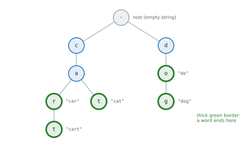

# Lesson 33: Tries (prefix trees)

**You'll learn:** prefix trees, nodes with children and an end flag, insert, search and starts_with, the dict-of-dicts trie, autocomplete, counting and deleting words, wildcard search, longest-prefix matching, radix trees, when to use a set or a sorted list instead.

▶ **Practise this lesson in the [sandbox](https://kishoremadanagopal.github.io/learning/dsa/#tries)**: run every example and check your exercise answers.

## Key terms

- **Trie (prefix tree):** a tree that stores strings one character per level, sharing common prefixes.
- **End-of-word flag:** a marker on the node where a complete word ends.
- **Prefix:** the beginning part of a string; "ca" is a prefix of "cat".
- **Autocomplete:** suggesting stored words that start with what has been typed.
- **Wildcard:** a pattern character, such as `.`, that matches any single character.
- **Longest prefix match:** finding the longest stored word that is a prefix of a given text, as routers do.
- **Radix tree:** a compressed trie whose edges hold whole strings instead of single characters.

A **trie** (pronounced "try", from re*trie*val), or **prefix tree**, stores strings character by character. Each node is one step along a word, its children are the possible next characters, and a flag marks nodes where a complete word ends. Words that share a prefix share the path for it.



Every operation walks one character at a time, so it costs **O(L)** for a word of length L, **no matter how many words are stored**. That's the trie's selling point for prefix questions: "is there any word starting with *ca*?" takes 2 steps.

## A trie class

```python
class TrieNode:
    def __init__(self):
        self.children = {}          # character -> TrieNode
        self.is_word = False        # does a word end exactly here?

class Trie:
    def __init__(self):
        self.root = TrieNode()

    def insert(self, word):
        node = self.root
        for ch in word:
            if ch not in node.children:
                node.children[ch] = TrieNode()
            node = node.children[ch]
        node.is_word = True

    def _walk(self, text):          # the node reached by following text, or None
        node = self.root
        for ch in text:
            node = node.children.get(ch)
            if node is None:
                return None
        return node

    def search(self, word):
        node = self._walk(word)
        return node is not None and node.is_word

    def starts_with(self, prefix):
        return self._walk(prefix) is not None

t = Trie()
for w in ["car", "cat", "cart", "dog", "do"]:
    t.insert(w)
print(t.search("car"), t.search("ca"), t.starts_with("ca"), t.starts_with("cow"))
```

`search("ca")` is False even though the path exists, because no word **ends** there. Forgetting the end-of-word flag is the classic trie bug.

A compact version uses nested dicts, with a special key such as `"$"` marking the end of a word. It's popular in interviews because it's short:

```python
def make_trie(words):
    root = {}
    for w in words:
        node = root
        for ch in w:
            node = node.setdefault(ch, {})   # get the child, creating it if missing
        node["$"] = True                     # end-of-word marker
    return root

trie = make_trie(["car", "cat", "cart"])
print(trie)
```

## Autocomplete

Walk down to the prefix's node, then collect every word below it with a depth-first search. Visiting children in alphabetical order gives the words in sorted order, and you can stop after the first few.

```python
class TrieNode:
    def __init__(self):
        self.children, self.is_word = {}, False

def insert(root, word):
    node = root
    for ch in word:
        node = node.children.setdefault(ch, TrieNode())
    node.is_word = True

def complete(root, prefix, limit=5):
    node = root
    for ch in prefix:
        node = node.children.get(ch)
        if node is None:
            return []                         # nothing starts with this prefix
    found = []
    def dfs(node, path):
        if len(found) == limit:
            return
        if node.is_word:
            found.append(prefix + path)
        for ch in sorted(node.children):      # alphabetical order
            dfs(node.children[ch], path + ch)
    dfs(node, "")
    return found

root = TrieNode()
for w in ["apple", "app", "application", "apply", "ape", "banana", "apt"]:
    insert(root, w)
print(complete(root, "app"))
print(complete(root, "ap", limit=3))
print(complete(root, "c"))
```

## Counting words with a prefix, and deleting

Store a **count** in each node of how many words pass through it; then "how many words start with *ap*?" is answered by one walk. Deleting a word decrements the counts along its path and clears its end flag.

```python
class TrieNode:
    def __init__(self):
        self.children, self.count, self.ends = {}, 0, 0   # words passing through / ending here

class CountingTrie:
    def __init__(self):
        self.root = TrieNode()

    def insert(self, word):
        node = self.root
        for ch in word:
            node = node.children.setdefault(ch, TrieNode())
            node.count += 1
        node.ends += 1

    def count_prefix(self, prefix):
        node = self.root
        for ch in prefix:
            node = node.children.get(ch)
            if node is None:
                return 0
        return node.count

    def delete(self, word):               # assumes the word is present
        node = self.root
        for ch in word:
            child = node.children[ch]
            child.count -= 1
            if child.count == 0:
                del node.children[ch]     # no words use this branch any more: prune it
                return
            node = child
        node.ends -= 1

t = CountingTrie()
for w in ["apple", "app", "apt", "bat"]:
    t.insert(w)
print(t.count_prefix("ap"), t.count_prefix("app"), t.count_prefix("b"))
t.delete("apple")
print(t.count_prefix("ap"), t.count_prefix("appl"))
```

## Wildcard search

To support patterns like `"c.t"` where `.` matches any letter, search recursively: at a `.`, try **every** child.

```python
def make_trie(words):
    root = {}
    for w in words:
        node = root
        for ch in w:
            node = node.setdefault(ch, {})
        node["$"] = True
    return root

def matches(node, pattern, i=0):
    if i == len(pattern):
        return "$" in node
    ch = pattern[i]
    if ch == ".":
        return any(matches(child, pattern, i + 1) for key, child in node.items() if key != "$")
    return ch in node and matches(node[ch], pattern, i + 1)

trie = make_trie(["cat", "cot", "cut", "car", "dog"])
print(matches(trie, "c.t"), matches(trie, "..g"), matches(trie, "c.."), matches(trie, "d.t"))
```

Worst case this branches at every dot (26ᵈ paths for d dots), but real dictionaries prune it quickly.

## Longest prefix match

Routers pick the most specific route for an address; spell checkers and tokenizers find the longest dictionary word at the start of the text. Walk the trie along the text and remember the **last** place a word ended.

```python
def make_trie(words):
    root = {}
    for w in words:
        node = root
        for ch in w:
            node = node.setdefault(ch, {})
        node["$"] = True
    return root

def longest_prefix(trie, text):
    node, best = trie, ""
    for i, ch in enumerate(text):
        if ch not in node:
            break
        node = node[ch]
        if "$" in node:
            best = text[:i + 1]           # a word ends here: the longest match so far
    return best

routes = make_trie(["10.", "10.1.", "10.1.2.", "192.168."])
print(longest_prefix(routes, "10.1.2.7"), longest_prefix(routes, "10.1.9.9"), repr(longest_prefix(routes, "8.8.8.8")))
```

## Trie or something simpler?

| Need | Simplest good tool | Cost |
|---|---|---|
| Is this exact word present? | a `set` | O(L) average |
| Words with a given prefix, in order | sorted list + `bisect_left(prefix)`, then read forwards | O(L log n) per lookup |
| Many prefix queries, counts per prefix, wildcards, longest-prefix matches | **trie** | O(L) per operation |
| Searching a grid for many dictionary words at once (word search II) | **trie** + DFS, pruning paths that aren't prefixes | far less than one search per word |

Tries use a lot of memory: one node object (with its own dict) per character. A **radix tree** (compressed trie) merges chains of single-child nodes into one edge labelled with a string, and is what many real routers and databases use. A **binary trie** over the bits of numbers solves "maximum XOR of two numbers" problems (Part 10).

## At a glance

| Concept | Approach | Time | Space |
|---|---|---|---|
| Insert / search / starts_with | walk one character per level, creating nodes on insert | O(L) | O(L) per new word |
| Autocomplete (first k words) | walk the prefix, then DFS in alphabetical order, stop at k | O(L + nodes visited) | O(L) |
| Count words with a prefix | store a pass-through count in each node | O(L) | O(1) extra per node |
| Delete a word | decrement counts along the path; prune empty branches | O(L) | O(1) |
| Wildcard search | at ".", try every child | O(26^dots × L) worst | O(L) |
| Longest prefix match | walk the text, remember the last word end | O(L) | O(1) |
| Prefix range with a sorted list | bisect_left(words, prefix), read forwards | O(L log n) | O(n) |

## Common mistakes

- Forgetting the end-of-word flag, so every prefix of a word counts as a word.
- Rebuilding the trie for every query instead of once.
- Collecting every word under a prefix and sorting, when an ordered DFS can stop early.
- Using a trie where a set (exact lookups) or a sorted list with bisect (simple prefix ranges) would do.

## Exercises

### 1. Implement a trie

Complete `Trie` with `insert(word)`, `search(word)` (True only if that exact word was inserted) and `starts_with(prefix)` (True if any inserted word starts with it). Each operation must take O(length of the string), however many words are stored. Don't keep a list or set of all the words.

Starter code:

```python
class Trie:
    def __init__(self):
        pass

    def insert(self, word):
        pass

    def search(self, word):
        pass

    def starts_with(self, prefix):
        pass

t = Trie()
t.insert("apple")
print(t.search("apple"), t.search("app"), t.starts_with("app"))   # True False True
t.insert("app")
print(t.search("app"))                                            # True
```

<details>
<summary>🧭 How to approach it</summary>

1. **Understand:** `search` is exact; `starts_with` asks about any stored word; the empty prefix gives True, because the walk never leaves the root.
2. **Examples:** after inserting "apple": search("app") → False, starts_with("app") → True.
3. **Brute force:** store words in a list and scan it: O(n · L) per query.
4. **Pattern:** **trie**: shared prefixes share nodes.
5. **Plan:** `TrieNode(children, is_word)`; insert creates the path; a `_find` helper serves both queries.
6. **Code and test:** a prefix that isn't a word, the empty trie, inserting twice.

</details>

<details>
<summary>💡 Hint 1</summary>

Each node needs two things: its children (one per possible next character) and whether a word ends at it.

</details>

<details>
<summary>💡 Hint 2</summary>

Use a small `TrieNode` class with `children = {}` and `is_word = False`. `insert` walks the word, creating missing children, and sets `is_word = True` at the last node.

</details>

<details>
<summary>💡 Hint 3</summary>

Write one helper that follows a string from the root and returns the node it reaches (or None if a character is missing). `search` needs that node **and** `is_word`; `starts_with` only needs the node to exist.

</details>

### 2. Search suggestions

Write `suggestions(words, queries)`. For each query string, return a list of up to **3** words from `words` that start with it, the alphabetically smallest ones, in alphabetical order (an empty list if none match). `words` has no duplicates. Return one list per query. With 20,000 words and 20,000 queries this must take well under a second, so don't scan every word for every query.

Starter code:

```python
def suggestions(words, queries):
    pass

print(suggestions(["mobile", "mouse", "moneypot", "monitor", "mousepad"], ["m", "mou", "mon", "x"]))
# [['mobile', 'moneypot', 'monitor'], ['mouse', 'mousepad'], ['moneypot', 'monitor'], []]
```

<details>
<summary>🧭 How to approach it</summary>

1. **Understand:** up to 3 matches per query, alphabetically smallest, in order; words are unsorted.
2. **Examples:** "mou" → ["mouse", "mousepad"]; "x" → [].
3. **Brute force:** sort once, then filter all words per query: O(n · q · L).
4. **Pattern:** **trie + ordered DFS** (or **sorting + binary search**: the matches for a prefix form one contiguous block of the sorted list).
5. **Plan:** build the trie; per query, walk the prefix, then DFS smallest-letter-first until 3 words are found.
6. **Code and test:** a query longer than any word, a word that is a prefix of others, no words.

</details>

<details>
<summary>💡 Hint 1</summary>

Checking every word against every query is n × q work. Which structure answers "which words start with this prefix?" by walking only the prefix?

</details>

<details>
<summary>💡 Hint 2</summary>

Build a trie of all the words once. For a query, walk down to its node; the matching words are exactly the words in that node's subtree.

</details>

<details>
<summary>💡 Hint 3</summary>

From the prefix node, do a depth-first search visiting children in alphabetical order, and stop after collecting 3 words. A node's own word comes before the words below it. (Alternative: sort the words, `bisect_left(words, q)`, and check the next 3.)

</details>

**In the sandbox:** exercises 69–70. Press **Check** to run the hidden tests.

### Answers and walkthroughs

Open these only after a real attempt. Each one explains the solution step by step.

<details>
<summary>✅ 1. Implement a trie</summary>

```python
class TrieNode:
    def __init__(self):
        self.children = {}
        self.is_word = False

class Trie:
    def __init__(self):
        self.root = TrieNode()

    def insert(self, word):
        node = self.root
        for ch in word:
            if ch not in node.children:
                node.children[ch] = TrieNode()      # create the path as needed
            node = node.children[ch]
        node.is_word = True                         # mark the end of a complete word

    def _find(self, text):
        node = self.root
        for ch in text:
            node = node.children.get(ch)
            if node is None:
                return None                         # the path breaks off: no such prefix
        return node

    def search(self, word):
        node = self._find(word)
        return node is not None and node.is_word

    def starts_with(self, prefix):
        return self._find(prefix) is not None

t = Trie()
t.insert("apple")
print(t.search("apple"), t.search("app"), t.starts_with("app"))
t.insert("app")
print(t.search("app"))
```

**Line by line**

- `self.root` is an empty node standing for the empty string.
- `insert` follows the word, creating any missing child, so words with a common prefix reuse the same nodes.
- `node.is_word = True` is what makes "app" different from "apple"'s first three letters.
- `_find` returns None as soon as the path breaks, so failed lookups stop early.
- `search` requires the end flag; `starts_with` only needs the path.

**Trace** of the example:

| operation | path walked | result |
|---|---|---|
| insert "apple" | creates a → p → p → l → e; marks e | — |
| search "apple" | a p p l e, e is marked | True |
| search "app" | a p p, the second p isn't marked | False |
| starts_with "app" | a p p exists | True |
| insert "app" | reuses a → p → p; marks the second p | — |
| search "app" | now marked | True |

**Complexity:** O(L) per operation; space O(total characters inserted) in the worst case.

**Common wrong approach:** having `search` return True whenever the path exists, so every prefix of a word counts as a word.

</details>

<details>
<summary>✅ 2. Search suggestions</summary>

```python
def suggestions(words, queries):
    root = {}
    for w in words:                          # build a trie; "$" holds the word that ends at a node
        node = root
        for ch in w:
            node = node.setdefault(ch, {})
        node["$"] = w

    result = []
    for q in queries:
        node = root
        for ch in q:                         # walk down to the prefix
            node = node.get(ch)
            if node is None:
                break
        found = []
        if node is not None:
            stack = [node]                   # depth-first, smallest letter first
            while stack and len(found) < 3:
                cur = stack.pop()
                if "$" in cur:
                    found.append(cur["$"])   # a word here comes before longer words below it
                for ch in sorted((k for k in cur if k != "$"), reverse=True):
                    stack.append(cur[ch])    # pushed in reverse so "a" is popped first
        result.append(found)
    return result

print(suggestions(["mobile", "mouse", "moneypot", "monitor", "mousepad"], ["m", "mou", "mon", "x"]))
```

**Line by line**

- Storing the word itself under `"$"` saves rebuilding it from the path.
- The walk stops at the first missing character; `node` is then None and the answer is `[]`.
- The DFS uses a stack. Pushing children in reverse alphabetical order means the smallest letter is popped first, so words come out alphabetically: a node's own word ("mouse") before its extensions ("mousepad").
- `len(found) < 3` stops the search early, so each query does only a little work beyond its prefix.

**Trace** for "mo" on the example words: the DFS from the "mo" node visits b → "mobile", then n → e → "moneypot", then n → i → "monitor": 3 found, stop.

**Complexity:** building is O(total characters); each query is O(L + the nodes visited before finding 3 words). The sort-and-bisect alternative is O(n log n) to sort, then O(L log n) per query.

**Common wrong approach:** collecting **all** matching words below the prefix and sorting them, which for a short prefix like "a" means visiting most of the trie on every query.

</details>

## Quick quiz

1. Searching a trie for a word of length L takes:
   - A) O(L), however many words are stored
   - B) O(n), where n is the number of words
   - C) O(log n)

2. A trie contains "apple". Why does search("app") return False?
   - A) No word is marked as ending at the second "p"
   - B) "app" is too short
   - C) Tries can't store prefixes

3. Which problem is a trie especially good at?
   - A) Finding all words with a given prefix
   - B) Finding the largest number
   - C) Sorting numbers

4. What is the main downside of a trie compared with a set of strings?
   - A) Memory: a node (with its own dict) for every character
   - B) Exact lookups are impossible
   - C) It can't store more than 26 words

<details>
<summary>Quiz answers</summary>

1. **A) O(L), however many words are stored**: Each step follows one character.
2. **A) No word is marked as ending at the second "p"**: The path exists, but the end-of-word flag isn't set there.
3. **A) Finding all words with a given prefix**: Every word with the prefix lies in the subtree below the prefix's node.
4. **A) Memory: a node (with its own dict) for every character**: Radix trees compress chains of single-child nodes to save space.

</details>

---
Previous: [Lesson 32](32-heaps.md) · Next: [Lesson 34: Segment trees and Fenwick trees](34-segment-fenwick.md)
