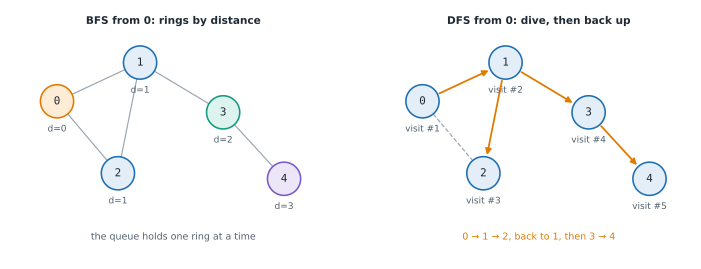
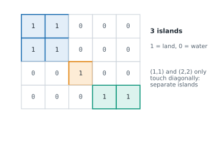

# Lesson 35: Graphs, BFS and DFS

**You'll learn:** vertices and edges, directed and weighted graphs, degree, DAGs, edge lists, adjacency matrices and adjacency lists, iterative and recursive DFS, BFS with a queue, connected components, grids and other implicit graphs, counting islands.

▶ **Practise this lesson in the [sandbox](https://kishoremadanagopal.github.io/learning/dsa/#graphs)**: run every example and check your exercise answers.

## Key terms

- **Graph:** a set of vertices joined by edges.
- **Vertex (node) / edge:** a point in the graph / a connection between two vertices.
- **Directed / undirected graph:** edges go one way / both ways.
- **Weighted graph:** each edge carries a number such as a distance or cost.
- **Degree:** the number of edges at a vertex; in-degree and out-degree for directed graphs.
- **Adjacency list:** for each vertex, a list of its neighbours.
- **Adjacency matrix:** a V × V grid with a mark where two vertices are joined.
- **Connected component:** a maximal group of vertices that can all reach each other.
- **Implicit graph:** a graph whose edges are computed on the fly, such as the cells of a grid.

A **graph** is a set of **vertices** (nodes) joined by **edges**. Trees and linked lists are special graphs; general graphs can have cycles, many routes between two nodes, and pieces that aren't connected at all. Road maps, social networks, web links, flight routes, package dependencies, the steps of an AI agent's workflow: all graphs.

![The same small graph three ways. A drawing of 5 vertices: 0–1, 0–2, 1–2, 1–3 and 3–4. Its adjacency matrix, a 5 × 5 grid of 0s and 1s with a 1 wherever two vertices are joined. Its adjacency list: 0: [1, 2], 1: [0, 2, 3], 2: [0, 1], 3: [1, 4], 4: [3]](../figures/graph-representations.svg)

| Term | Meaning |
|---|---|
| **V, E** | the number of vertices and of edges; graph costs are written with both, like O(V + E) |
| **undirected / directed** | edges go both ways (friendship) / one way (following someone, a one-way street) |
| **weighted** | each edge has a number: a distance, cost or time |
| **neighbours, degree** | the vertices joined to v / how many there are (in a directed graph: **in-degree** and **out-degree**) |
| **path, cycle** | a sequence of edges / a path that returns to where it started |
| **connected component** | a group of vertices that can all reach each other |
| **DAG** | a directed acyclic graph: directed, with no cycles (task dependencies) |
| **sparse / dense** | few edges (E close to V) / many edges (E close to V²) |

## Storing a graph

| Representation | Space | "Is u joined to v?" | List v's neighbours | Best for |
|---|---|---|---|---|
| **Edge list** `[(u, v), …]` | O(E) | O(E) | O(E) | input format; Kruskal's algorithm |
| **Adjacency matrix** `m[u][v]` | O(V²) | **O(1)** | O(V) | dense graphs, small V |
| **Adjacency list** `{u: [v, …]}` | O(V + E) | O(degree) | **O(degree)** | almost everything else |

Problems usually give you an edge list. Turning it into an adjacency list is the first line of most graph solutions:

```python
from collections import defaultdict

edges = [(0, 1), (0, 2), (1, 2), (1, 3), (3, 4)]

graph = defaultdict(list)            # undirected: add both directions
for u, v in edges:
    graph[u].append(v)
    graph[v].append(u)
print(dict(graph))

directed = defaultdict(list)         # directed: only u -> v
for u, v in edges:
    directed[u].append(v)
print(dict(directed))

flights = [("SFO", "JFK", 6), ("SFO", "SEA", 2), ("SEA", "JFK", 5)]
weighted = defaultdict(list)         # weighted: store (neighbour, weight) pairs
for u, v, w in flights:
    weighted[u].append((v, w))
print(dict(weighted))

n = 5                                # adjacency matrix: n x n of 0/1
matrix = [[0] * n for _ in range(n)]
for u, v in edges:
    matrix[u][v] = matrix[v][u] = 1
print(matrix[1])                     # row 1: who is 1 joined to?
```

Use a `defaultdict(list)` or, when vertices are numbered 0 to n − 1, a plain list of lists: `graph = [[] for _ in range(n)]`. Remember vertices with **no** edges still exist; a `defaultdict` only creates them when touched.

## Depth-first search (DFS)

DFS goes as far as it can along one path, then backs up and tries the next branch: exactly like the tree traversals of Lesson 29, plus a **visited** set, because a graph can lead back to a vertex you've already seen. Without it, a cycle makes the search loop forever.

```python
graph = {0: [1, 2], 1: [0, 2, 3], 2: [0, 1], 3: [1, 4], 4: [3], 5: []}

def dfs_recursive(graph, start, visited=None, order=None):
    if visited is None:
        visited, order = set(), []
    visited.add(start)
    order.append(start)
    for nxt in graph[start]:
        if nxt not in visited:
            dfs_recursive(graph, nxt, visited, order)
    return order

def dfs_iterative(graph, start):
    visited, order, stack = set(), [], [start]
    while stack:
        node = stack.pop()
        if node in visited:
            continue                     # it may have been pushed twice
        visited.add(node)
        order.append(node)
        for nxt in reversed(graph[node]):    # reversed: visit neighbours in the listed order
            if nxt not in visited:
                stack.append(nxt)
    return order

print(dfs_recursive(graph, 0), dfs_iterative(graph, 0))
```

Every vertex is visited once and every edge looked at (twice for undirected), so DFS is **O(V + E)** time and O(V) space. The recursive version is shortest to write, but a long path (thousands of vertices) exceeds Python's recursion limit; the **explicit stack** version handles any size.

## Breadth-first search (BFS)

BFS explores in **rings**: first the start, then everything 1 edge away, then 2 edges away, and so on, using a queue. That's why BFS finds the **fewest-edges** path in an unweighted graph (next lesson).



```python
from collections import deque

graph = {0: [1, 2], 1: [0, 2, 3], 2: [0, 1], 3: [1, 4], 4: [3], 5: []}

def bfs(graph, start):
    dist = {start: 0}                    # doubles as the visited set
    queue = deque([start])
    while queue:
        node = queue.popleft()
        for nxt in graph[node]:
            if nxt not in dist:          # mark when ADDING to the queue, not when popping
                dist[nxt] = dist[node] + 1
                queue.append(nxt)
    return dist

print(bfs(graph, 0))
print(5 in bfs(graph, 0))                # 5 is not reachable from 0
```

Mark a vertex as seen **when you put it in the queue**. Marking only when you pop it lets the same vertex enter the queue many times.

## Connected components

To count the separate pieces, start a search from every vertex that hasn't been visited yet; each new start is a new component. Still O(V + E) overall, because each vertex is visited once in total.

```python
def count_components(n, edges):
    graph = [[] for _ in range(n)]
    for u, v in edges:
        graph[u].append(v)
        graph[v].append(u)
    seen, components = set(), 0
    for start in range(n):
        if start in seen:
            continue
        components += 1                  # a vertex nobody has reached: a new piece
        stack = [start]
        seen.add(start)
        while stack:
            node = stack.pop()
            for nxt in graph[node]:
                if nxt not in seen:
                    seen.add(nxt)
                    stack.append(nxt)
    return components

print(count_components(6, [(0, 1), (1, 2), (3, 4)]))   # {0,1,2}, {3,4}, {5}
```

## Grids are graphs too

Many problems never mention a graph: a maze, a map of land and water, a game board. Each **cell** is a vertex and its up, down, left and right neighbours are its edges. Such **implicit graphs** are explored without building an adjacency list; you compute the neighbours on the fly (Lesson 10's direction list).

```python
grid = ["S.#.",
        "..#.",
        "...E"]
rows, cols = len(grid), len(grid[0])
DIRS = [(-1, 0), (1, 0), (0, -1), (0, 1)]

def neighbours(r, c):
    for dr, dc in DIRS:
        nr, nc = r + dr, c + dc
        if 0 <= nr < rows and 0 <= nc < cols and grid[nr][nc] != "#":
            yield nr, nc

print(list(neighbours(0, 0)), list(neighbours(1, 1)))
```



## Where graph searches show up

| Question | Tool |
|---|---|
| Can I get from A to B? Which vertices can A reach? | DFS or BFS |
| How many separate groups? | a search from each unvisited vertex (or union-find, Lesson 39) |
| Fewest steps from A to B (unweighted) | BFS (Lesson 36) |
| Cheapest route with weights | Dijkstra, Bellman-Ford (Lesson 38) |
| Order tasks that depend on each other | topological sort (Lesson 37) |
| Detect a cycle | DFS with colours (directed) or union-find (undirected) |

## At a glance

| Concept | Approach | Time | Space |
|---|---|---|---|
| Build an adjacency list | append (u, v) and (v, u) for undirected edges | O(V + E) | O(V + E) |
| DFS (iterative) | stack + visited set | O(V + E) | O(V) |
| BFS | queue (deque) + visited set, mark when queued | O(V + E) | O(V) |
| Connected components | one search from every unvisited vertex | O(V + E) | O(V) |
| Count islands in a grid | flood fill from each unvisited land cell | O(R · C) | O(R · C) |
| Edge check with an adjacency matrix | matrix[u][v] | O(1) | O(V²) |

## Common mistakes

- Forgetting the visited set, so a cycle makes the search run forever.
- Adding only one direction for an undirected edge.
- Writing `[[]] * n`, which makes every vertex share one neighbour list.
- Recursive DFS on large graphs or grids, which exceeds Python's recursion limit.

## Exercises

### 1. Number of islands

`grid` is a list of strings made of `"1"` (land) and `"0"` (water). An **island** is a group of land cells joined horizontally or vertically. Write `num_islands(grid)` returning how many islands there are. It must handle a 300 × 300 grid that is one long winding island, so use an explicit stack or a queue rather than recursion.

Starter code:

```python
def num_islands(grid):
    pass

print(num_islands(["11000",
                   "11000",
                   "00100",
                   "00011"]))   # 3
```

<details>
<summary>🧭 How to approach it</summary>

1. **Understand:** 4-directional connections only; strings can't be changed, so track visited cells separately; an empty grid has 0 islands.
2. **Examples:** the example has 3 islands; a checkerboard of 1s has one island per 1.
3. **Brute force:** there isn't a meaningfully simpler idea; the danger is the recursive flood fill crashing on big islands.
4. **Pattern:** **connected components** on an implicit grid graph: one search per unvisited land cell.
5. **Plan:** double loop over cells; on unseen land, count it and flood-fill with an explicit stack.
6. **Code and test:** all water, a single cell, diagonals, a long winding island.

</details>

<details>
<summary>💡 Hint 1</summary>

Scan every cell. When you find land that hasn't been visited, that's a new island. What do you need to do so you don't count its other cells again?

</details>

<details>
<summary>💡 Hint 2</summary>

Visit the whole island right away (a flood fill): DFS or BFS from that cell over land neighbours, adding each cell to a `seen` set.

</details>

<details>
<summary>💡 Hint 3</summary>

Use `stack = [(r, c)]` and loop `while stack`: pop a cell, and for its 4 neighbours that are inside the grid, land, and not seen, add them to `seen` and push them. Count how many times you start a flood fill.

</details>

### 2. Is there a path?

Write `has_path(n, edges, source, target)` for an **undirected** graph with vertices `0` to `n − 1` and `edges` given as pairs. Return `True` if `target` can be reached from `source`. It must be O(V + E): a chain of 100,000 vertices should take well under a second.

Starter code:

```python
def has_path(n, edges, source, target):
    pass

print(has_path(3, [(0, 1), (1, 2), (2, 0)], 0, 2))           # True
print(has_path(6, [(0, 1), (0, 2), (3, 5), (5, 4), (4, 3)], 0, 5))   # False
```

<details>
<summary>🧭 How to approach it</summary>

1. **Understand:** undirected edges, vertices 0..n−1, source may equal target, some vertices have no edges.
2. **Examples:** the triangle → True; two separate pieces → False.
3. **Brute force:** search, but find neighbours by scanning the edge list each time: O(V × E).
4. **Pattern:** **adjacency list + DFS/BFS** with a visited set.
5. **Plan:** build the list, then an iterative search that stops as soon as the target appears.
6. **Code and test:** source = target, no edges, reversed edge directions, different components.

</details>

<details>
<summary>💡 Hint 1</summary>

You need to explore everything reachable from `source`. Which search does that, and what does it need to find a vertex's neighbours quickly?

</details>

<details>
<summary>💡 Hint 2</summary>

Build an adjacency list first (`graph[u].append(v)` **and** `graph[v].append(u)`, because the graph is undirected). Then run DFS or BFS from `source` with a `seen` set.

</details>

<details>
<summary>💡 Hint 3</summary>

`seen = {source}; stack = [source]`; pop a vertex, return True if it's the target, and push every unseen neighbour (marking it seen). If the stack empties, return False.

</details>

**In the sandbox:** exercises 73–74. Press **Check** to run the hidden tests.

### Answers and walkthroughs

Open these only after a real attempt. Each one explains the solution step by step.

<details>
<summary>✅ 1. Number of islands</summary>

```python
def num_islands(grid):
    if not grid:
        return 0
    rows, cols = len(grid), len(grid[0])
    seen = set()
    islands = 0
    for r in range(rows):
        for c in range(cols):
            if grid[r][c] != "1" or (r, c) in seen:
                continue
            islands += 1                         # new, unvisited land: a new island
            seen.add((r, c))
            stack = [(r, c)]
            while stack:                         # flood-fill the whole island
                cr, cc = stack.pop()
                for nr, nc in ((cr + 1, cc), (cr - 1, cc), (cr, cc + 1), (cr, cc - 1)):
                    if 0 <= nr < rows and 0 <= nc < cols and grid[nr][nc] == "1" and (nr, nc) not in seen:
                        seen.add((nr, nc))
                        stack.append((nr, nc))
    return islands

print(num_islands(["11000",
                   "11000",
                   "00100",
                   "00011"]))
```

**Line by line**

- The double loop looks at every cell once as a possible starting point.
- `if grid[r][c] != "1" or (r, c) in seen: continue` skips water and land already counted as part of an island.
- Each new start increments `islands`, then the stack-based flood fill marks every cell of that island as seen.
- Cells are marked when pushed, so no cell enters the stack twice.

**Trace** on the example:

| start cell | island cells marked | islands |
|---|---|---|
| (0, 0) | (0,0), (0,1), (1,0), (1,1) | 1 |
| (2, 2) | (2,2) | 2 |
| (3, 3) | (3,3), (3,4) | 3 |

Every other land cell is already in `seen` when the scan reaches it.

**Complexity:** O(R × C) time, O(R × C) space for `seen` and the stack.

**Common wrong approach:** a recursive `sink(r, c)`. It's correct and common in interviews, but a winding island 45,000 cells long needs 45,000 nested calls, far past Python's limit of about 1,000.

</details>

<details>
<summary>✅ 2. Is there a path?</summary>

```python
def has_path(n, edges, source, target):
    graph = [[] for _ in range(n)]        # adjacency list, built once: O(V + E)
    for u, v in edges:
        graph[u].append(v)
        graph[v].append(u)                # undirected: both directions
    seen = {source}
    stack = [source]
    while stack:
        node = stack.pop()
        if node == target:
            return True
        for nxt in graph[node]:
            if nxt not in seen:
                seen.add(nxt)
                stack.append(nxt)
    return False

print(has_path(3, [(0, 1), (1, 2), (2, 0)], 0, 2))
print(has_path(6, [(0, 1), (0, 2), (3, 5), (5, 4), (4, 3)], 0, 5))
```

**Line by line**

- `graph = [[] for _ in range(n)]` gives every vertex a list, including vertices with no edges. (`[[]] * n` would share one list, a classic bug.)
- Adding each edge in both directions makes the search work no matter which way the pair was written.
- `seen` is updated when a vertex is pushed, so each vertex enters the stack at most once.
- Returning `True` as soon as the target is popped stops early.

**Trace** on n = 6, edges (0,1), (0,2), (3,5), (5,4), (4,3), source 0, target 5:

| popped | pushed | seen |
|---|---|---|
| 0 | 1, 2 | {0, 1, 2} |
| 2 | — | {0, 1, 2} |
| 1 | — | {0, 1, 2} |

The stack is empty and 5 was never reached: False.

**Complexity:** O(V + E) time and space.

**Common wrong approach:** recursive DFS: correct, but on the 100,000-vertex chain it hits RecursionError.

</details>

## Quick quiz

1. Which representation lets you list a vertex's neighbours in O(degree) and uses O(V + E) space?
   - A) An adjacency list
   - B) An adjacency matrix
   - C) An edge list

2. Why does graph search need a visited set when tree traversal doesn't?
   - A) Graphs can have cycles and several paths to a vertex, so you could revisit vertices forever
   - B) Graphs are always bigger than trees
   - C) To make the search faster on trees

3. In BFS, when should a vertex be marked as seen?
   - A) When it's added to the queue
   - B) When it's popped from the queue
   - C) After the whole search

4. What is the time complexity of DFS or BFS with an adjacency list?
   - A) O(V + E)
   - B) O(V²) always
   - C) O(E log V)

<details>
<summary>Quiz answers</summary>

1. **A) An adjacency list**: The matrix takes O(V²) space and O(V) to list neighbours; the edge list needs a full scan.
2. **A) Graphs can have cycles and several paths to a vertex, so you could revisit vertices forever**: A tree has exactly one path between any two nodes; a graph may loop back.
3. **A) When it's added to the queue**: Marking at push time stops the same vertex from being queued many times.
4. **A) O(V + E)**: Each vertex is processed once and each edge is examined a constant number of times.

</details>

---
Previous: [Lesson 34](34-segment-fenwick.md) · Next: [Lesson 36: Shortest paths with BFS](36-bfs-shortest.md)
