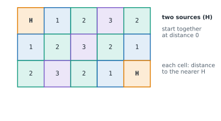

# Lesson 36: Shortest paths with BFS

**You'll learn:** shortest paths in unweighted graphs, parent links and path reconstruction, grid and maze shortest paths, multi-source BFS, 0-1 BFS, word ladders and other state graphs, bidirectional BFS, choosing a shortest-path method.

▶ **Practise this lesson in the [sandbox](https://kishoremadanagopal.github.io/learning/dsa/#bfs-shortest)**: run every example and check your exercise answers.

## Key terms

- **Shortest path (unweighted):** a path with the fewest edges.
- **Parent link:** the vertex from which another vertex was first reached; following parents rebuilds the path.
- **Multi-source BFS:** a BFS that starts with several vertices in the queue at distance 0.
- **0-1 BFS:** a BFS with a deque for edge weights of 0 or 1; 0-cost neighbours go to the front.
- **State graph:** an implicit graph whose vertices are situations (words, lock combinations) and whose edges are moves.
- **Bidirectional BFS:** searching from the start and the goal at once until the two searches meet.

In an **unweighted** graph, where every edge counts as one step, BFS finds the shortest path for free. It explores in rings of distance 0, 1, 2, …, so the **first time** it reaches a vertex is by a fewest-steps route. Nothing reached later could be closer.

## Distance and the path itself

To get the route, not just its length, remember each vertex's **parent**: the vertex you came from when you first reached it. Then walk the parents back from the target and reverse.

```python
from collections import deque

graph = {"A": ["B", "C"], "B": ["A", "D"], "C": ["A", "D", "E"], "D": ["B", "C", "F"], "E": ["C", "F"], "F": ["D", "E"]}

def shortest_path(graph, start, goal):
    parent = {start: None}
    queue = deque([start])
    while queue:
        node = queue.popleft()
        if node == goal:
            path = []
            while node is not None:          # walk back along the parent links
                path.append(node)
                node = parent[node]
            return path[::-1]
        for nxt in graph[node]:
            if nxt not in parent:
                parent[nxt] = node
                queue.append(nxt)
    return None                              # goal can't be reached

print(shortest_path(graph, "A", "F"))
print(len(shortest_path(graph, "A", "F")) - 1, "edges")
```

**O(V + E)** time. DFS does **not** find shortest paths: it may wander down a long route first.

## Shortest path in a grid

A maze is the most common disguise. Each cell is a vertex; store distances in a 2-D list or a dict.

```python
from collections import deque

maze = ["S..#....",
        ".#.#.##.",
        ".#...#..",
        ".####.#.",
        "......#E"]

def maze_steps(maze):
    rows, cols = len(maze), len(maze[0])
    start = next((r, c) for r in range(rows) for c in range(cols) if maze[r][c] == "S")
    dist = {start: 0}
    queue = deque([start])
    while queue:
        r, c = queue.popleft()
        if maze[r][c] == "E":
            return dist[(r, c)]
        for nr, nc in ((r + 1, c), (r - 1, c), (r, c + 1), (r, c - 1)):
            if 0 <= nr < rows and 0 <= nc < cols and maze[nr][nc] != "#" and (nr, nc) not in dist:
                dist[(nr, nc)] = dist[(r, c)] + 1
                queue.append((nr, nc))
    return -1

print(maze_steps(maze))
```

## Multi-source BFS

"How far is every cell from the **nearest** hospital?" Don't run one BFS per hospital: put **all** the sources in the queue at distance 0 and run a single BFS. The rings spread from every source at once, and each cell is reached first from its closest source. O(V + E) in total, however many sources there are.



```python
from collections import deque

def nearest_distance(grid, source="H"):
    rows, cols = len(grid), len(grid[0])
    dist = [[-1] * cols for _ in range(rows)]
    queue = deque()
    for r in range(rows):
        for c in range(cols):
            if grid[r][c] == source:
                dist[r][c] = 0
                queue.append((r, c))         # every source starts in the queue
    while queue:
        r, c = queue.popleft()
        for nr, nc in ((r + 1, c), (r - 1, c), (r, c + 1), (r, c - 1)):
            if 0 <= nr < rows and 0 <= nc < cols and dist[nr][nc] == -1:
                dist[nr][nc] = dist[r][c] + 1
                queue.append((nr, nc))
    return dist

for row in nearest_distance(["H....", ".....", "....H"]):
    print(row)
```

## 0-1 BFS: edges that cost 0 or 1

If every edge costs either 0 or 1 (say, moving along a road is free but switching roads costs 1), use a **deque**: push a vertex reached by a 0-cost edge to the **front** and one reached by a 1-cost edge to the **back**. The deque stays sorted by distance, so it's as correct as Dijkstra (Lesson 38) but O(V + E).

```python
from collections import deque

def zero_one_bfs(n, edges, start):          # edges: (u, v, cost) with cost 0 or 1, directed
    graph = [[] for _ in range(n)]
    for u, v, w in edges:
        graph[u].append((v, w))
    dist = [float("inf")] * n
    dist[start] = 0
    dq = deque([start])
    while dq:
        u = dq.popleft()
        for v, w in graph[u]:
            if dist[u] + w < dist[v]:
                dist[v] = dist[u] + w
                if w == 0:
                    dq.appendleft(v)          # as close as u: handle it next
                else:
                    dq.append(v)
    return dist

print(zero_one_bfs(5, [(0, 1, 1), (0, 2, 0), (2, 1, 0), (1, 3, 1), (2, 4, 1), (4, 3, 0)], 0))
```

## Implicit graphs: states and moves

The vertices don't have to exist in advance. In a **word ladder** (turn "hit" into "cog" changing one letter at a time, every step a real word), each word is a vertex and words that differ by one letter are neighbours. In a lock puzzle, each combination is a vertex. Generate neighbours as you go and BFS finds the fewest moves.

```python
from collections import deque, defaultdict

def ladder_length(begin, end, words):
    words = set(words)
    if end not in words:
        return 0
    buckets = defaultdict(list)              # "h*t" -> ["hot", "hit", ...]: words one letter apart share a bucket
    for w in words | {begin}:
        for i in range(len(w)):
            buckets[w[:i] + "*" + w[i + 1:]].append(w)
    seen = {begin}
    queue = deque([(begin, 1)])
    while queue:
        word, steps = queue.popleft()
        if word == end:
            return steps
        for i in range(len(word)):
            for nxt in buckets[word[:i] + "*" + word[i + 1:]]:
                if nxt not in seen:
                    seen.add(nxt)
                    queue.append((nxt, steps + 1))
    return 0

print(ladder_length("hit", "cog", ["hot", "dot", "dog", "lot", "log", "cog"]))   # hit hot dot dog cog
```

The buckets avoid comparing every pair of words (O(n²)); each word only looks at the words that share one of its L patterns.

## Bidirectional BFS

When both the start and the goal are known and the graph branches a lot, run two BFS searches, one from each end, expanding the **smaller** frontier each round, and stop when they meet. With branching factor b and distance d, that explores about 2·b^(d/2) vertices instead of b^d: for b = 10 and d = 6, two thousand instead of a million.

```python
def bidirectional(graph, start, goal):
    if start == goal:
        return 0
    front, back = {start}, {goal}
    seen = {start, goal}
    steps = 0
    while front and back:
        if len(front) > len(back):
            front, back = back, front           # always grow the smaller side
        steps += 1
        nxt_front = set()
        for node in front:
            for nxt in graph[node]:
                if nxt in back:
                    return steps                # the two searches met
                if nxt not in seen:
                    seen.add(nxt)
                    nxt_front.add(nxt)
        front = nxt_front
    return -1

graph = {0: [1, 2], 1: [0, 3], 2: [0, 4], 3: [1, 5], 4: [2, 5], 5: [3, 4, 6], 6: [5]}
print(bidirectional(graph, 0, 6))
```

## Choosing a shortest-path method

| Edge weights | Algorithm | Time |
|---|---|---|
| none (all equal) | **BFS** | O(V + E) |
| 0 or 1 | **0-1 BFS** with a deque | O(V + E) |
| non-negative | **Dijkstra** (Lesson 38) | O((V + E) log V) |
| may be negative | **Bellman-Ford** (Lesson 38) | O(V × E) |
| a DAG, any weights | relax in topological order (Lesson 37) | O(V + E) |
| all pairs, small V | **Floyd-Warshall** (Lesson 38) | O(V³) |

## At a glance

| Concept | Approach | Time | Space |
|---|---|---|---|
| Shortest path, unweighted | BFS from the start; distance of first visit | O(V + E) | O(V) |
| Rebuild the path | store parents; walk back from the goal; reverse | O(path length) | O(V) |
| Grid shortest path | BFS over cells with 4 or 8 neighbours | O(R · C) | O(R · C) |
| Distance to the nearest of many sources | multi-source BFS | O(V + E) | O(V) |
| Weights 0 or 1 | 0-1 BFS with a deque | O(V + E) | O(V) |
| Word ladder | BFS over words; wildcard buckets find neighbours | O(N · L²) | O(N · L) |
| Bidirectional BFS | grow the smaller frontier until the two meet | about O(b^(d/2)) | O(b^(d/2)) |

## Common mistakes

- Using DFS for a shortest path; it finds a path, not the shortest one.
- Marking vertices as visited when popped instead of when queued.
- Running one BFS per source instead of a single multi-source BFS.
- Using BFS on weighted edges, where fewer edges doesn't mean cheaper.

## Exercises

### 1. Shortest clear path in a grid

`grid` is an n × n list of lists of `0` (open) and `1` (blocked). Write `shortest_clear_path(grid)` returning the number of cells on the shortest path from the top-left cell to the bottom-right cell, moving to any of the **8** neighbouring cells (diagonals included) through open cells only. Return `-1` if there's no such path (including when the start or end is blocked).

Starter code:

```python
from collections import deque

def shortest_clear_path(grid):
    pass

print(shortest_clear_path([[0, 1], [1, 0]]))                     # 2 (one diagonal move)
print(shortest_clear_path([[0, 0, 0], [1, 1, 0], [1, 1, 0]]))    # 4
```

<details>
<summary>🧭 How to approach it</summary>

1. **Understand:** count cells, not moves; 8 directions; blocked start or end means −1.
2. **Examples:** [[0, 1], [1, 0]] → 2 (start, then the diagonal end).
3. **Brute force:** DFS trying every route and keeping the shortest: exponential.
4. **Pattern:** **BFS on a grid** (unweighted shortest path).
5. **Plan:** guard the corners, BFS with a distance dict, return on reaching the end.
6. **Code and test:** a 1 × 1 grid, blocked corners, a path that needs diagonal moves.

</details>

<details>
<summary>💡 Hint 1</summary>

Every move costs the same (one cell), so which search finds the fewest moves?

</details>

<details>
<summary>💡 Hint 2</summary>

BFS from (0, 0) over open cells, with 8 neighbours: all combinations of `dr` and `dc` in (−1, 0, 1). Store the distance of each cell as you discover it.

</details>

<details>
<summary>💡 Hint 3</summary>

Check the start and end cells first. Start with `dist = {(0, 0): 1}`; when you pop the bottom-right cell, return its distance. If the queue empties, return −1.

</details>

### 2. Rotting oranges

`grid` holds `0` (empty), `1` (fresh orange) and `2` (rotten orange). Every minute, each fresh orange next to a rotten one (up, down, left, right) becomes rotten. Write `minutes_to_rot(grid)` returning how many minutes until no fresh orange is left, or `-1` if some can never rot. Don't change `grid`. It must handle a 300 × 300 grid quickly, so don't re-scan the whole grid every minute.

Starter code:

```python
from collections import deque

def minutes_to_rot(grid):
    pass

print(minutes_to_rot([[2, 1, 1], [1, 1, 0], [0, 1, 1]]))   # 4
print(minutes_to_rot([[2, 1, 1], [0, 1, 1], [1, 0, 1]]))   # -1
```

<details>
<summary>🧭 How to approach it</summary>

1. **Understand:** spread is simultaneous from all rotten oranges; 0 minutes if nothing is fresh; −1 if some fresh orange is unreachable.
2. **Examples:** the first example takes 4 minutes; [[0, 2]] → 0.
3. **Brute force:** simulate minute by minute, scanning the whole grid each time: O((R·C)²) worst case.
4. **Pattern:** **multi-source BFS**: the BFS level is the minute.
5. **Plan:** queue all rotten cells at time 0 and count fresh ones; BFS; return the max time or −1.
6. **Code and test:** no fresh oranges, unreachable oranges, two sources meeting.

</details>

<details>
<summary>💡 Hint 1</summary>

The rot spreads one ring per minute from **every** rotten orange at once. Which search spreads in rings?

</details>

<details>
<summary>💡 Hint 2</summary>

Multi-source BFS: put all rotten oranges in the queue with time 0. Count the fresh oranges first, and subtract one each time an orange rots.

</details>

<details>
<summary>💡 Hint 3</summary>

Store `(r, c, minute)` in the queue. When a fresh neighbour rots, push it with `minute + 1`. The answer is the largest minute seen, or −1 if `fresh` is still above 0 at the end. Track rotten cells in a set so `grid` isn't changed.

</details>

**In the sandbox:** exercises 75–76. Press **Check** to run the hidden tests.

### Answers and walkthroughs

Open these only after a real attempt. Each one explains the solution step by step.

<details>
<summary>✅ 1. Shortest clear path in a grid</summary>

```python
from collections import deque

def shortest_clear_path(grid):
    n = len(grid)
    if grid[0][0] == 1 or grid[n - 1][n - 1] == 1:
        return -1
    dist = {(0, 0): 1}                        # path length counted in cells, so the start is 1
    queue = deque([(0, 0)])
    while queue:
        r, c = queue.popleft()
        if (r, c) == (n - 1, n - 1):
            return dist[(r, c)]
        for dr in (-1, 0, 1):
            for dc in (-1, 0, 1):
                nr, nc = r + dr, c + dc
                if 0 <= nr < n and 0 <= nc < n and grid[nr][nc] == 0 and (nr, nc) not in dist:
                    dist[(nr, nc)] = dist[(r, c)] + 1
                    queue.append((nr, nc))
    return -1

print(shortest_clear_path([[0, 1], [1, 0]]))
print(shortest_clear_path([[0, 0, 0], [1, 1, 0], [1, 1, 0]]))
```

**Line by line**

- Checking `grid[0][0]` and `grid[n-1][n-1]` first handles the blocked cases before searching.
- `dist` doubles as the visited set; a cell is recorded the moment it's discovered.
- The two loops over `dr` and `dc` generate all 8 neighbours (plus the cell itself, which is already in `dist` and so ignored).
- BFS pops cells in order of distance, so the first time the end is popped, its distance is the shortest.

**Trace** on [[0, 0, 0], [1, 1, 0], [1, 1, 0]]:

| popped | distance | newly discovered |
|---|---|---|
| (0, 0) | 1 | (0, 1) → 2 |
| (0, 1) | 2 | (0, 2) → 3, (1, 2) → 3 |
| (0, 2) | 3 | — |
| (1, 2) | 3 | (2, 2) → 4 |
| (2, 2) | **4** | the end: return 4 |

**Complexity:** O(n²) time and space: each cell is queued at most once and has 8 neighbours.

**Common wrong approach:** using DFS and returning the first path found, which is a path but not necessarily the shortest.

</details>

<details>
<summary>✅ 2. Rotting oranges</summary>

```python
from collections import deque

def minutes_to_rot(grid):
    rows, cols = len(grid), len(grid[0])
    rotten = set()
    queue = deque()
    fresh = 0
    for r in range(rows):
        for c in range(cols):
            if grid[r][c] == 2:
                rotten.add((r, c))
                queue.append((r, c, 0))          # every rotten orange is a source at minute 0
            elif grid[r][c] == 1:
                fresh += 1
    minutes = 0
    while queue:
        r, c, t = queue.popleft()
        minutes = max(minutes, t)
        for nr, nc in ((r + 1, c), (r - 1, c), (r, c + 1), (r, c - 1)):
            if 0 <= nr < rows and 0 <= nc < cols and grid[nr][nc] == 1 and (nr, nc) not in rotten:
                rotten.add((nr, nc))
                fresh -= 1
                queue.append((nr, nc, t + 1))
    return minutes if fresh == 0 else -1

print(minutes_to_rot([[2, 1, 1], [1, 1, 0], [0, 1, 1]]))
print(minutes_to_rot([[2, 1, 1], [0, 1, 1], [1, 0, 1]]))
```

**Line by line**

- The first double loop seeds the queue with every rotten orange and counts the fresh ones.
- Each queue item carries its minute, so a neighbour that rots from it gets `t + 1`.
- `rotten` stops an orange from rotting (and being counted) twice.
- After the BFS, any remaining `fresh` count means some oranges were never reached.

**Trace** on [[2, 1, 1], [1, 1, 0], [0, 1, 1]] (fresh = 6):

| minute | oranges that rot | fresh left |
|---|---|---|
| 1 | (0,1), (1,0) | 4 |
| 2 | (0,2), (1,1) | 2 |
| 3 | (2,1) | 1 |
| 4 | (2,2) | 0 → answer 4 |

**Complexity:** O(R × C) time and space.

**Common wrong approach:** running a separate BFS from each rotten orange and adding the times, instead of spreading from all of them together.

</details>

## Quick quiz

1. Why does BFS find the shortest path in an unweighted graph?
   - A) It reaches vertices in order of their distance, so the first visit is by a shortest route
   - B) It always goes straight towards the goal
   - C) It tries every possible path

2. How do you rebuild the actual path after a BFS?
   - A) Store each vertex's parent when it's discovered, then follow parents back from the goal and reverse
   - B) Run DFS afterwards
   - C) Sort the visited vertices

3. You need every cell's distance to the nearest of 50 exits. What's the efficient approach?
   - A) One BFS with all 50 exits in the queue at distance 0
   - B) 50 separate BFS runs, keeping the minimum
   - C) Dijkstra from each cell

4. In 0-1 BFS, where does a vertex reached by a 0-cost edge go?
   - A) The front of the deque
   - B) The back of the deque
   - C) It's skipped

<details>
<summary>Quiz answers</summary>

1. **A) It reaches vertices in order of their distance, so the first visit is by a shortest route**: Rings of distance 0, 1, 2… are completed one after another.
2. **A) Store each vertex's parent when it's discovered, then follow parents back from the goal and reverse**: The parent links form a shortest-path tree rooted at the start.
3. **A) One BFS with all 50 exits in the queue at distance 0**: Multi-source BFS costs O(V + E) in total.
4. **A) The front of the deque**: It's as close as the current vertex, so it must be handled before farther vertices.

</details>

---
Previous: [Lesson 35](35-graphs.md) · Next: [Lesson 37: Topological sort and DAGs](37-topological-sort.md)
