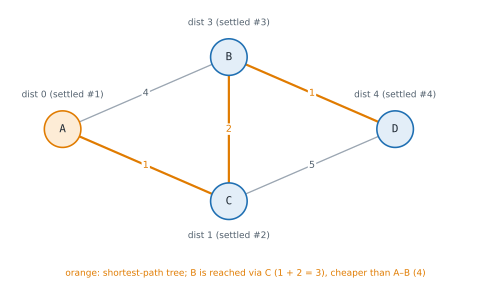

# Lesson 38: Weighted shortest paths

**You'll learn:** weighted graphs, relaxing an edge, Dijkstra with heapq and lazy deletion, why negative weights break Dijkstra, Bellman-Ford, negative cycles, at most k edges, Floyd-Warshall, A* with admissible heuristics, choosing an algorithm.

▶ **Practise this lesson in the [sandbox](https://kishoremadanagopal.github.io/learning/dsa/#shortest-paths)**: run every example and check your exercise answers.

## Key terms

- **Relaxation:** updating a vertex's distance if going through a neighbouring vertex is cheaper.
- **Dijkstra's algorithm:** repeatedly settles the closest unsettled vertex; needs non-negative weights.
- **Lazy deletion:** pushing a new heap entry when a distance improves and skipping stale entries later.
- **Bellman-Ford:** relaxes every edge V − 1 times; handles negative weights and detects negative cycles.
- **Negative cycle:** a cycle whose weights add up to less than zero, so costs can fall forever.
- **Floyd-Warshall:** all-pairs shortest paths by allowing each vertex in turn as a stopover.
- **A\* search:** Dijkstra ordered by cost so far plus a heuristic estimate of the cost remaining.
- **Admissible heuristic:** an estimate that never overestimates the true remaining cost.

When edges have **weights** (distances, prices, travel times), the path with the fewest edges isn't necessarily the cheapest. A 1-edge flight costing $900 loses to a 2-edge route costing $300. BFS counts edges, so it gives the wrong answer here.

## Dijkstra's algorithm

**Dijkstra's algorithm** grows a set of vertices whose shortest distance is final. At each step it takes the **unsettled vertex with the smallest known distance**, settles it, and **relaxes** its edges: for each neighbour, if going through this vertex is cheaper than the best route known so far, update it.



A min-heap of `(distance, vertex)` pairs finds the closest unsettled vertex quickly. Python's heapq has no "decrease key", so when a distance improves, just push a new pair; when an **out-of-date** pair is popped later, skip it (**lazy deletion**).

```python
import heapq

def dijkstra(graph, start):
    dist = {start: 0}
    parent = {start: None}
    heap = [(0, start)]
    done = set()
    while heap:
        d, u = heapq.heappop(heap)
        if u in done:
            continue                          # a stale entry: u was settled with a smaller distance
        done.add(u)
        for v, w in graph[u]:
            nd = d + w
            if nd < dist.get(v, float("inf")):    # relax the edge u -> v
                dist[v] = nd
                parent[v] = u
                heapq.heappush(heap, (nd, v))
    return dist, parent

def route(parent, goal):
    path = []
    while goal is not None:
        path.append(goal)
        goal = parent[goal]
    return path[::-1]

graph = {"A": [("B", 4), ("C", 1)], "B": [("A", 4), ("C", 2), ("D", 1)],
         "C": [("A", 1), ("B", 2), ("D", 5)], "D": [("B", 1), ("C", 5)]}
dist, parent = dijkstra(graph, "A")
print(dist)
print(route(parent, "D"))
```

**Cost:** each edge can push one heap entry, so O((V + E) log V) time and O(V + E) space. Dijkstra is the algorithm behind route planners and network routing (OSPF).

**Why it needs non-negative weights:** once a vertex is settled, Dijkstra never revisits it. That's safe only if no later edge can make a path **shorter**, which a negative weight can do:

```python
import heapq

def dijkstra_dist(graph, start):
    dist, heap, done = {start: 0}, [(0, start)], set()
    while heap:
        d, u = heapq.heappop(heap)
        if u in done:
            continue
        done.add(u)
        for v, w in graph[u]:
            if v not in done and d + w < dist.get(v, float("inf")):
                dist[v] = d + w
                heapq.heappush(heap, (d + w, v))
    return dist

graph = {"S": [("A", 1), ("B", 5)], "A": [], "B": [("A", -10)]}
print(dijkstra_dist(graph, "S"))      # says A costs 1, but S -> B -> A costs 5 - 10 = -5
```

## Bellman-Ford: negative weights and negative cycles

**Bellman-Ford** simply relaxes **every** edge, V − 1 times. A shortest path uses at most V − 1 edges, and after round i every path of up to i edges has been found. It's slower, **O(V × E)**, but handles negative weights.

If a V-th round still improves something, there's a **negative cycle**: a loop whose total is negative, so going round it again and again makes the cost fall forever. "Shortest path" then has no answer (currency-exchange arbitrage is exactly this).

```python
def bellman_ford(n, edges, start):          # edges: (u, v, w), directed
    INF = float("inf")
    dist = [INF] * n
    dist[start] = 0
    for _ in range(n - 1):
        changed = False
        for u, v, w in edges:
            if dist[u] != INF and dist[u] + w < dist[v]:
                dist[v] = dist[u] + w
                changed = True
        if not changed:
            break                            # nothing improved: already final
    for u, v, w in edges:                    # one more round: any improvement means a negative cycle
        if dist[u] != INF and dist[u] + w < dist[v]:
            return None
    return dist

print(bellman_ford(4, [(0, 1, 5), (0, 2, 4), (2, 1, -3), (1, 3, 2)], 0))
print(bellman_ford(3, [(0, 1, 1), (1, 2, -2), (2, 1, 1)], 0))
```

Bellman-Ford also answers "cheapest route using **at most k edges**" (at most k − 1 stopovers): run only k rounds, and relax from a **copy** of the previous round's distances so that one round can't chain several edges together. That's the next-but-one exercise.

## Floyd-Warshall: every pair at once

To know the shortest distance between **all pairs** of vertices, **Floyd-Warshall** tries every vertex k as a possible stopover: if going i → k → j beats the best i → j so far, take it. Three nested loops, with **k outermost**: O(V³) time, O(V²) space. Fine for a few hundred vertices; it handles negative edges, and a negative value on the diagonal (`dist[i][i] < 0`) reveals a negative cycle.

```python
INF = float("inf")

def floyd_warshall(n, edges):
    dist = [[0 if i == j else INF for j in range(n)] for i in range(n)]
    for u, v, w in edges:
        dist[u][v] = min(dist[u][v], w)
    for k in range(n):                     # allow k as a stopover
        for i in range(n):
            for j in range(n):
                if dist[i][k] + dist[k][j] < dist[i][j]:
                    dist[i][j] = dist[i][k] + dist[k][j]
    return dist

for row in floyd_warshall(4, [(0, 1, 3), (1, 2, 1), (0, 2, 7), (2, 3, 2), (3, 0, 4)]):
    print(row)
```

## A* search: Dijkstra with a sense of direction

Dijkstra spreads out evenly in every direction. When you only need **one** goal and can **estimate** the remaining distance, **A\*** orders the heap by **f = g + h**: g is the known cost so far and h is a **heuristic** guess of the cost to the goal. If h never overestimates (it's **admissible**), A\* still finds the shortest path, while exploring far fewer vertices. On a grid with 4-way moves, the **Manhattan distance** |Δrow| + |Δcol| is admissible. With h = 0, A\* is exactly Dijkstra.

```python
import heapq

def search(grid, start, goal, use_heuristic):
    rows, cols = len(grid), len(grid[0])
    def h(r, c):                                   # Manhattan distance: never overestimates on a 4-way grid
        return abs(r - goal[0]) + abs(c - goal[1]) if use_heuristic else 0
    g = {start: 0}
    heap = [(h(*start), h(*start), start)]         # (f = g + h, h to break ties, cell)
    done, expanded = set(), 0
    while heap:
        f, _, cell = heapq.heappop(heap)
        if cell in done:
            continue                               # stale entry
        if cell == goal:
            return g[cell], expanded
        done.add(cell)
        expanded += 1
        r, c = cell
        for nr, nc in ((r + 1, c), (r - 1, c), (r, c + 1), (r, c - 1)):
            if 0 <= nr < rows and 0 <= nc < cols and grid[nr][nc] != "#":
                ng = g[cell] + 1
                if ng < g.get((nr, nc), float("inf")):
                    g[(nr, nc)] = ng
                    heapq.heappush(heap, (ng + h(nr, nc), h(nr, nc), (nr, nc)))
    return -1, expanded

grid = ["." * 40 for _ in range(40)]
grid[20] = "#" * 30 + "." * 10                    # a wall with a gap on the right
for name, flag in [("Dijkstra", False), ("A*", True)]:
    steps, expanded = search(grid, (0, 0), (39, 0), flag)
    print(f"{name:8} steps: {steps} | cells expanded: {expanded} of {40 * 40}")
```

Games, robots and map apps use A\* (and refinements of it). Its speed depends on the heuristic: the closer h is to the true remaining cost without exceeding it, the fewer vertices it explores.

## Choosing an algorithm

| Situation | Algorithm | Time |
|---|---|---|
| Unweighted | BFS | O(V + E) |
| Weights 0 or 1 | 0-1 BFS | O(V + E) |
| Non-negative weights, one source | **Dijkstra** with a heap | O((V + E) log V) |
| Dense graph (E ≈ V²), non-negative | Dijkstra with an array scan instead of a heap | O(V²) |
| One source to one goal, good estimate available | **A\*** | depends on h; ≤ Dijkstra |
| Negative weights, or at most k edges | **Bellman-Ford** | O(V × E), or O(k × E) |
| DAG | relax in topological order | O(V + E) |
| All pairs, V up to a few hundred | **Floyd-Warshall** | O(V³) |

## At a glance

| Concept | Approach | Time | Space |
|---|---|---|---|
| Dijkstra (heap) | pop the closest vertex, relax its edges, skip stale entries | O((V + E) log V) | O(V + E) |
| Dijkstra (array scan, dense graphs) | pick the closest unsettled vertex by scanning | O(V²) | O(V) |
| Bellman-Ford | relax every edge V − 1 times; an extra round finds negative cycles | O(V · E) | O(V) |
| Cheapest with at most k edges | k rounds of Bellman-Ford from a copy | O(k · E) | O(V) |
| Floyd-Warshall | for k, i, j: dist[i][j] = min(dist[i][j], dist[i][k] + dist[k][j]) | O(V³) | O(V²) |
| A* | heap ordered by g + h with an admissible h | ≤ Dijkstra in practice | O(V) |

## Common mistakes

- Running Dijkstra on graphs with negative edges.
- Not skipping stale heap entries, so vertices are processed many times.
- Relaxing in place in "at most k edges" Bellman-Ford instead of from the previous round's copy.
- Putting the stopover loop k on the inside in Floyd-Warshall (it must be outermost).

## Exercises

### 1. Network delay time

A signal is sent from node `k` in a network of `n` nodes labelled `1` to `n`. `times` is a list of directed edges `(u, v, w)`: a signal takes `w` time units (w ≥ 1) to travel from u to v. Write `network_delay(times, n, k)` returning how long it takes for **all** nodes to receive the signal, or `-1` if some node never does. It must be fast on sparse networks: 50,000 nodes and 150,000 edges in well under a second.

Starter code:

```python
import heapq

def network_delay(times, n, k):
    pass

print(network_delay([(2, 1, 1), (2, 3, 1), (3, 4, 1)], 4, 2))   # 2
```

<details>
<summary>🧭 How to approach it</summary>

1. **Understand:** directed edges, nodes 1..n, positive weights, duplicates possible; all nodes must be reached.
2. **Examples:** from 2: nodes 1 and 3 at time 1, node 4 at time 2 → 2.
3. **Brute force:** Dijkstra that scans all nodes to find the next closest one: O(V²), or Bellman-Ford O(V × E).
4. **Pattern:** **Dijkstra with a heap** (lazy deletion).
5. **Plan:** adjacency list; heap from k; settle each node once; answer = max of the settled times.
6. **Code and test:** a single node, one-way edges, a cheaper indirect route, duplicate edges.

</details>

<details>
<summary>💡 Hint 1</summary>

Each node receives the signal at its shortest-path distance from k. Which algorithm gives shortest distances with positive weights?

</details>

<details>
<summary>💡 Hint 2</summary>

Dijkstra with a min-heap of `(time, node)`. The answer is the largest of the shortest times, or −1 if some node was never reached.

</details>

<details>
<summary>💡 Hint 3</summary>

Build `graph[u].append((v, w))`. Pop the smallest `(t, u)`; skip it if `u` is already in `dist`; otherwise set `dist[u] = t` and push `(t + w, v)` for each edge. At the end, check `len(dist) == n`.

</details>

### 2. Cheapest flights within k stops

There are `n` cities `0` to `n − 1` and `flights` given as `(from, to, price)`. Write `cheapest_flight(n, flights, src, dst, k)` returning the cheapest price from `src` to `dst` using **at most `k` stops** (so at most k + 1 flights), or `-1` if there's no such route.

Starter code:

```python
def cheapest_flight(n, flights, src, dst, k):
    pass

flights = [(0, 1, 100), (1, 2, 100), (2, 0, 100), (1, 3, 600), (2, 3, 200)]
print(cheapest_flight(4, flights, 0, 3, 1))   # 700: 0 -> 1 -> 3 (0 -> 1 -> 2 -> 3 is cheaper but has 2 stops)
```

<details>
<summary>🧭 How to approach it</summary>

1. **Understand:** k stops means up to k + 1 flights; one-way flights; −1 if impossible.
2. **Examples:** k = 1 → 700 via city 1; k = 2 → 400 via 1 and 2.
3. **Brute force:** DFS over every route of up to k + 1 flights: exponential.
4. **Pattern:** **Bellman-Ford with a limited number of rounds** (dynamic programming over "flights used").
5. **Plan:** costs start at infinity except src; k + 1 rounds relaxing from the previous round's copy.
6. **Code and test:** k = 0, one-way flights, a cheap route with too many stops.

</details>

<details>
<summary>💡 Hint 1</summary>

Plain Dijkstra finds the cheapest route but ignores the limit on the number of flights. Which algorithm builds routes one edge at a time?

</details>

<details>
<summary>💡 Hint 2</summary>

Bellman-Ford: after round i, every route with up to i flights is known. So run exactly k + 1 rounds.

</details>

<details>
<summary>💡 Hint 3</summary>

In each round, relax every flight using a **copy** of the costs from the previous round (`prev = cost[:]`), so a single round can't chain two flights together. Return `cost[dst]`, or −1 if it's still infinity.

</details>

**In the sandbox:** exercises 79–80. Press **Check** to run the hidden tests.

### Answers and walkthroughs

Open these only after a real attempt. Each one explains the solution step by step.

<details>
<summary>✅ 1. Network delay time</summary>

```python
import heapq

def network_delay(times, n, k):
    graph = [[] for _ in range(n + 1)]          # nodes are 1..n; index 0 unused
    for u, v, w in times:
        graph[u].append((v, w))
    dist = {}                                    # final arrival time of each node
    heap = [(0, k)]
    while heap:
        t, u = heapq.heappop(heap)
        if u in dist:
            continue                             # already reached sooner
        dist[u] = t
        for v, w in graph[u]:
            if v not in dist:
                heapq.heappush(heap, (t + w, v))
    return max(dist.values()) if len(dist) == n else -1

print(network_delay([(2, 1, 1), (2, 3, 1), (3, 4, 1)], 4, 2))
```

**Line by line**

- The adjacency list stores `(neighbour, weight)` pairs; nodes are 1-based, so the list has n + 1 slots.
- The heap always pops the smallest arrival time among the candidates.
- A node's first pop is its true shortest time: everything popped later is at least as late, and weights are positive.
- Later (larger) pops for the same node are stale and skipped.
- If fewer than n nodes were settled, some node is unreachable.

**Trace** on [(1, 2, 10), (1, 3, 1), (3, 2, 2)], n = 3, k = 1:

| popped (t, u) | settled | pushed |
|---|---|---|
| (0, 1) | 1 at 0 | (10, 2), (1, 3) |
| (1, 3) | 3 at 1 | (3, 2) |
| (3, 2) | 2 at 3 | — |
| (10, 2) | stale, skipped | — |

The largest time is 3.

**Complexity:** O((V + E) log V) time, O(V + E) space.

**Common wrong approach:** BFS that ignores weights, which would reach node 2 directly at time 10.

</details>

<details>
<summary>✅ 2. Cheapest flights within k stops</summary>

```python
def cheapest_flight(n, flights, src, dst, k):
    INF = float("inf")
    cost = [INF] * n
    cost[src] = 0
    for _ in range(k + 1):                      # k stops = at most k + 1 flights = k + 1 rounds
        prev = cost[:]                          # this round may only extend last round's routes
        for u, v, price in flights:
            if prev[u] != INF and prev[u] + price < cost[v]:
                cost[v] = prev[u] + price
    return cost[dst] if cost[dst] != INF else -1

flights = [(0, 1, 100), (1, 2, 100), (2, 0, 100), (1, 3, 600), (2, 3, 200)]
print(cheapest_flight(4, flights, 0, 3, 1))
```

**Line by line**

- `cost[c]` is the cheapest price to reach c using at most the number of flights processed so far.
- `prev = cost[:]` freezes the previous round. Relaxing from `prev` means each round adds at most **one** flight to any route; relaxing from `cost` itself could use 0 → 1 and then 1 → 3 in the same round.
- After k + 1 rounds, `cost[dst]` is the cheapest price with at most k + 1 flights.

**Trace** on the example with k = 1 (two rounds):

| round | cost of cities 0, 1, 2, 3 |
|---|---|
| start | 0, ∞, ∞, ∞ |
| 1 (one flight) | 0, 100, ∞, ∞ |
| 2 (two flights) | 0, 100, 200, **700** |

The route 0 → 1 → 2 → 3 (400) would need a third round, which k = 1 doesn't allow.

**Complexity:** O(k × E) time, O(n) space.

**Common wrong approach:** relaxing in place without the `prev` copy, which lets a round use several flights and breaks the stop limit.

</details>

## Quick quiz

1. Why can't Dijkstra's algorithm handle negative edge weights?
   - A) It finalises a vertex once popped, but a later negative edge could make that vertex cheaper
   - B) Heaps can't store negative numbers
   - C) It would run forever

2. How do you handle a shorter distance for a vertex already in heapq, which has no decrease-key?
   - A) Push a new (distance, vertex) pair and skip stale pairs when they're popped
   - B) Remove the old pair with list.remove
   - C) Rebuild the heap

3. How does Bellman-Ford detect a negative cycle?
   - A) An extra (V-th) round of relaxation still improves some distance
   - B) A distance becomes zero
   - C) The graph has more edges than vertices

4. When is A* guaranteed to find a shortest path?
   - A) When its heuristic never overestimates the remaining cost
   - B) Always
   - C) Only on trees

<details>
<summary>Quiz answers</summary>

1. **A) It finalises a vertex once popped, but a later negative edge could make that vertex cheaper**: Settled distances must never improve; negative edges break that guarantee.
2. **A) Push a new (distance, vertex) pair and skip stale pairs when they're popped**: This "lazy deletion" keeps each operation O(log n).
3. **A) An extra (V-th) round of relaxation still improves some distance**: After V − 1 rounds, all shortest paths are final unless a negative cycle exists.
4. **A) When its heuristic never overestimates the remaining cost**: An admissible heuristic (like Manhattan distance on a 4-way grid) keeps it correct.

</details>

---
Previous: [Lesson 37](37-topological-sort.md) · Next: [Lesson 39: Union-find and minimum spanning trees](39-union-find-mst.md)
