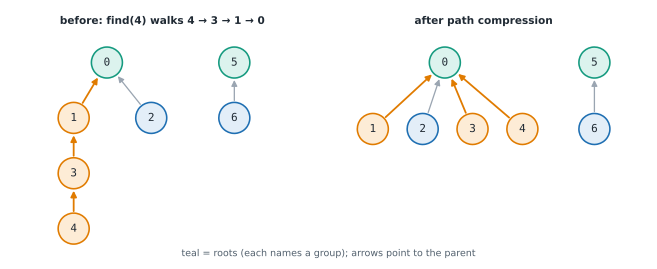
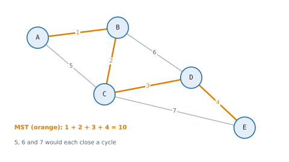

# Lesson 39: Union-find and minimum spanning trees

**You'll learn:** disjoint sets, find and union, path compression and union by size, the inverse Ackermann bound, counting components, detecting undirected cycles, spanning trees and the cut property, Kruskal's and Prim's algorithms, dense-graph Prim, single-linkage clustering.

▶ **Practise this lesson in the [sandbox](https://kishoremadanagopal.github.io/learning/dsa/#union-find-mst)**: run every example and check your exercise answers.

## Key terms

- **Union-find (disjoint set union):** a structure that keeps elements in merging groups and answers "same group?".
- **Root:** the element that names its group; it is its own parent.
- **Path compression:** pointing every node on a find path directly at the root.
- **Union by size (or rank):** hanging the smaller tree under the larger one.
- **Spanning tree:** V − 1 edges that connect every vertex with no cycle.
- **Minimum spanning tree (MST):** a spanning tree with the smallest total weight.
- **Cut property:** the cheapest edge crossing any split of the vertices is safe to include in an MST.
- **Kruskal / Prim:** build an MST by cheapest edges overall with union-find / by growing one tree with a heap.

Some questions are about **groups** that keep merging: "are these two computers on the same network yet?", "after these friendships, how many friend circles are there?", "does this new road create a loop?". A **union-find** (or **disjoint set union**, DSU) structure answers them in almost O(1) per operation.

## Union-find

Each group is stored as a small tree, and the **root** of the tree names the group. Every element has a `parent`; a root is its own parent.

- **find(x):** follow parents up to the root.
- **union(a, b):** find both roots; if they differ, hang one root under the other.

Two tricks keep the trees almost flat:

- **Union by size:** hang the **smaller** tree under the larger one, so trees stay shallow (height at most log n).
- **Path compression:** after a find, point every node on the path straight at the root, so the next find is one step.



```python
class DSU:
    def __init__(self, n):
        self.parent = list(range(n))      # each element starts alone, as its own root
        self.size = [1] * n
        self.groups = n

    def find(self, x):
        root = x
        while self.parent[root] != root:
            root = self.parent[root]
        while self.parent[x] != root:     # path compression: point everything on the path at the root
            self.parent[x], x = root, self.parent[x]
        return root

    def union(self, a, b):
        ra, rb = self.find(a), self.find(b)
        if ra == rb:
            return False                  # already in the same group
        if self.size[ra] < self.size[rb]:
            ra, rb = rb, ra
        self.parent[rb] = ra              # union by size: the smaller tree goes under the larger
        self.size[ra] += self.size[rb]
        self.groups -= 1
        return True

d = DSU(7)
for a, b in [(0, 1), (1, 2), (3, 4), (5, 6), (2, 4)]:
    d.union(a, b)
print("groups:", d.groups)
print("0 and 3 connected?", d.find(0) == d.find(3), "| 0 and 5?", d.find(0) == d.find(5))
print("size of 0's group:", d.size[d.find(0)])
```

With both tricks, any sequence of m operations on n elements takes O(m · α(n)) time, where α is the **inverse Ackermann function**: it's at most 4 for any n you could ever store, so each operation is effectively O(1). The `find` above is a loop rather than recursion, so long chains can't hit the recursion limit.

## What union-find is good at

| Problem | How |
|---|---|
| Count connected components as edges arrive | start with n groups; each successful union removes one |
| Find the edge that creates a cycle (undirected) | `union` returns False: both ends were already connected |
| Group equal things: accounts sharing an email, synonyms, equations like a = b | union every pair that must be together |
| Kruskal's minimum spanning tree | add the cheapest edges that join different groups |
| Percolation, image segmentation, "islands" that appear one cell at a time | union neighbouring cells as they're added |

Union-find can only **merge**; it can't split groups apart. BFS/DFS is better when the graph is fixed and you need paths, not just "same group?".

## Minimum spanning trees

A **spanning tree** connects all V vertices of a connected, undirected, weighted graph using exactly V − 1 edges and no cycles. A **minimum spanning tree (MST)** is one with the smallest total weight: the cheapest way to cable every building, pipe every house, or connect every server.



Both classic algorithms rely on the **cut property**: for any split of the vertices into two sides, the cheapest edge crossing the split belongs to some MST. So it's always safe to take the cheapest edge that connects something new.

## Kruskal's algorithm

Sort all edges by weight; go through them cheapest first, and keep an edge only if it joins two **different** groups (union-find says so). Stop at V − 1 edges.

```python
def kruskal(n, edges):                     # edges: (weight, u, v)
    parent = list(range(n))
    def find(x):
        while parent[x] != x:
            parent[x] = parent[parent[x]]  # path halving: a simpler form of path compression
            x = parent[x]
        return x
    total, chosen = 0, []
    for w, u, v in sorted(edges):
        ru, rv = find(u), find(v)
        if ru != rv:                       # joins two separate groups: no cycle
            parent[ru] = rv
            total += w
            chosen.append((u, v, w))
            if len(chosen) == n - 1:
                break
    return total, chosen

A, B, C, D, E = range(5)
edges = [(1, A, B), (2, B, C), (3, C, D), (4, D, E), (5, A, C), (6, B, D), (7, C, E)]
print(kruskal(5, edges))
```

**Cost:** sorting dominates, O(E log E). Kruskal is natural when you already have an edge list.

## Prim's algorithm

Grow **one** tree from any start vertex. Keep a heap of edges leaving the tree; repeatedly take the cheapest edge that reaches a vertex **not yet in the tree**. It's Dijkstra's shape, but the heap key is the single edge weight, not the distance from the start.

```python
import heapq

def prim(n, adj, start=0):                 # adj[u] = [(v, w), ...], undirected
    in_tree = [False] * n
    heap = [(0, start)]
    total, added = 0, 0
    while heap and added < n:
        w, u = heapq.heappop(heap)
        if in_tree[u]:
            continue                       # stale: u already joined more cheaply
        in_tree[u] = True
        total += w
        added += 1
        for v, wt in adj[u]:
            if not in_tree[v]:
                heapq.heappush(heap, (wt, v))
    return total if added == n else None   # None: the graph isn't connected

adj = [[] for _ in range(5)]
for w, u, v in [(1, 0, 1), (2, 1, 2), (3, 2, 3), (4, 3, 4), (5, 0, 2), (6, 1, 3), (7, 2, 4)]:
    adj[u].append((v, w))
    adj[v].append((u, w))
print(prim(5, adj))
```

**Cost:** O(E log V) with a heap. For a **dense** graph, such as "connect these n points, any two can be joined", there are about n²/2 edges; a heap-free Prim that keeps each outside vertex's cheapest link in an array and scans it is O(V²), the best possible there (the second exercise).

## Clustering with an MST

Run Kruskal but **stop early**, when k groups remain: you've split the points into k clusters, merging the closest ones first. That's **single-linkage hierarchical clustering**, a classic unsupervised learning method; the MST edges are the merge steps of its dendrogram.

## At a glance

| Concept | Approach | Time | Space |
|---|---|---|---|
| Find / union | path compression + union by size | O(α(n)) amortised, effectively O(1) | O(n) |
| Count components as edges arrive | start at n; each successful union subtracts 1 | O(E · α(V)) | O(V) |
| Undirected cycle (redundant edge) | union fails because both ends share a root | O(E · α(V)) | O(V) |
| Kruskal's MST | sort edges; add those joining different groups | O(E log E) | O(V + E) |
| Prim's MST (heap) | grow one tree; take the cheapest edge to a new vertex | O(E log V) | O(V + E) |
| Prim's MST (dense, array) | keep each outside vertex's cheapest link; scan for the minimum | O(V²) | O(V) |
| Single-linkage clustering into k groups | Kruskal, stopping at k groups | O(E log E) | O(V + E) |

## Common mistakes

- Comparing `parent[a] == parent[b]` instead of their roots, `find(a) == find(b)`.
- A recursive `find` on long chains, which can exceed the recursion limit before compression kicks in.
- Expecting union-find to split groups or report paths.
- Confusing Prim's heap key (one edge's weight) with Dijkstra's (distance from the start).

## Exercises

### 1. Redundant connection

A tree with `n` nodes (labelled `1` to `n`) had **one** extra edge added. `edges` lists all n edges as pairs. Write `redundant_connection(edges)` returning the edge that can be removed to leave a tree; if there are several answers, return the one that appears **last** in `edges`. Return it as a list `[u, v]`, as given. It must handle 100,000 edges quickly.

Starter code:

```python
def redundant_connection(edges):
    pass

print(redundant_connection([[1, 2], [1, 3], [2, 3]]))                    # [2, 3]
print(redundant_connection([[1, 2], [2, 3], [3, 4], [1, 4], [1, 5]]))    # [1, 4]
```

<details>
<summary>🧭 How to approach it</summary>

1. **Understand:** exactly one extra edge, so exactly one cycle; nodes are 1..n with n = len(edges); return the latest edge of the cycle.
2. **Examples:** the triangle → [2, 3]; the square → [1, 4].
3. **Brute force:** before adding each edge, BFS/DFS to see whether its ends are already connected: O(n²).
4. **Pattern:** **union-find** (cycle detection in an undirected graph as edges arrive).
5. **Plan:** DSU over 1..n; the first edge whose ends share a root is the answer.
6. **Code and test:** a doubled edge, unordered edges, the cycle closing mid-list.

</details>

<details>
<summary>💡 Hint 1</summary>

Add the edges one at a time. Which edge is the first to connect two nodes that were **already** connected?

</details>

<details>
<summary>💡 Hint 2</summary>

A tree plus one edge has exactly one cycle, and the edge that closes it while scanning left to right is the last edge of that cycle in the list. Union-find tells you whether two nodes are already in the same group.

</details>

<details>
<summary>💡 Hint 3</summary>

`parent = list(range(n + 1))` with an iterative `find`. For each edge, if `find(u) == find(v)` return it; otherwise `parent[find(u)] = find(v)`.

</details>

### 2. Connect all points

`points` is a list of `[x, y]` integer coordinates. Joining two points costs their Manhattan distance `|x1 − x2| + |y1 − y2|`. Write `min_cost_connect(points)` returning the minimum total cost to connect all the points (so every point can reach every other).

Starter code:

```python
def min_cost_connect(points):
    pass

print(min_cost_connect([[0, 0], [2, 2], [3, 10], [5, 2], [7, 0]]))   # 20
```

<details>
<summary>🧭 How to approach it</summary>

1. **Understand:** any point can link to any other; cost is Manhattan distance; one point costs 0.
2. **Examples:** the example's MST costs 20.
3. **Brute force:** try every spanning tree: hopeless. All pairs + Kruskal: O(n² log n), acceptable.
4. **Pattern:** **minimum spanning tree**; for a dense graph, **array-based Prim** in O(n²).
5. **Plan:** `best` array, n rounds of "pick the cheapest outside point, update the others".
6. **Code and test:** one point, collinear points, huge coordinates.

</details>

<details>
<summary>💡 Hint 1</summary>

"Connect everything at minimum total cost" is a minimum spanning tree. Every pair of points can be joined, so the graph is complete: about n²/2 edges.

</details>

<details>
<summary>💡 Hint 2</summary>

Kruskal works (build all pairs, sort them, union-find), at O(n² log n). Prim without a heap fits a complete graph better: keep, for each point outside the tree, the cheapest link into the tree.

</details>

<details>
<summary>💡 Hint 3</summary>

`best = [inf] * n; best[0] = 0`. Repeat n times: pick the outside point with the smallest `best`, add `best[u]` to the total, mark it in the tree, and lower `best[v]` for every outside point v using the distance from u.

</details>

**In the sandbox:** exercises 81–82. Press **Check** to run the hidden tests.

### Answers and walkthroughs

Open these only after a real attempt. Each one explains the solution step by step.

<details>
<summary>✅ 1. Redundant connection</summary>

```python
def redundant_connection(edges):
    parent = list(range(len(edges) + 1))     # nodes 1..n, and there are n edges

    def find(x):
        while parent[x] != x:
            parent[x] = parent[parent[x]]    # path halving keeps the trees flat
            x = parent[x]
        return x

    for u, v in edges:
        ru, rv = find(u), find(v)
        if ru == rv:
            return [u, v]                    # u and v were already connected: this edge closes a cycle
        parent[ru] = rv
    return []

print(redundant_connection([[1, 2], [1, 3], [2, 3]]))
print(redundant_connection([[1, 2], [2, 3], [3, 4], [1, 4], [1, 5]]))
```

**Line by line**

- `parent` has n + 1 entries so node labels 1..n can be used directly as indexes.
- `find` follows parents to the root, halving the path as it goes.
- Equal roots mean u and v are already connected, so this edge closes the cycle. Since we scan in order, it's the cycle edge that appears last.
- Otherwise the edge merges two groups.

**Trace** on [[1, 2], [2, 3], [3, 4], [1, 4], [1, 5]]:

| edge | find(u), find(v) | action |
|---|---|---|
| [1, 2] | 1, 2 | merge |
| [2, 3] | 2, 3 | merge |
| [3, 4] | 3, 4 | merge |
| [1, 4] | 4, 4 | same group: return [1, 4] |

**Complexity:** O(n · α(n)), effectively O(n), time; O(n) space.

**Common wrong approach:** returning the first edge that touches an already-seen **node**. Seeing a node before doesn't mean a cycle; only connecting two nodes of the same group does.

</details>

<details>
<summary>✅ 2. Connect all points</summary>

```python
def min_cost_connect(points):
    n = len(points)
    INF = float("inf")
    best = [INF] * n            # cheapest known link from each point into the tree
    in_tree = [False] * n
    best[0] = 0
    total = 0
    for _ in range(n):          # Prim's algorithm for a dense graph: O(n^2), no heap
        u = min((i for i in range(n) if not in_tree[i]), key=best.__getitem__)
        in_tree[u] = True
        total += best[u]
        ux, uy = points[u]
        for v in range(n):      # u joined the tree: maybe it offers some points a cheaper link
            if not in_tree[v]:
                d = abs(ux - points[v][0]) + abs(uy - points[v][1])
                if d < best[v]:
                    best[v] = d
    return total

print(min_cost_connect([[0, 0], [2, 2], [3, 10], [5, 2], [7, 0]]))
```

**Line by line**

- `best[v]` is the cheapest edge from v to any point already in the tree; point 0 starts the tree at cost 0.
- Each round picks the outside point with the smallest `best` (the cut property says that edge is safe) and adds its cost.
- Then the newly added point may be closer to some outside points, so their `best` values are lowered.
- After n rounds every point is in the tree.

**Trace** on [[0, 0], [1, 0], [2, 0], [3, 0]]:

| round | point added | cost | best afterwards (for points 0–3) |
|---|---|---|---|
| 1 | 0 | 0 | –, 1, 2, 3 |
| 2 | 1 | 1 | –, –, 1, 2 |
| 3 | 2 | 1 | –, –, –, 1 |
| 4 | 3 | 1 | total 3 |

**Complexity:** O(n²) time, O(n) space; with n²/2 edges there's no faster way to look at them all.

**Common wrong approach:** connecting each point to its nearest neighbour. That can leave separate clusters unconnected, and it isn't an MST.

</details>

## Quick quiz

1. What do path compression and union by size give union-find?
   - A) Nearly O(1) amortised time per operation (O(α(n)))
   - B) O(log n) per operation in the worst case, at best
   - C) The ability to split groups

2. How does union-find detect a cycle as undirected edges are added?
   - A) The edge's two ends already have the same root
   - B) A node gets a second parent
   - C) The number of groups goes up

3. How many edges does a spanning tree of a connected graph with V vertices have?
   - A) V − 1
   - B) V
   - C) E − 1

4. Which algorithm builds an MST by sorting all edges and adding the cheapest ones that don't form a cycle?
   - A) Kruskal's algorithm
   - B) Prim's algorithm
   - C) Dijkstra's algorithm

<details>
<summary>Quiz answers</summary>

1. **A) Nearly O(1) amortised time per operation (O(α(n)))**: α(n), the inverse Ackermann function, is at most 4 in practice.
2. **A) The edge's two ends already have the same root**: If u and v are already connected, adding u–v closes a loop.
3. **A) V − 1**: Any fewer can't connect everything; any more creates a cycle.
4. **A) Kruskal's algorithm**: Prim instead grows a single tree from a start vertex.

</details>

---
Previous: [Lesson 38](38-shortest-paths.md) · Next: [Lesson 40: Advanced graph algorithms](40-advanced-graphs.md)
