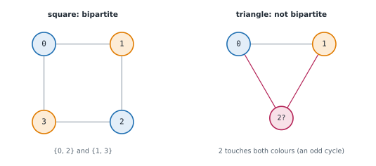
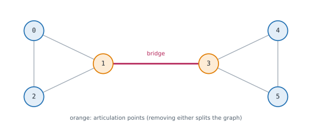

# Lesson 40: Advanced graph algorithms

**You'll learn:** bipartite graphs and two-colouring, cycles in undirected graphs, strongly connected components with Kosaraju, bridges and articulation points with low-link values, Eulerian paths with Hierholzer, maximum flow and minimum cut with Edmonds-Karp, NP-hard graph problems, a summary of graph algorithms.

▶ **Practise this lesson in the [sandbox](https://kishoremadanagopal.github.io/learning/dsa/#advanced-graphs)**: run every example and check your exercise answers.

## Key terms

- **Bipartite graph:** a graph whose vertices split into two sides with every edge between the sides.
- **Strongly connected component (SCC):** a maximal set of vertices in a directed graph that can all reach each other.
- **Bridge:** an edge whose removal disconnects the graph.
- **Articulation point (cut vertex):** a vertex whose removal disconnects the graph.
- **Low-link value:** the earliest discovery time a DFS subtree can reach with one back edge.
- **Eulerian path:** a path that uses every edge exactly once.
- **Maximum flow:** the most that can be sent from a source to a sink through edges with capacities.
- **Minimum cut:** the cheapest set of edges whose removal separates source from sink; equals the maximum flow.
- **NP-hard:** a problem with no known polynomial-time algorithm, such as the travelling salesman problem.

This lesson collects the graph algorithms that show up in harder interviews and real systems. Each is built from the same pieces you already know: BFS, DFS and careful bookkeeping.

## Bipartite graphs: two-colouring

A graph is **bipartite** if its vertices can be split into two sides so that every edge goes **between** the sides: students and courses, job seekers and jobs. Equivalently, you can colour it with two colours so no edge joins two vertices of the same colour, which is possible exactly when the graph has **no odd-length cycle**.



BFS from each uncoloured vertex, giving each neighbour the **opposite** colour; meeting a neighbour that already has the **same** colour proves it's not bipartite. That's the first exercise.

## Cycles in an undirected graph

In an undirected graph every edge appears twice (u → v and v → u), so seeing your parent again isn't a cycle. Any **other** already-visited neighbour is. (Union-find, Lesson 39, is the other easy way.)

```python
def has_cycle_undirected(n, edges):
    graph = [[] for _ in range(n)]
    for u, v in edges:
        graph[u].append(v)
        graph[v].append(u)
    seen = set()
    for start in range(n):
        if start in seen:
            continue
        seen.add(start)
        stack = [(start, -1)]                 # (vertex, the vertex we came from)
        while stack:
            u, parent = stack.pop()
            for v in graph[u]:
                if v == parent:
                    continue                  # the edge we just walked along
                if v in seen:
                    return True               # reached a seen vertex another way: a loop
                seen.add(v)
                stack.append((v, u))
    return False

print(has_cycle_undirected(4, [(0, 1), (1, 2), (2, 3)]), has_cycle_undirected(4, [(0, 1), (1, 2), (2, 0), (2, 3)]))
```

(For directed graphs, use the three colours or Kahn's algorithm from Lesson 37.)

## Strongly connected components

In a **directed** graph, a **strongly connected component (SCC)** is a maximal group where every vertex can reach every other: a set of web pages that all link to each other in a loop, or accounts that all transfer money around a ring. Shrinking each SCC to a single vertex always leaves a DAG.

**Kosaraju's algorithm** uses two DFS passes:

1. DFS the graph and record vertices in order of **finishing**.
2. **Reverse** every edge. Take vertices in **reverse** finishing order; each DFS on the reversed graph from an unvisited vertex collects exactly one SCC.

```python
def kosaraju(n, edges):
    graph = [[] for _ in range(n)]
    rev = [[] for _ in range(n)]
    for u, v in edges:
        graph[u].append(v)
        rev[v].append(u)

    order, seen = [], [False] * n             # pass 1: finishing order, with an explicit stack
    for s in range(n):
        if seen[s]:
            continue
        seen[s] = True
        stack = [(s, iter(graph[s]))]
        while stack:
            u, it = stack[-1]
            for v in it:
                if not seen[v]:
                    seen[v] = True
                    stack.append((v, iter(graph[v])))
                    break
            else:                             # no unvisited neighbours left: u is finished
                stack.pop()
                order.append(u)

    comps, seen = [], [False] * n             # pass 2: reversed graph, latest finisher first
    for s in reversed(order):
        if seen[s]:
            continue
        seen[s], comp, stack = True, [], [s]
        while stack:
            u = stack.pop()
            comp.append(u)
            for v in rev[u]:
                if not seen[v]:
                    seen[v] = True
                    stack.append(v)
        comps.append(sorted(comp))
    return comps

print(kosaraju(8, [(0, 1), (1, 2), (2, 0), (2, 3), (3, 4), (4, 5), (5, 3), (6, 5), (6, 7), (7, 6)]))
```

O(V + E). **Tarjan's algorithm** finds SCCs in one DFS using the low-link values described next. SCCs are used to solve **2-SAT** problems, simplify dependency graphs, and find groups in social networks.

## Bridges and articulation points

A **bridge** is an edge whose removal disconnects the graph; an **articulation point** (cut vertex) is a vertex whose removal does. They are the single points of failure of a network.

**Tarjan's low-link method:** in a DFS, give each vertex its discovery time `disc[v]`, and compute `low[v]`, the earliest discovery time reachable from v's subtree using at most one **back edge** (an edge to an ancestor). For a tree edge u → v:

- if `low[v] > disc[u]`, nothing below v can climb back to u or above, so **u–v is a bridge**;
- if `low[v] >= disc[u]` (and u isn't the root), **u is an articulation point**; the root is one if it has two or more DFS children.



The recursive version is the clearest; the second exercise asks you to write it.

## Eulerian paths: every edge exactly once

An **Eulerian path** uses every **edge** exactly once (drawing a figure without lifting the pen; a postman covering every street). In a connected undirected graph it exists when 0 or 2 vertices have odd degree (with 2, it must start at one of them). In a directed graph, every vertex needs in-degree = out-degree, except possibly a start (one extra out) and an end (one extra in).

**Hierholzer's algorithm** walks unused edges until stuck, then backs up, adding vertices to the route as it backs out. O(E).

```python
from collections import defaultdict

def itinerary(tickets, start):                # directed Eulerian path, smallest names first
    graph = defaultdict(list)
    for a, b in sorted(tickets, reverse=True):
        graph[a].append(b)                    # reverse-sorted, so pop() takes the smallest
    route, stack = [], [start]
    while stack:
        while graph[stack[-1]]:
            stack.append(graph[stack[-1]].pop())   # follow an unused ticket
        route.append(stack.pop())             # stuck: this airport goes on the route (backwards)
    return route[::-1]

print(itinerary([("JFK", "SFO"), ("JFK", "ATL"), ("SFO", "ATL"), ("ATL", "JFK"), ("ATL", "SFO")], "JFK"))
```

A **Hamiltonian** path, visiting every **vertex** exactly once, sounds similar but is NP-complete (see the end of this lesson).

## Maximum flow and minimum cut

Treat each directed edge as a pipe with a **capacity**. How much can flow from a **source** s to a **sink** t per second? The **Ford-Fulkerson** idea: while there is a path from s to t with spare capacity (an **augmenting path**), push as much as its narrowest pipe allows. Pushing flow creates **reverse** capacity, so later paths can undo an earlier poor choice. Finding each augmenting path with BFS is the **Edmonds-Karp** algorithm, O(V × E²).

```python
from collections import deque

def max_flow(n, edges, s, t):
    cap = [[0] * n for _ in range(n)]
    adj = [set() for _ in range(n)]
    for u, v, c in edges:
        cap[u][v] += c
        adj[u].add(v)
        adj[v].add(u)                        # the reverse direction, for undoing flow
    flow = 0
    while True:
        parent = [-1] * n
        parent[s] = s
        queue = deque([s])
        while queue and parent[t] == -1:     # BFS for a path with spare capacity
            u = queue.popleft()
            for v in adj[u]:
                if parent[v] == -1 and cap[u][v] > 0:
                    parent[v] = u
                    queue.append(v)
        if parent[t] == -1:
            return flow                       # no augmenting path left
        push, v = float("inf"), t
        while v != s:                         # the narrowest pipe on the path
            push = min(push, cap[parent[v]][v])
            v = parent[v]
        v = t
        while v != s:
            cap[parent[v]][v] -= push
            cap[v][parent[v]] += push         # allow this flow to be undone later
            v = parent[v]
        flow += push

edges = [(0, 1, 10), (0, 2, 5), (1, 2, 15), (1, 3, 5), (2, 3, 10)]
print(max_flow(4, edges, 0, 3))
```

The **max-flow min-cut theorem** says the maximum flow equals the total capacity of the cheapest set of edges whose removal separates s from t. Flow algorithms also solve **bipartite matching** (assign workers to jobs: source → workers → jobs → sink, all capacities 1), image segmentation, and scheduling.

## Problems with no known fast algorithm

Some graph problems are **NP-hard**: no polynomial-time algorithm is known, and finding one would solve thousands of other hard problems. Recognise them so you don't waste time hunting for an O(V + E) trick:

| Problem | Typical approach |
|---|---|
| **Travelling salesman** (shortest tour through every vertex) | bitmask DP for n ≤ ~20 (Part 9), heuristics and approximation otherwise |
| **Hamiltonian path** (visit every vertex once) | backtracking or bitmask DP for small n |
| **Graph colouring** with the fewest colours | backtracking, greedy approximations |
| **Maximum clique / independent set** | backtracking with pruning, small n |

## Graph algorithms at a glance

| Task | Algorithm | Time |
|---|---|---|
| Reachability, components | DFS / BFS | O(V + E) |
| Unweighted shortest path | BFS | O(V + E) |
| Non-negative weighted shortest path | Dijkstra | O((V + E) log V) |
| Negative weights / negative cycles | Bellman-Ford | O(V · E) |
| All-pairs shortest paths | Floyd-Warshall | O(V³) |
| Dependency order, directed cycle check | topological sort | O(V + E) |
| Dynamic connectivity, undirected cycle check | union-find | ~O(1) per operation |
| Minimum spanning tree | Kruskal / Prim | O(E log E) / O(E log V) |
| Two-colouring | BFS / DFS | O(V + E) |
| Strongly connected components | Kosaraju / Tarjan | O(V + E) |
| Bridges, articulation points | Tarjan low-link | O(V + E) |
| Use every edge once | Hierholzer | O(E) |
| Maximum flow, bipartite matching | Edmonds-Karp | O(V · E²) |

## At a glance

| Concept | Approach | Time | Space |
|---|---|---|---|
| Bipartite check | BFS two-colouring; a same-colour edge means an odd cycle | O(V + E) | O(V) |
| Undirected cycle check | DFS ignoring the parent edge, or union-find | O(V + E) | O(V) |
| Strongly connected components | Kosaraju: finishing order, then DFS on reversed edges | O(V + E) | O(V + E) |
| Bridges / articulation points | Tarjan: low[v] > disc[u] / low[v] ≥ disc[u] | O(V + E) | O(V) |
| Eulerian path | Hierholzer: walk unused edges, add vertices when stuck | O(E) | O(E) |
| Maximum flow | Edmonds-Karp: BFS augmenting paths with reverse capacities | O(V · E²) | O(V²) with a matrix |
| Travelling salesman (exact) | bitmask DP over subsets | O(2ⁿ · n²) | O(2ⁿ · n) |

## Common mistakes

- Checking only the component that contains vertex 0 when the graph is disconnected.
- Treating the parent edge as a cycle in an undirected graph.
- Using `low[v] >= disc[u]` (the articulation-point test) to find bridges.
- Searching for a fast exact algorithm for an NP-hard problem instead of using small-n methods.

## Exercises

### 1. Is the graph bipartite?

`graph` is an adjacency list: `graph[u]` lists the neighbours of vertex `u` (vertices `0` to `n − 1`, undirected, possibly **disconnected**). Write `is_bipartite(graph)` returning `True` if the vertices can be split into two groups with every edge going between the groups.

Starter code:

```python
from collections import deque

def is_bipartite(graph):
    pass

print(is_bipartite([[1, 3], [0, 2], [1, 3], [0, 2]]))            # True: a square
print(is_bipartite([[1, 2, 3], [0, 2], [0, 1, 3], [0, 2]]))      # False: contains a triangle
```

<details>
<summary>🧭 How to approach it</summary>

1. **Understand:** undirected adjacency list; pieces may be disconnected; isolated vertices are fine.
2. **Examples:** a square → True; anything with a triangle → False.
3. **Brute force:** try all 2ⁿ ways to split the vertices: exponential.
4. **Pattern:** **two-colouring with BFS** (or DFS); a clash means an odd cycle.
5. **Plan:** colour array, BFS from every uncoloured vertex, opposite colours for neighbours.
6. **Code and test:** a disconnected graph whose second piece has an odd cycle, odd and even cycles.

</details>

<details>
<summary>💡 Hint 1</summary>

Try to colour each vertex with one of two colours so that neighbours always differ. When does that fail?

</details>

<details>
<summary>💡 Hint 2</summary>

Pick an uncoloured vertex, colour it 0, and BFS: every neighbour must get the other colour. If a neighbour already has the **same** colour as the current vertex, it's not bipartite.

</details>

<details>
<summary>💡 Hint 3</summary>

Keep `colour = [None] * n`. Loop over every start vertex (the graph may be disconnected); for an uncoloured one, colour it 0 and BFS, setting `colour[v] = 1 - colour[u]`, returning False on a clash.

</details>

### 2. Critical connections (bridges)

A network has `n` servers `0` to `n − 1`, connected by undirected `connections` (pairs). Write `critical_connections(n, connections)` returning every connection whose removal would disconnect some servers, as a list of pairs in any order.

Starter code:

```python
def critical_connections(n, connections):
    pass

print(critical_connections(4, [[0, 1], [1, 2], [2, 0], [1, 3]]))   # [[1, 3]]
```

<details>
<summary>🧭 How to approach it</summary>

1. **Understand:** undirected, possibly several pieces; a bridge is an edge on no cycle; any order of pairs.
2. **Examples:** the triangle with a tail → only [1, 3].
3. **Brute force:** remove each edge and test connectivity with BFS: O(E × (V + E)).
4. **Pattern:** **Tarjan's low-link DFS**.
5. **Plan:** discovery times and low values in one DFS; a tree edge with `low[child] > disc[parent]` is a bridge.
6. **Code and test:** a single edge, a cycle (no bridges), a chain (all bridges), two triangles joined by one edge.

</details>

<details>
<summary>💡 Hint 1</summary>

An edge is critical exactly when it isn't on any cycle. Removing every edge in turn and checking connectivity works, but costs O(E × (V + E)). How can one DFS tell?

</details>

<details>
<summary>💡 Hint 2</summary>

In a DFS, record each vertex's discovery time `disc[v]` and `low[v]`: the earliest discovery time its subtree can reach through a single back edge. If `low[v] > disc[u]` for a tree edge u → v, nothing below v loops back, so u–v is a bridge.

</details>

<details>
<summary>💡 Hint 3</summary>

In `dfs(u, parent)`: set `disc[u] = low[u] = timer`. For each neighbour v ≠ parent: if unvisited, recurse, then `low[u] = min(low[u], low[v])` and test `low[v] > disc[u]`; if visited, `low[u] = min(low[u], disc[v])`.

</details>

**In the sandbox:** exercises 83–84. Press **Check** to run the hidden tests.

### Answers and walkthroughs

Open these only after a real attempt. Each one explains the solution step by step.

<details>
<summary>✅ 1. Is the graph bipartite?</summary>

```python
from collections import deque

def is_bipartite(graph):
    colour = [None] * len(graph)
    for start in range(len(graph)):           # the graph may have several pieces
        if colour[start] is not None:
            continue
        colour[start] = 0
        queue = deque([start])
        while queue:
            u = queue.popleft()
            for v in graph[u]:
                if colour[v] is None:
                    colour[v] = 1 - colour[u] # neighbours get the opposite colour
                    queue.append(v)
                elif colour[v] == colour[u]:
                    return False              # an edge inside one colour: an odd cycle
    return True

print(is_bipartite([[1, 3], [0, 2], [1, 3], [0, 2]]))
print(is_bipartite([[1, 2, 3], [0, 2], [0, 1, 3], [0, 2]]))
```

**Line by line**

- The outer loop makes sure every piece of a disconnected graph is checked, not just the piece containing vertex 0.
- Each piece starts with colour 0; its colouring is forced from there, because each neighbour must take the opposite colour.
- A neighbour with the same colour as `u` means an edge inside one group, so no split exists.

**Trace** on the pentagon [[1, 4], [0, 2], [1, 3], [2, 4], [3, 0]]:

| popped | colours set | clash? |
|---|---|---|
| 0 (colour 0) | 1 → 1, 4 → 1 | — |
| 1 (colour 1) | 2 → 0 | — |
| 4 (colour 1) | 3 → 0 | — |
| 2 (colour 0) | — | neighbour 3 also has colour 0: **False** |

**Complexity:** O(V + E) time, O(V) space.

**Common wrong approach:** only starting from vertex 0, which misses an odd cycle in another piece of the graph.

</details>

<details>
<summary>✅ 2. Critical connections (bridges)</summary>

```python
import sys

def critical_connections(n, connections):
    sys.setrecursionlimit(10_000)
    graph = [[] for _ in range(n)]
    for u, v in connections:
        graph[u].append(v)
        graph[v].append(u)
    disc = [-1] * n          # discovery time of each server in the DFS
    low = [0] * n            # earliest discovery time reachable from its subtree with one back edge
    bridges = []
    timer = 0

    def dfs(u, parent):
        nonlocal timer
        disc[u] = low[u] = timer
        timer += 1
        for v in graph[u]:
            if v == parent:
                continue                     # don't treat the edge we came along as a way back
            if disc[v] == -1:                # tree edge: explore v first
                dfs(v, u)
                low[u] = min(low[u], low[v])
                if low[v] > disc[u]:         # v's subtree can't climb back to u or above
                    bridges.append([u, v])
            else:                            # back edge to an ancestor
                low[u] = min(low[u], disc[v])

    for s in range(n):
        if disc[s] == -1:
            dfs(s, -1)
    return bridges

print(critical_connections(4, [[0, 1], [1, 2], [2, 0], [1, 3]]))
```

**Line by line**

- `disc[u]` records when u was first reached; `low[u]` starts equal to it.
- For an unvisited neighbour, the recursive call computes `low[v]`; u inherits it because anything v's subtree can reach, u can reach too.
- An already-visited neighbour (not the parent) is an ancestor reached by a back edge, so `low[u]` may drop to its discovery time.
- `low[v] > disc[u]` means v's whole subtree has no way back to u or above except through u–v.
- Skipping only `parent` is fine here because each pair of servers has at most one connection.

**Trace** on [[0, 1], [1, 2], [2, 0], [1, 3]], starting at 0:

| step | disc | low | note |
|---|---|---|---|
| visit 0 | 0 | 0 | |
| visit 1 | 1 | 1 | tree edge 0 → 1 |
| visit 2 | 2 | 2 → **0** | back edge 2 → 0 |
| back at 1 from 2 | | low[1] = 0 | low[2] = 0 ≤ disc[1]: not a bridge |
| visit 3 | 3 | 3 | tree edge 1 → 3; no other edges |
| back at 1 from 3 | | | low[3] = 3 > disc[1] = 1: **[1, 3] is a bridge** |

**Complexity:** O(V + E) time, O(V) space. The recursion is as deep as the longest DFS path; for networks with tens of thousands of servers in a line, convert it to an explicit stack.

**Common wrong approach:** comparing `low[v] >= disc[u]`, which is the test for articulation **points**, and reports edges on cycles as bridges.

</details>

## Quick quiz

1. A graph is bipartite exactly when it has no:
   - A) Cycle of odd length
   - B) Cycle at all
   - C) Vertex of odd degree

2. What does each strongly connected component of a directed graph contain?
   - A) A maximal set of vertices that can all reach each other
   - B) Vertices with the same in-degree
   - C) A single vertex and its neighbours

3. In Tarjan's method, when is the tree edge u → v a bridge?
   - A) When low[v] > disc[u]
   - B) When low[v] == 0
   - C) When v is a leaf

4. Which problem is NP-hard, with no known polynomial-time algorithm?
   - A) Travelling salesman (shortest tour through every vertex)
   - B) Minimum spanning tree
   - C) Shortest path with non-negative weights

<details>
<summary>Quiz answers</summary>

1. **A) Cycle of odd length**: Even cycles can be coloured alternately; odd ones can't.
2. **A) A maximal set of vertices that can all reach each other**: Shrinking each SCC to one vertex leaves a DAG.
3. **A) When low[v] > disc[u]**: Nothing in v's subtree can climb back to u or above.
4. **A) Travelling salesman (shortest tour through every vertex)**: MST and Dijkstra are fast; TSP needs exponential time for exact answers in general.

</details>

---
Previous: [Lesson 39](39-union-find-mst.md) · Next: [Lesson 41: Dynamic programming foundations](41-dp-intro.md)
