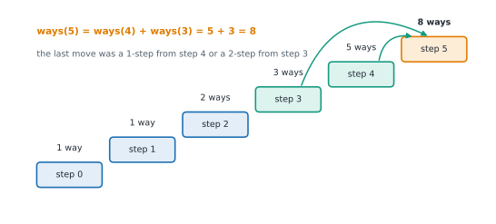

# Lesson 41: Dynamic programming foundations

**You'll learn:** overlapping subproblems and optimal substructure, memoisation and tabulation, recursion depth limits, the five-step DP recipe, space optimisation, climbing stairs, minimum-cost stairs, house robber, recognising DP problems.

▶ **Practise this lesson in the [sandbox](https://kishoremadanagopal.github.io/learning/dsa/#dp-intro)**: run every example and check your exercise answers.

## Key terms

- **Dynamic programming (DP):** solving a problem by combining stored answers to smaller versions of it, each computed once.
- **Overlapping subproblems:** the same smaller problems are needed many times.
- **Optimal substructure:** an optimal answer is built from optimal answers to subproblems.
- **Memoisation (top-down):** recursion that caches each result the first time it's computed.
- **Tabulation (bottom-up):** filling a table of answers from the smallest cases upwards with loops.
- **State:** what one DP table entry means, such as "dp[i] = ways to reach step i".
- **Transition (recurrence):** the formula that computes a state from smaller states.
- **Base case:** a state whose answer is known directly, such as dp[0] = 1.

**Dynamic programming (DP)** solves a problem by combining the answers to **smaller versions of the same problem**, solving each smaller version only **once** and storing the result. Lesson 21 showed the idea on Fibonacci: naive recursion made millions of calls because it solved fib(3) and fib(2) over and over; remembering answers made it O(n).

A problem suits DP when it has both:

- **Overlapping subproblems:** the same smaller problems come up again and again. (Merge sort's halves never overlap, which is why it's divide and conquer, not DP.)
- **Optimal substructure:** the best answer is built from the best answers to subproblems. The cheapest route to the top of the stairs ends with the cheapest route to one of the last steps.

## Two ways to write it: top-down and bottom-up

```python
from functools import cache

# Top-down (memoisation): write the recursion, cache the answers
@cache
def fib_memo(n):
    return n if n < 2 else fib_memo(n - 1) + fib_memo(n - 2)

# Bottom-up (tabulation): fill a table from the smallest case upwards
def fib_table(n):
    if n < 2:
        return n
    dp = [0] * (n + 1)
    dp[1] = 1
    for i in range(2, n + 1):
        dp[i] = dp[i - 1] + dp[i - 2]      # every value it needs is already in the table
    return dp[n]

# Bottom-up with O(1) space: only the last two values are ever needed
def fib_two(n):
    a, b = 0, 1
    for _ in range(n):
        a, b = b, a + b
    return a

print(fib_memo(90), fib_table(90), fib_two(90))
print(len(str(fib_two(10_000))), "digits in fib(10,000)")
```

| | Top-down (memoisation) | Bottom-up (tabulation) |
|---|---|---|
| How | recursion + cache | loops filling a table |
| Computes | only the subproblems actually needed | every subproblem up to n |
| Easiest when | the recurrence is clear but the order isn't | the order of subproblems is simple |
| Limits | recursion depth (see below) | none from the stack |
| Space savings | hard | easy: keep only the rows or values still needed |

**Recursion depth:** a top-down solution for n = 5,000 needs about 5,000 nested calls. Desktop Python stops at about 1,000 (`RecursionError`); in this browser sandbox, recursion through `@cache` stops at about 500, because each call adds the cache's own frame. So memoise for small inputs or when only some subproblems matter, and **tabulate** when n is large.

## The DP recipe

1. **State:** define, in words, what one table entry means. "`dp[i]` = the number of ways to reach step i." Most of the difficulty is here.
2. **Transition (recurrence):** how an entry follows from smaller ones. "`dp[i] = dp[i − 1] + dp[i − 2]`."
3. **Base cases:** the smallest entries you know directly. "`dp[0] = 1`."
4. **Order:** compute entries so that everything an entry needs is already done (usually increasing i).
5. **Answer:** which entry, or which combination of entries, answers the question. "`dp[n]`."

Then ask whether you can **save space**: if `dp[i]` only looks back a fixed number of steps, keep just those values.

## Climbing stairs

You climb n steps, taking 1 or 2 at a time. In how many different ways can you reach the top? The **last** move was either a 1-step from step n − 1 or a 2-step from step n − 2, so `ways(n) = ways(n − 1) + ways(n − 2)`: Fibonacci in disguise.



```python
def climb(n):
    dp = [0] * (n + 1)
    dp[0] = 1                       # one way to stand at the bottom: do nothing
    for i in range(1, n + 1):
        dp[i] = dp[i - 1] + (dp[i - 2] if i >= 2 else 0)
    return dp

print(climb(10))
```

## Minimum cost climbing stairs

`cost[i]` is the price of stepping on step i; you may start on step 0 or 1 and want to get past the last step as cheaply as possible, moving 1 or 2 steps at a time. State: `dp[i]` = the cheapest total to **arrive** at step i. You arrive from i − 1 or i − 2, paying for the step you left.

```python
def min_cost(cost):
    n = len(cost)
    dp = [0] * (n + 1)              # dp[0] = dp[1] = 0: you may start on either for free
    for i in range(2, n + 1):
        dp[i] = min(dp[i - 1] + cost[i - 1], dp[i - 2] + cost[i - 2])
    return dp[n]                    # "past the end" is position n

print(min_cost([10, 15, 20]), min_cost([1, 100, 1, 1, 1, 100, 1, 1, 100, 1]))
```

## House robber: take it or skip it

Houses in a row hold `nums[i]` money; you can't rob two neighbours. At each house there are two choices: **skip** it (keep the best up to the previous house) or **take** it (its money plus the best up to two houses back). That take-or-skip shape appears in countless DP problems. It's the first exercise.

## How to recognise a DP problem

- It asks for a **count** ("how many ways"), an **optimum** ("minimum cost", "longest", "maximum profit") or **feasibility** ("is it possible").
- Each decision **limits** future decisions, so a simple greedy choice might be wrong.
- Brute force would try every combination (2ⁿ subsets, every path), and the same partial situations repeat.
- Input sizes are moderate: n up to around 10⁴ for O(n²), or two sizes up to around 10³ for an O(n·m) table.

## At a glance

| Concept | Approach | Time | Space |
|---|---|---|---|
| Fibonacci / climbing stairs (1 or 2) | dp[i] = dp[i − 1] + dp[i − 2] | O(n) | O(1) with two variables |
| Climbing with any step sizes | ways[i] = Σ ways[i − s] | O(n · k) | O(n) |
| Minimum cost stairs | dp[i] = min(dp[i − 1] + cost[i − 1], dp[i − 2] + cost[i − 2]) | O(n) | O(1) |
| House robber | best = max(skip: prev1, take: prev2 + x) | O(n) | O(1) |
| Memoise any recursive function | @cache | O(states × work per state) | O(states) + recursion depth |

## Common mistakes

- Starting to code before defining in words what dp[i] means.
- Forgetting or mis-setting the base case (dp[0] = 0 where it should be 1).
- Filling the table in an order where some needed entry isn't computed yet.
- Memoised recursion on large n, which exceeds the recursion limit; tabulate instead.

## Exercises

### 1. Climbing stairs with any step sizes

Write `count_ways(n, steps)` returning how many different ordered sequences of moves reach exactly step `n`, where each move climbs one of the sizes in `steps` (a list of distinct positive integers). There's 1 way to reach step 0. It must handle n = 5,000 quickly: build a table with a loop (deep recursion won't fit).

Starter code:

```python
def count_ways(n, steps):
    pass

print(count_ways(4, [1, 2]))      # 5
print(count_ways(4, [1, 2, 3]))   # 7
```

<details>
<summary>🧭 How to approach it</summary>

1. **Understand:** ordered sequences (1 + 2 and 2 + 1 are different); exactly n; n = 0 → 1.
2. **Examples:** n = 4 with [1, 2] → 5: 1111, 112, 121, 211, 22.
3. **Brute force:** recursion over the first move: correct but exponential, since the same heights are recomputed.
4. **Pattern:** **1-D DP**: state `ways[i]`, transition = sum over the last move.
5. **Plan:** a table of size n + 1, base `ways[0] = 1`, fill upwards, return `ways[n]`.
6. **Code and test:** n = 0, impossible heights, a single big step.

</details>

<details>
<summary>💡 Hint 1</summary>

Think about the **last** move. If it was a step of size s, where were you just before it?

</details>

<details>
<summary>💡 Hint 2</summary>

You were at step n − s. So the number of ways to reach n is the sum of the ways to reach n − s, over every step size s that fits.

</details>

<details>
<summary>💡 Hint 3</summary>

`ways = [0] * (n + 1); ways[0] = 1`; for i from 1 to n, add `ways[i - s]` for each `s <= i`. Return `ways[n]`.

</details>

### 2. House robber

Houses in a row contain `nums[i]` money (non-negative). You can't rob two **adjacent** houses. Write `rob(nums)` returning the most money you can take. It must handle 100,000 houses quickly.

Starter code:

```python
def rob(nums):
    pass

print(rob([1, 2, 3, 1]))       # 4: houses 0 and 2
print(rob([2, 7, 9, 3, 1]))    # 12: houses 0, 2 and 4
```

<details>
<summary>🧭 How to approach it</summary>

1. **Understand:** no two neighbours; amounts ≥ 0; empty list → 0.
2. **Examples:** [2, 7, 9, 3, 1] → 2 + 9 + 1 = 12.
3. **Brute force:** recursion that tries rob/skip at every house: O(2ⁿ).
4. **Pattern:** **1-D DP, take or skip**: `best[i] = max(best[i−1], best[i−2] + nums[i])`.
5. **Plan:** two rolling variables instead of a whole table.
6. **Code and test:** empty, one house, the best plan skipping two houses in a row.

</details>

<details>
<summary>💡 Hint 1</summary>

At each house you have two choices. What are they, and what does each one allow at the previous house?

</details>

<details>
<summary>💡 Hint 2</summary>

Let `best[i]` be the most you can take from the first i + 1 houses. Either skip house i (`best[i − 1]`) or rob it (`best[i − 2] + nums[i]`); take the larger.

</details>

<details>
<summary>💡 Hint 3</summary>

You only ever look back two houses, so keep two variables `prev2` and `prev1`. For each house: `prev2, prev1 = prev1, max(prev1, prev2 + money)`. Return `prev1`.

</details>

**In the sandbox:** exercises 85–86. Press **Check** to run the hidden tests.

### Answers and walkthroughs

Open these only after a real attempt. Each one explains the solution step by step.

<details>
<summary>✅ 1. Climbing stairs with any step sizes</summary>

```python
def count_ways(n, steps):
    ways = [0] * (n + 1)
    ways[0] = 1                          # one way to be at the bottom: make no moves
    for i in range(1, n + 1):
        for s in steps:
            if s <= i:
                ways[i] += ways[i - s]   # the last move was a step of size s
    return ways[n]

print(count_ways(4, [1, 2]))
print(count_ways(4, [1, 2, 3]))
```

**Line by line**

- `ways[i]` means "the number of move sequences that end exactly at step i".
- `ways[0] = 1` is the empty sequence. Without it, every count would stay 0.
- For each i, every allowed last step s contributes all the ways of reaching i − s.
- Filling i in increasing order guarantees `ways[i - s]` is already final.

**Trace** for n = 4, steps [1, 2, 3]:

| i | from i−1 | from i−2 | from i−3 | ways[i] |
|---|---|---|---|---|
| 0 | | | | 1 |
| 1 | 1 | | | 1 |
| 2 | 1 | 1 | | 2 |
| 3 | 2 | 1 | 1 | 4 |
| 4 | 4 | 2 | 1 | **7** |

**Complexity:** O(n × k) time for k step sizes, O(n) space (O(max step) if you keep only a sliding window).

**Common wrong approach:** looping over step sizes in the **outer** loop and heights in the inner loop. That counts **combinations** (1 + 2 and 2 + 1 once) instead of ordered sequences; it's the right order for coin change "number of ways" (next lesson), not here.

</details>

<details>
<summary>✅ 2. House robber</summary>

```python
def rob(nums):
    prev2 = 0          # best total up to two houses back
    prev1 = 0          # best total up to the previous house
    for money in nums:
        take = prev2 + money            # rob this house: can't have robbed the previous one
        skip = prev1                    # leave it: keep the best so far
        prev2, prev1 = prev1, max(take, skip)
    return prev1

print(rob([1, 2, 3, 1]))
print(rob([2, 7, 9, 3, 1]))
```

**Line by line**

- `prev1` is the best total over the houses so far; `prev2` the best total excluding the most recent house.
- `take` adds this house to a plan that didn't use the previous house; `skip` keeps the best plan so far.
- The tuple assignment shifts the window forward by one house.
- Starting both at 0 handles the empty list and the first two houses without special cases.

**Trace** on [2, 7, 9, 3, 1]:

| money | take (prev2 + money) | skip (prev1) | prev2, prev1 after |
|---|---|---|---|
| 2 | 2 | 0 | 0, 2 |
| 7 | 7 | 2 | 2, 7 |
| 9 | 11 | 7 | 7, 11 |
| 3 | 10 | 11 | 11, 11 |
| 1 | 12 | 11 | 11, **12** |

**Complexity:** O(n) time, O(1) space.

**Common wrong approach:** summing the even-indexed or the odd-indexed houses and taking the larger; [2, 1, 1, 2] has a best of 4 using houses 0 and 3.

</details>

## Quick quiz

1. Which two properties make a problem suitable for dynamic programming?
   - A) Overlapping subproblems and optimal substructure
   - B) Sorted input and small numbers
   - C) Recursion and a hash table

2. What is the main practical risk of top-down (memoised) DP in Python for large n?
   - A) Exceeding the recursion depth limit
   - B) It gives wrong answers
   - C) It uses less memory than tabulation

3. In the DP recipe, which step usually takes the most thought?
   - A) Defining the state: what one table entry means
   - B) Choosing a variable name
   - C) Printing the answer

4. House robber looks back two houses. How much memory does the optimised version need?
   - A) O(1): two variables
   - B) O(n)
   - C) O(n²)

<details>
<summary>Quiz answers</summary>

1. **A) Overlapping subproblems and optimal substructure**: Subproblems repeat, and the best answer is built from the best answers to subproblems.
2. **A) Exceeding the recursion depth limit**: Each level is a nested call; bottom-up loops have no such limit.
3. **A) Defining the state: what one table entry means**: Once dp[i] has a precise meaning, the transition usually follows.
4. **A) O(1): two variables**: Keep only the values the transition still needs.

</details>

---
Previous: [Lesson 40](40-advanced-graphs.md) · Next: [Lesson 42: DP on sequences](42-dp-sequences.md)
