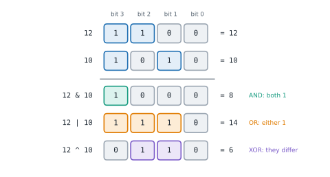

# Lesson 47: Bit manipulation

**You'll learn:** binary in Python, AND, OR, XOR, NOT and shifts, negative numbers and two's complement, setting, clearing and testing bits, the lowest set bit, powers of two, counting bits, XOR puzzles, sets as bitmasks, enumerating subsets and submasks, maximum XOR of two numbers.

▶ **Practise this lesson in the [sandbox](https://kishoremadanagopal.github.io/learning/dsa/#bit-manipulation)**: run every example and check your exercise answers.

## Key terms

- **Bit:** a single binary digit, 0 or 1.
- **Bitwise operator:** an operator that works on each bit position: & (AND), | (OR), ^ (XOR), ~ (NOT), << and >> (shifts).
- **XOR (exclusive or):** 1 where two bits differ; x ^ x = 0 and x ^ 0 = x.
- **Two's complement:** the usual way to store negative integers, where −x equals ~x + 1.
- **Bitmask:** an integer whose bits record which items of a small set are present.
- **Lowest set bit:** the rightmost 1 bit of a number, isolated by x & −x.
- **Submask:** a mask whose 1 bits are a subset of another mask's 1 bits.

Every integer is stored in **binary**: 13 is `1101`, meaning 8 + 4 + 0 + 1. Working on the bits directly gives tiny, very fast solutions to some problems, packs a whole set of small numbers into one integer (the bitmask DP of Lesson 44), and appears all over systems code: permissions, flags, network masks, hashing, compression.

## Binary in Python

```python
print(bin(13), f"{13:b}", f"{13:08b}")      # '0b1101', '1101', zero-padded to 8 digits
print(int("1101", 2), 0b1101, 0xFF)         # reading binary, a binary literal, a hex literal
print((13).bit_length(), (13).bit_count())  # 4 bits needed, 3 of them are 1 (bit_count: Python 3.10+)
```

## The operators

| Operator | Name | Bit rule | Example (12 = 1100, 10 = 1010) |
|---|---|---|---|
| `a & b` | AND | 1 if both are 1 | `1000` = 8 |
| `a \| b` | OR | 1 if either is 1 | `1110` = 14 |
| `a ^ b` | XOR | 1 if they differ | `0110` = 6 |
| `~a` | NOT | flips every bit | `-13` (see below) |
| `a << k` | left shift | moves bits left: × 2ᵏ | `12 << 2` = 48 |
| `a >> k` | right shift | moves bits right: // 2ᵏ | `12 >> 2` = 3 |



```python
a, b = 12, 10
print(a & b, a | b, a ^ b, a << 2, a >> 2)
print(f"{a:04b} & {b:04b} = {a & b:04b}")
```

## Negative numbers and ~

Most languages store integers in a fixed number of bits using **two's complement**, where −x is `~x + 1`. Python's integers have **unlimited** size, but they behave as if negative numbers had infinitely many 1 bits on the left. So `~x == -x - 1`, and `x & -x` still isolates the lowest set bit. When you need a fixed width (to mimic a 32-bit C integer), mask with `& 0xFFFFFFFF`.

```python
print(~5, -5 & 0xFF, f"{-5 & 0xFF:08b}")     # -6, and -5 as an 8-bit pattern: 11111011
print(12 & -12)                              # 4: the lowest set bit of 1100
```

## The essential tricks

| Goal | Expression | Why |
|---|---|---|
| Is bit i set? | `x >> i & 1` (or `x & (1 << i)`) | moves bit i to the end |
| Set bit i | `x \| (1 << i)` | OR with a single 1 |
| Clear bit i | `x & ~(1 << i)` | AND with all 1s except bit i |
| Toggle bit i | `x ^ (1 << i)` | XOR flips |
| Lowest set bit | `x & -x` | Fenwick trees use this (Lesson 34) |
| Clear the lowest set bit | `x & (x - 1)` | subtracting 1 flips the lowest 1 and the 0s after it |
| Is x a power of two? | `x > 0 and x & (x - 1) == 0` | a power of two has exactly one 1 |
| Count the 1 bits | `x.bit_count()` | or loop `x &= x - 1` until 0 |
| Even or odd? | `x & 1` | the last bit |

```python
x = 0b10110
print(x >> 1 & 1, bin(x | 1), bin(x & ~(1 << 2)), bin(x ^ 0b11))
print([n for n in range(1, 70) if n & (n - 1) == 0])           # powers of two

def count_ones(x):                  # Brian Kernighan's method: one loop per 1 bit
    count = 0
    while x:
        x &= x - 1
        count += 1
    return count

print(count_ones(0b1011_0110), (0b1011_0110).bit_count())
```

## XOR puzzles

XOR has three properties that solve a whole family of puzzles: `x ^ x == 0`, `x ^ 0 == x`, and the order of XORs doesn't matter. So XOR-ing a list cancels out every value that appears an even number of times.

```python
from functools import reduce
from operator import xor

print(reduce(xor, [4, 1, 2, 1, 2]))          # the number that appears once: 4

def missing_number(nums):                    # 0..n with one number missing
    result = len(nums)
    for i, x in enumerate(nums):
        result ^= i ^ x                      # every present number cancels with its index
    return result

print(missing_number([3, 0, 1]), missing_number([9, 6, 4, 2, 3, 5, 7, 0, 1]))

a, b = 5, 9
a ^= b; b ^= a; a ^= b                       # swap without a temporary (just a curiosity in Python)
print(a, b)
```

## Sets as bitmasks

A set of items numbered 0 to n − 1 fits in one integer: bit i is 1 when item i is in the set. Union, intersection and difference become `|`, `&` and `& ~`, each a single machine-word operation for small n. Looping `mask` from 0 to 2ⁿ − 1 visits **every subset**, which is how bitmask DP enumerates its states.

```python
items = ["a", "b", "c"]
for mask in range(1 << len(items)):          # 0 .. 7: every subset
    subset = [items[i] for i in range(len(items)) if mask >> i & 1]
    print(f"{mask:03b}", subset)

A, B = 0b1011, 0b0110                        # {0, 1, 3} and {1, 2}
print(bin(A | B), bin(A & B), bin(A & ~B))   # union, intersection, difference
```

To visit every **submask** of a mask (every subset of a given set), use `sub = (sub - 1) & mask` until it reaches 0. Across all masks this totals O(3ⁿ), the standard trick for DP over subsets of subsets.

```python
mask = 0b1011
sub = mask
while sub:
    print(f"{sub:04b}", end=" ")
    sub = (sub - 1) & mask                   # the next smaller submask
print("0000")
```

## Maximum XOR of two numbers

Which pair of numbers has the largest XOR? Comparing all pairs is O(n²). Instead, decide the answer **one bit at a time from the top**: for each bit, ask "can the answer have a 1 here, given the bits already chosen?" Two numbers produce that answer prefix exactly when the XOR of their prefixes equals it, which is a set lookup. A **binary trie** over the bits (Lesson 33) is the other classic solution. That's the second exercise.

## Bit manipulation at a glance

| Problem | Trick | Time |
|---|---|---|
| The single number among pairs | XOR everything | O(n) |
| Missing number in 0..n | XOR with the indexes (or a sum formula) | O(n) |
| Power of two | `x & (x − 1) == 0` | O(1) |
| Count set bits | `bit_count()` or Kernighan's loop | O(1) / O(set bits) |
| Bits of every number 0..n | `bits[i] = bits[i >> 1] + (i & 1)` | O(n) |
| Every subset of n items | loop masks 0..2ⁿ − 1 | O(2ⁿ · n) |
| Maximum XOR pair | greedy bit by bit with a set (or a binary trie) | O(n · bits) |

## At a glance

| Concept | Approach | Time | Space |
|---|---|---|---|
| Test / set / clear / toggle bit i | x >> i & 1, x OR (1 << i), x & ~(1 << i), x ^ (1 << i) | O(1) | O(1) |
| Lowest set bit / clear it | x & −x / x & (x − 1) | O(1) | O(1) |
| Power of two | x > 0 and x & (x − 1) == 0 | O(1) | O(1) |
| Count set bits | x.bit_count(), or Kernighan's loop | O(1) / O(set bits) | O(1) |
| Single number among pairs | XOR everything | O(n) | O(1) |
| All subsets of n items | masks 0 .. 2ⁿ − 1 | O(2ⁿ · n) | O(1) per mask |
| All submasks of every mask | sub = (sub − 1) & mask | O(3ⁿ) | O(1) |
| Maximum XOR pair | greedy per bit with a prefix set, or a binary trie | O(n · bits) | O(n) |

## Common mistakes

- Forgetting operator precedence: `x & 1 == 0` means `x & (1 == 0)`; write `(x & 1) == 0`.
- Expecting fixed-width overflow in Python; mask with `& 0xFFFFFFFF` when you need 32-bit behaviour.
- Using `x & (x − 1) == 0` as a power-of-two test without also checking x > 0.
- Comparing all pairs for a maximum XOR instead of building the answer bit by bit.

## Exercises

### 1. The single number

Every number in `nums` appears exactly **twice**, except one that appears once. Write `single_number(nums)` returning that number, in one pass with O(1) extra memory (no set, dict or sorting).

Starter code:

```python
def single_number(nums):
    pass

print(single_number([4, 1, 2, 1, 2]))   # 4
```

<details>
<summary>🧭 How to approach it</summary>

1. **Understand:** exactly one number appears once, all others exactly twice; O(1) memory.
2. **Examples:** [4, 1, 2, 1, 2] → 4.
3. **Brute force:** count with a dict (O(n) memory) or sort and scan pairs (O(n log n)).
4. **Pattern:** **XOR cancellation**.
5. **Plan:** fold the list with `^`.
6. **Code and test:** one element, zero as the answer, negative numbers.

</details>

<details>
<summary>💡 Hint 1</summary>

Which bitwise operator turns two copies of the same number into 0?

</details>

<details>
<summary>💡 Hint 2</summary>

XOR: `x ^ x == 0` and `x ^ 0 == x`, and the order of the XORs doesn't matter.

</details>

<details>
<summary>💡 Hint 3</summary>

Start with `result = 0` and XOR in every number; every pair cancels, leaving the single number.

</details>

### 2. Maximum XOR of two numbers

Write `max_xor(nums)` returning the largest value of `a ^ b` over all pairs of numbers in `nums` (non-negative integers below 2²⁰; a list of one number gives 0). It must handle 50,000 numbers in about a second, so don't compare every pair.

Starter code:

```python
def max_xor(nums):
    pass

print(max_xor([3, 10, 5, 25, 2, 8]))   # 28: 5 ^ 25
```

<details>
<summary>🧭 How to approach it</summary>

1. **Understand:** the maximum over pairs; numbers below 2²⁰; one number → 0 (it can only pair with itself).
2. **Examples:** [3, 10, 5, 25, 2, 8] → 5 ^ 25 = 00101 ^ 11001 = 11100 = 28.
3. **Brute force:** every pair: O(n²).
4. **Pattern:** **greedy bit by bit** with prefix sets (or a **binary trie**: for each number, walk the trie choosing the opposite bit whenever possible).
5. **Plan:** 20 rounds; each round a set of prefixes and one membership test per prefix.
6. **Code and test:** one number, equal numbers, numbers differing in every bit.

</details>

<details>
<summary>💡 Hint 1</summary>

A 1 in a high bit beats any combination of lower bits. So decide the answer's bits from the top, greedily: can this bit be 1?

</details>

<details>
<summary>💡 Hint 2</summary>

After choosing the top bits of the answer, look only at each number's top bits (its **prefix**, `x >> bit`). The answer prefix is possible if some two prefixes XOR to it. Since `p ^ q == c` means `q == c ^ p`, a set lookup checks it.

</details>

<details>
<summary>💡 Hint 3</summary>

For bit from 19 down to 0: `best <<= 1`; `prefixes = {x >> bit for x in nums}`; if any `(best | 1) ^ p` is in `prefixes`, set `best |= 1`. Return `best`.

</details>

**In the sandbox:** exercises 97–98. Press **Check** to run the hidden tests.

### Answers and walkthroughs

Open these only after a real attempt. Each one explains the solution step by step.

<details>
<summary>✅ 1. The single number</summary>

```python
def single_number(nums):
    result = 0
    for x in nums:
        result ^= x          # pairs cancel (x ^ x == 0); the lone number survives (x ^ 0 == x)
    return result

print(single_number([4, 1, 2, 1, 2]))
```

**Line by line**

- `result` starts at 0, the identity for XOR.
- XOR is commutative and associative, so the order is irrelevant: mentally group each pair together; each pair gives 0.
- What's left is 0 ^ single = single.

**Trace** on [4, 1, 2, 1, 2] (in binary):

| x | result after |
|---|---|
| 4 (100) | 100 |
| 1 (001) | 101 |
| 2 (010) | 111 |
| 1 (001) | 110 |
| 2 (010) | **100** = 4 |

**Complexity:** O(n) time, O(1) space.

**Common wrong approach:** `sum(set(nums)) * 2 - sum(nums)`. It works, but uses O(n) extra memory, which the problem rules out.

</details>

<details>
<summary>✅ 2. Maximum XOR of two numbers</summary>

```python
def max_xor(nums):
    best = 0
    for bit in range(19, -1, -1):                 # from the highest bit down
        best <<= 1                                # make room for this bit
        prefixes = {x >> bit for x in nums}       # every number's top bits so far
        candidate = best | 1                      # try to make this bit 1
        # two prefixes p and q give `candidate` exactly when p ^ q == candidate, i.e. q == candidate ^ p
        if any(candidate ^ p in prefixes for p in prefixes):
            best = candidate
    return best

print(max_xor([3, 10, 5, 25, 2, 8]))
```

**Line by line**

- Bits are decided from 19 down to 0 because a higher bit is worth more than all lower bits together.
- `best <<= 1` shifts the bits decided so far up, leaving a 0 in the new position; `candidate` tries a 1 there.
- `prefixes` holds the numbers' top bits at this length. If p and q are both prefixes and `p ^ q == candidate`, then two numbers start with bits that XOR to the candidate, so the answer can keep that 1.
- Because `x ^ y == c` is the same as `y == c ^ x`, each prefix needs just one set lookup.

**Trace** on [3, 10, 5, 25, 2, 8] for the top 5 bits (bits 4 to 0 of 25 = 11001):

| bit | candidate | possible? | best |
|---|---|---|---|
| 4 | 1 | yes (25 starts with 1, others with 0) | 1 |
| 3 | 11 | yes (25 → 11, 5 → 00) | 11 |
| 2 | 111 | yes (110 ^ 001) | 111 |
| 1 | 1111 | no | 1110 |
| 0 | 11101 | no | **11100** = 28 |

(Bits 19 to 5 are 0 for every number, so they stay 0.)

**Complexity:** O(n × B) for B = 20 bits, O(n) space.

**Common wrong approach:** XOR-ing only the largest number with every other number. The best pair needn't include it: in [9, 8, 1], the largest number gives at most 9 ^ 1 = 8, but 8 ^ 1 = 9.

</details>

## Quick quiz

1. What is 12 ^ 10 (XOR of 1100 and 1010)?
   - A) 6 (0110)
   - B) 8 (1000)
   - C) 14 (1110)

2. Which expression is true exactly when a positive x is a power of two?
   - A) x & (x − 1) == 0
   - B) x & 1 == 0
   - C) x ^ x == 0

3. In Python, what does ~x equal?
   - A) −x − 1
   - B) −x
   - C) x with its last bit flipped

4. How do you visit every subset of n items with bitmasks?
   - A) Loop mask from 0 to 2ⁿ − 1; item i is in the subset when bit i of mask is 1
   - B) Loop from 0 to n
   - C) Sort the items first

<details>
<summary>Quiz answers</summary>

1. **A) 6 (0110)**: XOR keeps the bits where the two numbers differ.
2. **A) x & (x − 1) == 0**: A power of two has a single 1 bit, and x − 1 turns it off.
3. **A) −x − 1**: Python behaves as if negative numbers had infinitely many leading 1 bits.
4. **A) Loop mask from 0 to 2ⁿ − 1; item i is in the subset when bit i of mask is 1**: Each integer below 2ⁿ is one subset.

</details>

---
Previous: [Lesson 46](46-intervals-sweep.md) · Next: [Lesson 48: Maths for coding problems](48-number-theory.md)
