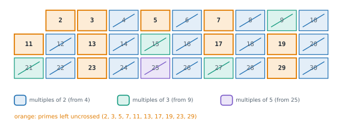

# Lesson 48: Maths for coding problems

**You'll learn:** gcd and lcm with Euclid's algorithm, primality by trial division, the sieve of Eratosthenes, prime factorisation, modular arithmetic, modular inverses and Fermat's little theorem, factorials, permutations and combinations, Pascal's triangle, Catalan numbers, float precision and exact arithmetic, Fisher-Yates shuffle, reservoir sampling.

▶ **Practise this lesson in the [sandbox](https://kishoremadanagopal.github.io/learning/dsa/#number-theory)**: run every example and check your exercise answers.

## Key terms

- **gcd / lcm:** the greatest common divisor / least common multiple of two numbers.
- **Euclid's algorithm:** gcd(a, b) = gcd(b, a mod b) until b is 0.
- **Prime:** an integer greater than 1 whose only divisors are 1 and itself.
- **Sieve of Eratosthenes:** finds all primes below n by crossing out multiples of each prime.
- **Modular arithmetic:** arithmetic on remainders after division by a modulus m.
- **Modular inverse:** the number b⁻¹ with b · b⁻¹ ≡ 1 (mod m); it replaces division.
- **Fermat's little theorem:** for a prime p and a not divisible by p, a^(p−1) ≡ 1, so a^(p−2) is a's inverse.
- **Combination C(n, k):** the number of ways to choose k items from n when order doesn't matter.
- **Reservoir sampling:** choosing k random items from a stream in one pass with O(k) memory.

A handful of mathematical tools come up again and again in coding problems: when answers are huge ("give the answer modulo 10⁹ + 7"), when a problem is secretly about divisibility or primes, or when you need to pick random items fairly. Python makes several of them one-liners, but you should know what's underneath.

## Greatest common divisor and least common multiple

**Euclid's algorithm:** gcd(a, b) = gcd(b, a mod b), stopping when b is 0. Each step at least halves the numbers every two rounds, so it's O(log min(a, b)). The **lcm** follows from it: lcm(a, b) = a × b / gcd(a, b).

```python
import math

def gcd(a, b):
    while b:
        a, b = b, a % b              # gcd(48, 18) -> gcd(18, 12) -> gcd(12, 6) -> gcd(6, 0) = 6
    return a

print(gcd(48, 18), math.gcd(48, 18), math.gcd(12, 18, 30))    # math.gcd accepts many numbers (3.9+)
print(48 * 18 // gcd(48, 18), math.lcm(4, 6, 10))
```

Uses: simplifying fractions, checking whether two numbers share a factor, repeating patterns (two cycles of lengths a and b line up every lcm(a, b) steps).

## Primes

To test one number, try divisors up to **√n**: if n = a × b, one of them is at most √n. O(√n). To find **all** primes below n, the **sieve of Eratosthenes** crosses out the multiples of each prime, starting at p² (smaller multiples were already crossed out by smaller primes). O(n log log n), practically linear.



```python
import math

def is_prime(n):
    if n < 2:
        return False
    for d in range(2, math.isqrt(n) + 1):     # isqrt: exact integer square root
        if n % d == 0:
            return False
    return True

def primes_below(n):
    is_p = [True] * n
    is_p[0:2] = [False, False]
    for p in range(2, math.isqrt(n - 1) + 1):
        if is_p[p]:
            for multiple in range(p * p, n, p):
                is_p[multiple] = False
    return [i for i, flag in enumerate(is_p) if flag]

def factorise(n):                              # prime factors by trial division: O(√n)
    factors, d = [], 2
    while d * d <= n:
        while n % d == 0:
            factors.append(d)
            n //= d
        d += 1
    if n > 1:
        factors.append(n)                      # whatever is left is a prime
    return factors

print(is_prime(97), is_prime(91), primes_below(30))
print(factorise(360), factorise(2 ** 31 - 1))
```

## Modular arithmetic

When answers would have thousands of digits, problems ask for them **modulo** a prime, usually 10⁹ + 7 (a prime that fits comfortably in 32 bits, so products fit in 64 bits in other languages). You can take the remainder after **every** addition, subtraction and multiplication, so numbers stay small:

- (a + b) mod m = ((a mod m) + (b mod m)) mod m, and the same for − and ×.
- **Division doesn't work that way.** Dividing by b means multiplying by b's **modular inverse**: the number b⁻¹ with b × b⁻¹ ≡ 1 (mod m). It exists when gcd(b, m) = 1. For a prime m, **Fermat's little theorem** gives b⁻¹ = b^(m−2) mod m.

```python
MOD = 10**9 + 7

print(pow(3, 200, MOD))                  # fast modular power, built in (Lesson 22 wrote it by hand)
inv3 = pow(3, -1, MOD)                   # modular inverse (Python 3.8+)
print(inv3, 3 * inv3 % MOD, pow(3, MOD - 2, MOD) == inv3)
print(10 * inv3 % MOD == 10 * pow(3, MOD - 2, MOD) % MOD)    # "10 / 3" in modular arithmetic
print(-7 % 3, (-7) // 3)                 # Python's % is never negative for a positive modulus (C and Java give -1)
```

## Counting: permutations and combinations

- Orderings of n items: n!. Ordered choices of k from n: P(n, k) = n! / (n − k)!.
- Unordered choices of k from n: C(n, k) = n! / (k! (n − k)!), "n choose k". `math.comb` and `math.perm` compute them exactly.
- **Pascal's rule** C(n, k) = C(n − 1, k − 1) + C(n − 1, k) builds a table by DP, handy for small n or when you need many values.
- For many C(n, k) **modulo a prime**, precompute factorials and **inverse factorials** once (O(n)), then each query is O(1): C(n, k) = n! × (k!)⁻¹ × ((n − k)!)⁻¹ mod p. That's the second exercise.

```python
import math

print(math.factorial(5), math.perm(5, 2), math.comb(5, 2))

pascal = [[1]]
for n in range(1, 6):                       # Pascal's triangle: each entry is the sum of the two above
    prev = pascal[-1]
    pascal.append([1] + [prev[k - 1] + prev[k] for k in range(1, n)] + [1])
for row in pascal:
    print(row)

catalan = [math.comb(2 * n, n) // (n + 1) for n in range(8)]
print("Catalan numbers:", catalan)          # balanced bracket strings, binary tree shapes, ...
```

Counting problems in interviews are often a C(n, k) in disguise: paths in a grid (C(m + n − 2, m − 1), Lesson 43), ways to choose a team, the number of binary strings with k ones. The **Catalan numbers** count balanced bracket sequences of n pairs and binary trees with n nodes.

## Exact integers, inexact floats

Python's `int` never overflows, so you'll never see the wrap-around bugs of C or Java. **Floats** are the danger: they're binary fractions with about 15–16 significant digits, so many decimals can't be stored exactly.

```python
import math
from fractions import Fraction
from decimal import Decimal

print(0.1 + 0.2, 0.1 + 0.2 == 0.3, math.isclose(0.1 + 0.2, 0.3))
print(Fraction(1, 10) + Fraction(2, 10), Decimal("0.1") + Decimal("0.2"))
print(int(math.sqrt(10**30 - 1)), math.isqrt(10**30 - 1))   # float sqrt is off by one for big integers
print(2**64, 7 // 2, -7 // 2, round(2.5), round(3.5))       # floor division rounds down; round() rounds half to even
```

Rules of thumb: compare floats with `math.isclose`, keep money in integer cents (or `Decimal`), use `math.isqrt` for integer square roots, and use `//` for integer division. Note that `round(2.5)` is 2: Python rounds halves to the nearest **even** number.

## Randomness: shuffling and sampling

**Fisher-Yates shuffle:** walk from the end, swapping each position with a random position at or before it. Every permutation is equally likely, in O(n). (Swapping each item with a random position anywhere looks similar but is biased.) `random.shuffle` does this.

**Reservoir sampling:** pick k items uniformly at random from a **stream** too long to store, in one pass: keep the first k, then replace a random kept item with item i (counting from 0) with probability k / (i + 1).

```python
import random

def fisher_yates(items, rng):
    items = items[:]
    for i in range(len(items) - 1, 0, -1):
        j = rng.randint(0, i)                  # a position at or before i
        items[i], items[j] = items[j], items[i]
    return items

def reservoir(stream, k, rng):
    sample = []
    for i, item in enumerate(stream):
        if i < k:
            sample.append(item)
        else:
            j = rng.randint(0, i)              # keep item i with probability k / (i + 1)
            if j < k:
                sample[j] = item
    return sample

rng = random.Random(42)                         # seeded, so the run is reproducible
print(fisher_yates(list(range(10)), rng))
print(reservoir(range(1_000_000), 5, rng))

counts = [0] * 10                               # each of 10 items should be picked about 3 / 10 of the time
for _ in range(20_000):
    for x in reservoir(range(10), 3, rng):
        counts[x] += 1
print([round(c / 20_000, 2) for c in counts])
```

Randomness also protects algorithms from worst-case inputs: random pivots in quicksort and quickselect (Lesson 27), random hash seeds, and treaps and skip lists (Lesson 31).

## Maths at a glance

| Task | Method | Time |
|---|---|---|
| gcd / lcm | Euclid; lcm = a·b / gcd | O(log min(a, b)) |
| Is n prime? | trial division to √n | O(√n) |
| All primes below n | sieve of Eratosthenes | O(n log log n) |
| Prime factors of n | trial division | O(√n) |
| aᵇ mod m | `pow(a, b, m)` (fast exponentiation) | O(log b) |
| Modular inverse | `pow(a, -1, m)`, or a^(m−2) for prime m | O(log m) |
| Many C(n, k) mod p | factorial and inverse-factorial tables | O(n) once, O(1) per query |
| Integer square root | `math.isqrt` | O(log n) |
| Shuffle | Fisher-Yates (`random.shuffle`) | O(n) |
| k random items from a stream | reservoir sampling | O(n) time, O(k) memory |

## At a glance

| Concept | Approach | Time | Space |
|---|---|---|---|
| gcd / lcm | Euclid; lcm = a · b // gcd | O(log min(a, b)) | O(1) |
| Primality | trial division up to √n | O(√n) | O(1) |
| All primes below n | sieve of Eratosthenes | O(n log log n) | O(n) |
| Prime factorisation | trial division | O(√n) | O(log n) |
| Modular power / inverse | pow(a, b, m) / pow(a, −1, m) | O(log b) | O(1) |
| Many C(n, k) mod p | factorial and inverse-factorial tables | O(n) once, O(1) per query | O(n) |
| Uniform shuffle | Fisher-Yates | O(n) | O(1) in place |
| k random items from a stream | reservoir sampling | O(n) | O(k) |

## Common mistakes

- Dividing modded numbers with `/` or `//` instead of multiplying by an inverse.
- Taking the modulus only at the end, letting numbers grow huge (slow in Python, overflow elsewhere).
- Comparing floats with `==`, or using `int(math.sqrt(n))` for big integers instead of `math.isqrt`.
- Writing a "shuffle" that swaps with any position, which isn't uniform; use Fisher-Yates.

## Exercises

### 1. Count the primes

Write `count_primes(n)` returning how many prime numbers are **less than** `n`. It must handle n = 2,000,000 in well under a second.

Starter code:

```python
def count_primes(n):
    pass

print(count_primes(10))   # 4: 2, 3, 5, 7
```

<details>
<summary>🧭 How to approach it</summary>

1. **Understand:** strictly less than n; 0, 1 and 2 give 0.
2. **Examples:** n = 10 → 2, 3, 5, 7 → 4.
3. **Brute force:** trial division for each number: O(n √n).
4. **Pattern:** **sieve of Eratosthenes**.
5. **Plan:** a flag list; cross out multiples starting at p²; only p up to √n needed; count the remaining flags.
6. **Code and test:** n ≤ 2, n = 3, known counts (25 below 100, 168 below 1,000).

</details>

<details>
<summary>💡 Hint 1</summary>

Testing each number separately repeats a lot of work. Instead of asking "is x prime?", cross out the numbers that **can't** be prime.

</details>

<details>
<summary>💡 Hint 2</summary>

Sieve of Eratosthenes: start with every number marked prime; for each p still marked, cross out p², p² + p, p² + 2p, … (any smaller multiple has a smaller factor and is already crossed out).

</details>

<details>
<summary>💡 Hint 3</summary>

`is_prime = [True] * n`, mark 0 and 1 False; for p while `p * p < n`: if `is_prime[p]`, set every `is_prime[m]` for m in `range(p * p, n, p)` to False. Return `sum(is_prime)`.

</details>

### 2. Combinations modulo a prime

`queries` is a list of pairs `(n, k)` with 0 ≤ n ≤ 100,000. Write `comb_mod(queries)` returning a list with C(n, k) mod 1,000,000,007 for each pair (0 when k < 0 or k > n). It must answer 20,000 queries quickly: `math.comb` builds huge exact numbers and is far too slow for that many.

Starter code:

```python
MOD = 10**9 + 7

def comb_mod(queries):
    pass

print(comb_mod([(5, 2), (10, 0), (10, 10), (3, 5)]))   # [10, 1, 1, 0]
```

<details>
<summary>🧭 How to approach it</summary>

1. **Understand:** many queries; answers mod a prime; k outside 0..n gives 0.
2. **Examples:** C(5, 2) = 10; C(3, 5) = 0.
3. **Brute force:** `math.comb` per query: exact big integers with tens of thousands of digits.
4. **Pattern:** **precompute once, answer in O(1)**: factorial and inverse-factorial tables with **modular inverses**.
5. **Plan:** tables up to the largest n; one inverse with `pow`, the rest by a backwards loop.
6. **Code and test:** C(0, 0), k out of range, the largest n.

</details>

<details>
<summary>💡 Hint 1</summary>

C(n, k) = n! / (k! (n − k)!). Factorials mod p are easy to build in one loop. What replaces the division?

</details>

<details>
<summary>💡 Hint 2</summary>

Multiplying by modular inverses. For a prime p, the inverse of a is `pow(a, p - 2, p)`. Precompute `fact[i]` and `inv_fact[i]` for every i up to the largest n, once.

</details>

<details>
<summary>💡 Hint 3</summary>

Build `fact` with `fact[i] = fact[i-1] * i % MOD`. Set `inv_fact[N-1] = pow(fact[N-1], MOD - 2, MOD)`, then go down with `inv_fact[i-1] = inv_fact[i] * i % MOD`. Answer each query as `fact[n] * inv_fact[k] % MOD * inv_fact[n-k] % MOD`.

</details>

**In the sandbox:** exercises 99–100. Press **Check** to run the hidden tests.

### Answers and walkthroughs

Open these only after a real attempt. Each one explains the solution step by step.

<details>
<summary>✅ 1. Count the primes</summary>

```python
def count_primes(n):
    if n < 3:
        return 0
    is_prime = [True] * n
    is_prime[0] = is_prime[1] = False
    p = 2
    while p * p < n:
        if is_prime[p]:
            for multiple in range(p * p, n, p):    # smaller multiples were crossed out by smaller primes
                is_prime[multiple] = False
        p += 1
    return sum(is_prime)                           # True counts as 1

print(count_primes(10))
```

**Line by line**

- `is_prime` has one flag per number from 0 to n − 1; 0 and 1 are not prime.
- The loop only needs p with p² < n: a composite number below n has a factor at most √n, so it's crossed out by then.
- Crossing out starts at p × p because p × 2, p × 3, … were already crossed out as multiples of 2, 3, ….
- `sum(is_prime)` counts the True values.

**Trace** for n = 30: p = 2 crosses out 4, 6, …, 28; p = 3 crosses out 9, 15, 21, 27 (and others already gone); p = 5 crosses out 25. p = 6 has 36 > 30, so stop: 10 primes remain.

**Complexity:** O(n log log n) time, O(n) space.

**Common wrong approach:** starting the inner loop at 2p and running p all the way to n: still correct, but much slower; or forgetting that n itself isn't counted.

</details>

<details>
<summary>✅ 2. Combinations modulo a prime</summary>

```python
MOD = 10**9 + 7

def comb_mod(queries):
    N = max((n for n, k in queries), default=0) + 1
    fact = [1] * N
    for i in range(1, N):
        fact[i] = fact[i - 1] * i % MOD                 # i! mod p
    inv_fact = [1] * N
    inv_fact[N - 1] = pow(fact[N - 1], MOD - 2, MOD)    # Fermat: a^(p-2) is a's inverse mod a prime p
    for i in range(N - 1, 0, -1):
        inv_fact[i - 1] = inv_fact[i] * i % MOD         # 1/(i-1)! = i/i!
    out = []
    for n, k in queries:
        if k < 0 or k > n:
            out.append(0)
        else:
            out.append(fact[n] * inv_fact[k] % MOD * inv_fact[n - k] % MOD)
    return out

print(comb_mod([(5, 2), (10, 0), (10, 10), (3, 5)]))
```

**Line by line**

- `fact[i]` holds i! mod p, built from the previous value.
- Only **one** `pow` call is needed: the inverse of N−1 factorial. Because (i − 1)! = i! / i, its inverse is `inv_fact[i] * i`, so the loop fills the rest going down.
- Each answer multiplies three precomputed numbers, taking `% MOD` after each product so the numbers stay small.
- Out-of-range k is answered with 0 before indexing.

**Trace** for C(5, 2) (small numbers, so the modulus never kicks in): fact = 1, 1, 2, 6, 24, 120; 5! / (2! · 3!) = 120 / (2 · 6) = 10, computed as 120 × inverse(2) × inverse(6).

**Complexity:** O(N + Q) time for the largest n = N and Q queries (plus one O(log p) power), O(N) space.

**Common wrong approach:** computing `fact[n] // (fact[k] * fact[n - k])` with the modded factorials. Integer division of remainders gives nonsense; modular division must use inverses.

</details>

## Quick quiz

1. What does Euclid's algorithm compute, and how fast?
   - A) The greatest common divisor, in O(log min(a, b)) steps
   - B) The least common multiple, in O(a × b)
   - C) All divisors, in O(n)

2. Why does the sieve of Eratosthenes start crossing out multiples of p at p²?
   - A) Smaller multiples of p have a smaller prime factor and are already crossed out
   - B) p² is the first multiple that is even
   - C) To save memory

3. How do you divide by b when working modulo a prime p?
   - A) Multiply by b's modular inverse, pow(b, p − 2, p) or pow(b, -1, p)
   - B) Use integer division //
   - C) Take the remainder first, then divide

4. What does reservoir sampling achieve?
   - A) k uniformly random items from a stream, in one pass and O(k) memory
   - B) Sorting a stream
   - C) The k largest items of a stream

<details>
<summary>Quiz answers</summary>

1. **A) The greatest common divisor, in O(log min(a, b)) steps**: gcd(a, b) = gcd(b, a mod b); the numbers shrink quickly.
2. **A) Smaller multiples of p have a smaller prime factor and are already crossed out**: For example, 3 × 2 = 6 was already crossed out as a multiple of 2.
3. **A) Multiply by b's modular inverse, pow(b, p − 2, p) or pow(b, -1, p)**: Division doesn't distribute over mod; multiplying by the inverse does.
4. **A) k uniformly random items from a stream, in one pass and O(k) memory**: Item i replaces a kept item with probability k / (i + 1).

</details>

---
Previous: [Lesson 47](47-bit-manipulation.md) · Next: [Lesson 49: Recognising the pattern](49-problem-patterns.md)
