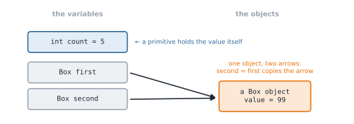

# Lesson 17: Classes and objects

**You'll learn:** classes, objects, fields, instance methods, `new`, references, `null`, `toString`.

▶ **Practise this lesson in the [sandbox](https://kishoremadanagopal.github.io/learning/java/#classes-and-objects)**: run every example and check your exercise answers.

## Key terms

- **Class:** a blueprint that defines a new type.
- **Object (instance):** one value created from a class with `new`.
- **Field (instance variable):** data that each object stores.
- **Instance method:** a method called on an object, which can use its fields.
- **Reference:** a variable's pointer to an object.
- **null:** a reference that points to nothing.
- **NullPointerException:** thrown when using a null reference.
- **toString():** the method Java calls to turn an object into text.

A **class** is a blueprint for a new type. An **object** (or **instance**) is one thing built from that blueprint. A `Dog` class describes what every dog has and can do; `rex` and `fido` are two separate dog objects.

```java
class Dog {
    String name;            // fields: data each object holds
    int age;

    String bark() {         // method: behaviour that uses the object's data
        return name + " says woof!";
    }
}

public class Main {
    public static void main(String[] args) {
        Dog rex = new Dog();
        rex.name = "Rex";
        rex.age = 3;

        Dog fido = new Dog();
        fido.name = "Fido";
        fido.age = 7;

        System.out.println(rex.bark());
        System.out.println(fido.name + " is " + fido.age);
    }
}
```

- **Fields** (also called instance variables) are declared in the class body. Each object gets its own copy.
- **Methods** without `static` are **instance methods**: you call them on an object, `rex.bark()`, and they can use that object's fields.
- `new Dog()` creates an object and returns a **reference** to it.

A file can hold several classes, but only one `public` class, which must match the file name. That's why `Main` is public here and `Dog` isn't.

## Objects keep their own state

```java
class Counter {
    int count;

    void increment() {
        count++;
    }
}

public class Main {
    public static void main(String[] args) {
        Counter a = new Counter();
        Counter b = new Counter();
        a.increment();
        a.increment();
        b.increment();
        System.out.println(a.count + " " + b.count);
    }
}
```

## References

A variable of a class type holds a **reference** (an arrow pointing at the object), not the object itself. Copying the variable copies the arrow:

```java
class Box {
    int value;
}

public class Main {
    public static void main(String[] args) {
        Box first = new Box();
        first.value = 1;
        Box second = first;          // same object, two names
        second.value = 99;
        System.out.println(first.value);
        System.out.println(first == second);
    }
}
```



## null

A reference that points at nothing is `null`. Calling a method on `null` throws the most famous exception in Java, `NullPointerException`:

*This example raises an error on purpose.*

```java
class Dog {
    String name;
}

public class Main {
    public static void main(String[] args) {
        Dog d = null;
        System.out.println(d.name);
    }
}
```

Fields of object type start as `null` too, so check before use: `if (d != null) { ... }`.

## toString

When you print an object, Java calls its `toString()` method. By default it prints something like `Dog@1b6d3586`. Write your own to get useful output:

```java
class Point {
    int x;
    int y;

    @Override
    public String toString() {
        return "(" + x + ", " + y + ")";
    }
}

public class Main {
    public static void main(String[] args) {
        Point p = new Point();
        p.x = 3;
        p.y = 4;
        System.out.println(p);
        System.out.println("Point: " + p);
    }
}
```

`@Override` tells the compiler you mean to replace an inherited method; it's explained in the Inheritance lesson.

## Common mistakes

- Calling a method on a variable that is still `null`.
- Expecting `b = a` to copy an object; both names refer to the same object.
- Declaring two public classes in one file.
- Forgetting `public` on `toString()`.

## Exercises

### 1. Rectangle

Create a class `Rectangle` (not public) with `double` fields `width` and `height`, and instance methods `area()`, `perimeter()` and `isSquare()`. The checker creates rectangles with `new Rectangle()` and sets the fields directly.

Starter code:

```java
class Rectangle {

}

public class Main {
    public static void main(String[] args) {
        Rectangle r = new Rectangle();
        r.width = 3;
        r.height = 4;
        System.out.println(r.area());
    }
}
```

**In the sandbox:** exercise 27. Press **Check** to test your answer.

<details>
<summary>Hints</summary>

1. Declare double width; double height; then three methods without static, each using the fields directly.

</details>

<details>
<summary>Answers</summary>

**1. Rectangle**

```java
class Rectangle {
    double width;
    double height;

    double area() {
        return width * height;
    }

    double perimeter() {
        return 2 * (width + height);
    }

    boolean isSquare() {
        return width == height;
    }
}

public class Main {
    public static void main(String[] args) {
        Rectangle r = new Rectangle();
        r.width = 3;
        r.height = 4;
        System.out.println(r.area());
    }
}
```

</details>

## Quick quiz

1. What does `new` do?
   - A) Creates an object and returns a reference to it
   - B) Declares a new class
   - C) Copies an existing object

2. After `Box b2 = b1; b2.value = 5;`, what is `b1.value`?
   - A) 5
   - B) The old value
   - C) An error

3. Calling a method on a variable that is `null` throws…
   - A) NullPointerException
   - B) ClassCastException
   - C) Nothing happens

<details>
<summary>Quiz answers</summary>

1. **A) Creates an object and returns a reference to it**: `new Dog()` builds a fresh Dog object.
2. **A) 5**: Both variables refer to the same object.
3. **A) NullPointerException**: There's no object to call the method on.

</details>

---
Previous: [Lesson 16](16-recursion.md) · Next: [Lesson 18: Constructors and this](18-constructors.md)
