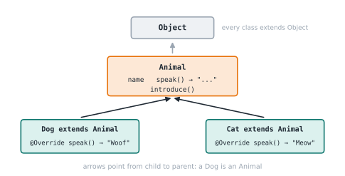

# Lesson 21: Inheritance

**You'll learn:** `extends`, `super`, `@Override`, `protected`, `Object`, single inheritance.

▶ **Practise this lesson in the [sandbox](https://kishoremadanagopal.github.io/learning/java/#inheritance)**: run every example and check your exercise answers.

## Key terms

- **Inheritance:** a class reusing and extending another with `extends`.
- **Superclass / subclass:** the parent / the child class.
- **Override:** a subclass redefining an inherited method.
- **super:** calls the parent's constructor (`super(...)`) or methods (`super.m()`).
- **@Override:** asks the compiler to confirm a method really overrides one.
- **protected:** visible to subclasses and the same package.
- **Object:** the class every class ultimately extends.

**Inheritance** lets a class (the **subclass** or child) reuse and extend another class (the **superclass** or parent) with `extends`. The relationship is "is a": a `Dog` **is an** `Animal`.

```java
class Animal {
    protected String name;

    Animal(String name) {
        this.name = name;
    }

    String speak() {
        return "...";
    }

    String introduce() {
        return "I am " + name + " and I say " + speak();
    }
}

class Dog extends Animal {
    Dog(String name) {
        super(name);                // run Animal's constructor
    }

    @Override
    String speak() {
        return "Woof";
    }
}

class Cat extends Animal {
    Cat(String name) {
        super(name);
    }

    @Override
    String speak() {
        return "Meow";
    }
}

public class Main {
    public static void main(String[] args) {
        System.out.println(new Dog("Rex").introduce());
        System.out.println(new Cat("Tom").introduce());
    }
}
```

`Dog` didn't write `introduce()`; it **inherited** it. It only **overrode** `speak()`, the part that differs.



## super

- `super(...)` calls the parent's constructor. It must be the first line of the child's constructor.
- `super.method()` calls the parent's version of an overridden method, so you can extend it rather than replace it.

```java
class Employee {
    protected String name;
    protected double salary;

    Employee(String name, double salary) {
        this.name = name;
        this.salary = salary;
    }

    String describe() {
        return name + " earns " + salary;
    }
}

class Manager extends Employee {
    private final int reports;

    Manager(String name, double salary, int reports) {
        super(name, salary);
        this.reports = reports;
    }

    @Override
    String describe() {
        return super.describe() + " and manages " + reports + " people";
    }
}

public class Main {
    public static void main(String[] args) {
        System.out.println(new Manager("Ana", 120000, 4).describe());
    }
}
```

## @Override catches mistakes

`@Override` asks the compiler to confirm you're really overriding a parent method. A typo then becomes a compile error instead of a silent bug:

*This example raises an error on purpose.*

```java
class Animal {
    String speak() { return "..."; }
}

class Dog extends Animal {
    @Override
    String speek() { return "Woof"; }
}

public class Main {
    public static void main(String[] args) {
        System.out.println(new Dog().speak());
    }
}
```

## Every class extends Object

A class without `extends` implicitly extends `java.lang.Object`. That's where `toString()`, `equals()` and `hashCode()` come from.

## Rules worth knowing

- A class can extend only **one** class (single inheritance). Interfaces (two lessons ahead) cover multiple-type needs.
- `final class` can't be extended; a `final` method can't be overridden.
- `private` members aren't visible to subclasses; `protected` ones are.
- Prefer **composition** (a field holding another object) for "has a" relationships. A `Car` has an `Engine`; it isn't one.

## Common mistakes

- Forgetting `super(...)` when the parent has no no-argument constructor.
- Misspelling an overridden method without `@Override`, silently creating a new method.
- Using inheritance for "has a" relationships instead of composition.

## Exercises

### 1. Savings account

Given `Account`, create `SavingsAccount extends Account` with a constructor `SavingsAccount(String owner, double balance, double rate)` that calls `super`, and a method `addInterest()` that increases the balance by `balance * rate`. Override `toString()` to append ` @ 5.0%` for a rate of 0.05 (use `rate * 100`).

Starter code:

```java
class Account {
    protected String owner;
    protected double balance;

    Account(String owner, double balance) {
        this.owner = owner;
        this.balance = balance;
    }

    @Override
    public String toString() {
        return owner + ": " + balance;
    }
}

class SavingsAccount {

}

public class Main {
    public static void main(String[] args) {
        // SavingsAccount s = new SavingsAccount("Ana", 1000, 0.05);
        // s.addInterest();
        // System.out.println(s);
    }
}
```

**In the sandbox:** exercise 31. Press **Check** to test your answer.

<details>
<summary>Hints</summary>

1. class SavingsAccount extends Account { ... }. The constructor starts with super(owner, balance); toString() returns super.toString() + " @ " + rate * 100 + "%".

</details>

<details>
<summary>Answers</summary>

**1. Savings account**

```java
class Account {
    protected String owner;
    protected double balance;

    Account(String owner, double balance) {
        this.owner = owner;
        this.balance = balance;
    }

    @Override
    public String toString() {
        return owner + ": " + balance;
    }
}

class SavingsAccount extends Account {
    private final double rate;

    SavingsAccount(String owner, double balance, double rate) {
        super(owner, balance);
        this.rate = rate;
    }

    void addInterest() {
        balance += balance * rate;
    }

    @Override
    public String toString() {
        return super.toString() + " @ " + rate * 100 + "%";
    }
}

public class Main {
    public static void main(String[] args) {
        SavingsAccount s = new SavingsAccount("Ana", 1000, 0.05);
        s.addInterest();
        System.out.println(s);
    }
}
```

</details>

## Quick quiz

1. What does `super(name)` do in a constructor?
   - A) Runs the parent class's constructor
   - B) Creates a second object
   - C) Calls the overridden method

2. How many classes can a Java class extend directly?
   - A) One
   - B) Two
   - C) Any number

3. Why write `@Override`?
   - A) The compiler checks that a parent method is really being overridden
   - B) It makes the method faster
   - C) It's required for every method

<details>
<summary>Quiz answers</summary>

1. **A) Runs the parent class's constructor**: It lets the parent initialise its part of the object; it must come first.
2. **A) One**: Java has single inheritance for classes. Interfaces fill the gap.
3. **A) The compiler checks that a parent method is really being overridden**: A misspelled method name becomes a compile error instead of a silent bug.

</details>

---
Previous: [Lesson 20](20-static-members.md) · Next: [Lesson 22: Polymorphism and casting](22-polymorphism.md)
