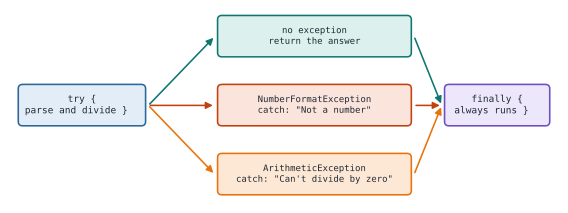
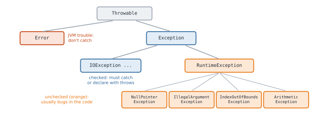

# Lesson 26: Exceptions

**You'll learn:** `try`/`catch`/`finally`, checked vs unchecked, `throw`, `throws`, custom exceptions, try-with-resources.

▶ **Practise this lesson in the [sandbox](https://kishoremadanagopal.github.io/learning/java/#exceptions)**: run every example and check your exercise answers.

## Key terms

- **Exception:** an object signalling that something went wrong at runtime.
- **try / catch:** run code and handle specific exceptions.
- **finally:** a block that always runs, used for cleanup.
- **throw / throws:** raise an exception / declare that a method may throw one.
- **Checked exception:** must be caught or declared, like `IOException`.
- **Unchecked exception:** a `RuntimeException`, usually a programming bug.
- **Stack trace:** the list of method calls shown when an exception isn't caught.
- **try-with-resources:** closes resources declared in `try (...)` automatically.

An **exception** is an object that signals something went wrong while the program runs. If nothing handles it, the program stops and prints a stack trace.

## try and catch

```java
public class Main {
    public static void main(String[] args) {
        String[] inputs = {"42", "3.5", "abc"};
        for (String text : inputs) {
            try {
                int n = Integer.parseInt(text);
                System.out.println("Got " + n);
            } catch (NumberFormatException e) {
                System.out.println("'" + text + "' is not a whole number: " + e.getMessage());
            }
        }
        System.out.println("The program keeps going");
    }
}
```

When an exception is thrown inside `try`, Java jumps to the first matching `catch`. Catch **specific** exceptions; catching everything hides real bugs.

## Several catches and finally

```java
public class Main {
    static int divide(String a, String b) {
        try {
            return Integer.parseInt(a) / Integer.parseInt(b);
        } catch (NumberFormatException e) {
            System.out.println("Not a number");
            return 0;
        } catch (ArithmeticException e) {
            System.out.println("Can't divide by zero");
            return 0;
        } finally {
            System.out.println("-- done --");      // always runs, even after return
        }
    }

    public static void main(String[] args) {
        System.out.println(divide("10", "2"));
        System.out.println(divide("10", "0"));
        System.out.println(divide("ten", "2"));
    }
}
```



You can also catch several types in one block: `catch (NumberFormatException | ArithmeticException e)`.

## The exception hierarchy



## Checked vs unchecked

- **Unchecked** exceptions (`RuntimeException` and its subclasses) usually mean a bug: a null reference, a bad index. You don't have to declare them.
- **Checked** exceptions (other `Exception`s, like `IOException`) represent problems outside your control, such as a missing file. The compiler forces you to either **catch** them or **declare** them with `throws`:

```java
import java.io.IOException;

public class Main {
    static String readConfig(boolean exists) throws IOException {
        if (!exists) {
            throw new IOException("config.txt not found");
        }
        return "theme=dark";
    }

    public static void main(String[] args) {
        try {
            System.out.println(readConfig(true));
            System.out.println(readConfig(false));
        } catch (IOException e) {
            System.out.println("Using defaults because: " + e.getMessage());
        }
    }
}
```

## Throwing your own

`throw` raises an exception. Use it to reject invalid input early, with a clear message:

```java
public class Main {
    static double sqrt(double x) {
        if (x < 0) {
            throw new IllegalArgumentException("Can't take the square root of " + x);
        }
        return Math.sqrt(x);
    }

    public static void main(String[] args) {
        System.out.println(sqrt(16));
        try {
            sqrt(-4);
        } catch (IllegalArgumentException e) {
            System.out.println("Error: " + e.getMessage());
        }
    }
}
```

## Custom exceptions

For your own application errors, extend `Exception` (checked) or `RuntimeException` (unchecked):

```java
class InsufficientFundsException extends Exception {
    private final double shortfall;

    InsufficientFundsException(double shortfall) {
        super("Need " + shortfall + " more");
        this.shortfall = shortfall;
    }

    double getShortfall() {
        return shortfall;
    }
}

public class Main {
    static double withdraw(double balance, double amount) throws InsufficientFundsException {
        if (amount > balance) {
            throw new InsufficientFundsException(amount - balance);
        }
        return balance - amount;
    }

    public static void main(String[] args) {
        try {
            System.out.println(withdraw(100, 30));
            System.out.println(withdraw(100, 130));
        } catch (InsufficientFundsException e) {
            System.out.println("Declined: " + e.getMessage() + " (short by " + e.getShortfall() + ")");
        }
    }
}
```

## try-with-resources

Resources like files and network connections must be closed. A **try-with-resources** block closes them automatically, even if an exception happens. Anything that implements `AutoCloseable` works:

```java
class Connection implements AutoCloseable {
    Connection() { System.out.println("open"); }
    void send(String msg) { System.out.println("send " + msg); }
    @Override public void close() { System.out.println("close"); }
}

public class Main {
    public static void main(String[] args) {
        try (Connection c = new Connection()) {
            c.send("hello");
            throw new IllegalStateException("network hiccup");
        } catch (IllegalStateException e) {
            System.out.println("caught: " + e.getMessage());
        }
    }
}
```

"close" prints before "caught": the resource is closed first, then the exception is handled.

## Common mistakes

- Catching `Exception` everywhere and hiding real bugs.
- An empty `catch` block that silently swallows errors.
- Throwing exceptions without a helpful message.
- Forgetting to close files and connections. Use try-with-resources.

## Exercises

### 1. Safe parse

Write `static int parseOrDefault(String text, int fallback)` that returns the parsed integer, or `fallback` if `text` isn't a valid whole number (including `null`). Use try/catch, not string checks.

Starter code:

```java
public class Main {
    static int parseOrDefault(String text, int fallback) {
        return Integer.parseInt(text);
    }

    public static void main(String[] args) {
        System.out.println(parseOrDefault("42", 0) + " " + parseOrDefault("x", -1));
    }
}
```

### 2. Validated quantity

Write `static int validateQuantity(int qty)` that returns `qty` if it's between 1 and 100, and otherwise throws an `IllegalArgumentException` whose message contains the bad value.

Starter code:

```java
public class Main {
    static int validateQuantity(int qty) {
        return qty;
    }

    public static void main(String[] args) {
        System.out.println(validateQuantity(5));
    }
}
```

**In the sandbox:** exercises 37–38. Press **Check** to test your answer.

<details>
<summary>Hints</summary>

1. Wrap the parseInt call in try { ... } catch (NumberFormatException e) { return fallback; }. Integer.parseInt(null) also throws NumberFormatException.
2. if (qty < 1 || qty > 100) throw new IllegalArgumentException("... " + qty);

</details>

<details>
<summary>Answers</summary>

**1. Safe parse**

```java
public class Main {
    static int parseOrDefault(String text, int fallback) {
        try {
            return Integer.parseInt(text);
        } catch (NumberFormatException e) {
            return fallback;
        }
    }

    public static void main(String[] args) {
        System.out.println(parseOrDefault("42", 0) + " " + parseOrDefault("x", -1));
    }
}
```

**2. Validated quantity**

```java
public class Main {
    static int validateQuantity(int qty) {
        if (qty < 1 || qty > 100) {
            throw new IllegalArgumentException("Quantity must be 1 to 100, got " + qty);
        }
        return qty;
    }

    public static void main(String[] args) {
        System.out.println(validateQuantity(5));
    }
}
```

</details>

## Quick quiz

1. Which must be caught or declared with `throws`?
   - A) Checked exceptions like IOException
   - B) RuntimeExceptions like NullPointerException
   - C) Errors like OutOfMemoryError

2. When does a `finally` block run?
   - A) Always, whether or not an exception occurred
   - B) Only after an exception
   - C) Only if there's no exception

3. What does try-with-resources do?
   - A) Closes the resource automatically at the end of the block
   - B) Retries the code if it fails
   - C) Hides all exceptions

<details>
<summary>Quiz answers</summary>

1. **A) Checked exceptions like IOException**: The compiler enforces handling only for checked exceptions.
2. **A) Always, whether or not an exception occurred**: It's for cleanup that must always happen.
3. **A) Closes the resource automatically at the end of the block**: Anything AutoCloseable declared in `try (...)` is closed for you.

</details>

---
Previous: [Lesson 25](25-stringbuilder-and-wrappers.md) · Next: [Lesson 27: Generics](27-generics.md)
