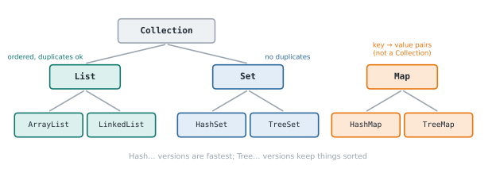

# Lesson 29: Sets and maps

**You'll learn:** `HashSet`, `TreeSet`, `HashMap`, `TreeMap`, `getOrDefault`, `merge`, `equals` and `hashCode`.

▶ **Practise this lesson in the [sandbox](https://kishoremadanagopal.github.io/learning/java/#sets-and-maps)**: run every example and check your exercise answers.

## Key terms

- **Set:** a collection of unique values.
- **Map:** a collection of key-value pairs with unique keys.
- **HashSet / HashMap:** fast, unordered implementations.
- **TreeSet / TreeMap:** sorted implementations.
- **LinkedHashSet / LinkedHashMap:** keep insertion order.
- **getOrDefault / merge:** read with a fallback / combine a new value with an existing one.
- **hashCode:** a number used by hash collections to locate objects quickly.



## Sets

A **Set** holds unique values: adding a duplicate does nothing. Membership tests (`contains`) are very fast.

```java
import java.util.*;

public class Main {
    public static void main(String[] args) {
        Set<String> tags = new HashSet<>();
        tags.add("java");
        tags.add("code");
        System.out.println(tags.add("java"));           // false: already there
        System.out.println(tags.size() + " " + tags.contains("code"));

        Set<String> ordered = new LinkedHashSet<>(List.of("pear", "apple", "pear", "fig"));
        System.out.println(ordered);                     // insertion order, no duplicates

        Set<Integer> sorted = new TreeSet<>(List.of(5, 1, 4, 1));
        System.out.println(sorted);                      // sorted order
    }
}
```

| Implementation | Order |
|---|---|
| `HashSet` | no particular order (fastest) |
| `LinkedHashSet` | insertion order |
| `TreeSet` | sorted order |

Set operations use `addAll` (union), `retainAll` (intersection) and `removeAll` (difference), which change the set they're called on, so work on a copy:

```java
import java.util.*;

public class Main {
    public static void main(String[] args) {
        Set<String> javaDevs = Set.of("Ana", "Ben", "Cy");
        Set<String> pythonDevs = Set.of("Ben", "Dee");

        Set<String> both = new TreeSet<>(javaDevs);
        both.retainAll(pythonDevs);
        Set<String> either = new TreeSet<>(javaDevs);
        either.addAll(pythonDevs);
        Set<String> javaOnly = new TreeSet<>(javaDevs);
        javaOnly.removeAll(pythonDevs);
        System.out.println(both + " " + either + " " + javaOnly);
    }
}
```

## Maps

A **Map** stores **key → value** pairs. Keys are unique; looking up a value by key is fast.

```java
import java.util.*;

public class Main {
    public static void main(String[] args) {
        Map<String, Integer> stock = new HashMap<>();
        stock.put("apples", 10);
        stock.put("pears", 4);
        stock.put("apples", 7);                          // replaces the old value
        System.out.println(stock.get("apples"));
        System.out.println(stock.get("kiwis"));          // null: missing key
        System.out.println(stock.getOrDefault("kiwis", 0));
        System.out.println(stock.containsKey("pears"));
        stock.remove("pears");
        System.out.println(stock);
    }
}
```

`HashMap` has no order, `LinkedHashMap` keeps insertion order, and `TreeMap` keeps keys sorted.

## Looping over a map

```java
import java.util.*;

public class Main {
    public static void main(String[] args) {
        Map<String, Integer> scores = new TreeMap<>(Map.of("Cy", 85, "Ana", 91, "Ben", 78));
        for (Map.Entry<String, Integer> e : scores.entrySet()) {
            System.out.println(e.getKey() + ": " + e.getValue());
        }
        System.out.println(scores.keySet() + " " + scores.values());
    }
}
```

## Counting with a map

Counting things is the classic map job. `merge` adds to an existing count or starts a new one:

```java
import java.util.*;

public class Main {
    public static void main(String[] args) {
        String text = "the cat and the hat and the bat";
        Map<String, Integer> counts = new TreeMap<>();
        for (String word : text.split(" ")) {
            counts.merge(word, 1, Integer::sum);         // same as: put(word, getOrDefault(word, 0) + 1)
        }
        System.out.println(counts);

        Map<Character, List<String>> byLetter = new TreeMap<>();
        for (String word : List.of("apple", "avocado", "banana", "blueberry")) {
            byLetter.computeIfAbsent(word.charAt(0), k -> new ArrayList<>()).add(word);
        }
        System.out.println(byLetter);
    }
}
```

`Integer::sum` is a **method reference**, covered with lambdas in Part 6.

## equals and hashCode

Hash-based collections (`HashSet`, `HashMap`) use `hashCode()` to find the right bucket and `equals()` to compare. If you put your own objects in them, you must override **both**, consistently, or duplicates and lookups go wrong. Records do this for you, which is one more reason to use them for data:

```java
import java.util.*;

record Point(int x, int y) { }

class OldPoint {
    final int x, y;
    OldPoint(int x, int y) { this.x = x; this.y = y; }
}

public class Main {
    public static void main(String[] args) {
        Set<Point> points = new HashSet<>(List.of(new Point(1, 2), new Point(1, 2)));
        System.out.println(points.size());               // 1: records compare by value

        Set<OldPoint> old = new HashSet<>(List.of(new OldPoint(1, 2), new OldPoint(1, 2)));
        System.out.println(old.size());                  // 2: no equals/hashCode
    }
}
```

## Common mistakes

- Calling `map.get(key)` and using the result without checking for `null`.
- Putting your own objects in a HashSet without overriding `equals` and `hashCode`.
- Expecting a `HashMap` to keep insertion or sorted order.

## Exercises

### 1. Word frequency

Write `static Map<String, Integer> wordCounts(String text)` that counts each **lowercased** word, splitting on whitespace with `text.trim().split("\\s+")`. Return an empty map for blank text.

Starter code:

```java
import java.util.*;

public class Main {
    static Map<String, Integer> wordCounts(String text) {
        return new HashMap<>();
    }

    public static void main(String[] args) {
        System.out.println(wordCounts("The cat saw the dog"));
    }
}
```

### 2. Common friends

Write `static Set<String> common(List<String> a, List<String> b)` returning a **sorted** set (`TreeSet`) of names that appear in both lists.

Starter code:

```java
import java.util.*;

public class Main {
    static Set<String> common(List<String> a, List<String> b) {
        return new TreeSet<>();
    }

    public static void main(String[] args) {
        System.out.println(common(List.of("Cy", "Ana", "Ben"), List.of("Ben", "Dee", "Ana")));
    }
}
```

**In the sandbox:** exercises 42–43. Press **Check** to test your answer.

<details>
<summary>Hints</summary>

1. Return early for blank text. Then loop over text.trim().split("\\s+") and use counts.merge(word.toLowerCase(), 1, Integer::sum).
2. Start with new TreeSet<>(a), then call retainAll with b.

</details>

<details>
<summary>Answers</summary>

**1. Word frequency**

```java
import java.util.*;

public class Main {
    static Map<String, Integer> wordCounts(String text) {
        Map<String, Integer> counts = new HashMap<>();
        if (text.isBlank()) {
            return counts;
        }
        for (String word : text.trim().split("\\s+")) {
            counts.merge(word.toLowerCase(), 1, Integer::sum);
        }
        return counts;
    }

    public static void main(String[] args) {
        System.out.println(wordCounts("The cat saw the dog"));
    }
}
```

**2. Common friends**

```java
import java.util.*;

public class Main {
    static Set<String> common(List<String> a, List<String> b) {
        Set<String> result = new TreeSet<>(a);
        result.retainAll(new HashSet<>(b));
        return result;
    }

    public static void main(String[] args) {
        System.out.println(common(List.of("Cy", "Ana", "Ben"), List.of("Ben", "Dee", "Ana")));
    }
}
```

</details>

## Quick quiz

1. What does `set.add(x)` return if x is already in the set?
   - A) false
   - B) true
   - C) It throws an exception

2. Which map keeps its keys sorted?
   - A) HashMap
   - B) LinkedHashMap
   - C) TreeMap

3. What must you override to use your own class as a HashMap key?
   - A) Both equals and hashCode
   - B) Only equals
   - C) Only toString

<details>
<summary>Quiz answers</summary>

1. **A) false**: Sets ignore duplicates; `add` reports whether anything changed.
2. **C) TreeMap**: TreeMap is a sorted map.
3. **A) Both equals and hashCode**: Hash collections use hashCode to locate and equals to compare. Records do both for you.

</details>

---
Previous: [Lesson 28](28-lists.md) · Next: [Lesson 30: Sorting with Comparable and Comparator](30-sorting-and-comparators.md)
