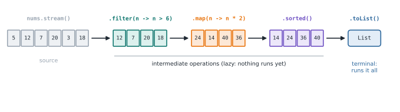

# Lesson 32: Streams

**You'll learn:** `stream()`, `filter`, `map`, `sorted`, `reduce`, `collect`, `groupingBy`.

▶ **Practise this lesson in the [sandbox](https://kishoremadanagopal.github.io/learning/java/#streams)**: run every example and check your exercise answers.

## Key terms

- **Stream:** a pipeline that processes a sequence of elements.
- **Intermediate operation:** a lazy step such as `filter` or `map` that returns a stream.
- **Terminal operation:** a step such as `toList` or `count` that produces a result and runs the pipeline.
- **Collector:** a recipe for gathering stream results, such as `groupingBy` or `joining`.
- **IntStream:** a stream of primitive ints with `sum`, `average` and `range`.

A **stream** is a pipeline that processes a sequence of elements: start from a source, apply **intermediate** operations, and finish with a **terminal** operation.

```java
import java.util.*;

public class Main {
    public static void main(String[] args) {
        List<Integer> nums = List.of(5, 12, 7, 20, 3, 18);

        List<Integer> bigDoubled = nums.stream()
            .filter(n -> n > 6)          // keep some elements
            .map(n -> n * 2)             // transform each one
            .sorted()                    // order them
            .toList();                   // terminal: collect into a list
        System.out.println(bigDoubled);

        int sum = nums.stream().mapToInt(Integer::intValue).sum();
        long count = nums.stream().filter(n -> n % 2 == 0).count();
        System.out.println(sum + " " + count);
    }
}
```

Compare the loop version: a new list, a `for`, an `if`, an `add`, then a sort. The stream says **what** you want, not **how** to step through it.



## Laziness

Intermediate operations don't run until a terminal operation asks for results, and then each element flows through the whole pipeline. A stream can be used only **once**.

## Common operations

| Intermediate | Does |
|---|---|
| `filter(pred)` | keeps matching elements |
| `map(f)` | transforms each element |
| `sorted()` / `sorted(cmp)` | orders them |
| `distinct()` | removes duplicates |
| `limit(n)` / `skip(n)` | takes / skips elements |
| `flatMap(f)` | flattens nested streams |

| Terminal | Returns |
|---|---|
| `toList()`, `collect(...)` | a collection |
| `count()`, `sum()`, `average()` | numbers (sum/average on IntStream etc.) |
| `min(cmp)`, `max(cmp)`, `findFirst()` | an `Optional` |
| `anyMatch`, `allMatch`, `noneMatch` | boolean |
| `forEach(action)` | nothing |
| `reduce(identity, op)` | one combined value |

```java
import java.util.*;
import java.util.stream.*;

public class Main {
    public static void main(String[] args) {
        List<String> words = List.of("stream", "lambda", "java", "map", "filter", "java");
        System.out.println(words.stream().distinct().map(String::toUpperCase).toList());
        System.out.println(words.stream().anyMatch(w -> w.startsWith("j")));
        System.out.println(words.stream().max(Comparator.comparingInt(String::length)).get());
        System.out.println(words.stream().map(String::length).reduce(0, Integer::sum));
        System.out.println(String.join(",", words.stream().sorted().limit(3).toList()));

        System.out.println(IntStream.rangeClosed(1, 5).map(i -> i * i).boxed().toList());
        System.out.println(Stream.of("a,b", "c").flatMap(s -> Arrays.stream(s.split(","))).toList());
        System.out.println(IntStream.of(3, 8, 1).summaryStatistics());
    }
}
```

## Collectors: grouping and joining

`collect(Collectors...)` gathers results into maps, strings and more:

```java
import java.util.*;
import java.util.stream.*;

record Employee(String name, String dept, double salary) { }

public class Main {
    public static void main(String[] args) {
        List<Employee> staff = List.of(
            new Employee("Ana", "Eng", 95000),
            new Employee("Ben", "Sales", 62000),
            new Employee("Cy", "Eng", 88000),
            new Employee("Dee", "Sales", 70000)
        );

        Map<String, List<String>> namesByDept = staff.stream()
            .collect(Collectors.groupingBy(Employee::dept, TreeMap::new,
                     Collectors.mapping(Employee::name, Collectors.toList())));
        System.out.println(namesByDept);

        Map<String, Double> avgByDept = staff.stream()
            .collect(Collectors.groupingBy(Employee::dept, TreeMap::new,
                     Collectors.averagingDouble(Employee::salary)));
        System.out.println(avgByDept);

        String names = staff.stream().map(Employee::name).collect(Collectors.joining(", ", "[", "]"));
        System.out.println(names);

        Map<Boolean, Long> highEarners = staff.stream()
            .collect(Collectors.partitioningBy(e -> e.salary() > 80000, Collectors.counting()));
        System.out.println(highEarners);
    }
}
```

## Streams or loops?

Streams are great for transforming and summarising collections. A plain loop is often clearer when you need to break early, update several variables, or handle checked exceptions. Use whichever reads better.

## Common mistakes

- Forgetting the terminal operation, so nothing runs.
- Reusing a stream after it has been consumed.
- Changing outside variables from inside a stream.

## Exercises

### 1. Stream practice

Using streams, write:

- `static List<String> shortUpper(List<String> words)`: words with at most 4 letters, uppercased, in their original order.
- `static int sumOfSquaresOfOdds(List<Integer> nums)`: the sum of the squares of the odd numbers.

Starter code:

```java
import java.util.*;
import java.util.stream.*;

public class Main {
    static List<String> shortUpper(List<String> words) {
        return words;
    }

    static int sumOfSquaresOfOdds(List<Integer> nums) {
        return 0;
    }

    public static void main(String[] args) {
        System.out.println(shortUpper(List.of("java", "stream", "map", "lambda")));
        System.out.println(sumOfSquaresOfOdds(List.of(1, 2, 3, 4, 5)));
    }
}
```

### 2. Group by length

Write `static Map<Integer, List<String>> byLength(List<String> words)` that groups words by their length, using `Collectors.groupingBy` with a `TreeMap` so the keys are sorted. Words keep their original order inside each group.

Starter code:

```java
import java.util.*;
import java.util.stream.*;

public class Main {
    static Map<Integer, List<String>> byLength(List<String> words) {
        return new TreeMap<>();
    }

    public static void main(String[] args) {
        System.out.println(byLength(List.of("hi", "cat", "ox", "dog", "bird")));
    }
}
```

**In the sandbox:** exercises 47–48. Press **Check** to test your answer.

<details>
<summary>Hints</summary>

1. words.stream().filter(...).map(String::toUpperCase).toList(); and nums.stream().filter(n -> n % 2 != 0).mapToInt(n -> n * n).sum();
2. words.stream().collect(Collectors.groupingBy(String::length, TreeMap::new, Collectors.toList()))

</details>

<details>
<summary>Answers</summary>

**1. Stream practice**

```java
import java.util.*;
import java.util.stream.*;

public class Main {
    static List<String> shortUpper(List<String> words) {
        return words.stream()
            .filter(w -> w.length() <= 4)
            .map(String::toUpperCase)
            .toList();
    }

    static int sumOfSquaresOfOdds(List<Integer> nums) {
        return nums.stream()
            .filter(n -> n % 2 != 0)
            .mapToInt(n -> n * n)
            .sum();
    }

    public static void main(String[] args) {
        System.out.println(shortUpper(List.of("java", "stream", "map", "lambda")));
        System.out.println(sumOfSquaresOfOdds(List.of(1, 2, 3, 4, 5)));
    }
}
```

**2. Group by length**

```java
import java.util.*;
import java.util.stream.*;

public class Main {
    static Map<Integer, List<String>> byLength(List<String> words) {
        return words.stream()
            .collect(Collectors.groupingBy(String::length, TreeMap::new, Collectors.toList()));
    }

    public static void main(String[] args) {
        System.out.println(byLength(List.of("hi", "cat", "ox", "dog", "bird")));
    }
}
```

</details>

## Quick quiz

1. When do a stream's intermediate operations run?
   - A) Only when a terminal operation is called
   - B) Immediately, one after another
   - C) When the stream is created

2. What does `.map(String::length)` do to a stream of strings?
   - A) Turns it into a stream of their lengths
   - B) Filters out empty strings
   - C) Sorts by length

3. Can you reuse a stream after a terminal operation?
   - A) Yes
   - B) No, you get an IllegalStateException

<details>
<summary>Quiz answers</summary>

1. **A) Only when a terminal operation is called**: Streams are lazy; `toList()`, `count()` and friends trigger the work.
2. **A) Turns it into a stream of their lengths**: `map` transforms each element.
3. **B) No, you get an IllegalStateException**: Create a new stream from the source each time.

</details>

---
Previous: [Lesson 31](31-lambdas.md) · Next: [Lesson 33: Optional and null safety](33-optional.md)
