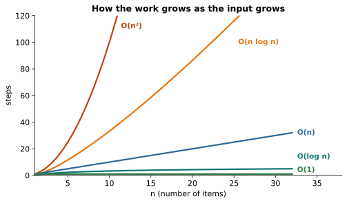

# Lesson 37: Algorithms and Big-O

**You'll learn:** Big-O, choosing collections, binary search, merge sort, operation costs.

▶ **Practise this lesson in the [sandbox](https://kishoremadanagopal.github.io/learning/java/#algorithms-and-big-o)**: run every example and check your exercise answers.

## Key terms

- **Algorithm:** a step-by-step method for solving a problem.
- **Big-O notation:** how running time grows with input size.
- **Binary search:** finds a value in sorted data by halving the range each step: O(log n).
- **Merge sort:** a divide-and-conquer sort running in O(n log n).
- **Amortised cost:** the average cost per operation over many operations.

Two programs can produce the same answer while one takes milliseconds and the other takes hours. **Big-O notation** describes how running time grows as the input size `n` grows:

| Big-O | Name | Example | 1,000 → 1,000,000 items |
|---|---|---|---|
| O(1) | constant | `HashMap.get`, array index | same time |
| O(log n) | logarithmic | binary search, `TreeMap.get` | 10 steps → 20 steps |
| O(n) | linear | loop over a list, `ArrayList.contains` | 1,000× slower |
| O(n log n) | linearithmic | `Collections.sort`, merge sort | ~2,000× slower |
| O(n²) | quadratic | nested loops over the same data | 1,000,000× slower |



## The right data structure is the biggest win

`list.contains(x)` checks elements one by one: O(n). `set.contains(x)` uses hashing: O(1) on average. Watch the difference:

```java
import java.util.*;

public class Main {
    public static void main(String[] args) {
        int n = 20_000;
        List<Integer> list = new ArrayList<>();
        for (int i = 0; i < n; i++) list.add(i);
        Set<Integer> set = new HashSet<>(list);

        long t = System.nanoTime();
        int hits = 0;
        for (int i = n - 2_000; i < n; i++) if (list.contains(i)) hits++;
        long listMs = (System.nanoTime() - t) / 1_000_000;

        t = System.nanoTime();
        for (int i = n - 2_000; i < n; i++) if (set.contains(i)) hits++;
        long setMs = (System.nanoTime() - t) / 1_000_000;

        System.out.println("list: " + listMs + " ms, set: " + setMs + " ms, hits: " + hits);
    }
}
```

## Spotting O(n²)

A loop inside a loop over the same data is the classic warning sign. A set often removes the inner loop:

```java
import java.util.*;

public class Main {
    static boolean hasDuplicateSlow(int[] a) {          // O(n²)
        for (int i = 0; i < a.length; i++) {
            for (int j = i + 1; j < a.length; j++) {
                if (a[i] == a[j]) return true;
            }
        }
        return false;
    }

    static boolean hasDuplicateFast(int[] a) {          // O(n)
        Set<Integer> seen = new HashSet<>();
        for (int x : a) {
            if (!seen.add(x)) return true;
        }
        return false;
    }

    public static void main(String[] args) {
        int[] data = {5, 3, 8, 1, 3};
        System.out.println(hasDuplicateSlow(data) + " " + hasDuplicateFast(data));
    }
}
```

## Binary search: O(log n)

On **sorted** data, compare with the middle element and discard half each step. A million items take at most 20 comparisons:

```java
import java.util.Arrays;

public class Main {
    static int binarySearch(int[] a, int target) {
        int low = 0, high = a.length - 1;
        while (low <= high) {
            int mid = (low + high) >>> 1;        // avoids overflow for huge arrays
            if (a[mid] == target) return mid;
            if (a[mid] < target) low = mid + 1;
            else high = mid - 1;
        }
        return -1;
    }

    public static void main(String[] args) {
        int[] sorted = new int[143];
        for (int i = 0; i < sorted.length; i++) sorted[i] = i * 7;
        System.out.println(binarySearch(sorted, 693) + " " + binarySearch(sorted, 50));
        System.out.println(Arrays.binarySearch(sorted, 693));    // the library version
    }
}
```

## Merge sort: O(n log n)

Split the array in half, sort each half recursively, then merge the two sorted halves. It's a classic **divide and conquer** algorithm:

```java
import java.util.Arrays;

public class Main {
    static int[] mergeSort(int[] a) {
        if (a.length <= 1) return a;
        int mid = a.length / 2;
        int[] left = mergeSort(Arrays.copyOfRange(a, 0, mid));
        int[] right = mergeSort(Arrays.copyOfRange(a, mid, a.length));

        int[] merged = new int[a.length];
        int i = 0, j = 0, k = 0;
        while (i < left.length && j < right.length) {
            merged[k++] = (left[i] <= right[j]) ? left[i++] : right[j++];
        }
        while (i < left.length) merged[k++] = left[i++];
        while (j < right.length) merged[k++] = right[j++];
        return merged;
    }

    public static void main(String[] args) {
        System.out.println(Arrays.toString(mergeSort(new int[]{38, 27, 43, 3, 9, 82, 10})));
    }
}
```

In real code, use `Arrays.sort` or `Collections.sort`, which are highly optimised. Knowing how sorting works trains your algorithmic thinking, and it's a favourite interview topic.

## Costs of common operations

| Operation | ArrayList | LinkedList | HashMap / HashSet | TreeMap / TreeSet |
|---|---|---|---|---|
| get by index / key | O(1) | O(n) | O(1) | O(log n) |
| contains | O(n) | O(n) | O(1) | O(log n) |
| add at end | O(1)* | O(1) | O(1) | O(log n) |
| insert / remove at front | O(n) | O(1) | n/a | n/a |

\* amortised: occasionally the backing array is resized.

## Common mistakes

- Calling `list.contains` inside a loop over large data. Use a HashSet.
- Running binary search on unsorted data.
- Optimising before measuring.

## Exercises

### 1. Two sum

Write `static int[] twoSum(int[] nums, int target)` returning the indexes `{i, j}` (with `i < j`) of two numbers that add up to `target`, or an empty array if there are none. Make it **O(n)** with a `HashMap` from value to index.

Starter code:

```java
import java.util.*;

public class Main {
    static int[] twoSum(int[] nums, int target) {
        for (int i = 0; i < nums.length; i++) {
            for (int j = i + 1; j < nums.length; j++) {
                if (nums[i] + nums[j] == target) {
                    return new int[]{i, j};
                }
            }
        }
        return new int[0];
    }

    public static void main(String[] args) {
        System.out.println(Arrays.toString(twoSum(new int[]{2, 7, 11, 15}, 9)));
    }
}
```

### 2. Insertion sort

Implement `static void insertionSort(int[] a)` that sorts the array in place without `Arrays.sort`: take each element and shift it left until it's in position.

Starter code:

```java
import java.util.Arrays;

public class Main {
    static void insertionSort(int[] a) {

    }

    public static void main(String[] args) {
        int[] data = {5, 2, 9, 1, 5, 6};
        insertionSort(data);
        System.out.println(Arrays.toString(data));
    }
}
```

**In the sandbox:** exercises 54–55. Press **Check** to test your answer.

<details>
<summary>Hints</summary>

1. Loop once. For each index j, look up target - nums[j] in a map of value → index. If it's there, return {thatIndex, j}; otherwise put nums[j] → j.
2. For each i from 1, remember value = a[i]. Move bigger elements to the left of it one step right (a[j + 1] = a[j]) while j >= 0 && a[j] > value, then put value at a[j + 1].

</details>

<details>
<summary>Answers</summary>

**1. Two sum**

```java
import java.util.*;

public class Main {
    static int[] twoSum(int[] nums, int target) {
        Map<Integer, Integer> seen = new HashMap<>();
        for (int j = 0; j < nums.length; j++) {
            Integer i = seen.get(target - nums[j]);
            if (i != null) {
                return new int[]{i, j};
            }
            seen.put(nums[j], j);
        }
        return new int[0];
    }

    public static void main(String[] args) {
        System.out.println(Arrays.toString(twoSum(new int[]{2, 7, 11, 15}, 9)));
    }
}
```

**2. Insertion sort**

```java
import java.util.Arrays;

public class Main {
    static void insertionSort(int[] a) {
        for (int i = 1; i < a.length; i++) {
            int value = a[i];
            int j = i - 1;
            while (j >= 0 && a[j] > value) {
                a[j + 1] = a[j];
                j--;
            }
            a[j + 1] = value;
        }
    }

    public static void main(String[] args) {
        int[] data = {5, 2, 9, 1, 5, 6};
        insertionSort(data);
        System.out.println(Arrays.toString(data));
    }
}
```

</details>

## Quick quiz

1. What's the Big-O of `HashSet.contains`?
   - A) O(1) on average
   - B) O(n)
   - C) O(log n)

2. What does binary search require?
   - A) Sorted data
   - B) A HashMap
   - C) Unique values

3. Two nested loops over the same n items are usually…
   - A) O(n)
   - B) O(n²)
   - C) O(2n)

<details>
<summary>Quiz answers</summary>

1. **A) O(1) on average**: Hashing jumps straight to the right bucket.
2. **A) Sorted data**: Discarding half only works if you know which side the target is on.
3. **B) O(n²)**: For each of n items you do up to n more steps.

</details>

---
Previous: [Lesson 36](36-concurrency.md) · Next: [Lesson 38: Capstone: a library system](38-capstone.md)
