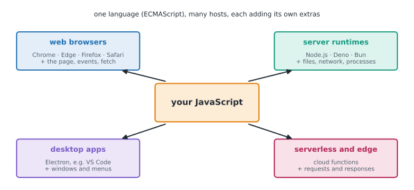

# Lesson 1: What JavaScript is

**You'll learn:** what JavaScript is, where it runs (browsers, Node.js, Deno, Bun), runtimes and their extras, ECMAScript, TC39 and yearly editions, console.log, statements, semicolons and automatic semicolon insertion, comments, JavaScript compared with Python, how the sandbox runs code, reading error messages.

▶ **Practise this lesson in the [sandbox](https://kishoremadanagopal.github.io/learning/javascript/#what-is-javascript)**: run every example and check your exercise answers.

## Key terms

- **JavaScript:** the programming language of the web, also used for servers and tools.
- **Runtime (host):** a program that runs JavaScript and adds its own features, such as a browser or Node.js.
- **Node.js:** a runtime for running JavaScript outside the browser: servers, scripts and tools.
- **ECMAScript:** the official standard that defines the JavaScript language, with a new edition each year.
- **TC39:** the committee that develops the ECMAScript standard.
- **Statement:** one instruction in a program, usually ending with a semicolon.
- **Automatic semicolon insertion:** JavaScript's rule for adding missing semicolons at line ends.
- **Web Worker:** a background thread in the browser; the sandbox runs your code in one.

**JavaScript** is the programming language of the web. Every interactive web page runs it, and since **Node.js** arrived in 2009 it also runs servers, command-line tools and build systems. It's one of the most widely used languages in the world.

## Where JavaScript runs



A program that runs JavaScript is a **runtime** (or **host**). Each provides the same core language plus its own extras:

| Runtime | Extras it adds |
|---|---|
| a web browser | the page (`document`), clicks and other events, `fetch`, storage |
| **Node.js** | files, networking, processes; the npm package ecosystem |
| Deno, Bun | modern alternatives to Node.js, with TypeScript built in |

The core language is standardised as **ECMAScript** by a committee called **TC39**. A new edition comes out every June: ECMAScript 2015 (often called **ES6**) modernised the language, and ECMAScript 2026 is the latest. Browsers add new features as they're agreed, so code that works in the newest Chrome may need a recent version of Safari too. This course points out the few places where that matters.

## Your first program

```js
console.log("Hello, world!");
console.log("JavaScript can do maths:", 6 * 7);
console.log("Text and numbers:", "3" + 4, 3 + 4);
```

`console.log(...)` prints its arguments, separated by spaces. In a browser it prints to the developer console (press F12, or Cmd+Option+J on a Mac); in Node.js it prints to the terminal; here it prints to the output panel.

## Statements, semicolons and comments

```js
// A comment runs to the end of the line.
/* A block comment
   can span several lines. */

let total = 2 + 3;     // a statement; the semicolon ends it
total = total * 10
console.log(total)     // works without semicolons too
```

JavaScript inserts missing semicolons for you (**automatic semicolon insertion**), so most code works either way. This course writes them, like most style guides; tools such as Prettier (Part 7) add them automatically.

## If you know Python

| Python | JavaScript |
|---|---|
| `print("hi")` | `console.log("hi");` |
| indentation makes blocks | `{ }` make blocks; indentation is only for readability |
| `x = 5` | `let x = 5;` or `const x = 5;` |
| `True`, `False`, `None` | `true`, `false`, `null` (and `undefined`) |
| `and`, `or`, `not` | `&&`, `\|\|`, `!` |
| `# comment` | `// comment` |
| `def add(a, b):` | `function add(a, b) { … }` |

## How this sandbox runs your code

Your code runs in your own browser, in a separate thread (a **Web Worker**), so an endless loop can't freeze the page: press **Stop**. Two details:

- Code runs in **strict mode**, as in modern JavaScript modules: a few old, error-prone features are switched off, and some silent mistakes become real errors (Lesson 2).
- You can use `await` at the top level (Part 4), and timers like `setTimeout` finish before the output is shown.

*This example raises an error on purpose.*

```js
console.log("This line runs.");
console.log(messag);            // a typo: there's no variable called messag
console.log("This one doesn't.");
```

When something goes wrong, you get the line, the error and a hint. Read errors from the top: the **error type** (`ReferenceError`) and its message usually say exactly what's wrong.

## At a glance

| Concept | Approach | Time | Space |
|---|---|---|---|
| Print values | console.log(a, b, …) joins them with spaces | O(n) | O(n) |
| Comment | // to end of line, or /* … */ | — | — |
| Find an error | read the type and message, then the line | — | — |

## Common mistakes

- Forgetting a closing quote or bracket, so nothing runs at all.
- Misspelling a name such as `console`, giving a `ReferenceError`.
- Reading only the last line of an error message instead of its type and message.
- Joining text and numbers with `+` and getting text instead of a sum.

## Exercises

### 1. Print a receipt

Print exactly these three lines with `console.log`:

```text
Bike shop
Inner tube: 6
Total: 12
```

Compute the total as `2 * 6` in the code rather than typing `12`.

Starter code:

```js
// Print the three lines here.
```

<details>
<summary>🧭 How to approach it</summary>

1. **Understand:** three lines of output, exact text; the total must be calculated.
2. **Examples:** `console.log("Total:", 2 * 6)` prints `Total: 12`.
3. **Brute force:** typing `"Total: 12"` works but skips the calculation.
4. **Pattern:** **one `console.log` per line**, with several arguments separated by spaces.
5. **Plan:** three calls in order.
6. **Code and test:** run it and compare the output with the target, character by character.

</details>

<details>
<summary>💡 Hint 1</summary>

Each `console.log` call prints one line.

</details>

<details>
<summary>💡 Hint 2</summary>

`console.log("Inner tube:", 6)` prints the text, a space, then the number.

</details>

<details>
<summary>💡 Hint 3</summary>

The last line is `console.log("Total:", 2 * 6);`.

</details>

### 2. Fix the program

This program has three mistakes. Fix them so it prints `Welcome, Ada!` and then `You have 3 messages.`

Starter code:

```js
consol.log("Welcome, Ada!")
let count = 3;
console.log("You have", count "messages.");
console.log("Done);
```

<details>
<summary>🧭 How to approach it</summary>

1. **Understand:** the code must run and print the two required lines first.
2. **Examples:** a missing quote is a `SyntaxError`, reported before anything runs.
3. **Brute force:** rewrite everything from scratch: works, but practise reading the errors instead.
4. **Pattern:** **fix one error at a time**: run, read the message, fix, run again.
5. **Plan:** syntax errors first (quote, comma), then the misspelt name.
6. **Code and test:** run after each fix.

</details>

<details>
<summary>💡 Hint 1</summary>

Read the error message: which name isn't defined, or what couldn't be read?

</details>

<details>
<summary>💡 Hint 2</summary>

`consol` is a typo. Arguments must be separated by commas. Every string needs both quotes.

</details>

<details>
<summary>💡 Hint 3</summary>

Fix `consol.log` → `console.log`, add the comma after `count`, and close the quote in `"Done"`.

</details>

**In the sandbox:** exercises 1–2. Press **Check** to run the hidden tests.

### Answers and walkthroughs

Open these only after a real attempt. Each one explains the solution step by step.

<details>
<summary>✅ 1. Print a receipt</summary>

```js
console.log("Bike shop");
console.log("Inner tube:", 6);
console.log("Total:", 2 * 6);
```

**Line by line**

- `console.log("Bike shop")` prints the text as it is.
- With several arguments, `console.log` joins them with single spaces, so `"Inner tube:", 6` prints `Inner tube: 6`.
- `2 * 6` is evaluated first, then printed: `Total: 12`.

**Common wrong approach:** `console.log("Total: " + 2 * 6)` also works (the multiplication happens before the `+`), but `console.log("Total: " + 2 + 6)` prints `Total: 26`: once one side of `+` is text, `+` joins text. Lesson 3 covers this.

</details>

<details>
<summary>✅ 2. Fix the program</summary>

```js
console.log("Welcome, Ada!");
let count = 3;
console.log("You have", count, "messages.");
console.log("Done");
```

**Line by line**

- `"Done);` has no closing quote, so JavaScript can't read the program at all: a `SyntaxError` stops everything before any line runs.
- `count "messages."` is missing a comma between two arguments: another syntax error.
- `consol.log` is a `ReferenceError`: there's no variable called `consol`. That only shows once the syntax errors are fixed, because syntax is checked before anything runs.

**Common wrong approach:** fixing only the line in the first error message and assuming it was the only problem. JavaScript reports one syntax error at a time.

</details>

## Quick quiz

1. Who standardises the core JavaScript language?
   - A) TC39, as the ECMAScript specification
   - B) Google
   - C) Each browser separately

2. What does console.log("a", 1, true) print?
   - A) a 1 true
   - B) a,1,true
   - C) "a" 1 true

3. Which runtime lets JavaScript read files and run servers?
   - A) Node.js
   - B) A web browser tab
   - C) ECMAScript

4. Are semicolons required at the end of statements?
   - A) Usually not, thanks to automatic semicolon insertion, but most style guides use them
   - B) Yes, always
   - C) No, they're an error

<details>
<summary>Quiz answers</summary>

1. **A) TC39, as the ECMAScript specification**: A new ECMAScript edition comes out every June.
2. **A) a 1 true**: Arguments are printed separated by spaces; strings without quotes at the top level.
3. **A) Node.js**: Node.js adds files, networking and processes to the language.
4. **A) Usually not, thanks to automatic semicolon insertion, but most style guides use them**: Formatters such as Prettier add them for you.

</details>

---
Back to the [course home](../README.md) · Next: [Lesson 2: Variables and types](02-variables-and-types.md)
