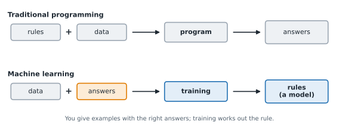
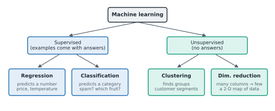

# Lesson 1: What machine learning is

**You'll learn:** rules vs learning, models, features and labels, X and y, supervised vs unsupervised, regression vs classification vs clustering, ML in 2026.

▶ **Practise this lesson in the [sandbox](https://kishoremadanagopal.github.io/learning/ml/#what-is-ml)**: run every example and check your exercise answers.

## Key terms

- **Machine learning (ML):** getting a computer to learn rules from examples, instead of writing the rules by hand.
- **Model:** the rule a computer learned from data; it turns features into a prediction.
- **Prediction:** the model's answer for an example, often one it has never seen.
- **Feature:** a column the model uses as a clue, such as a fruit's width. All features together are called X.
- **Label:** the answer the model should learn to predict, such as the kind of fruit. Also called the target, and called y in code.
- **Target:** another name for the label.
- **X:** the table of features, one row per example.
- **y:** the column of labels, one per row of X.
- **Training:** letting a model learn from examples with known answers.
- **Supervised learning:** learning from examples that come with the right answers.
- **Unsupervised learning:** finding structure, such as groups, in data with no answers.
- **Regression:** supervised learning that predicts a number.
- **Classification:** supervised learning that predicts a category.
- **Clustering:** unsupervised learning that puts similar rows into groups.
- **Dimensionality reduction:** summarising many columns with a few new ones.
- **scikit-learn:** the standard Python library for machine learning on tables; imported as sklearn.

In normal programming, **you** write the rules. To sort fruit you might write: "if it's yellow and long, it's a lemon". That works until you meet a green lemon, a yellow apple, or a thousand other cases you didn't think of.

**Machine learning (ML)** flips this around. You give the computer lots of **examples with the right answers**, and it works out the rules itself. The result is called a **model**: a rule learned from data that can make a guess (a **prediction**) for new examples it has never seen.



## Features and labels

Every ML dataset is a table. Each **row** is one example (a fruit, a house, a customer). The columns come in two kinds:

- **Features** are the clues the model looks at: width, height, weight. In code they're called **`X`** (capital, because it's a table).
- The **label** (also called the **target**) is the answer you want to predict: the kind of fruit. In code it's called **`y`** (small, because it's one column).

```python
import pandas as pd

fruit = pd.read_csv("fruit.csv")
print(fruit.head())

X = fruit[["width_cm", "height_cm", "weight_g"]]   # features: the clues
y = fruit["fruit"]                                  # label: the answer
print(X.shape, y.shape)
```

`X` has 150 rows and 3 columns; `y` has 150 answers, one per row. Training means: "look at these 150 examples and learn how the clues relate to the answer".

## The main kinds of machine learning



| Kind | You have | The model learns to | Example |
|---|---|---|---|
| **Supervised: regression** | features + a **number** to predict | predict a number | a home's price from its size |
| **Supervised: classification** | features + a **category** to predict | pick a category | spam or not spam |
| **Unsupervised: clustering** | features only, **no answers** | find natural groups | customer segments |
| **Unsupervised: dimensionality reduction** | features only | summarise many columns with a few | a 2-D map of 50 measurements |

**Supervised** means every training example comes with the right answer, like a teacher marking homework. **Unsupervised** means there are no answers; the model looks for structure on its own.

The quickest way to tell regression from classification: look at the label. Can you average it (price, temperature, minutes)? Regression. Is it a category (yes/no, apple/orange/lemon)? Classification.

```python
import pandas as pd

housing = pd.read_csv("housing.csv")
churn = pd.read_csv("churn.csv")

print(housing["price_k"].head(3))           # a number      -> regression
print(churn["churned"].value_counts())      # 0 or 1 (no/yes) -> classification
```

`churned` is stored as 0 and 1, but it's still a category ("stayed" or "left"). Numbers that are really labels make it a classification problem.

## Where ML shows up in 2026

- **Every day:** spam filters, card-fraud alerts, recommendations ("you might also like"), maps estimating arrival times, photo search.
- **In business:** predicting which customers will leave (churn), forecasting demand, scoring leads, flagging unusual transactions.
- **In AI:** large language models (LLMs) like Claude are machine learning too: very large models trained on text to predict what comes next. The ideas in this course (training data, testing on unseen data, overfitting, evaluation) are exactly the ones AI engineers use when they fine-tune and evaluate those models.

You'll use **scikit-learn**, the standard Python library for "classic" machine learning on tables. It's free, it runs in this sandbox, and its design (create a model, `fit` it, `predict` with it) is copied by almost every other ML library.

```python
import sklearn
print("scikit-learn version:", sklearn.__version__)
```

## Common mistakes

- Calling a 0/1 or yes/no label "regression" because it's stored as numbers. If it's a category, it's classification.
- Putting the label column inside X. The model then just copies the answer and looks perfect until it meets real data.
- Expecting a model to be right every time. A model gives its best guess from patterns in past examples.

## Exercises

### 1. Features and label for houses

Load `housing.csv`. Make `X` a DataFrame with the columns `area_sqm`, `bedrooms` and `age_years`, and `y` the `price_k` column.

Starter code:

```python
import pandas as pd

housing = pd.read_csv("housing.csv")

```

### 2. Which kind of problem?

Make a dictionary `kinds` that maps each task to `"regression"`, `"classification"` or `"clustering"`:
`"predict tomorrow's temperature"`, `"is this email spam?"`, `"group shoppers by behaviour, no labels"`, `"which of 3 fruits is this?"`, `"how many minutes will delivery take?"`.

Starter code:

```python
kinds = {
    "predict tomorrow's temperature": "",
}
```

**In the sandbox:** exercises 1–2. Press **Check** to test your answer.

<details>
<summary>Hints</summary>

1. Double brackets pick several columns as a table: `housing[["area_sqm", "bedrooms", "age_years"]]`. Single brackets pick one column.
2. A number you could average is regression; a category is classification; no answers at all is clustering.

</details>

<details>
<summary>Answers</summary>

**1. Features and label for houses**

```python
import pandas as pd

housing = pd.read_csv("housing.csv")
X = housing[["area_sqm", "bedrooms", "age_years"]]
y = housing["price_k"]
print(X.shape, y.shape)
```

**2. Which kind of problem?**

```python
kinds = {
    "predict tomorrow's temperature": "regression",
    "is this email spam?": "classification",
    "group shoppers by behaviour, no labels": "clustering",
    "which of 3 fruits is this?": "classification",
    "how many minutes will delivery take?": "regression",
}
print(kinds)
```

</details>

## Quick quiz

1. In machine learning, who writes the rules?
   - A) The programmer, by hand
   - B) The computer, by learning them from examples with answers
   - C) Nobody: models don't use rules

2. In a table of houses, which column would be the label for predicting price?
   - A) area_sqm
   - B) neighborhood
   - C) price_k

3. A model predicts whether a customer will cancel (yes/no). This is:
   - A) Regression
   - B) Classification
   - C) Clustering

4. What makes learning "unsupervised"?
   - A) It runs without a computer
   - B) The training data has no answers (labels)
   - C) It uses more data

<details>
<summary>Quiz answers</summary>

1. **B) The computer, by learning them from examples with answers**: You supply examples and answers; training finds the rule. The learned rule is the model.
2. **C) price_k**: The label (target) is what you want to predict. Everything you use as clues is a feature.
3. **B) Classification**: The answer is a category (yes or no), so it's classification, even if it's stored as 0 and 1.
4. **B) The training data has no answers (labels)**: Without labels, the model can only look for structure, such as groups.

</details>

---
Back to the [course home](../README.md) · Next: [Lesson 2: Your first model: fit and predict](02-first-model.md)
