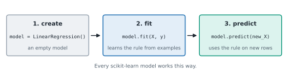

# Lesson 2: Your first model: fit and predict

**You'll learn:** the estimator API, create / fit / predict, LinearRegression, KNeighborsClassifier, predict_proba, coef_ and intercept_, 2-D X.

▶ **Practise this lesson in the [sandbox](https://kishoremadanagopal.github.io/learning/ml/#first-model)**: run every example and check your exercise answers.

## Key terms

- **Estimator:** any scikit-learn model object; they all have fit and either predict or transform.
- **fit:** the method that trains a model: model.fit(X, y).
- **predict:** the method that returns the model's answers for new rows.
- **predict_proba:** for classifiers, the model's probability for each class, in the order of model.classes_.
- **Linear regression:** a model that fits the best straight line (or flat surface) through the data and predicts from it.
- **Coefficient:** a number a linear model learned for a feature: how much the prediction changes per unit of that feature. Stored in coef_.
- **Intercept:** the prediction when every feature is 0. Stored in intercept_.
- **k-nearest neighbours (KNN):** a model that predicts from the k most similar training rows, by vote or average.
- **Hyperparameter:** a setting you choose before training, like n_neighbors.
- **Parameter:** something the model learns during training, like a coefficient.
- **classes_:** the list of categories a classifier learned, in the order predict_proba uses.

Every model in scikit-learn is used the same way, in three steps:



1. **Create** an empty model: `model = LinearRegression()`. It knows nothing yet.
2. **Fit** it to examples: `model.fit(X, y)`. This is the **training**: the model studies the features and answers and stores what it learned inside itself.
3. **Predict**: `model.predict(new_X)` gives answers for new rows.

A model object in scikit-learn is called an **estimator**. Once you know these three steps, you can use any of the dozens of models in the library.

## A model that predicts a number

Do students who study more score higher in maths? A **linear regression** model draws the best straight line through the points, and then reads predictions off the line.

```python
import pandas as pd
from sklearn.linear_model import LinearRegression

students = pd.read_csv("students.csv")
X = students[["hours_studied"]]     # a table with one column (note the double brackets)
y = students["math"]

model = LinearRegression()          # 1. create
model.fit(X, y)                     # 2. fit (train)

new = pd.DataFrame({"hours_studied": [2, 6, 10]})
print(model.predict(new).round(1))  # 3. predict
```

The model predicts about 41 points for 2 hours of study and about 77 for 10. It learned that each extra hour is worth roughly 4.5 points:

```python
import pandas as pd
from sklearn.linear_model import LinearRegression

students = pd.read_csv("students.csv")
model = LinearRegression().fit(students[["hours_studied"]], students["math"])

print("slope:", model.coef_.round(2))          # points per extra hour
print("intercept:", round(model.intercept_, 1)) # predicted score at 0 hours
```

Things a model **learned** from data end with an underscore in scikit-learn: `coef_`, `intercept_`. They only exist after `fit`. (`.fit()` also hands back the model itself, which is why `LinearRegression().fit(...)` on one line works.)

## X must be a table

The most common beginner error: passing a single column as `students["hours_studied"]` (a Series, 1-D). scikit-learn always wants **X as a table** (2-D), even with one feature, so use **double brackets**: `students[["hours_studied"]]`. The label `y` is the other way round: one column, single brackets.

*This example raises an error on purpose.*

```python
import pandas as pd
from sklearn.linear_model import LinearRegression

students = pd.read_csv("students.csv")
LinearRegression().fit(students["hours_studied"], students["math"])
```

## A model that predicts a category

Now a classifier. **k-nearest neighbours** (KNN) is the simplest idea in ML: to label a new fruit, find the `k` most similar fruits in the training data and take a vote. Same three steps:

```python
import pandas as pd
from sklearn.neighbors import KNeighborsClassifier

fruit = pd.read_csv("fruit.csv")
X = fruit[["width_cm", "height_cm"]]
y = fruit["fruit"]

knn = KNeighborsClassifier(n_neighbors=5)
knn.fit(X, y)

mystery = pd.DataFrame({"width_cm": [6.0, 7.5], "height_cm": [8.5, 7.1]})
print(knn.predict(mystery))
```

A narrow, tall fruit (6 cm wide, 8.5 cm high) is called a lemon; a round 7.5 by 7.1 cm one is an apple. `n_neighbors=5` is a setting **you** choose before training. Settings like this are called **hyperparameters**, to tell them apart from the things the model learns.

For classifiers, `predict_proba` shows how sure the model is: the share of the 5 neighbours that voted for each class, in the order of `knn.classes_`.

```python
import pandas as pd
from sklearn.neighbors import KNeighborsClassifier

fruit = pd.read_csv("fruit.csv")
knn = KNeighborsClassifier(n_neighbors=5).fit(fruit[["width_cm", "height_cm"]], fruit["fruit"])

mystery = pd.DataFrame({"width_cm": [7.6], "height_cm": [7.3]})
print(knn.classes_)
print(knn.predict_proba(mystery))
print(knn.predict(mystery))
```

This fruit is borderline: some of its neighbours are apples and some are oranges, and the majority wins. Probabilities like these are often more useful than the bare answer.

## Common mistakes

- Passing one feature as df["col"] (1-D). X must be a table: df[["col"]].
- Calling predict before fit. The model hasn't learned anything yet, so scikit-learn raises NotFittedError.
- Predicting with different columns, or a different column order, from the ones used in fit.
- Reading too much into one prediction. Check how sure the model is with predict_proba.

## Exercises

### 1. Price from size

Fit a `LinearRegression` called `model` that predicts `price_k` from `area_sqm` in `housing.csv`. Then store the predicted price of a 100 m² home in `pred_100` (a single number).

Starter code:

```python
import pandas as pd
from sklearn.linear_model import LinearRegression

housing = pd.read_csv("housing.csv")

```

### 2. Name that fruit

Train a `KNeighborsClassifier` with `n_neighbors=7` called `knn` on `fruit.csv`, using all three measurements (`width_cm`, `height_cm`, `weight_g`). Store its prediction for a fruit 7.9 cm wide, 7.8 cm high and 195 g in `answer` (a string such as `"apple"`).

Starter code:

```python
import pandas as pd
from sklearn.neighbors import KNeighborsClassifier

fruit = pd.read_csv("fruit.csv")

```

**In the sandbox:** exercises 3–4. Press **Check** to test your answer.

<details>
<summary>Hints</summary>

1. `model.predict(...)` returns an array; take its first value with `[0]`.
2. The new row must have the same columns, in the same order, as the training data.

</details>

<details>
<summary>Answers</summary>

**1. Price from size**

```python
import pandas as pd
from sklearn.linear_model import LinearRegression

housing = pd.read_csv("housing.csv")
model = LinearRegression()
model.fit(housing[["area_sqm"]], housing["price_k"])
pred_100 = model.predict(pd.DataFrame({"area_sqm": [100]}))[0]
print(round(pred_100, 1))
```

**2. Name that fruit**

```python
import pandas as pd
from sklearn.neighbors import KNeighborsClassifier

fruit = pd.read_csv("fruit.csv")
X = fruit[["width_cm", "height_cm", "weight_g"]]
knn = KNeighborsClassifier(n_neighbors=7).fit(X, fruit["fruit"])
row = pd.DataFrame({"width_cm": [7.9], "height_cm": [7.8], "weight_g": [195]})
answer = knn.predict(row)[0]
print(answer)
```

</details>

## Quick quiz

1. What does model.fit(X, y) do?
   - A) Draws a chart of X and y
   - B) Trains the model: it learns from the examples and stores what it learned
   - C) Predicts y for new rows

2. Why does students[["hours_studied"]] have two pairs of brackets?
   - A) scikit-learn needs X as a table (2-D), even with one column
   - B) It makes the code run faster
   - C) It removes missing values

3. In scikit-learn, what does a trailing underscore, as in coef_, tell you?
   - A) The attribute is private
   - B) It was learned from the data during fit
   - C) It's a hyperparameter you set

4. n_neighbors=5 in KNeighborsClassifier is:
   - A) Something the model learns from data
   - B) A hyperparameter: a setting you choose before training
   - C) The number of features

<details>
<summary>Quiz answers</summary>

1. **B) Trains the model: it learns from the examples and stores what it learned**: fit is training. predict comes after, and uses what fit stored.
2. **A) scikit-learn needs X as a table (2-D), even with one column**: Single brackets give a Series (1-D). Double brackets give a one-column DataFrame, which is what fit expects for X.
3. **B) It was learned from the data during fit**: Learned attributes end with _ and only exist after fit.
4. **B) A hyperparameter: a setting you choose before training**: Hyperparameters are chosen by you; parameters (like coef_) are learned.

</details>

---
Previous: [Lesson 1](01-what-is-ml.md) · Next: [Lesson 3: Train and test: checking on unseen data](03-train-test.md)
