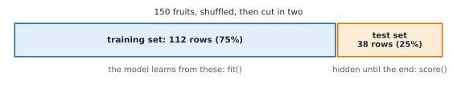

# Lesson 3: Train and test: checking on unseen data

**You'll learn:** why test on unseen data, train_test_split, test_size, random_state, stratify, score, accuracy, memorisation and overfitting.

▶ **Practise this lesson in the [sandbox](https://kishoremadanagopal.github.io/learning/ml/#train-test)**: run every example and check your exercise answers.

## Key terms

- **Training set:** the rows the model learns from.
- **Test set:** rows held back and used only to measure the finished model; it plays the part of new, unseen data.
- **train_test_split:** the scikit-learn function that shuffles rows and splits them into X_train, X_test, y_train, y_test.
- **test_size:** the share of rows kept for testing, such as 0.25.
- **random_state:** a seed that fixes a random process, so results are the same every run.
- **Stratify:** splitting so that each part keeps the same mix of classes as the full data.
- **Accuracy:** the share of predictions that are correct; what score returns for a classifier.
- **score:** a model's built-in measure: accuracy for classifiers, R² for regressors.
- **Generalisation:** how well a model works on data it didn't train on.
- **Overfitting:** learning the training data's noise so well that the model does worse on new data.

A model is only useful if it works on **new** data: next month's customers, tomorrow's emails. So you can't judge it on the examples it learned from. That's like giving students the exam questions to study, then using the same questions in the exam: they could score 100% by memorising.

The fix is simple: before training, **hold back** some rows. Train on the rest, then test on the held-back rows the model has never seen.



- The **training set** is what the model learns from.
- The **test set** is the model's final exam. Use it only to measure, never to learn from.
- A typical split is 75/25 or 80/20.

## train_test_split

```python
import pandas as pd
from sklearn.model_selection import train_test_split

fruit = pd.read_csv("fruit.csv")
X = fruit[["width_cm", "height_cm"]]
y = fruit["fruit"]

X_train, X_test, y_train, y_test = train_test_split(X, y, test_size=0.25, random_state=42)
print(X_train.shape, X_test.shape)
print(y_train.shape, y_test.shape)
```

It shuffles the rows and cuts them into four pieces. Learn the order by heart, because it's always the same: **`X_train, X_test, y_train, y_test`**.

- `test_size=0.25` keeps 25% for testing.
- `random_state=42` fixes the shuffle, so you get the same split every time you run it (any number works; 42 is just tradition). Without it, every run gives a different split and different scores.

## Score on the test set

Every model has a `score` method. For classifiers it's **accuracy**, the share of correct answers; for regressors it's R², which you'll meet in Lesson 6.

```python
import pandas as pd
from sklearn.model_selection import train_test_split
from sklearn.neighbors import KNeighborsClassifier

fruit = pd.read_csv("fruit.csv")
X = fruit[["width_cm", "height_cm", "weight_g"]]
X_train, X_test, y_train, y_test = train_test_split(X, fruit["fruit"], test_size=0.25, random_state=3)

knn = KNeighborsClassifier(n_neighbors=5).fit(X_train, y_train)
print("training accuracy:", round(knn.score(X_train, y_train), 3))
print("test accuracy:    ", round(knn.score(X_test, y_test), 3))
```

The model gets 84% of its training fruit right but 82% of the test fruit. The test accuracy is the honest number: it's how the model does on fruit it has never seen.

## Spotting memorisation

With `n_neighbors=1`, each training fruit's nearest neighbour is **itself**, so the model gets every training fruit right: it has simply memorised them. Training accuracy says "perfect"; the test set says otherwise:

```python
import pandas as pd
from sklearn.model_selection import train_test_split
from sklearn.neighbors import KNeighborsClassifier

fruit = pd.read_csv("fruit.csv")
X = fruit[["width_cm", "height_cm", "weight_g"]]
X_train, X_test, y_train, y_test = train_test_split(X, fruit["fruit"], test_size=0.25, random_state=3)

for k in [1, 5, 15]:
    knn = KNeighborsClassifier(n_neighbors=k).fit(X_train, y_train)
    print(f"k={k:>2}  train {knn.score(X_train, y_train):.3f}   test {knn.score(X_test, y_test):.3f}")
```

k=1 is perfect on training data but the worst on the test set. A big gap between training and test scores is the warning sign of **overfitting**: the model learned the noise in its training data, not the general pattern. Part 2 shows how to find the sweet spot.

## Keep the classes balanced with stratify

If a class is rare, a random split might put too few of them in the test set. `stratify=y` keeps the same mix of classes in both parts:

```python
import pandas as pd
from sklearn.model_selection import train_test_split

churn = pd.read_csv("churn.csv")
X = churn[["tenure_months", "monthly_charge", "support_calls"]]
y = churn["churned"]

X_train, X_test, y_train, y_test = train_test_split(X, y, test_size=0.2, random_state=0, stratify=y)
print("all:  ", y.mean().round(3))
print("train:", y_train.mean().round(3))
print("test: ", y_test.mean().round(3))
```

With `stratify`, about 27.5% of customers churned in the full data, in training and in testing alike. Use it for classification whenever you split.

## Common mistakes

- Judging a model by its score on the training data.
- Mixing up the order of the four results. It's always X_train, X_test, y_train, y_test.
- Leaving out random_state and then wondering why the score changes every run.
- Training on the test set "just once". After that it's no longer unseen.

## Exercises

### 1. Split the churn data

Load `churn.csv`. Use `X = churn[["tenure_months", "monthly_charge", "support_calls"]]` and `y = churn["churned"]`. Split them into `X_train, X_test, y_train, y_test` with 30% for testing, `random_state=1` and stratified by `y`.

Starter code:

```python
import pandas as pd
from sklearn.model_selection import train_test_split

churn = pd.read_csv("churn.csv")
X = churn[["tenure_months", "monthly_charge", "support_calls"]]
y = churn["churned"]

```

### 2. Train versus test

Using the fruit split below, train a `KNeighborsClassifier(n_neighbors=3)` called `knn` on the training data. Store its training accuracy in `train_acc` and its test accuracy in `test_acc`.

Starter code:

```python
import pandas as pd
from sklearn.model_selection import train_test_split
from sklearn.neighbors import KNeighborsClassifier

fruit = pd.read_csv("fruit.csv")
X_train, X_test, y_train, y_test = train_test_split(
    fruit[["width_cm", "height_cm", "weight_g"]], fruit["fruit"], test_size=0.25, random_state=7, stratify=fruit["fruit"])

```

**In the sandbox:** exercises 5–6. Press **Check** to test your answer.

<details>
<summary>Hints</summary>

1. `train_test_split(X, y, test_size=0.3, random_state=1, stratify=y)` returns four things, in the order X_train, X_test, y_train, y_test.
2. `knn.score(X_train, y_train)` and `knn.score(X_test, y_test)`.

</details>

<details>
<summary>Answers</summary>

**1. Split the churn data**

```python
import pandas as pd
from sklearn.model_selection import train_test_split

churn = pd.read_csv("churn.csv")
X = churn[["tenure_months", "monthly_charge", "support_calls"]]
y = churn["churned"]
X_train, X_test, y_train, y_test = train_test_split(X, y, test_size=0.3, random_state=1, stratify=y)
print(X_train.shape, X_test.shape)
```

**2. Train versus test**

```python
import pandas as pd
from sklearn.model_selection import train_test_split
from sklearn.neighbors import KNeighborsClassifier

fruit = pd.read_csv("fruit.csv")
X_train, X_test, y_train, y_test = train_test_split(
    fruit[["width_cm", "height_cm", "weight_g"]], fruit["fruit"], test_size=0.25, random_state=7, stratify=fruit["fruit"])
knn = KNeighborsClassifier(n_neighbors=3).fit(X_train, y_train)
train_acc = knn.score(X_train, y_train)
test_acc = knn.score(X_test, y_test)
print(round(train_acc, 3), round(test_acc, 3))
```

</details>

## Quick quiz

1. Why keep a test set the model never trains on?
   - A) To make training faster
   - B) To measure how well the model does on new, unseen data
   - C) Because scikit-learn requires it

2. A model scores 1.00 on training data and 0.70 on test data. The most likely problem is:
   - A) Underfitting
   - B) Overfitting: it memorised the training data
   - C) A bug in train_test_split

3. What does random_state=42 do in train_test_split?
   - A) Uses 42% of rows for testing
   - B) Fixes the shuffle so the split is the same every run
   - C) Makes the split more accurate

4. When should you pass stratify=y?
   - A) For classification, so train and test keep the same mix of classes
   - B) For regression only
   - C) Never: it causes leakage

<details>
<summary>Quiz answers</summary>

1. **B) To measure how well the model does on new, unseen data**: Scoring on training data rewards memorising. Only unseen data shows real performance.
2. **B) Overfitting: it memorised the training data**: A big train/test gap means the model learned noise that doesn't carry over to new rows.
3. **B) Fixes the shuffle so the split is the same every run**: It seeds the random shuffle. Any number works; the point is repeatability.
4. **A) For classification, so train and test keep the same mix of classes**: Stratifying keeps rare classes represented in both parts.

</details>

---
Previous: [Lesson 2](02-first-model.md) · Next: [Lesson 4: The ML workflow and baselines](04-workflow-and-baselines.md)
