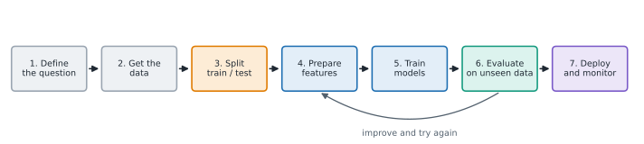

# Lesson 4: The ML workflow and baselines

**You'll learn:** the ML workflow, framing the question, building X and y, dropping IDs and the label, DummyClassifier and DummyRegressor, comparing to a baseline.

▶ **Practise this lesson in the [sandbox](https://kishoremadanagopal.github.io/learning/ml/#workflow-and-baselines)**: run every example and check your exercise answers.

## Key terms

- **ML workflow:** the steps of a project: question, data, split, prepare, train, evaluate, deploy and monitor.
- **Baseline:** the score of the simplest sensible guess, which any real model must beat.
- **DummyClassifier:** a baseline classifier that always predicts the most common class.
- **DummyRegressor:** a baseline regressor that always predicts the average of the training labels.
- **Majority class:** the most common category in the labels.
- **Identifier (ID):** a column that names each row, such as customer_id; not a real feature.

Real projects follow the same steps every time. This course is organised around them:



1. **Define the question.** What exactly do you predict, for whom, and what will people do with the prediction? "Which customers will cancel in the next month, so the retention team can call them" is a good question.
2. **Get the data**, and check it (Python for Data skills).
3. **Split** into training and test sets, **before** you look closely at patterns.
4. **Prepare features**: numbers only, no missing values, sensible scales (Part 4).
5. **Train** a few models.
6. **Evaluate** them on data they didn't train on. Go back to step 4 or 5 and improve.
7. **Deploy and monitor**: use the model, and watch that it keeps working (Lesson 23).

## Getting X and y into shape

scikit-learn models need:

| Rule | Why | How |
|---|---|---|
| X is a table (2-D), y is one column | that's the format `fit` expects | `df[["a", "b"]]` and `df["target"]` |
| Only numbers in X | models do arithmetic | encode text columns (Lesson 16) |
| No missing values (for most models) | you can't multiply by "nothing" | fill or drop them (Lesson 16) |
| The label is **not** in X | otherwise the model just copies the answer | `df.drop(columns="target")` |

A quick way to build X from "every column except a few":

```python
import pandas as pd

churn = pd.read_csv("churn.csv")
print(churn.dtypes)

X = churn.drop(columns=["customer_id", "churned"])
y = churn["churned"]
print(X.columns.tolist())
```

`customer_id` is dropped because an ID number is just a name. A model could find accidental patterns in it ("IDs above 1500 churn more") that mean nothing for new customers.

## Always start with a baseline

How good is "80% accuracy"? It depends. If 80% of customers stay, a "model" that always says **"stays"** is already 80% accurate, without learning anything.

A **baseline** is the score of the dumbest sensible guess. scikit-learn has them built in:

- `DummyClassifier()` always predicts the most common class.
- `DummyRegressor()` always predicts the average of the training labels.

```python
import pandas as pd
from sklearn.model_selection import train_test_split
from sklearn.dummy import DummyClassifier
from sklearn.neighbors import KNeighborsClassifier

churn = pd.read_csv("churn.csv")
X = churn[["tenure_months", "monthly_charge", "support_calls"]]
y = churn["churned"]
X_train, X_test, y_train, y_test = train_test_split(X, y, test_size=0.25, random_state=0, stratify=y)

baseline = DummyClassifier().fit(X_train, y_train)
knn = KNeighborsClassifier(n_neighbors=15).fit(X_train, y_train)
print("baseline accuracy:", round(baseline.score(X_test, y_test), 3))
print("knn accuracy:     ", round(knn.score(X_test, y_test), 3))
```

The baseline already gets 0.724, because about 72% of customers stay. The real model does better, but by less than "0.77 accuracy" sounds on its own. Always report your model **next to** the baseline. If a model can't beat it, it hasn't learned anything useful.

The same idea for numbers:

```python
import pandas as pd
from sklearn.model_selection import train_test_split
from sklearn.dummy import DummyRegressor
from sklearn.linear_model import LinearRegression

housing = pd.read_csv("housing.csv")
X = housing[["area_sqm", "bedrooms", "age_years", "distance_km"]]
y = housing["price_k"]
X_train, X_test, y_train, y_test = train_test_split(X, y, test_size=0.25, random_state=5)

baseline = DummyRegressor().fit(X_train, y_train)
linear = LinearRegression().fit(X_train, y_train)
print("baseline guess for every home:", round(baseline.predict(X_test)[0], 1))
print("baseline R²:", round(baseline.score(X_test, y_test), 3))
print("linear R²:  ", round(linear.score(X_test, y_test), 3))
```

The baseline guesses the same average price for every home and scores an R² just below 0: it explains none of the differences between homes (it's slightly negative because the test homes' average isn't exactly the training average). The linear model explains most of the variation. You'll learn exactly what R² means in Lesson 6.

## Common mistakes

- Reporting "85% accuracy" without the baseline. If 85% of rows are one class, that's no better than guessing.
- Keeping ID columns as features. The model can find meaningless patterns in them.
- Starting to model before the question is clear: what is predicted, for whom, and what action follows.

## Exercises

### 1. Beat the baseline

Using the split below, store the test accuracy of a `DummyClassifier()` in `base_acc` and of a `KNeighborsClassifier(n_neighbors=25)` in `knn_acc`, both trained on the training data. Then set `better` to `True` if KNN beats the baseline, else `False`.

Starter code:

```python
import pandas as pd
from sklearn.model_selection import train_test_split
from sklearn.dummy import DummyClassifier
from sklearn.neighbors import KNeighborsClassifier

churn = pd.read_csv("churn.csv")
X = churn[["tenure_months", "support_calls"]]
y = churn["churned"]
X_train, X_test, y_train, y_test = train_test_split(X, y, test_size=0.3, random_state=3, stratify=y)

```

### 2. Features without leaks

From `housing.csv`, build `X` with **every** column except `home_id`, `neighborhood` (text, which you'll learn to handle later) and the label `price_k`. Make `y` the `price_k` column.

Starter code:

```python
import pandas as pd

housing = pd.read_csv("housing.csv")

```

**In the sandbox:** exercises 7–8. Press **Check** to test your answer.

<details>
<summary>Hints</summary>

1. Fit each model on `X_train, y_train`, then `.score(X_test, y_test)`.
2. `housing.drop(columns=[...])` returns every other column.

</details>

<details>
<summary>Answers</summary>

**1. Beat the baseline**

```python
import pandas as pd
from sklearn.model_selection import train_test_split
from sklearn.dummy import DummyClassifier
from sklearn.neighbors import KNeighborsClassifier

churn = pd.read_csv("churn.csv")
X = churn[["tenure_months", "support_calls"]]
y = churn["churned"]
X_train, X_test, y_train, y_test = train_test_split(X, y, test_size=0.3, random_state=3, stratify=y)

base_acc = DummyClassifier().fit(X_train, y_train).score(X_test, y_test)
knn_acc = KNeighborsClassifier(n_neighbors=25).fit(X_train, y_train).score(X_test, y_test)
better = knn_acc > base_acc
print(round(base_acc, 3), round(knn_acc, 3), better)
```

**2. Features without leaks**

```python
import pandas as pd

housing = pd.read_csv("housing.csv")
X = housing.drop(columns=["home_id", "neighborhood", "price_k"])
y = housing["price_k"]
print(X.columns.tolist())
```

</details>

## Quick quiz

1. 90% of emails are not spam. A model is 90% accurate. What do you know?
   - A) It's an excellent model
   - B) It may have learned nothing: always saying "not spam" also scores 90%
   - C) It's overfitting

2. What does DummyRegressor() predict by default?
   - A) Zero for every row
   - B) The average of the training labels, for every row
   - C) A random number

3. Why drop customer_id from the features?
   - A) An ID is just a name; any pattern in it is accidental and won't hold for new customers
   - B) IDs are text
   - C) It makes training slower

4. Which step should come before you study patterns in the data closely?
   - A) Deploying the model
   - B) Splitting off the test set
   - C) Tuning hyperparameters

<details>
<summary>Quiz answers</summary>

1. **B) It may have learned nothing: always saying "not spam" also scores 90%**: Compare with a baseline. A DummyClassifier would score 90% here.
2. **B) The average of the training labels, for every row**: It's the simplest sensible guess, so a real model must beat it.
3. **A) An ID is just a name; any pattern in it is accidental and won't hold for new customers**: IDs carry no real information about behaviour, so they only invite fake patterns.
4. **B) Splitting off the test set**: Split first, so nothing you learn from the data (even by eye) leaks from the test set into your choices.

</details>

---
Previous: [Lesson 3](03-train-test.md) · Next: [Lesson 5: Linear regression with many features](05-linear-regression.md)
