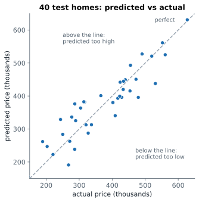

# Lesson 5: Linear regression with many features

**You'll learn:** linear models with many features, coefficients and intercept, "holding others fixed", least squares, predicting new rows, predicted-vs-actual plots.

▶ **Practise this lesson in the [sandbox](https://kishoremadanagopal.github.io/learning/ml/#linear-regression)**: run every example and check your exercise answers.

## Key terms

- **Linear regression:** a model whose prediction is the intercept plus a coefficient times each feature, added up.
- **Least squares:** choosing coefficients so the sum of squared training errors is as small as possible.
- **Coefficient:** the change in the prediction for one more unit of a feature, with the other features unchanged.
- **Intercept:** the model's prediction when every feature is 0.
- **Holding other features fixed:** comparing rows that differ in only one feature; what a coefficient describes.
- **Predicted-vs-actual plot:** a scatter of predictions against the real values; a perfect model puts every point on the diagonal.

In Lesson 2 you predicted maths scores from one feature, hours studied: the model drew a line. With several features, a **linear regression** does the same thing in more directions at once. For homes it learns a recipe like:

> price = intercept + (a × area) + (b × bedrooms) + (c × age) + (d × distance)

Training finds the numbers `a`, `b`, `c` and `d` (the **coefficients**) and the **intercept** that make the predictions as close as possible to the real prices in the training data. "As close as possible" has a precise meaning: it makes the **sum of squared errors** as small as it can be, which is why this method is called **least squares**.

```python
import pandas as pd
from sklearn.model_selection import train_test_split
from sklearn.linear_model import LinearRegression

housing = pd.read_csv("housing.csv")
X = housing[["area_sqm", "bedrooms", "age_years", "distance_km"]]
y = housing["price_k"]
X_train, X_test, y_train, y_test = train_test_split(X, y, test_size=0.25, random_state=5)

model = LinearRegression().fit(X_train, y_train)
print("intercept:", round(model.intercept_, 1))
print(pd.Series(model.coef_, index=X.columns).round(2))
```

## Reading the coefficients

Prices are in thousands, so each coefficient is "thousands of pounds per unit":

| Feature | Coefficient | In words |
|---|---|---|
| `area_sqm` | 3.13 | each extra m² adds about 3,100 to the price |
| `bedrooms` | 13.32 | each extra bedroom adds about 13,000 |
| `age_years` | −0.63 | each year older takes off about 600 |
| `distance_km` | −7.35 | each km further from the centre takes off about 7,400 |

Each coefficient is the effect of one feature **while the others stay the same**. "An extra bedroom adds 13,000" means: two homes with the same area, age and distance, one of which has an extra bedroom. That's not the same as "homes with more bedrooms cost 13,000 more", because homes with more bedrooms also tend to be bigger.

Two cautions:

- **Units matter.** A coefficient's size depends on its feature's units. Area's 3.13 looks small next to bedrooms' 13.32, but area changes by tens of m² between homes. Don't compare coefficient sizes to decide which feature "matters most" (Lesson 8 shows how to compare fairly).
- **Prediction is not cause.** The model learns patterns in this data. It can't tell you that adding a bedroom to **your** home will raise its value by 13,000.

## Predicting a new home

```python
import pandas as pd
from sklearn.model_selection import train_test_split
from sklearn.linear_model import LinearRegression

housing = pd.read_csv("housing.csv")
X = housing[["area_sqm", "bedrooms", "age_years", "distance_km"]]
y = housing["price_k"]
X_train, X_test, y_train, y_test = train_test_split(X, y, test_size=0.25, random_state=5)
model = LinearRegression().fit(X_train, y_train)

new_home = pd.DataFrame({"area_sqm": [90], "bedrooms": [3], "age_years": [20], "distance_km": [5.0]})
print("predicted price (thousands):", model.predict(new_home).round(1))
```

You can check the arithmetic by hand: 114.6 + 3.13×90 + 13.32×3 − 0.63×20 − 7.35×5 ≈ 387. That's all a linear model is.

## Predicted versus actual

The best quick check of a regression model is a scatter of **predicted** against **actual** values for the test set. A perfect model puts every point on the diagonal line.



```python
import pandas as pd
import matplotlib.pyplot as plt
from sklearn.model_selection import train_test_split
from sklearn.linear_model import LinearRegression

housing = pd.read_csv("housing.csv")
X = housing[["area_sqm", "bedrooms", "age_years", "distance_km"]]
y = housing["price_k"]
X_train, X_test, y_train, y_test = train_test_split(X, y, test_size=0.25, random_state=5)
pred = LinearRegression().fit(X_train, y_train).predict(X_test)

plt.scatter(y_test, pred)
plt.plot([200, 650], [200, 650], linestyle="--", color="grey")   # the "perfect" line
plt.xlabel("actual price (thousands)")
plt.ylabel("predicted price (thousands)")
plt.title("Test homes: predicted vs actual")
plt.show()
```

Points above the line are homes the model **over**-priced; points below were **under**-priced. Most are close, but some are off by 100 or more. Part of that is because the model can't see one important feature yet: the neighbourhood, which is text. You'll add it in Lesson 16.

## Common mistakes

- Comparing raw coefficients to rank features. Their sizes depend on units; standardise first.
- Reading a coefficient as cause and effect. A model learns patterns in data, not what happens if you change something.
- Building the new row with columns in a different order, or missing one, from the training data.

## Exercises

### 1. The distance effect

Using the split below, fit a `LinearRegression` called `model` on the training data. Store the coefficient for `distance_km` in `dist_coef` (a single number).

Starter code:

```python
import pandas as pd
from sklearn.model_selection import train_test_split
from sklearn.linear_model import LinearRegression

housing = pd.read_csv("housing.csv")
X = housing[["area_sqm", "bedrooms", "distance_km"]]
y = housing["price_k"]
X_train, X_test, y_train, y_test = train_test_split(X, y, test_size=0.25, random_state=2)

```

### 2. Price a flat

Fit a `LinearRegression` on **all** 160 homes (no split this time) using `area_sqm`, `bedrooms`, `age_years` and `distance_km`. Store the predicted price of a 60 m², 2-bedroom, 45-year-old flat 1.5 km from the centre in `flat_price` (a single number, in thousands).

Starter code:

```python
import pandas as pd
from sklearn.linear_model import LinearRegression

housing = pd.read_csv("housing.csv")

```

**In the sandbox:** exercises 9–10. Press **Check** to test your answer.

<details>
<summary>Hints</summary>

1. `model.coef_` lists the coefficients in the same order as `X`'s columns; `distance_km` is the third one, `model.coef_[2]`.
2. Build a one-row DataFrame with the same four columns, then take `model.predict(flat)[0]`.

</details>

<details>
<summary>Answers</summary>

**1. The distance effect**

```python
import pandas as pd
from sklearn.model_selection import train_test_split
from sklearn.linear_model import LinearRegression

housing = pd.read_csv("housing.csv")
X = housing[["area_sqm", "bedrooms", "distance_km"]]
y = housing["price_k"]
X_train, X_test, y_train, y_test = train_test_split(X, y, test_size=0.25, random_state=2)

model = LinearRegression().fit(X_train, y_train)
dist_coef = model.coef_[2]          # same order as X's columns
print(pd.Series(model.coef_, index=X.columns).round(2))
```

**2. Price a flat**

```python
import pandas as pd
from sklearn.linear_model import LinearRegression

housing = pd.read_csv("housing.csv")
cols = ["area_sqm", "bedrooms", "age_years", "distance_km"]
model = LinearRegression().fit(housing[cols], housing["price_k"])

flat = pd.DataFrame({"area_sqm": [60], "bedrooms": [2], "age_years": [45], "distance_km": [1.5]})
flat_price = model.predict(flat)[0]
print(round(flat_price, 1))
```

</details>

## Quick quiz

1. A linear model's coefficient for age_years is -0.63 (prices in thousands). What does it mean?
   - A) Each extra year of age lowers the predicted price by about 630, other features unchanged
   - B) Older homes are 63% cheaper
   - C) Age explains 63% of the price

2. Why shouldn't you compare raw coefficient sizes to find the most important feature?
   - A) Because coefficients are random
   - B) Because each depends on its feature's units: per m², per bedroom, per km
   - C) Because negative coefficients don't count

3. On a predicted-vs-actual plot, a point far above the diagonal is a home the model:
   - A) Priced too high
   - B) Priced too low
   - C) Priced perfectly

4. "Least squares" means the model chooses coefficients that:
   - A) Use the fewest features
   - B) Make the sum of squared errors on the training data as small as possible
   - C) Make every error exactly zero

<details>
<summary>Quiz answers</summary>

1. **A) Each extra year of age lowers the predicted price by about 630, other features unchanged**: A coefficient is the change in prediction per unit of the feature, holding the others fixed.
2. **B) Because each depends on its feature's units: per m², per bedroom, per km**: A feature measured in small units gets a small coefficient even if it matters a lot. Scale features first (Lesson 8 and 15).
3. **A) Priced too high**: Above the line means predicted > actual.
4. **B) Make the sum of squared errors on the training data as small as possible**: Squaring makes every error positive and punishes big misses more.

</details>

---
Previous: [Lesson 4](04-workflow-and-baselines.md) · Next: [Lesson 6: Measuring regression errors](06-regression-metrics.md)
