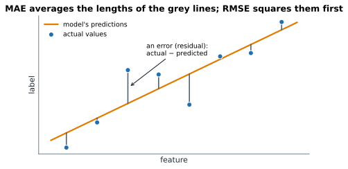

# Lesson 6: Measuring regression errors

**You'll learn:** residuals, MAE, MSE, RMSE, R², sklearn.metrics, comparing with a baseline, residual plots, choosing a metric.

▶ **Practise this lesson in the [sandbox](https://kishoremadanagopal.github.io/learning/ml/#regression-metrics)**: run every example and check your exercise answers.

## Key terms

- **Residual:** actual minus predicted for one row; the model's error on that row.
- **MAE (mean absolute error):** the average size of the errors, in the label's units.
- **MSE (mean squared error):** the average of the squared errors.
- **RMSE (root mean squared error):** the square root of MSE, back in the label's units; big errors count extra.
- **R² (coefficient of determination):** the share of the variation in the label that the model explains, compared with always predicting the average. 1 is perfect, 0 is no better than the average, below 0 is worse.
- **Residual plot:** residuals plotted against predictions; a healthy model shows a shapeless cloud around 0.
- **sklearn.metrics:** the scikit-learn module with metric functions such as mean_absolute_error and r2_score.

A regression model is never exactly right, so you need a number that says **how wrong** it is, on average, on the test set. Every metric starts from the **errors**, also called **residuals**: actual minus predicted, one per test row.



| Metric | How it's made | Units | Good value | Read it as |
|---|---|---|---|---|
| **MAE** (mean absolute error) | average of the error sizes | same as y (thousands) | small | "typically off by this much" |
| **MSE** (mean squared error) | average of squared errors | y squared | small | hard to read; used in training |
| **RMSE** (root mean squared error) | square root of MSE | same as y | small | like MAE, but big misses count extra |
| **R²** (coefficient of determination) | 1 − (model's squared errors ÷ baseline's) | none | close to 1 | share of the variation the model explains |

## Computing them by hand, then with scikit-learn

```python
import pandas as pd
import numpy as np
from sklearn.model_selection import train_test_split
from sklearn.linear_model import LinearRegression

housing = pd.read_csv("housing.csv")
X = housing[["area_sqm", "bedrooms", "age_years", "distance_km"]]
y = housing["price_k"]
X_train, X_test, y_train, y_test = train_test_split(X, y, test_size=0.25, random_state=5)
pred = LinearRegression().fit(X_train, y_train).predict(X_test)

errors = y_test - pred
print("first five errors:", errors.head().round(1).tolist())
print("MAE: ", np.abs(errors).mean().round(1))
print("MSE: ", (errors ** 2).mean().round(1))
print("RMSE:", np.sqrt((errors ** 2).mean()).round(1))
```

The same, using `sklearn.metrics`. Every metric function takes **actual first, predicted second**:

```python
import pandas as pd
from sklearn.model_selection import train_test_split
from sklearn.linear_model import LinearRegression
from sklearn.metrics import mean_absolute_error, mean_squared_error, root_mean_squared_error, r2_score

housing = pd.read_csv("housing.csv")
X = housing[["area_sqm", "bedrooms", "age_years", "distance_km"]]
y = housing["price_k"]
X_train, X_test, y_train, y_test = train_test_split(X, y, test_size=0.25, random_state=5)
model = LinearRegression().fit(X_train, y_train)
pred = model.predict(X_test)

print("MAE: ", round(mean_absolute_error(y_test, pred), 1))
print("MSE: ", round(mean_squared_error(y_test, pred), 1))
print("RMSE:", round(root_mean_squared_error(y_test, pred), 1))
print("R²:  ", round(r2_score(y_test, pred), 3))
print("R² from model.score:", round(model.score(X_test, y_test), 3))
```

In words: the model's price is typically off by about **41 thousand** (MAE), big misses push RMSE up to **50 thousand**, and it explains about **82%** of the variation in test prices (R²). `model.score` gives the same R² for any regressor.

## Understanding R²

R² compares your model with the baseline that always predicts the average:

- **R² = 1**: perfect predictions.
- **R² = 0**: no better than guessing the average for every row.
- **R² < 0**: **worse** than guessing the average. It happens with bad models, and you saw a slightly negative baseline in Lesson 4.

R² has no units, so it's handy for comparing across problems. MAE and RMSE are in the label's units, so they're what you tell people: "our price estimate is typically within 41,000".

## MAE or RMSE?

RMSE is always at least as big as MAE. The gap tells you something: if RMSE is much bigger, a few predictions are **very** wrong. Choose based on what hurts:

- Is a 100k miss twice as bad as a 50k miss? Use **MAE**.
- Is a 100k miss much worse than two 50k misses (a big surprise could sink a budget)? Use **RMSE**, which punishes big errors more.

## Look at the residuals too

A single number hides patterns. Plot the residuals against the predictions: a healthy model shows a shapeless cloud around zero. A curve or a funnel means the model is missing something.

```python
import pandas as pd
import matplotlib.pyplot as plt
from sklearn.model_selection import train_test_split
from sklearn.linear_model import LinearRegression

housing = pd.read_csv("housing.csv")
X = housing[["area_sqm", "bedrooms", "age_years", "distance_km"]]
y = housing["price_k"]
X_train, X_test, y_train, y_test = train_test_split(X, y, test_size=0.25, random_state=5)
pred = LinearRegression().fit(X_train, y_train).predict(X_test)

plt.scatter(pred, y_test - pred)
plt.axhline(0, color="grey", linestyle="--")
plt.xlabel("predicted price")
plt.ylabel("residual (actual - predicted)")
plt.title("Residuals of the test homes")
plt.show()
```

## Common mistakes

- Computing metrics on the training data and reporting them as the model's quality.
- Reporting only R². People understand "typically off by 41,000" (MAE) much better.
- Forgetting that R² can be negative. It doesn't run from 0 to 1 on test data.
- Passing predictions first to metric functions. The habit is metric(y_true, y_pred).

## Exercises

### 1. Three numbers for the report

Using the model and split below, compute the test-set `mae`, `rmse` and `r2` with `sklearn.metrics`.

Starter code:

```python
import pandas as pd
from sklearn.model_selection import train_test_split
from sklearn.linear_model import LinearRegression
from sklearn.metrics import mean_absolute_error, root_mean_squared_error, r2_score

students = pd.read_csv("students.csv")
X = students[["hours_studied", "attendance_pct"]]
y = students["math"]
X_train, X_test, y_train, y_test = train_test_split(X, y, test_size=0.3, random_state=4)
model = LinearRegression().fit(X_train, y_train)

```

### 2. How much better than guessing?

With the same split, compute the test MAE of a `DummyRegressor()` in `base_mae` and of a `LinearRegression()` in `model_mae`, both trained on the training data. Store `base_mae - model_mae` in `saved`: how many points closer the model gets, on average.

Starter code:

```python
import pandas as pd
from sklearn.model_selection import train_test_split
from sklearn.dummy import DummyRegressor
from sklearn.linear_model import LinearRegression
from sklearn.metrics import mean_absolute_error

students = pd.read_csv("students.csv")
X = students[["hours_studied", "attendance_pct"]]
y = students["math"]
X_train, X_test, y_train, y_test = train_test_split(X, y, test_size=0.3, random_state=4)

```

**In the sandbox:** exercises 11–12. Press **Check** to test your answer.

<details>
<summary>Hints</summary>

1. Predict on `X_test` first, then pass `(y_test, pred)` to each metric, actual first.
2. Same recipe twice: fit on the training data, predict `X_test`, then `mean_absolute_error(y_test, pred)`.

</details>

<details>
<summary>Answers</summary>

**1. Three numbers for the report**

```python
import pandas as pd
from sklearn.model_selection import train_test_split
from sklearn.linear_model import LinearRegression
from sklearn.metrics import mean_absolute_error, root_mean_squared_error, r2_score

students = pd.read_csv("students.csv")
X = students[["hours_studied", "attendance_pct"]]
y = students["math"]
X_train, X_test, y_train, y_test = train_test_split(X, y, test_size=0.3, random_state=4)
model = LinearRegression().fit(X_train, y_train)

pred = model.predict(X_test)
mae = mean_absolute_error(y_test, pred)
rmse = root_mean_squared_error(y_test, pred)
r2 = r2_score(y_test, pred)
print(round(mae, 2), round(rmse, 2), round(r2, 3))
```

**2. How much better than guessing?**

```python
import pandas as pd
from sklearn.model_selection import train_test_split
from sklearn.dummy import DummyRegressor
from sklearn.linear_model import LinearRegression
from sklearn.metrics import mean_absolute_error

students = pd.read_csv("students.csv")
X = students[["hours_studied", "attendance_pct"]]
y = students["math"]
X_train, X_test, y_train, y_test = train_test_split(X, y, test_size=0.3, random_state=4)

base_mae = mean_absolute_error(y_test, DummyRegressor().fit(X_train, y_train).predict(X_test))
model_mae = mean_absolute_error(y_test, LinearRegression().fit(X_train, y_train).predict(X_test))
saved = base_mae - model_mae
print(round(base_mae, 2), round(model_mae, 2), round(saved, 2))
```

</details>

## Quick quiz

1. A price model has MAE = 41 (thousands). What's the plain-English reading?
   - A) Its predictions are typically off by about 41,000
   - B) It's right 41% of the time
   - C) It explains 41% of the variation

2. RMSE is much bigger than MAE. What does that tell you?
   - A) The model is perfect
   - B) A few predictions are very wrong
   - C) You used the wrong units

3. A model has R² = -0.2 on the test set. That means:
   - A) It explains 20% of the variation
   - B) It does worse than always predicting the average
   - C) The metric is broken

4. Which argument comes first in mean_absolute_error?
   - A) The actual values (y_test)
   - B) The predictions
   - C) It doesn't matter for any metric

<details>
<summary>Quiz answers</summary>

1. **A) Its predictions are typically off by about 41,000**: MAE is in the label's units: the average size of the errors.
2. **B) A few predictions are very wrong**: Squaring makes big errors count extra, so a big RMSE-MAE gap points to some large misses.
3. **B) It does worse than always predicting the average**: R² below 0 means the model loses to the simplest baseline.
4. **A) The actual values (y_test)**: scikit-learn metrics are metric(y_true, y_pred). For MAE the order doesn't change the answer, but for many others (like precision) it does, so build the habit.

</details>

---
Previous: [Lesson 5](05-linear-regression.md) · Next: [Lesson 7: Underfitting and overfitting](07-overfitting.md)
