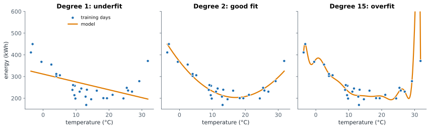
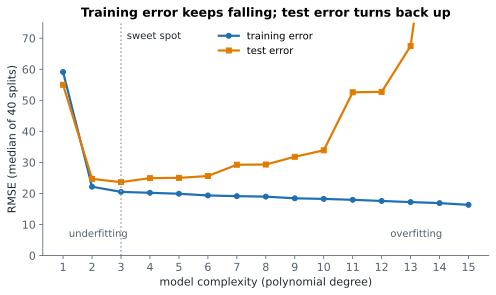

# Lesson 7: Underfitting and overfitting

**You'll learn:** model complexity, polynomial features, underfitting, overfitting, the complexity curve, bias and variance, ways to reduce overfitting.

▶ **Practise this lesson in the [sandbox](https://kishoremadanagopal.github.io/learning/ml/#overfitting)**: run every example and check your exercise answers.

## Key terms

- **Underfitting:** a model too simple for the pattern; it does badly on both training and test data.
- **Overfitting:** a model so flexible it learns the training data's noise; good on training data, worse on new data.
- **Model complexity:** how flexible a model is, set by knobs like polynomial degree, n_neighbors or tree depth.
- **Polynomial features:** extra columns made from powers of a feature (x², x³…) so a linear model can draw curves.
- **Degree:** the highest power in polynomial features.
- **Complexity curve:** training and test error plotted against complexity; the test error is lowest at the sweet spot.
- **Bias:** error from a model's too-rigid assumptions; high bias causes underfitting.
- **Variance:** how much a model changes with different training rows; high variance causes overfitting.
- **make_pipeline:** joins several steps into one model that runs them in order.
- **PolynomialFeatures:** the scikit-learn step that adds powers of the features.

The `energy.csv` file has 40 days of outdoor temperature and an office building's energy use. Cold days need heating, hot days need air conditioning, so energy use is lowest in the middle: a U shape.

```python
import pandas as pd
import matplotlib.pyplot as plt

energy = pd.read_csv("energy.csv")
plt.scatter(energy["temperature_c"], energy["energy_kwh"])
plt.xlabel("outdoor temperature (°C)")
plt.ylabel("energy used (kWh)")
plt.title("Energy use: high when cold, high when hot")
plt.show()
```

A straight line can't follow a U. To fit curves, we can give a linear model extra features: temperature², temperature³ and so on. A model with powers up to 2 can draw a U; with higher powers it can draw ever wigglier curves. The **degree** is the highest power, and it controls how **flexible** (complex) the model is.

`make_pipeline` chains steps so they act like one model: make the powers, put them on a similar scale (so huge numbers like 30¹⁵ don't cause trouble), then fit the linear regression. Lesson 17 covers pipelines properly; for now, read it as "do these steps in order".

```python
import pandas as pd
from sklearn.model_selection import train_test_split
from sklearn.pipeline import make_pipeline
from sklearn.preprocessing import PolynomialFeatures, StandardScaler
from sklearn.linear_model import LinearRegression
from sklearn.metrics import root_mean_squared_error

energy = pd.read_csv("energy.csv")
X = energy[["temperature_c"]]
y = energy["energy_kwh"]
X_train, X_test, y_train, y_test = train_test_split(X, y, test_size=0.3, random_state=1)

for degree in [1, 2, 10, 15]:
    model = make_pipeline(PolynomialFeatures(degree), StandardScaler(), LinearRegression())
    model.fit(X_train, y_train)
    train_rmse = root_mean_squared_error(y_train, model.predict(X_train))
    test_rmse = root_mean_squared_error(y_test, model.predict(X_test))
    print(f"degree {degree:>2}:  train RMSE {train_rmse:5.1f}   test RMSE {test_rmse:5.1f}")
```

Read the table from top to bottom:

- **Degree 1 (a straight line): underfitting.** It's bad on the training data **and** the test data (RMSE above 50 on both). The model is too simple to capture the U.
- **Degree 2: just right.** Training and test errors are both low (about 23) and close together.
- **Degrees 10 and 15: overfitting.** The training error keeps falling, because the curve bends to pass near every training point, but the test error **rises** (27, then 41). The extra wiggles follow random noise in these 28 days, which doesn't repeat on new days.



## The complexity curve

Plot training and test error against complexity and you get the most important picture in machine learning:



- On the left, both errors are high: **underfitting** (also called **high bias**: the model's assumptions are too rigid).
- On the right, training error is low but test error is high: **overfitting** (also called **high variance**: the model changes a lot depending on which rows it saw).
- The **sweet spot** is where the test error is lowest.

Every model has a "complexity knob": the degree here, `n_neighbors` for KNN (small k = more complex), the depth of a decision tree, the number of features. Finding the right setting is called **tuning**, and you'll automate it in Lesson 19.

## What helps against overfitting

- **A simpler model**, or fewer features.
- **More training data.** Noise averages out, and a wiggly curve can't pass near thousands of points.
- **Regularisation**: penalise complexity (next lesson).
- **Honest testing**: as long as you judge by unseen data, you'll **notice** overfitting, which is half the battle.

## Common mistakes

- Choosing the most complex model because its training error is lowest.
- Believing a perfect training score means a perfect model. It usually means memorising.
- Thinking overfitting only happens with fancy models. Even linear regression overfits with too many features and too few rows.

## Exercises

### 1. Find the sweet spot

Using the split below, try every degree from 1 to 8 with the same pipeline as the lesson. Store the degree with the **lowest test RMSE** in `best_degree` (an int).

Starter code:

```python
import pandas as pd
from sklearn.model_selection import train_test_split
from sklearn.pipeline import make_pipeline
from sklearn.preprocessing import PolynomialFeatures, StandardScaler
from sklearn.linear_model import LinearRegression
from sklearn.metrics import root_mean_squared_error

energy = pd.read_csv("energy.csv")
X_train, X_test, y_train, y_test = train_test_split(
    energy[["temperature_c"]], energy["energy_kwh"], test_size=0.3, random_state=3)

```

### 2. Measure the gap

With the same split (`random_state=3`), fit the degree-15 pipeline and store its training RMSE in `train_rmse` and its test RMSE in `test_rmse`. Then set `overfit` to `True` if the test RMSE is more than 1.5 times the training RMSE.

Starter code:

```python
import pandas as pd
from sklearn.model_selection import train_test_split
from sklearn.pipeline import make_pipeline
from sklearn.preprocessing import PolynomialFeatures, StandardScaler
from sklearn.linear_model import LinearRegression
from sklearn.metrics import root_mean_squared_error

energy = pd.read_csv("energy.csv")
X_train, X_test, y_train, y_test = train_test_split(
    energy[["temperature_c"]], energy["energy_kwh"], test_size=0.3, random_state=3)

```

**In the sandbox:** exercises 13–14. Press **Check** to test your answer.

<details>
<summary>Hints</summary>

1. Store each degree's test RMSE in a dictionary, then `min(d, key=d.get)` gives the key with the smallest value.
2. Predict on both `X_train` and `X_test` and compare each with its own true values.

</details>

<details>
<summary>Answers</summary>

**1. Find the sweet spot**

```python
import pandas as pd
from sklearn.model_selection import train_test_split
from sklearn.pipeline import make_pipeline
from sklearn.preprocessing import PolynomialFeatures, StandardScaler
from sklearn.linear_model import LinearRegression
from sklearn.metrics import root_mean_squared_error

energy = pd.read_csv("energy.csv")
X_train, X_test, y_train, y_test = train_test_split(
    energy[["temperature_c"]], energy["energy_kwh"], test_size=0.3, random_state=3)

test_rmse = {}
for degree in range(1, 9):
    model = make_pipeline(PolynomialFeatures(degree), StandardScaler(), LinearRegression()).fit(X_train, y_train)
    test_rmse[degree] = root_mean_squared_error(y_test, model.predict(X_test))
    print(degree, round(test_rmse[degree], 1))

best_degree = min(test_rmse, key=test_rmse.get)
print("best:", best_degree)
```

**2. Measure the gap**

```python
import pandas as pd
from sklearn.model_selection import train_test_split
from sklearn.pipeline import make_pipeline
from sklearn.preprocessing import PolynomialFeatures, StandardScaler
from sklearn.linear_model import LinearRegression
from sklearn.metrics import root_mean_squared_error

energy = pd.read_csv("energy.csv")
X_train, X_test, y_train, y_test = train_test_split(
    energy[["temperature_c"]], energy["energy_kwh"], test_size=0.3, random_state=3)

model = make_pipeline(PolynomialFeatures(15), StandardScaler(), LinearRegression()).fit(X_train, y_train)
train_rmse = root_mean_squared_error(y_train, model.predict(X_train))
test_rmse = root_mean_squared_error(y_test, model.predict(X_test))
overfit = test_rmse > 1.5 * train_rmse
print(round(train_rmse, 1), round(test_rmse, 1), overfit)
```

</details>

## Quick quiz

1. A model has high error on both the training and test sets. It is probably:
   - A) Underfitting: too simple for the pattern
   - B) Overfitting
   - C) Perfect

2. As a model gets more complex, what usually happens to the training error?
   - A) It keeps falling
   - B) It keeps rising
   - C) It stays the same

3. Where is the sweet spot on a complexity curve?
   - A) Where the training error is lowest
   - B) Where the test (or validation) error is lowest
   - C) At the most complex model

4. Which of these does NOT help against overfitting?
   - A) Collecting more training data
   - B) Using a simpler model
   - C) Judging the model by its training score

<details>
<summary>Quiz answers</summary>

1. **A) Underfitting: too simple for the pattern**: Bad everywhere means the model can't even capture the training data's pattern.
2. **A) It keeps falling**: More flexibility lets the model hug the training points, even their noise. That's why training error can't pick the model.
3. **B) Where the test (or validation) error is lowest**: The goal is good predictions on unseen data.
4. **C) Judging the model by its training score**: Training score rewards memorising. The other two genuinely reduce overfitting.

</details>

---
Previous: [Lesson 6](06-regression-metrics.md) · Next: [Lesson 8: Regularisation: Ridge and Lasso](08-regularization.md)
