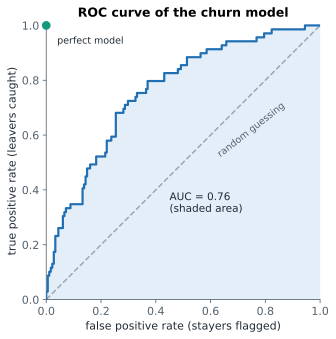

# Lesson 11: Thresholds, ROC curves and AUC

**You'll learn:** changing the threshold, the precision-recall trade-off, ROC curves, AUC, choosing a threshold from costs, class_weight for rare classes.

▶ **Practise this lesson in the [sandbox](https://kishoremadanagopal.github.io/learning/ml/#thresholds-roc)**: run every example and check your exercise answers.

## Key terms

- **Precision-recall trade-off:** lowering the threshold raises recall and usually lowers precision, and the reverse.
- **True positive rate:** another name for recall.
- **False positive rate:** FP ÷ (FP + TN): the share of real negatives wrongly flagged.
- **ROC curve:** true positive rate against false positive rate for every possible threshold.
- **AUC (area under the ROC curve):** one number for how well a model ranks positives above negatives; 0.5 is random, 1.0 is perfect.
- **class_weight="balanced":** makes mistakes on rare classes count more during training.
- **Ranking:** ordering rows from most to least likely positive; what AUC measures.

`predict` uses a threshold of 0.5: "leaves" if the probability is at least 50%. Nothing makes 0.5 special. If missing a leaver costs more than a false alarm, flag people at a **lower** probability.

## Moving the threshold

```python
import pandas as pd
from sklearn.model_selection import train_test_split
from sklearn.linear_model import LogisticRegression
from sklearn.metrics import precision_score, recall_score

churn = pd.read_csv("churn.csv")
X = churn[["tenure_months", "monthly_charge", "support_calls"]]
y = churn["churned"]
X_train, X_test, y_train, y_test = train_test_split(X, y, test_size=0.25, random_state=0, stratify=y)
proba = LogisticRegression().fit(X_train, y_train).predict_proba(X_test)[:, 1]

for threshold in [0.5, 0.4, 0.3, 0.2]:
    pred = (proba >= threshold).astype(int)
    print(f"threshold {threshold}:  flagged {pred.sum():>3}   precision {precision_score(y_test, pred):.2f}   recall {recall_score(y_test, pred):.2f}")
```

Lowering the threshold flags more customers. Recall climbs from 0.33 to 0.83: you catch most leavers. Precision falls from 0.62 to 0.40: more of the people you call were going to stay anyway. That's the **precision–recall trade-off**.


How to pick the threshold? From the **costs**. If a retention offer costs 10 and a lost customer costs 200, catching leavers matters far more than wasting some offers, so a low threshold makes sense. Pick it on validation data (Lesson 18), never by peeking at the test set.

## The ROC curve: every threshold at once

To compare **models** without choosing a threshold, look at all thresholds together. The **ROC curve** plots, for every threshold:

- the **true positive rate** (recall: share of leavers caught) on the y-axis, against
- the **false positive rate** (share of stayers wrongly flagged) on the x-axis.



- A model that guesses at random follows the diagonal.
- A perfect model goes straight up to the top-left corner: it catches everyone with no false alarms.
- The **AUC** (area under the curve) sums it up in one number: 0.5 is random guessing, 1.0 is perfect. AUC is also the chance that the model gives a random leaver a higher probability than a random stayer.

```python
import pandas as pd
import matplotlib.pyplot as plt
from sklearn.model_selection import train_test_split
from sklearn.linear_model import LogisticRegression
from sklearn.metrics import roc_auc_score, RocCurveDisplay

churn = pd.read_csv("churn.csv")
X = churn[["tenure_months", "monthly_charge", "support_calls"]]
y = churn["churned"]
X_train, X_test, y_train, y_test = train_test_split(X, y, test_size=0.25, random_state=0, stratify=y)
model = LogisticRegression().fit(X_train, y_train)

proba = model.predict_proba(X_test)[:, 1]
print("AUC:", round(roc_auc_score(y_test, proba), 3))

RocCurveDisplay.from_estimator(model, X_test, y_test)
plt.plot([0, 1], [0, 1], linestyle="--", color="grey")
plt.title("ROC curve")
plt.show()
```

Note that `roc_auc_score` needs the **probabilities**, not the 0/1 predictions: it's about how well the model **ranks** customers.

## Rare classes: class_weight

When the positive class is rare, models drift towards predicting the common class. `class_weight="balanced"` tells the model that each mistake on the rare class counts more (in proportion to how rare it is):

```python
import pandas as pd
from sklearn.model_selection import train_test_split
from sklearn.linear_model import LogisticRegression
from sklearn.metrics import precision_score, recall_score, roc_auc_score

churn = pd.read_csv("churn.csv")
X = churn[["tenure_months", "monthly_charge", "support_calls"]]
y = churn["churned"]
X_train, X_test, y_train, y_test = train_test_split(X, y, test_size=0.25, random_state=0, stratify=y)

for weights in [None, "balanced"]:
    model = LogisticRegression(class_weight=weights).fit(X_train, y_train)
    pred = model.predict(X_test)
    auc = roc_auc_score(y_test, model.predict_proba(X_test)[:, 1])
    print(f"class_weight={weights}:  precision {precision_score(y_test, pred):.2f}  recall {recall_score(y_test, pred):.2f}  AUC {auc:.3f}")
```

Recall jumps from 0.33 to 0.71, precision drops, and AUC barely moves. That's a clue: balancing mostly moves the threshold. The model ranks customers about as well either way; it just flags more of them.

## Common mistakes

- Passing 0/1 predictions to roc_auc_score instead of probabilities.
- Choosing the threshold on the test set. Choose it on validation data, from the costs of each mistake.
- Thinking class_weight makes a model better at ranking. It mostly shifts where the line is drawn.

## Exercises

### 1. A lower threshold

Using the probabilities below, make `pred` the 0/1 predictions at a threshold of **0.35**, then store the recall and precision of those predictions in `recall_35` and `precision_35`.

Starter code:

```python
import pandas as pd
from sklearn.model_selection import train_test_split
from sklearn.linear_model import LogisticRegression
from sklearn.metrics import precision_score, recall_score

churn = pd.read_csv("churn.csv")
X = churn[["tenure_months", "monthly_charge", "support_calls", "data_gb"]]
y = churn["churned"]
X_train, X_test, y_train, y_test = train_test_split(X, y, test_size=0.3, random_state=8, stratify=y)
proba = LogisticRegression().fit(X_train, y_train).predict_proba(X_test)[:, 1]

```

### 2. Compare by AUC

With the same split, compute the test AUC of a `LogisticRegression()` using **only** `tenure_months` in `auc_one`, and using all four features in `auc_four`.

Starter code:

```python
import pandas as pd
from sklearn.model_selection import train_test_split
from sklearn.linear_model import LogisticRegression
from sklearn.metrics import roc_auc_score

churn = pd.read_csv("churn.csv")
X = churn[["tenure_months", "monthly_charge", "support_calls", "data_gb"]]
y = churn["churned"]
X_train, X_test, y_train, y_test = train_test_split(X, y, test_size=0.3, random_state=8, stratify=y)

```

**In the sandbox:** exercises 21–22. Press **Check** to test your answer.

<details>
<summary>Hints</summary>

1. `(proba >= 0.35)` gives True/False; `.astype(int)` turns it into 1/0.
2. Remember `roc_auc_score` wants probabilities: `model.predict_proba(...)[:, 1]`. For one feature, use `X_train[["tenure_months"]]` and the same column of `X_test`.

</details>

<details>
<summary>Answers</summary>

**1. A lower threshold**

```python
import pandas as pd
from sklearn.model_selection import train_test_split
from sklearn.linear_model import LogisticRegression
from sklearn.metrics import precision_score, recall_score

churn = pd.read_csv("churn.csv")
X = churn[["tenure_months", "monthly_charge", "support_calls", "data_gb"]]
y = churn["churned"]
X_train, X_test, y_train, y_test = train_test_split(X, y, test_size=0.3, random_state=8, stratify=y)
proba = LogisticRegression().fit(X_train, y_train).predict_proba(X_test)[:, 1]

pred = (proba >= 0.35).astype(int)
recall_35 = recall_score(y_test, pred)
precision_35 = precision_score(y_test, pred)
print(round(recall_35, 3), round(precision_35, 3))
```

**2. Compare by AUC**

```python
import pandas as pd
from sklearn.model_selection import train_test_split
from sklearn.linear_model import LogisticRegression
from sklearn.metrics import roc_auc_score

churn = pd.read_csv("churn.csv")
X = churn[["tenure_months", "monthly_charge", "support_calls", "data_gb"]]
y = churn["churned"]
X_train, X_test, y_train, y_test = train_test_split(X, y, test_size=0.3, random_state=8, stratify=y)

one = LogisticRegression().fit(X_train[["tenure_months"]], y_train)
auc_one = roc_auc_score(y_test, one.predict_proba(X_test[["tenure_months"]])[:, 1])
four = LogisticRegression().fit(X_train, y_train)
auc_four = roc_auc_score(y_test, four.predict_proba(X_test)[:, 1])
print(round(auc_one, 3), round(auc_four, 3))
```

</details>

## Quick quiz

1. You lower the threshold from 0.5 to 0.3. What usually happens?
   - A) Recall goes up, precision goes down
   - B) Both go up
   - C) Both go down

2. A model's AUC is 0.5. It is:
   - A) Perfect
   - B) No better than random guessing at ranking
   - C) Half as good as random

3. What does roc_auc_score need as its second argument?
   - A) The 0/1 predictions
   - B) The predicted probabilities (or scores) for the positive class
   - C) The training data

4. How should you choose a threshold?
   - A) From the costs of each kind of mistake, using validation data
   - B) Always 0.5
   - C) The value that gives the highest test accuracy

<details>
<summary>Quiz answers</summary>

1. **A) Recall goes up, precision goes down**: More rows are flagged: you catch more real positives but also raise more false alarms.
2. **B) No better than random guessing at ranking**: 0.5 is the diagonal line. 1.0 is perfect ranking.
3. **B) The predicted probabilities (or scores) for the positive class**: AUC measures ranking, so it needs the probabilities, not hard decisions.
4. **A) From the costs of each kind of mistake, using validation data**: The right threshold depends on what mistakes cost, and must not be tuned on the test set.

</details>

---
Previous: [Lesson 10](10-classification-metrics.md) · Next: [Lesson 12: k-nearest neighbours and distance](12-knn.md)
